# Explore Automated Machine Learning in Azure Machine Learning

## Lab overview

In this exercise, you'll use the automated machine learning feature in **Azure Machine Learning** to train and evaluate a machine learning model. You'll then deploy and test the trained model.

## Lab Objectives

In this lab, you will perform:

- Task 1: Creating an Azure Machine Learning workspace resource
- Task 2: Use automated machine learning to train a model
- Task 3: Deploy the model

### Task 1: Create an Azure Machine Learning workspace

In this task, you will create an Azure Machine Learning workspace. You will search for Machine Learning, configure the necessary settings like subscription, resource group, and workspace name, and deploy the resource. Once deployed, you will access the workspace through Azure Machine Learning Studio.

1. In the Azure Portal, select **+ Create a resource**.

    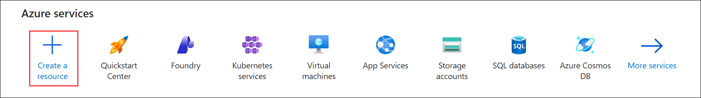

2. In the Marketplace page search for **Azure Machine Learning (1)** and select **Azure Machine Learning (2)**.
 
   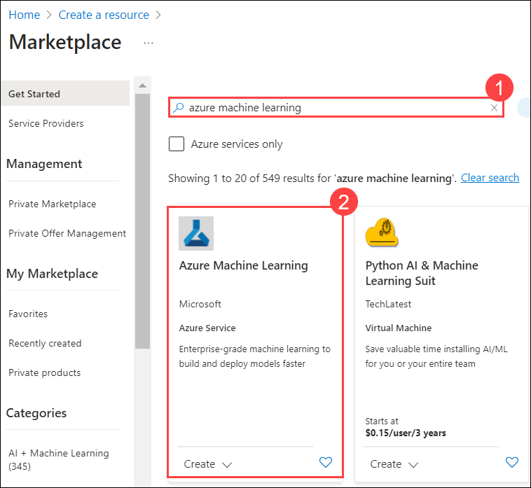

3. On the **Azure Machine Learning** page, click **Create** to proceed.

   
  
4. Create a new **Azure Machine Learning** resource with an *Azure Machine Learning* plan. Use the following settings:

    - **Subscription**: Use existing Azure subscription. **(1)**
    - **Resource group**: Select **AI-900-Module-01** **(2)**
    - **Name**: Give name **AI-900-Workspace-<inject key="DeploymentID" enableCopy="false" /> (3)**
    - **Region**: Select **<inject key="location" enableCopy="false" />** **(4)**
    - **Storage account**: Note the default new storage account that will be created for your workspace. **(5)**
    - **Key vault**: Note the default new key vault that will be created for your workspace. **(6)**
    - **Application insights**: Note the default new application insights resource that will be created for your workspace. **(7)**
    - **Container registry**: None (one will be created automatically the first time you deploy a model to a container) **(8)**

5. Select **Review + create (9)**.

    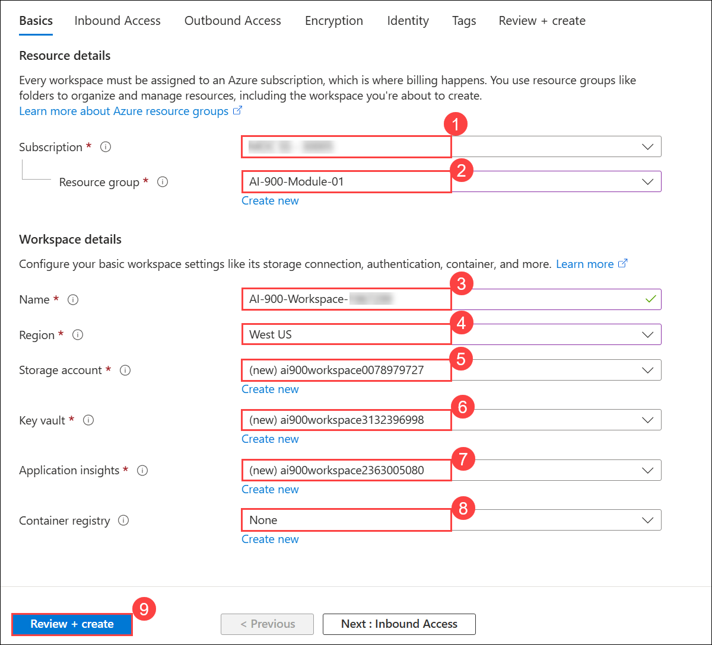

6. After successfully completing the validation process, click on the **Create** button located in the lower left corner of the page.

   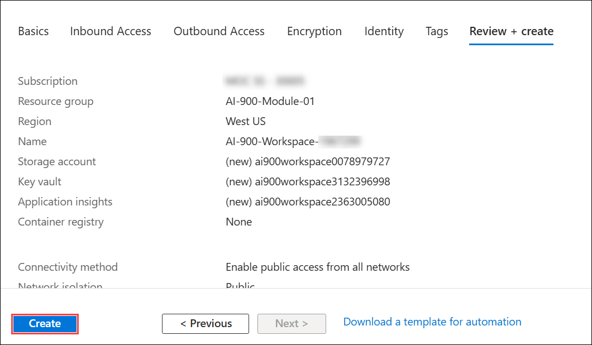
   
7. Wait for deployment to complete(it can take a few minutes), and then click on the **Go to resource** button, this will take you to your workspace resource.

   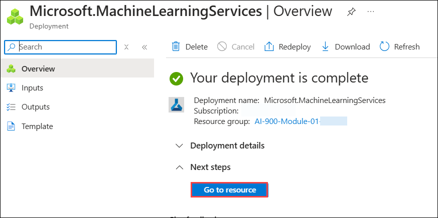

8. Select **Launch studio** (or open a new browser tab and navigate to [https://ml.azure.com](https://ml.azure.com?azure-portal=true), and if prompted, sign into **Azure Machine Learning studio** using your Microsoft account). Close any messages that are displayed.

   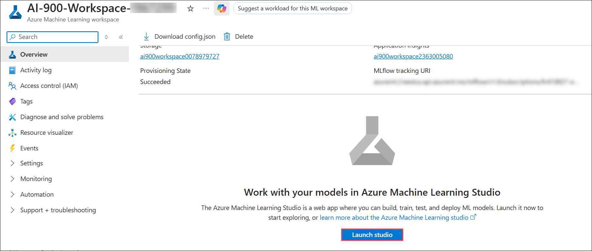

   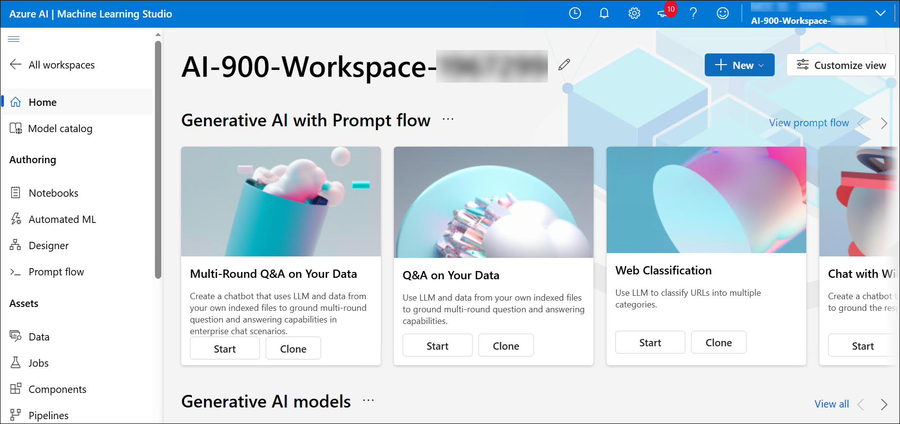

9. In Azure Machine Learning studio, click on **All workspaces (1)** and the navigate to **Workspaces (2)**, you should see your newly created workspace **(3)**.

    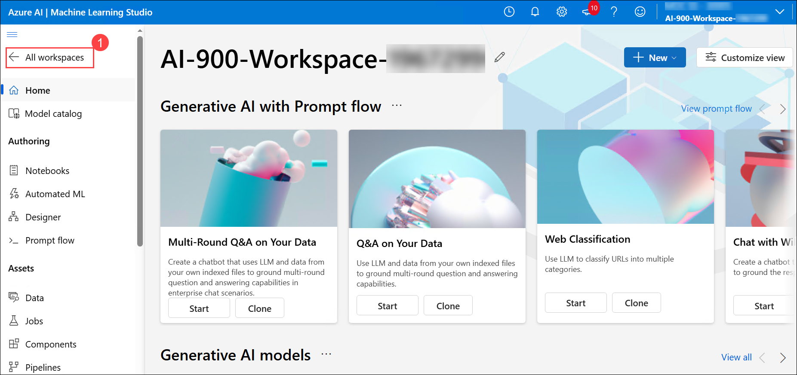

    .png)

## Validation

> **Congratulations** on completing the task! Now, it's time to validate it. Here are the steps:
> - Hit the Validate button for the corresponding task. If you receive a success message, you can proceed to the next task.
> - If not, carefully read the error message and retry the step, following the instructions in the lab guide. 
> - If you need any assistance, please contact us at cloudlabs-support@spektrasystems.com. We are available 24/7 to help you out.

  <validation step="0e571ab6-2856-478e-afa3-41efc38df116" />

### Enable preview features

Some features of Azure Machine Learning are in preview and need to be explicitly enabled in your workspace.

1. In Azure Machine Learning Studio, click on **manage preview features** (the loud speaker icon - &#128363;).

     

1. Enable the following preview feature, if not enabled.

     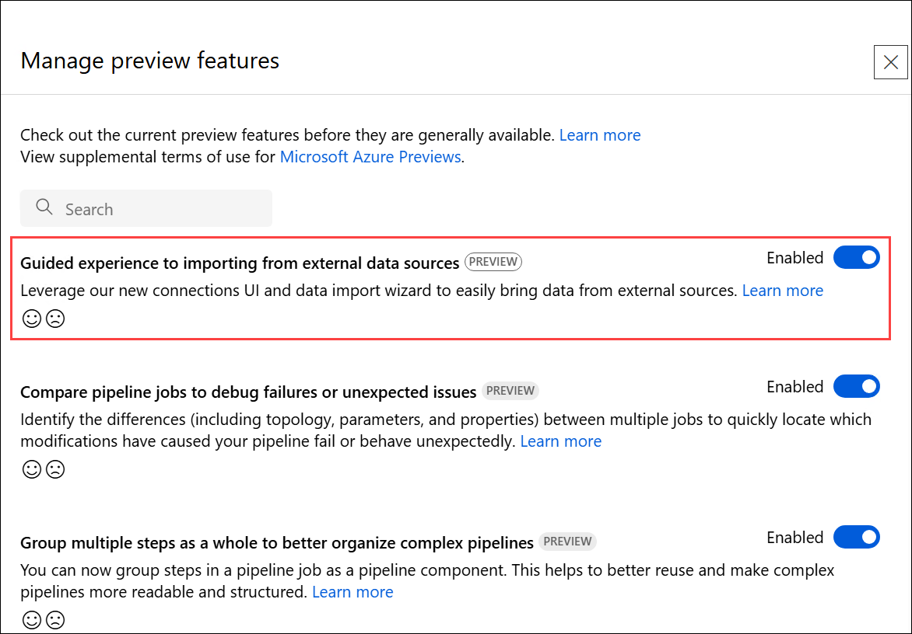

### Task 2: Use automated machine learning to train a model

In this task, you will learn how to use automated machine learning to train a model efficiently without writing extensive code.

Automated machine learning enables you to try multiple algorithms and parameters to train multiple models, and identify the best one for your data. In this exercise, you'll use a dataset of ice cream sales to train a model that predicts the demand for ice creams that should be expected on a given day, based on seasonal and meteorological features.

1. In [Azure Machine Learning studio](https://ml.azure.com?azure-portal=true), navigate to the **Automated ML (1)** page (under **Authoring**), select  **+ New Automated ML job (2)**.

   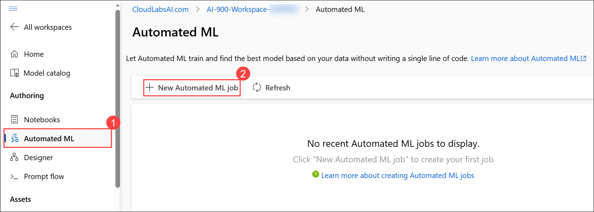  

1. Create a new Automated ML job with the following settings, using **Next (5)** as required to progress through the user interface:

    **Basic settings**:

    - **Job name**: mslearn-icecream-automl **(1)**
    - **New experiment name**: mslearn-icecream-automl **(2)**
    - **Description**: Automated machine learning for ice cream demand prediction **(3)**
    - **Tags**: Leave default **(4)**

       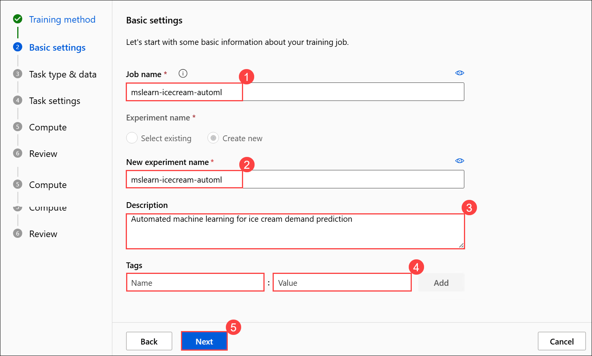

   **Task type & data**:

    - **Select task type**: Regression **(1)**
    - **Select data**: Select **+ Create (2)** 

        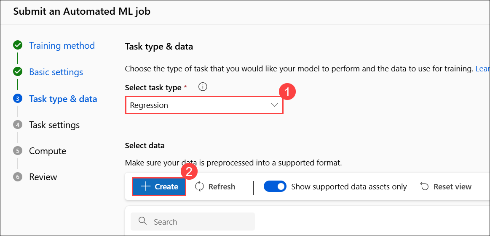

    - To create new data with the following settings:

         - **Data type**:
            - **Name**: `ice-cream` **(1)**
            - **Description**: `Historic ice cream sales data` **(2)**
            - **Type**: Tabular **(3)**
            - Click **Next (4)**

              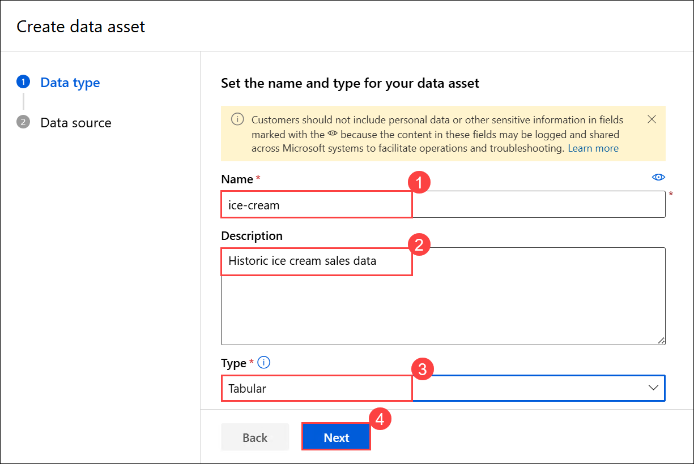
        - **Data source**:
            - Select **From local files (1)**
            - Click **Next (2)**

              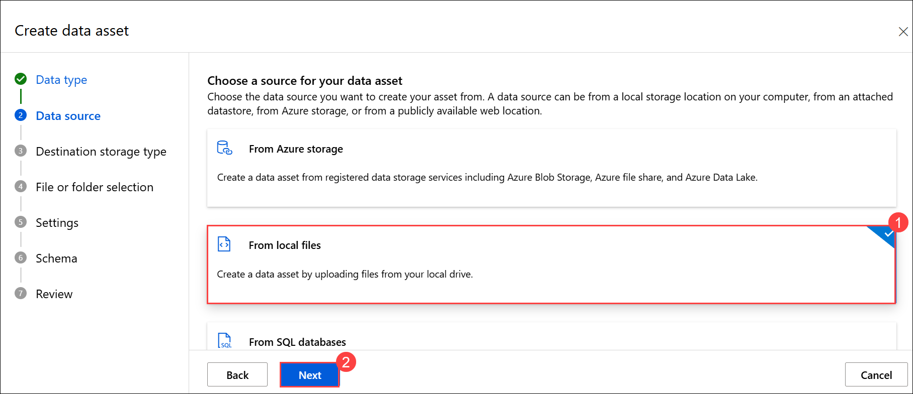
        - **Destination storage type**:
            - **Datastore type**: Azure Blob Storage **(1)**
            - **Name**: workspaceblobstore **(2)**
            - Click **Next (3)**

              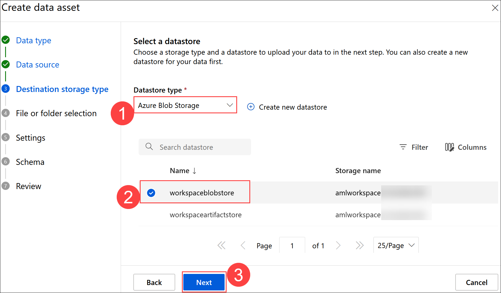
        - **Files or Folder selection**:
            - **Upload files or folder**: Download and extract the contents of the folder from [`https://aka.ms/mslearn-ml-data`](https://aka.ms/mslearn-ml-data), extract the downloaded **ml-data.zip** archive to see the files it contains. Note that one of these files is **ice-cream.csv**, which contains the ice cream sales data required for this exercise. Once uploaded, click on **Next**.

            - On the **Create data asset – File or folder selection** page, click **Upload files or folder (1)** and choose **Upload files (2)** to upload files from your local drive.

              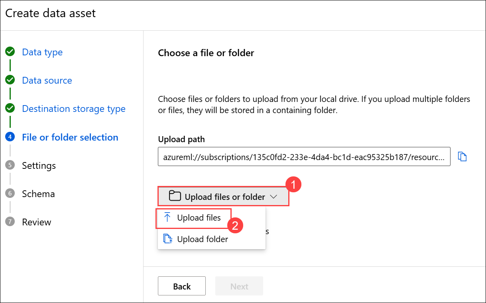

            - In the **Open** dialog, select **ice-cream (1)**, then click **Open (2)** to upload the file.

              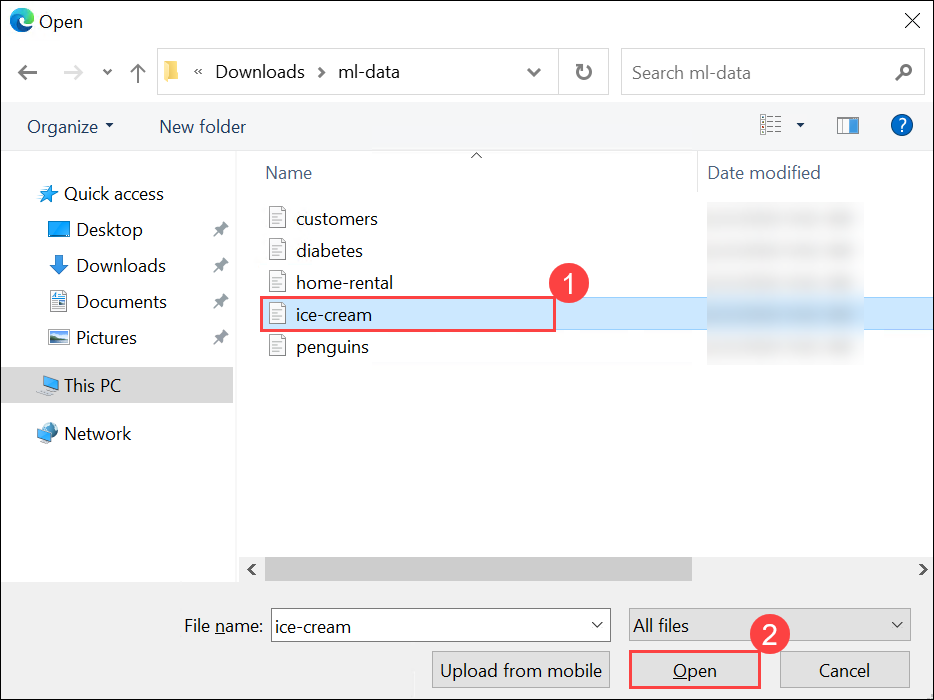

              .png)

        - On the **Create data asset - Settings** page, leave everything default click **Next**:

          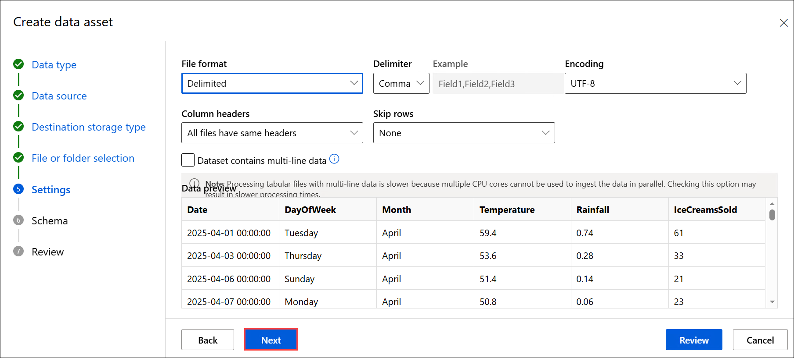
        - On the **Create data asset - Schema** page, 
          - Include **only** the following columns **(1)** (*Date* is unique for each row, and adds little predictive capability on its own):
            - **DayOfWeek**
            - **Month**
            - **Temperature**
            - **Rainfall**
            - **IceCreamsSold**
        - review detected columns and types, then click **Next (2)**

          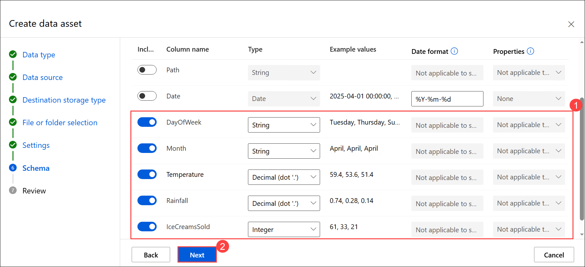

        - Select **Create**. 
  
          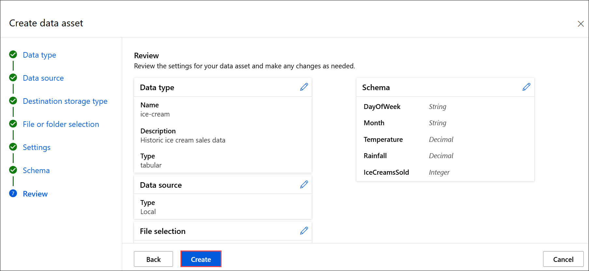
      
        - After the dataset is created, select the **ice-cream (1)** dataset to continue to submit the Automated ML job. Select **Next (2)**

          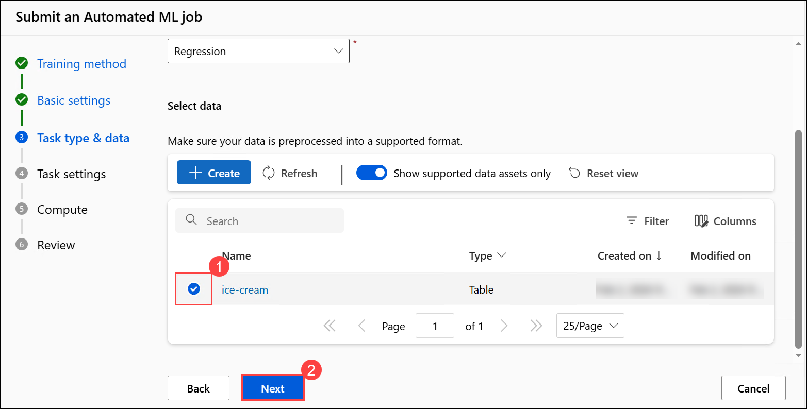
        
    **Task settings**:

    - **Task type**: Regression
    - **Data**: ice-cream
    - **Target column**: IceCreamsSold **(1)**

       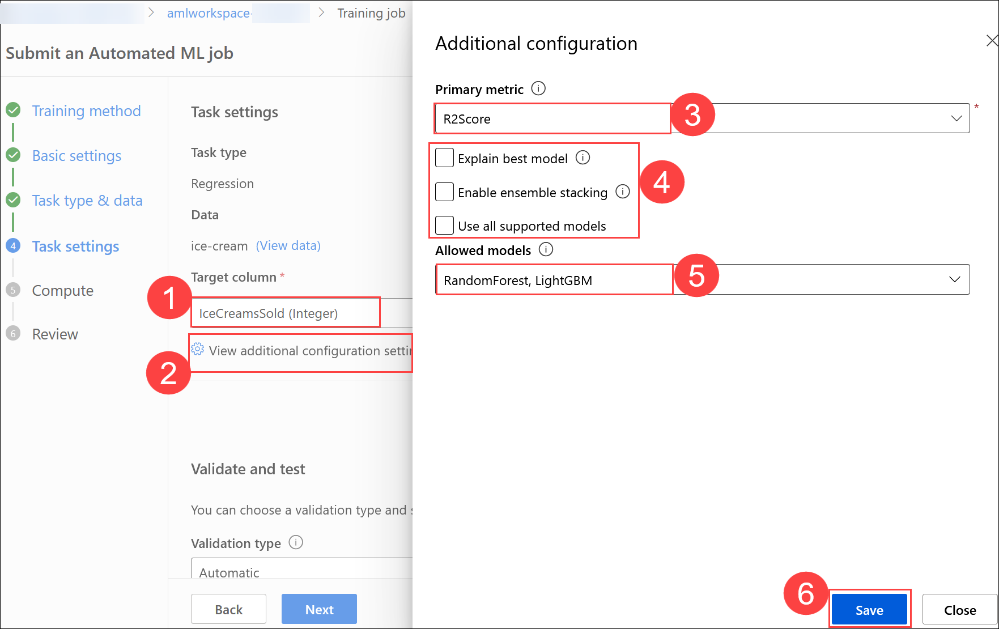

    - Select **View additional configuration settings (2)** under Target Column:
        - Primary metric: **R2 score** **(3)**
        - Explain best model: **Unselected** **(4)**
        - **Use all supported models**: <u>Un</u>selected.  You'll restrict the job to try only a few specific algorithms.
        - **Allowed models**: Select only **RandomForest** and **LightGBM** **(5)** - normally you'd want to try as many as possible, but each model added increases the time it takes to run the job. Then click on **Save (6)**.

    - **Limits**: **Expand this section**
        - Use the limits to end the training job early based on specific criteria. In this exercise, set the following limits:
          - Metric score threshold: **0.9** **(1)**
          - Experiment Timeout (minutes): **15** **(2)**
          - Click **Next (3)**

            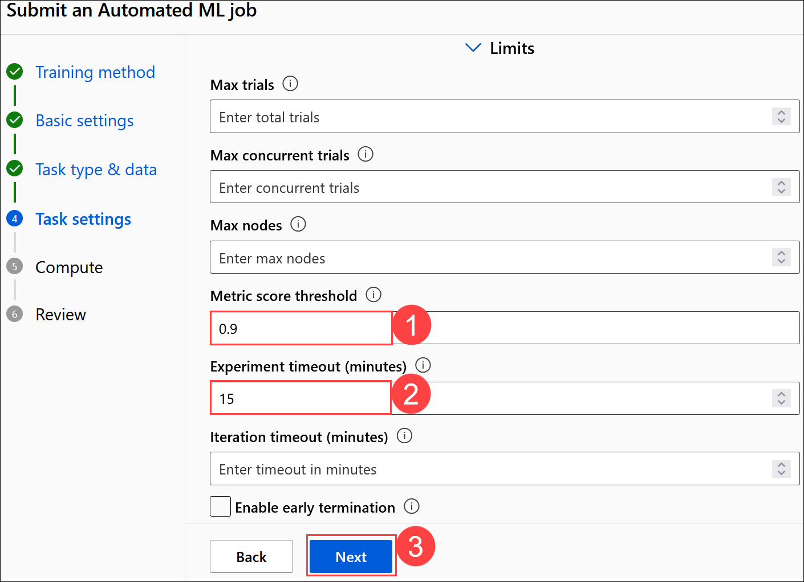

            >**Note:** It's important to set these limits when using Azure Machine Learning, as running training jobs for every possible algorithm and featurization combination could potentially take hours.

    **Compute**:
    - **Select compute type**: Serverless **(1)**
    - **Virtual machine type**: CPU **(2)**
    - **Virtual machine tier**: Dedicated **(3)**
    - **Virtual machine size**: Standard_DS3_V2 **(4)**
    - **Number of instances**: 1 **(5)** and then select **Next (6)**

      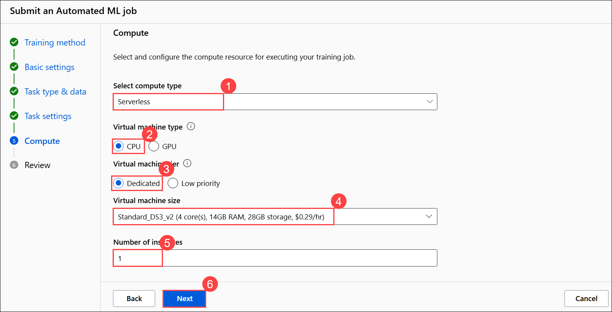

1. Select **Submit training job**. It starts automatically.

   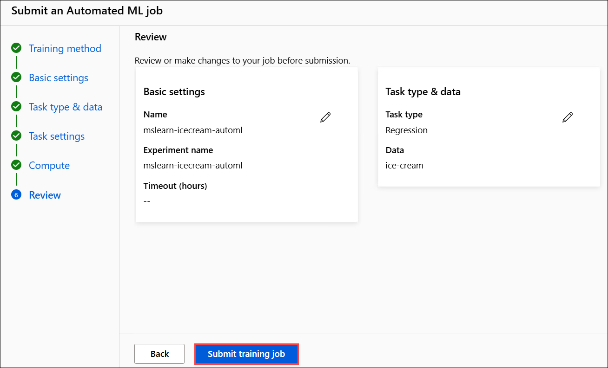

1. Wait for the job to finish. It might take around `10-15 minutes`, while now might be a good time for a coffee break!

**Review the best model**

When the automated machine learning job has completed, you can review the best model it trained.

1. On the **Overview** tab of the automated machine learning job, note the best model summary.

    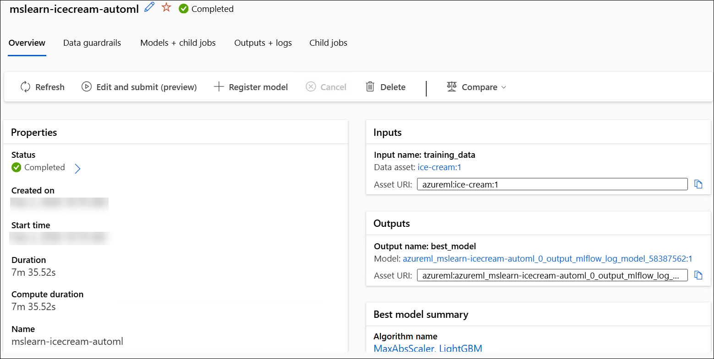

    > **Note**: You may see a message under the status "Warning: User specified exit score reached...". This is an expected message. Please continue to the next step.
  
1. Select the text under **Algorithm name** for the best model to view its details.

    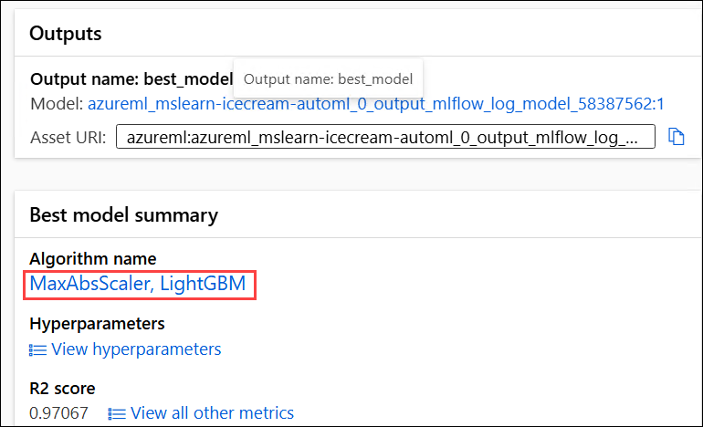

  - **Overview:** General details for the child job.

    .png)

  - **Model:** Information about the model that was trained.

    .png)

  - **Metric:** Select the **Metrics** tab and select the **residuals** and **predicted_true** charts if they are not already selected. 

    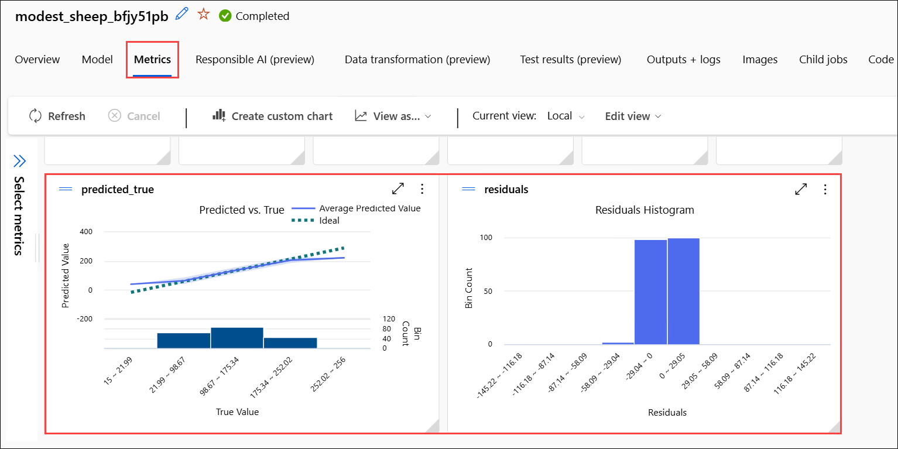

    >**Note:** Review the charts which show the performance of the model. The **residuals** chart shows the *residuals* (the differences between predicted and actual values) as a histogram. The **predicted_true** chart compares the predicted values against the true values.

  - **Outputs and logs:** Information logged during the training process.

    .png)

### Task 3: Deploy and test the model

1. On the **Model** tab for the best model trained by your automated machine learning job, select **Deploy (1)** and use the **Real-time endpoint (2)** option to deploy the model with the following settings:

   - **Instance count**: 3 **(1)** 
    - **Virtual machine**: Standard_DS3_v2 **(2)**
    - **Endpoint**: New **(3)**
    - **Endpoint name**: *Leave the default name* **(4)**
    - **Deployment name**: *Leave default* **(5)**
    - **Inferencing data collection**: *Disabled* **(6)**
    - **Package Model**: *Disabled* **(7)**

      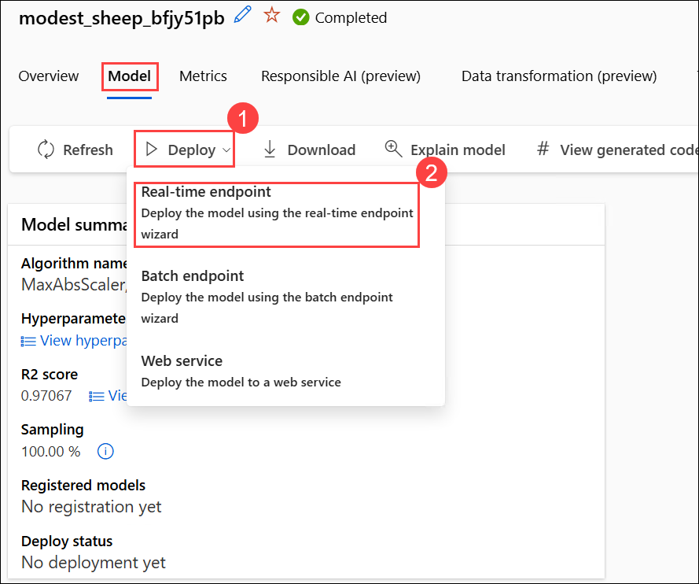

      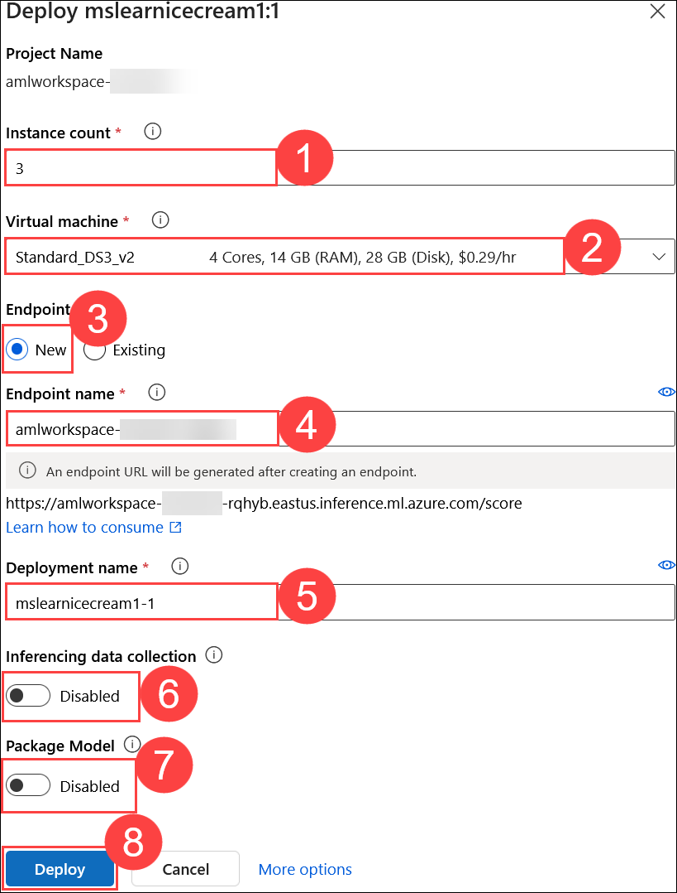

1. Select **Deploy (8)**

1. Wait for the **Deploy status** to change to *Succeeded*. This may take 5-10 minutes.

   >**Note**: Check the **Notifications** bar to verify the status of the operation.

### Task 4: Test the deployed service

Now you can test your deployed service.

1. In Azure Machine Learning studio, on the left hand menu, select **Endpoints (1)** and open the **Real-time endpoints (2)** in the page.

    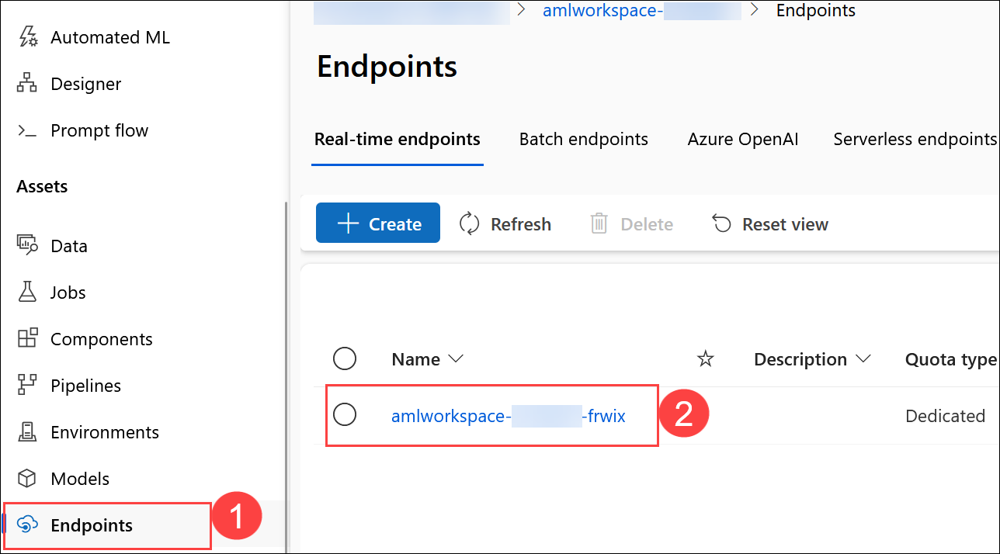

1. On the *real-time endpoint* page view the **Test** tab.

    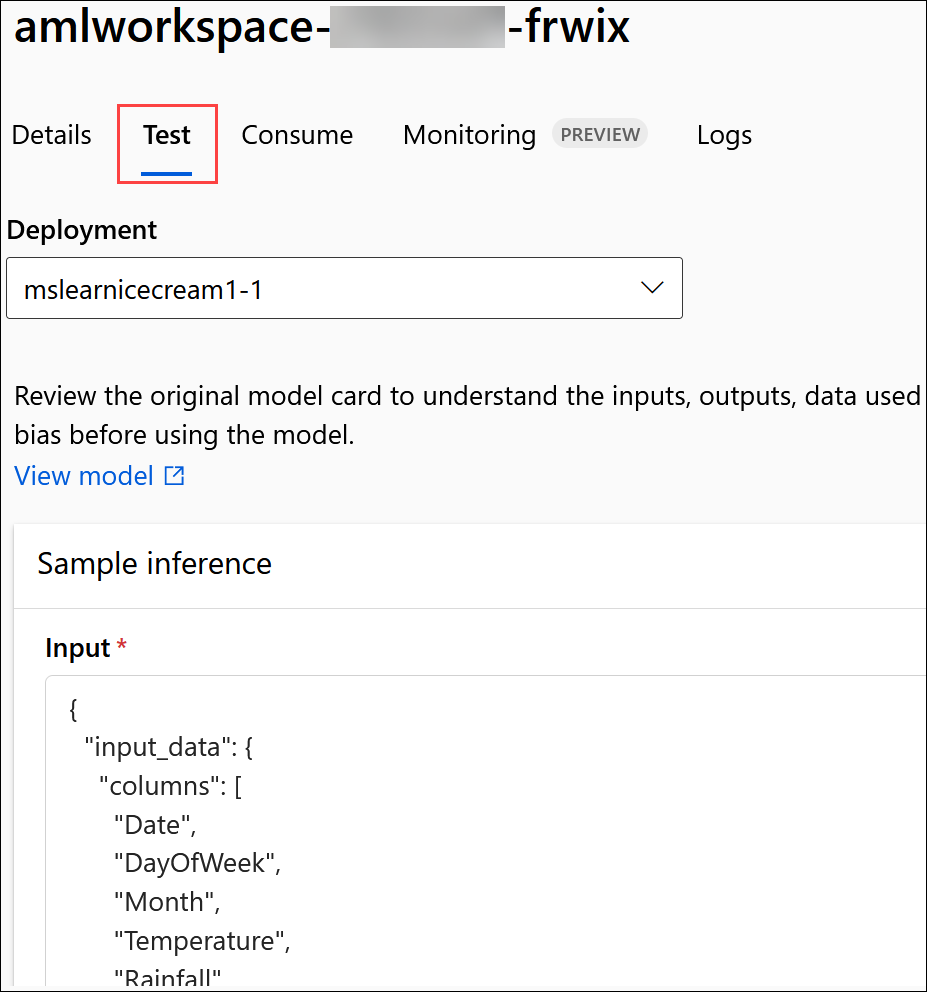

1. In the **Input data to test endpoint** pane, replace the template JSON with the following input data **(1)**:

    ```json
    {
    "input_data": {
        "columns": [
            "DayOfWeek",
            "Month",
            "Temperature",
            "Rainfall"
        ],
        "index": [0],
        "data": [["Wednesday","June",70.5,0.05]]
     }
    }
    ```

1. Click the **Test (2)** button.

    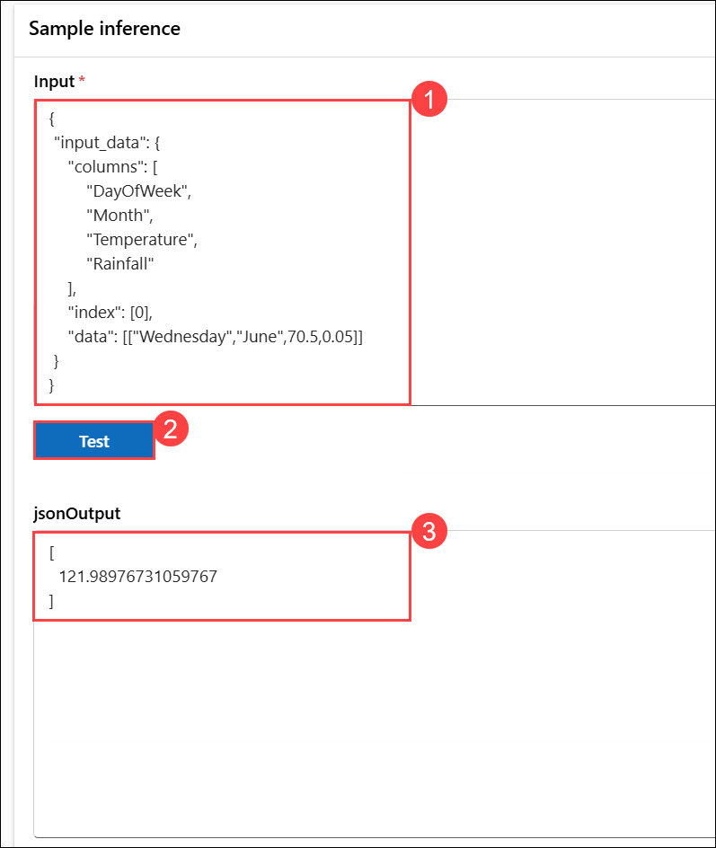

1. Review the test results, which include a predicted number of ice creams sold based on the input features - similar to this:

    ```JSON
    [
      121.98976731059767
    ]
    ```

    The test pane took the input data and used the model you trained to return the predicted number of ice creams sold.

Let’s review what you have done. You used a dataset of historical ice cream sales data to train a model. The model predicts the number of ice creams expected to be sold on a given day, based on seasonal and meteorological features.

## Validation

> **Congratulations** on completing the task! Now, it's time to validate it. Here are the steps:
> - Hit the Validate button for the corresponding task. If you receive a success message, you can proceed to the next task.
> - If not, carefully read the error message and retry the step, following the instructions in the lab guide. 
> - If you need any assistance, please contact us at cloudlabs-support@spektrasystems.com. We are available 24/7 to help you out.

  <validation step="d5b3d279-a696-4a1d-b7c5-370eca8ae53a" />

### Review
In this lab, you have completed the following tasks:
- Created an *Azure Machine Learning workspace* resource
- Utilized automated machine learning to train a model
- Deployed the model
  
## You have successfully completed this lab.
