# Get started with text analysis in Microsoft Foundry

In this lab, you will use Microsoft Foundry to explore Azure Language – Text Analytics capabilities. You’ll create a project in the Foundry portal and use the Language Playground to analyze text. Through hands-on tasks, you’ll perform sentiment analysis, key phrase extraction, named entity recognition, and text summarization on sample documents, gaining practical experience with common natural language processing (NLP) techniques used in real-world AI applications.

## Lab objectives

In this lab, you will perform:
- Task 1: Create a project in Microsoft Foundry portal
- Task 2: Prepare for text analysis
- Task 3: Analyze sentiment
- Task 4: Extract key phrases
- Task 5: Extract named entities
- Task 6: Summarize text

>**Note:** This exercise uses the **classic** Foundry interface. If you are using the new Foundry interface, you need to toggle back to the classic Foundry interface. 

### Task 1: Create a project in Microsoft Foundry portal 

In this task, you sign in to the Microsoft Foundry portal and create a new project.
This project sets up the required environment to use Azure Language services in the Language Playground.

1. Copy the **Microsoft Foundry** link and paste it into a new browser tab to access the portal: `https://ai.azure.com?azure-portal=true`

1. On the **Microsoft Foundry** home page, click on **Sign in** in the top right corner.

   

1. If prompted to sign in, enter your credentials:
 
   - **Email/Username:** <inject key="AzureAdUserEmail"></inject> **(1)** and click on **Next (2)**.
 
      
 
   - **Password:** <inject key="AzureAdUserPassword"></inject> **(1)** and click on **Sign in (2)**.
 
     .png)

1. If prompted to **Stay signed in?**, you can click **No**.

   

1. Scroll down to the bottom of the home page and select **Explore Azure AI services**. 

     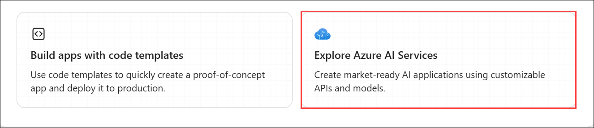

1. On the Azure AI services page, select the **Language + Translator** tile. 

     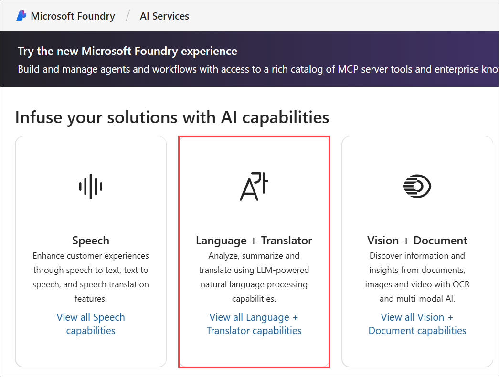

1. Select **Try the Language Playground**. Then in the dialog box click on **Create a new project**. 

     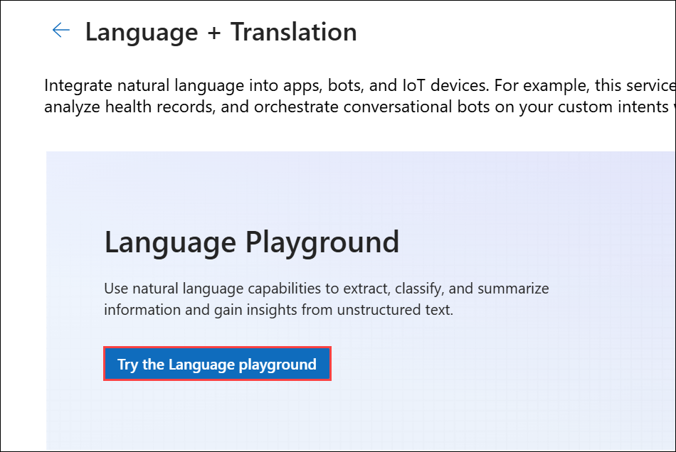

     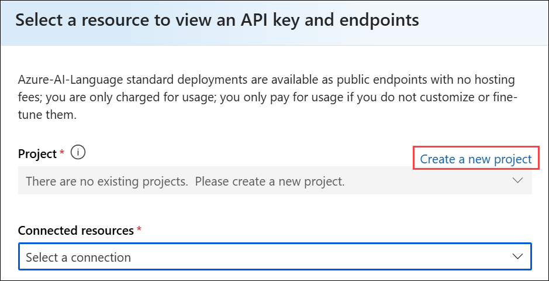

1. In the **Create a project** wizard, enter project name **Myproject<inject key="DeploymentID" enableCopy="false" /> (1)**, and **Expand Advanced options (2)** to specify the following settings for your project: 
     
     - **Subscription:** **Leave default subscription (3)** 
     - **Resource group:** Select **AI-900-Module-03a (4)** 
     - **Region:** Select **<inject key="location" enableCopy="false"/> (5)**
     - **Foundry or Azure OpenAI:**  Click on **Create New (6)**
    - Name: **AI<inject key="DeploymentID" enableCopy="false" /> (7)**
    - Click on Create **(8)**

      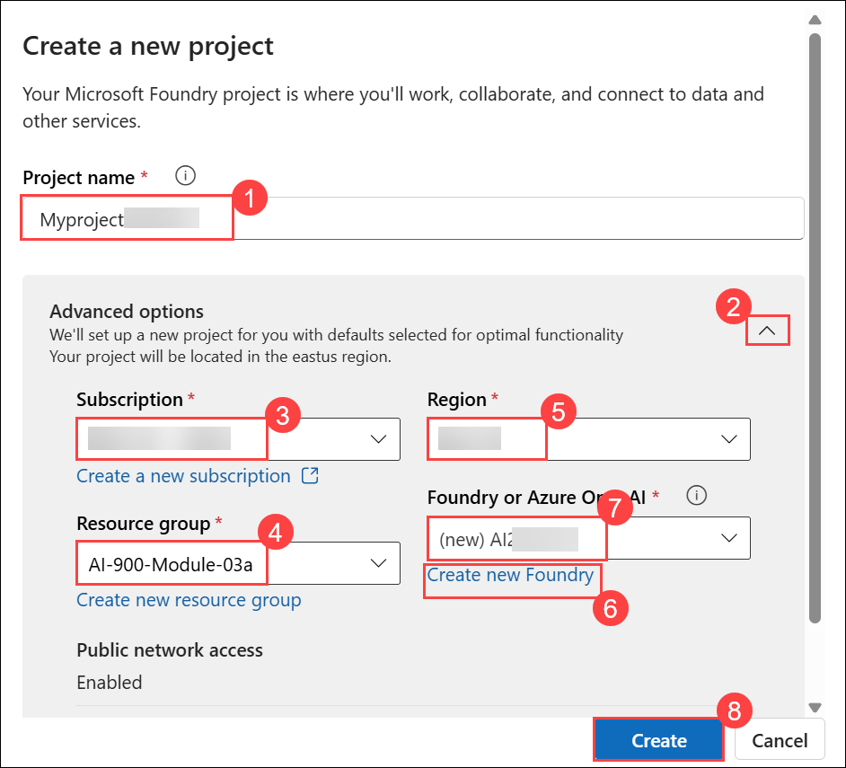

1. Wait for your project to be created. It may take a few minutes.

1. When the project is created, you will be taken to the **Language Playground**. The Language playground is a user interface that enables you to try out some Azure Language capabilities. 

     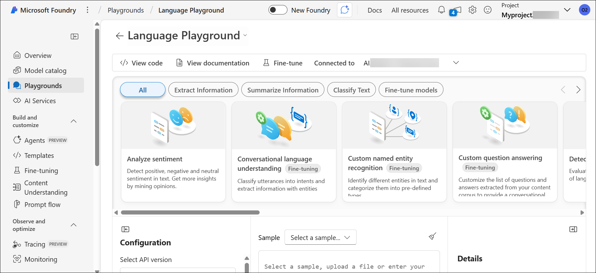

> **Congratulations** on completing the task! Now, it's time to validate it. Here are the steps:
 
- Hit the Validate button for the corresponding task. You will receive a success message. 
- If not, carefully read the error message and retry the step, following the instructions in the lab guide.
- If you need any assistance, please contact us at cloudlabs-support@spektrasystems.com. We are available 24/7 to help you out.

  <validation step="b5fc2cf7-316a-44fc-988b-06c8e323a185" />

### Task 2: Prepare for text analysis

In this task, you will download and extract sample text documents required for the lab. These files are used as input for performing text analysis in the Language Playground.

1. Open a new **InPrivate/Incognito** browser window, navigate to `https://aka.ms/ai-text`, and download the archive. This archive contains multiple text documents that you'll use in this exercise.

1. Select the **Downloads (1)** icon in the browser toolbar, and then choose **Open file (2)** for the downloaded **text.zip** file.

     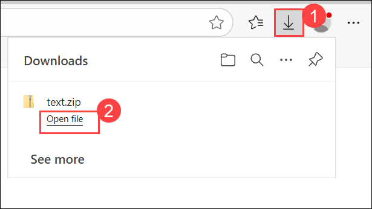

1. In File Explorer, select the **Extract (1)** tab, and then choose **Extract all (2)** to begin extracting the compressed files.

     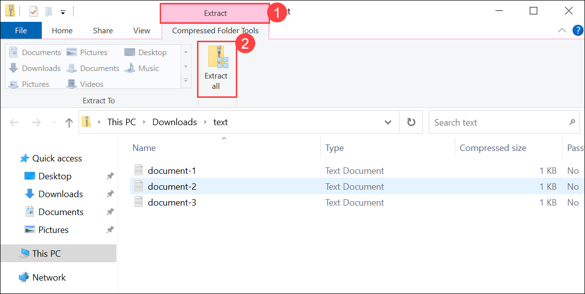

1. In the **Extract Compressed (Zipped) Folders** window, verify the destination path and select **Extract** to complete the process.

     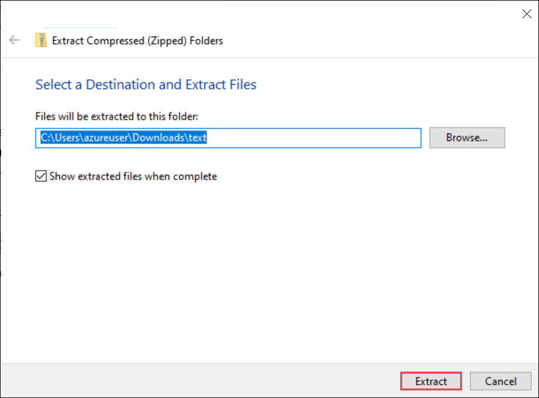

1. Return to the Language Playground to try out some of Azure Language's text analysis capabilities.

### Task 3: Analyze sentiment

**Sentiment analysis** is a common NLP task. It's used to determine whether text conveys a positive, neutral or negative sentiment; which makes it useful for categorizing reviews, social media posts, and other subjective documents.

1. In the Language playground, select **Classify text (1)**. Then select the **Analyze sentiment (2)** tile.

     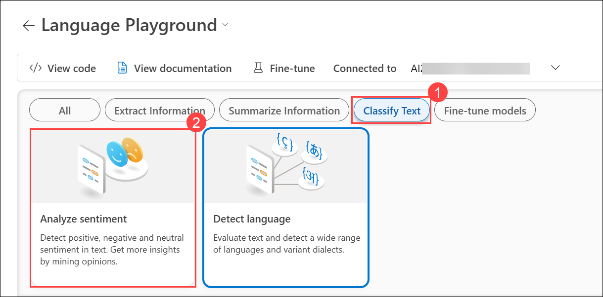

1. Select the **Upload (1)** icon, browse to **Downloads (2)**, choose **document-1 (3)**, and then select **Open (4)** to upload the file.

     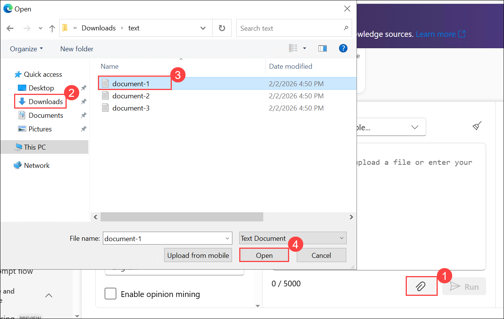

1. In the Language Playground, review the text input area and select the **Run** button to analyze the sentiment.

     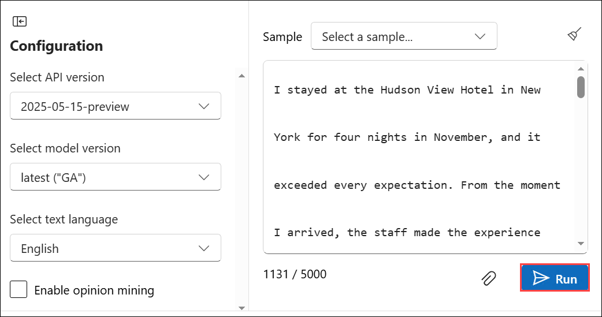

1. Review the analysis results displayed in the **Details** pane, including the overall sentiment score and sentence-level insights.

     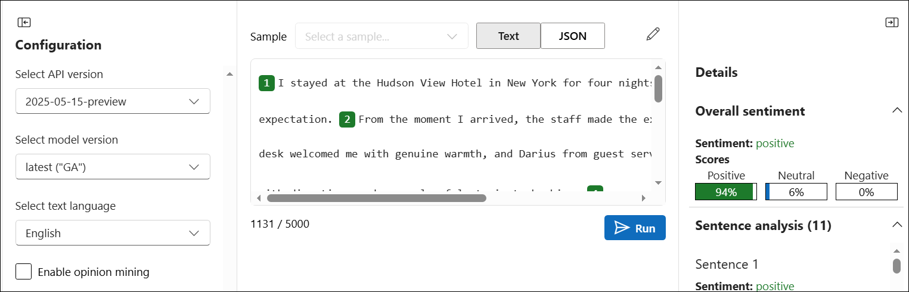

1. Select the pencil icon to edit the text. Repeat the analysis for **document-2.txt** and **document-3.txt**.

### Task 4: Extract key phrases

**Key phrases** are the most important pieces of information in text. Let's use the key phrase extraction capability of Azure Language to pull important information from a review.

1. In the Language playground, select **Extract information (1)**. Then select the **Extract key phrases (2)** tile.

     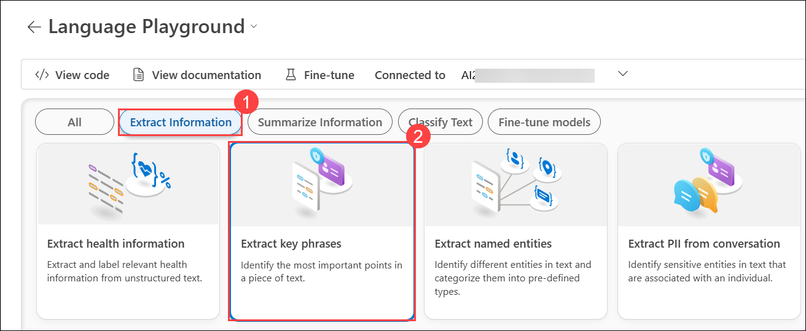

1. Select the **Upload (1)** icon, browse to **Downloads (2)**, choose **document-1 (3)**, and then select **Open (4)** to upload the file.

     

1. In the Language Playground, select **Run** to analyze the text.

     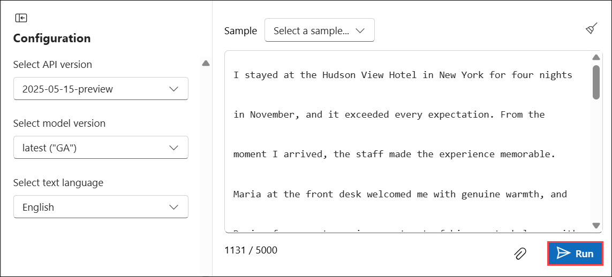

1. Review the extracted key phrases and results displayed in the **Details** pane.

     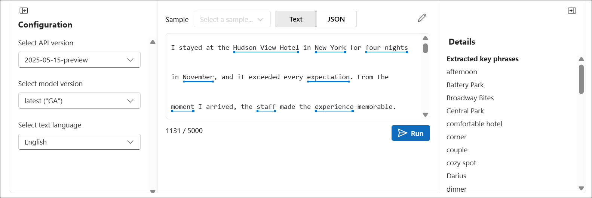

     >**Tip:** Notice the different phrases extracted in the *Details* section. These phrases should contribute most to the text's meaning.

1. Select the pencil icon to edit the text. Repeat the analysis for **document-2.txt** and **document-3.txt**.

### Task 5: Extract named entities

**Named entities** are words that describe people, places, and objects with proper names. Let's use the named entity extraction capability of Azure Language to identify types of information in a review.

1. In the Language playground, select **Extract information (1)**. Then select the **Extract named entities (2)** tile. 

     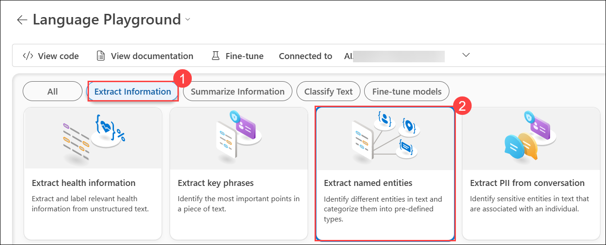

1. Select the **Upload (1)** icon, browse to **Downloads (2)**, choose **document-1 (3)**, and then select **Open (4)** to upload the file.

     

1. In the Language Playground, select **Run** to analyze the text.

     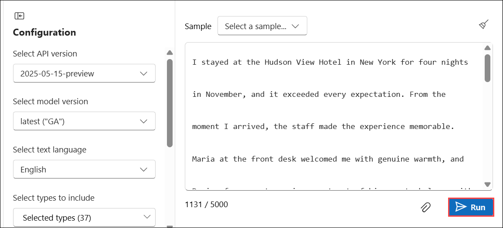

1. Review the extracted entities and results displayed in the **Details** pane.

     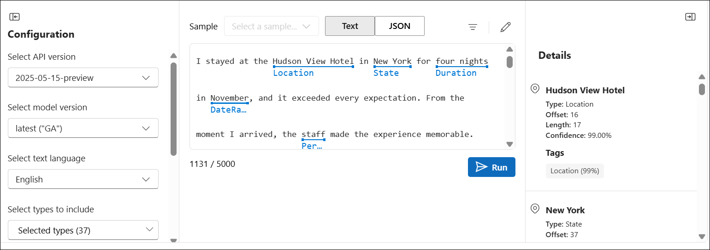

     >**Tip:** Notice in the *Details* section how the extracted entities come with additional information such as type and confidence scores. The confidence score represents the likelihood that the type identified actually belongs to that category.

1. Select the pencil icon to edit the text. Repeat the analysis for **document-2.txt** and **document-3.txt**.

### Task 6: Summarize text

**Summarization** is a way to distill the main points in a document into a shorter amount of text.

1. In the Language playground, select **Summarize information (1)**, then select the **Summarize text (2)** tile.

      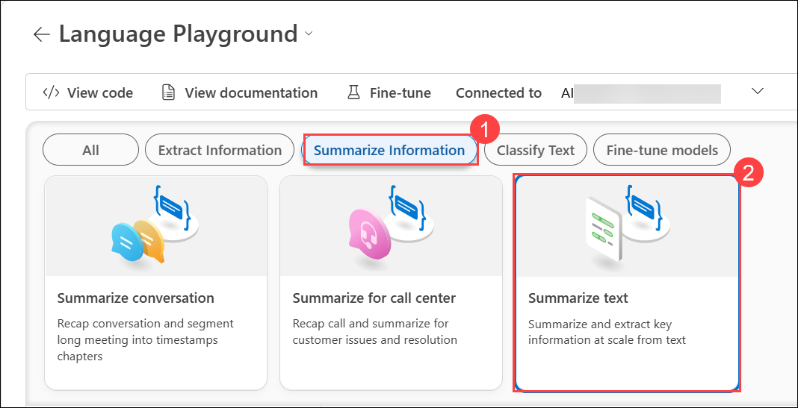

1. Select the **Upload (1)** icon, browse to **Downloads (2)**, choose **document-1 (3)**, and then select **Open (4)** to upload the file.

     

1. In the Language Playground, select **Run** to generate the extractive summary.

     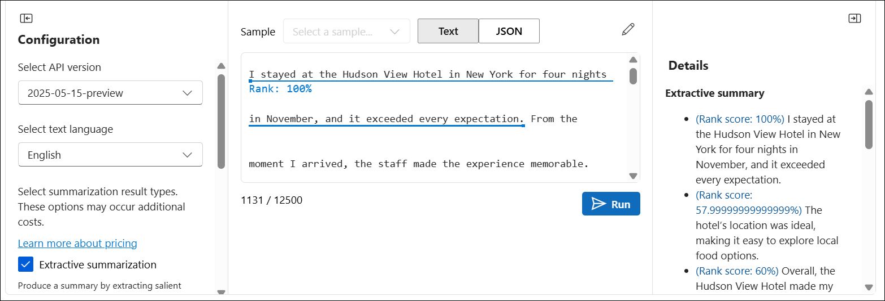

1. Review the summarized sentences and their rank scores in the **Details** pane under Extractive summary.

     >**Tip:** Notice the *Extractive summary* in *Details* provides rank scores for the most salient sentences.

1. Select the pencil icon to edit the text. Repeat the analysis for **document-2.txt** and **document-3.txt**.

#### Review the sample code

1. Select the **View code** tab to view sample code for text summarization. Below is the same sample code in Python for your reference:

    ```python

    # This example requires environment variables named "AZURE_AI_KEY" and "ENDPOINT_TO_CALL_LANGUAGE_API"
    key = os.environ.get('AZURE_AI_KEY')
    endpoint = os.environ.get('ENDPOINT_TO_CALL_LANGUAGE_API')

    from azure.ai.textanalytics import TextAnalyticsClient
    from azure.core.credentials import AzureKeyCredential

    # Authenticate the client using your key and endpoint 
    def authenticate_client():
        ta_credential = AzureKeyCredential(key)
        text_analytics_client = TextAnalyticsClient(
                endpoint=endpoint, 
                credential=ta_credential)
        return text_analytics_client

    client = authenticate_client()

    # Example method for summarizing text
    def sample_extractive_summarization(client):
        from azure.core.credentials import AzureKeyCredential
        from azure.ai.textanalytics import (
            TextAnalyticsClient,
            ExtractiveSummaryAction
        ) 

        document = [
            "The extractive summarization feature uses natural language processing techniques to locate key sentences in an unstructured text document. "
            "These sentences collectively convey the main idea of the document. This feature is provided as an API for developers. " 
            "They can use it to build intelligent solutions based on the relevant information extracted to support various use cases. "
            "Extractive summarization supports several languages. It is based on pretrained multilingual transformer models, part of our quest for holistic representations. "
            "It draws its strength from transfer learning across monolingual and harness the shared nature of languages to produce models of improved quality and efficiency. "
        ]

        poller = client.begin_analyze_actions(
            document,
            actions=[
                ExtractiveSummaryAction(max_sentence_count=4)
            ],
        )

        document_results = poller.result()
        for result in document_results:
            extract_summary_result = result[0]  # first document, first result
            if extract_summary_result.is_error:
                print("...Is an error with code '{}' and message '{}'".format(
                    extract_summary_result.code, extract_summary_result.message
                ))
            else:
                print("Summary extracted: 
    {}".format(
                    " ".join([sentence.text for sentence in extract_summary_result.sentences]))
                )

    sample_extractive_summarization(client)

    ```

    > **Tip:** You can copy the code and run it in your preferred Python development environment - for example Visual Studio Code. You will need to create environment variables for your Azure Language endpoint and key; which you can find in the code sample window.

### Review

In this exercise, you have completed the following tasks:

- Created a project in the Microsoft Foundry portal
- Prepared sample documents for text analysis
- Analyzed sentiment using Azure AI Language
- Extracted key phrases using Azure AI Language
- Extracted named entities using Azure AI Language
- Summarized text using Azure AI Language

## Learn more

To learn more about what you can do with this service, see the [Language service page](https://learn.microsoft.com/azure/ai-services/language-service/overview).


### Congratulations, you’ve successfully completed the hands-on lab!
