# Get started with speech in Microsoft Foundry

## Lab overview

In this exercise, you'll use Microsoft Foundry to explore speech-enabled generative AI capabilities. You'll interact with a generative AI model using speech, configure voices and system prompts, adjust model and speech parameters, and review the client code that enables real-time voice-based conversations.

## Lab objectives

In this exercise, you will perform:

- Task 1: Create a Microsoft Foundry project
- Task 2: Navigate to Azure Speech - Voice Live 
- Task 3: Open the Speech Playground App
- Task 4: Select a voice 
- Task 5: Use speech to interact with the model (Read Only)
- Task 6: Experiment with system prompts (Read Only)
- Task 7: Experiment with model parameters (Read Only)
- Task 8: View the client code 

## Task 1: Create a Microsoft Foundry project

In this task, you'll create and configure a Microsoft Foundry project to organize the resources and services required for building a speech-enabled AI application.

1. Copy the **Microsoft Foundry** link and paste it into a new browser tab to access the portal: `https://ai.azure.com?azure-portal=true`

1. On the **Microsoft Foundry** home page, click on **Sign in** in the top right corner.

   

1. If prompted to sign in, enter your credentials:
 
   - **Email/Username:** <inject key="AzureAdUserEmail"></inject> **(1)** and click on **Next (2)**.
 
      
 
   - **Password:** <inject key="AzureAdUserPassword"></inject> **(1)** and click on **Sign in (2)**.
 
     .png)

1. If prompted to **Stay signed in?**, you can click **No**.

   

   > **Note:** Close any tips or quick start panes that are opened the first time you sign in, and if necessary, use the **Foundry** logo at the top left to navigate to the home page.

1. At the top of the **Microsoft Foundry** portal, enable the **New Foundry toggle (1)** to switch to the latest Foundry user interface.

1. From the **Select a project to continue** dialog, click the drop-down under **Select or search for a project**, and then select **Create a new project (2)**.

    

1. In the **Create a project** wizard, enter project name **Myproject<inject key="DeploymentID" enableCopy="false" /> (1)**, and expand **Advanced options (2)** to specify the following settings for your project: 

    - Subscription : **Leave default subscription (3)** 
    - Resource Group : Select **AI-900-Module-04a (4)** 
    - Microsoft Foundry resource: **MyFoundry<inject key="DeploymentID" enableCopy="false" /> (5)**
    - Region : Select **<inject key="location" enableCopy="false"/> (6)**
    - Click on **Create** **(7)**

      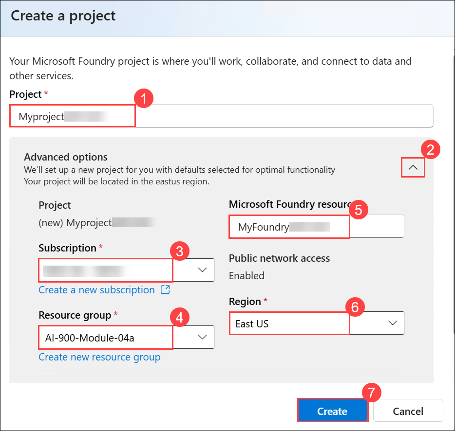
      
      >**Note:** Model deployments are restricted by regional quotas. If you select a region in which you have insufficient available quota, you may need to select an alternative region for a new resource later.

1. Wait for your project to be created. It may take a few minutes. Once the setup is complete, you are automatically redirected to the **Microsoft Foundry home page** for the newly created project.

    

## Task 2: Navigate to Azure Speech - Voice Live 

In this task, you'll navigate to Azure Speech - Voice Live within Microsoft Foundry to access speech-related AI services and the Speech Playground.

1. Go to the top-right corner of the Foundry home page, expand the menu if needed, and select **Build**.

    

1. On the **Build** page, from the left-hand menu and select **Models (1)**, then choose **AI Services (2)** from the Models page.

    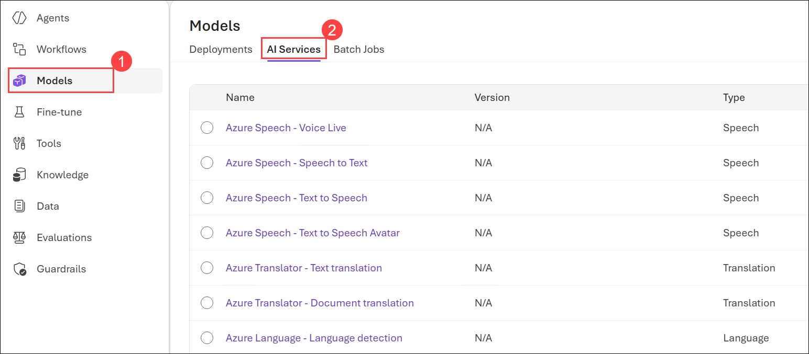

1. Keep in mind that this list shows only a small portion of the AI capabilities offered by Foundry Tools. You’ll find several Speech-related services here that you can test, including: 
 
    - **Azure Speech - Speech to Text**: capabilities used to generate text transcriptions from speech audio. For example, to transcribe calls or meetings, or to create captions for hearing-impaired users.
    - **Azure Speech - Text to Speech**: capabilities used to generate audio from text. For example, to create audio to help people with visual impairments or enable bots with natural-sounding speech.

1. From the list, select **Azure Speech - Voice Live** to try out *Voice Live* capabilities in the Speech Playground. 

    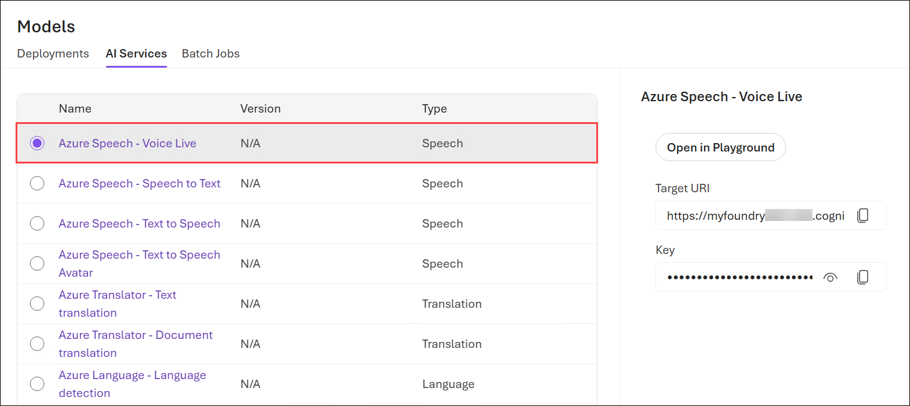

## Task 3: Open the Speech Playground App

In this exercise, you'll use a browser-based application to chat with the **GPT-4.1 Mini** model, a small language model that is useful for general chat solutions.

1. In your web browser, make sure the **Azure Speech-Voice Live Playground** is open. In the settings pane, browse through the samples and choose **Start with Blank** to create a new assistant.

    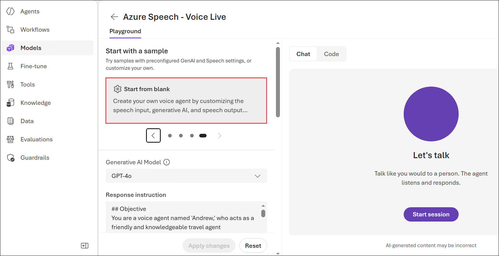
 
1. In the playground settings pane, change the **Generative AI model** to **GPT-4.1 Mini (1)**, then click **Apply changes (2)** to save your selection.

    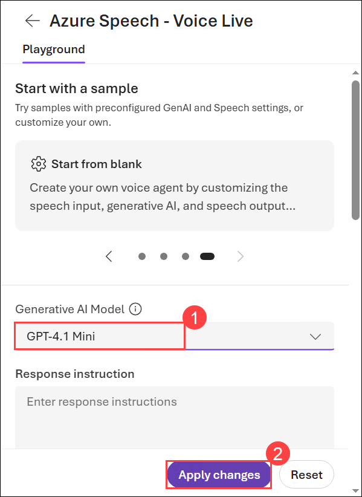

## Task 4: Select a voice 

In this task, you'll select and configure a text-to-speech voice to control how the assistant sounds.

1. In the configuration pane on the left, view the voices in the **Speech output (1)** drop-down list.
 
1. Select any of the available voices, and use the Preview selected voice (▷) **(2)** button to hear a sample of the voice.

    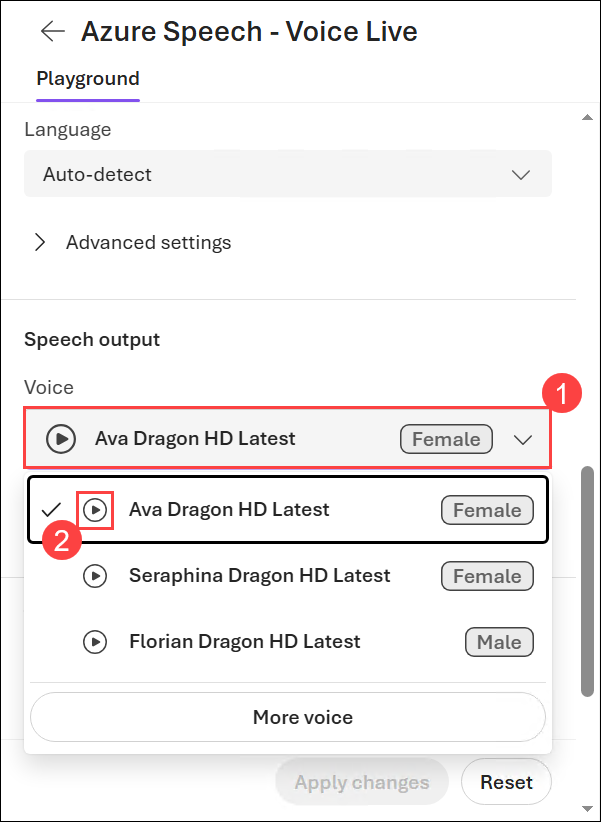
 
1. When you have selected the voice you want to use, use the **Apply changes** button to activate it.

    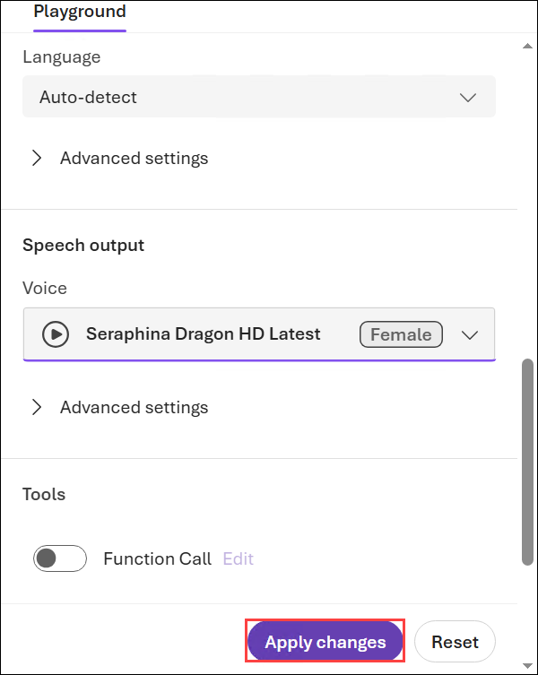

## Task 5: Use speech to interact with the model (Read Only)

In this task, you'll interact with the model using spoken input and listen to spoken responses, demonstrating speech-to-text and text-to-speech capabilities.

1. In the **Chat** pane, click **Start session** to begin a conversation with the model. If asked, allow microphone access. The agent will then introduce itself.

    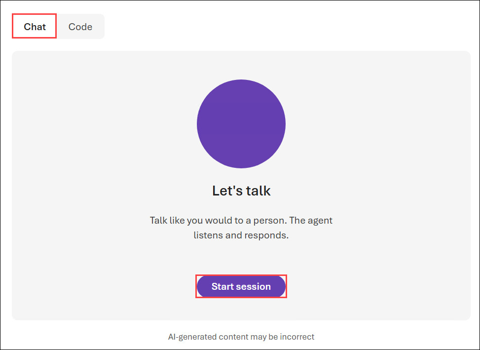

    >**Note**: If you are not prompted for microphone access, and your microphone is not detected, try the following steps to allow microphone access. In the browser window, navigate to the page url. Click on the *lock icon* next to the url. Select *Permissions*, *Microphone*, and *Allow*. Then refresh the page and try again.

1. When the app status is **Listening…**, say something like `"How does speech recognition work?"` and wait for a response.

    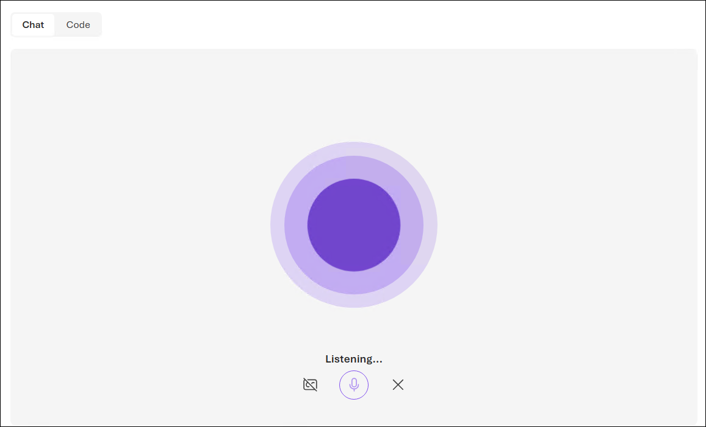

1. Verify that the app status changes to **Processing…**. The app will process the spoken input, using speech-to-text to convert your speech to text and submit it to the model as a prompt. 

    >**Note**: The processing speed may be so fast that you do not actually see the status before it changes back to *Speaking*.

1. When the status changes to **Speaking…**, the app uses text-to-speech to vocalize the response from the model. To see the original prompt and the response as text, select the **cc** button at the bottom of the chat screen.

    >**Note**: The follow-on prompt is submitted just by speaking. You can even interrupt the agent to keep the interaction focused on what you need done. 
    >**Note**: You can also use the Stop generation button in the chat pane to stop long-running responses. The button will end the conversation. You will need to start a new conversation to continue using the agent. 

    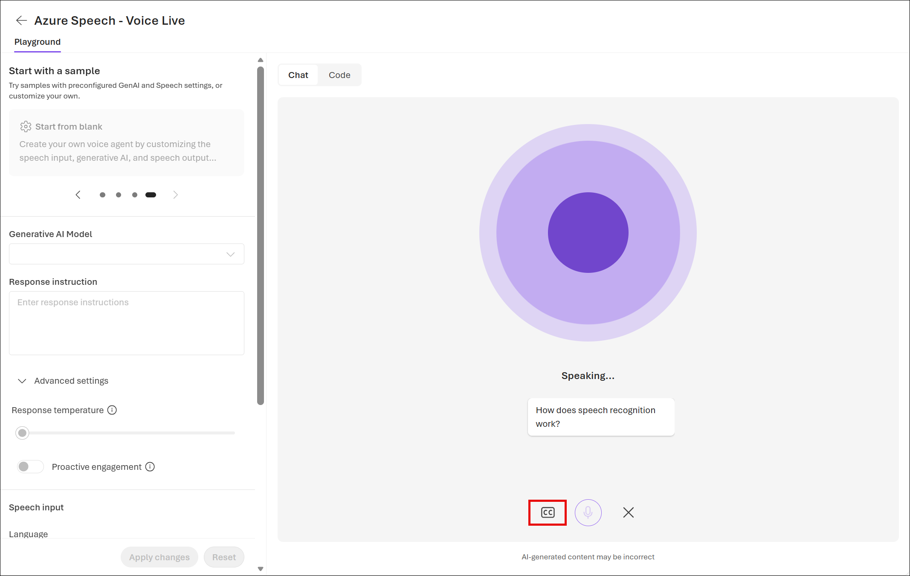

1. To continue the conversation, submit a second spoken prompt, such as `"How does speech synthesis work?"`, and review the response.

## Task 6: Experiment with system prompts (Read Only)

In this task, you'll modify system prompts to control the style, format, and length of the model’s responses.

1. In the pane on the left, in the **Response Instructions** text area, change the system prompt to: `You are an AI assistant that provides short and concise answers using simple language. Limit responses to a single sentence.` **(1)** and then click on **Apply changes (2)**.

    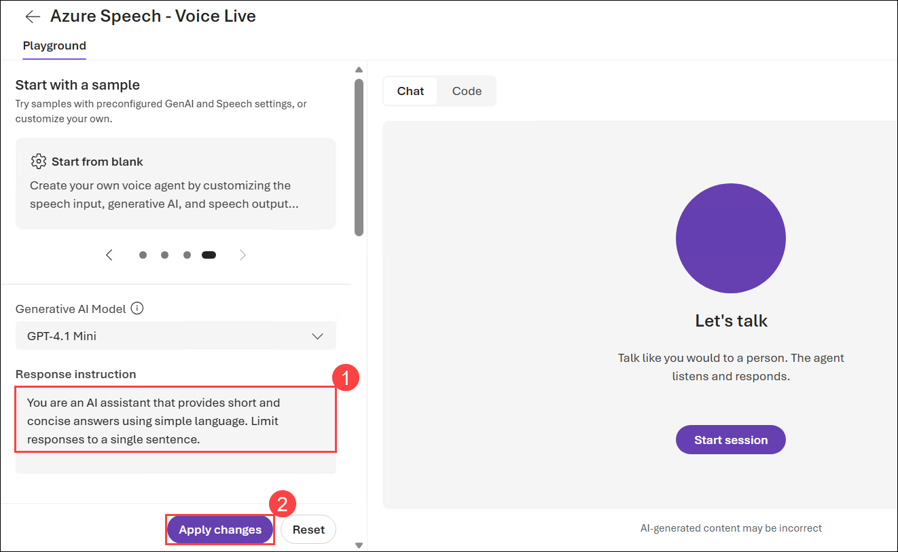

1. Now try the same prompt as before,`How does speech synthesis work?` and review the output.

## Task 7: Experiment with model parameters (Read Only)

In this task, you'll experiment with model and speech parameters to understand how they affect response creativity, behavior, and audio output.

Model parameters control how the model works, and can be useful for restricting the size of its responses (measured in tokens) and controlling how "creative" its responses can be.

#### Generative AI model parameters

1. Review the generative AI model's *Advanced settings*. One way you can affect the model's responses is by configuring the **temperature** of the response. The *temperature* is a parameter that controls the randomness or creativity of the model's responses. When the model is set to a lower temperature, its responses are more predictable and factual. As the temperature increases, more variability and creativity are added. The higher temperature setting is useful for brainstorming, its conversational tone, and generating varied examples. If the temperature is too high, however, it can result in responses that do not make much sense and aren't reliable.

1. Expand **Advanced settings (1)**, change the **Response temperature (2)**, then click **Apply changes (3)**. Repeat the same prompt as before, `How does speech synthesis work?` to observe the difference.

    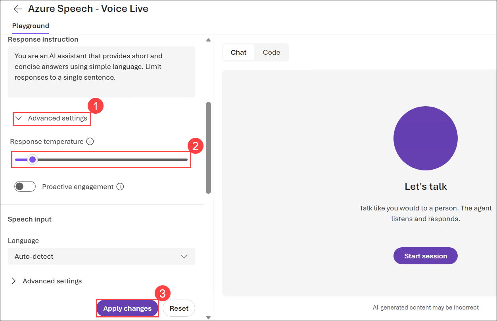

1. Another setting for the model is **proactive engagement**. Activating the toggle **on** means the agent initiates the conversation. Try turning the proactive engagement **On (1)**, then click on **Apply changes (2)** and start a new conversation with the agent.  

    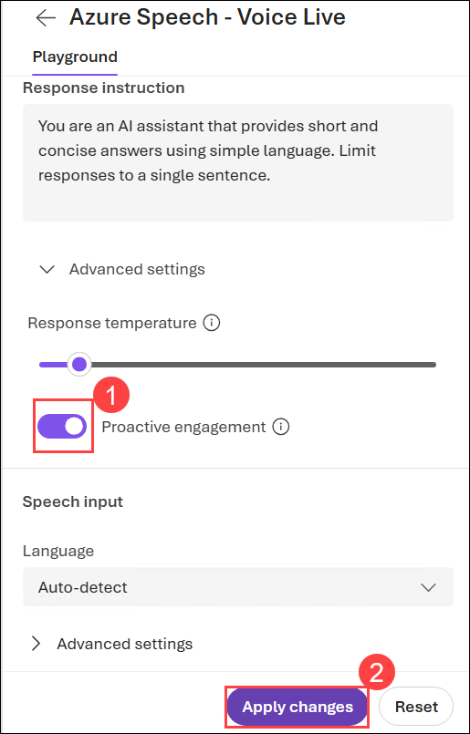

#### Speech input parameters 

1. Review the speech input's *Advanced settings*. 
    - **End of utterance (EOU)**: Detects the end of speaking and stops speech recognition processing, returning results promptly. Currently does not support GPT-4o Realtime or GPT-4o Mini Realtime models.
    - **Audio enhancement**: Improves sound quality by reducing noise and boosting clarity, ensuring more accurate and clear speech recognition.

        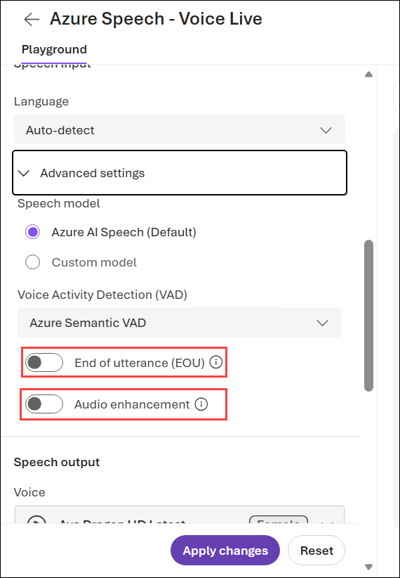

#### Speech output parameters

1. Review the speech output's advanced settings. 
    - **Voice temperature**: Controls the style and expressiveness of the spoken audio, including intonation, prosody, emphasis, pacing, and emotional variance. 
    - **Playback speed**: The speed at which the voice is speaking.
    - **Custom lexicon**: Define the pronunciation of specific words, such as company names, medical terms, or emojis. Create a custom lexicon file using the Audio Content Creation tool, and copy its link here to use

        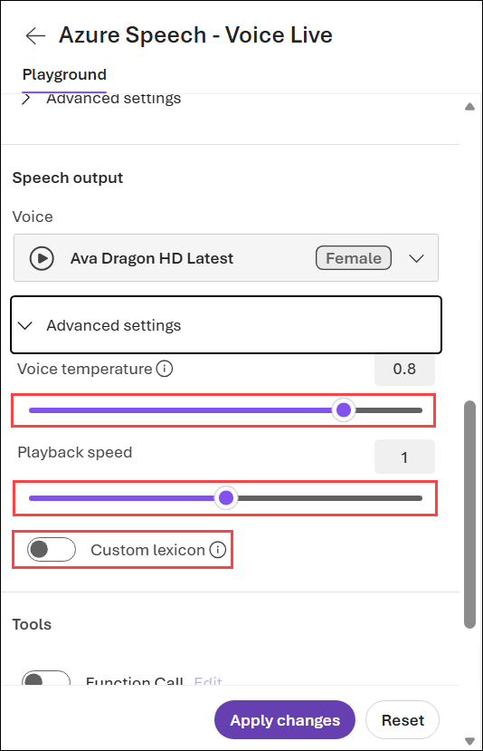

1. If you have time, you can also try out an Azure avatar. Activating the avatar toggle will allow you to select a prebuilt avatar or create a custom avatar that visualizes the agent's audio output as an avatar speaking.

    >**Note:** The avatar feature is currently supported only in the **East US 2, Southeast Asia, and Sweden Central regions**. It is not available in other resource regions.

## Task 8: View the client code 

In this task, you'll review the client code that powers the voice-enabled assistant to understand how speech and AI services are implemented.

1. Select **Code** at the top of the chat screen. You should see Python code like this:  

    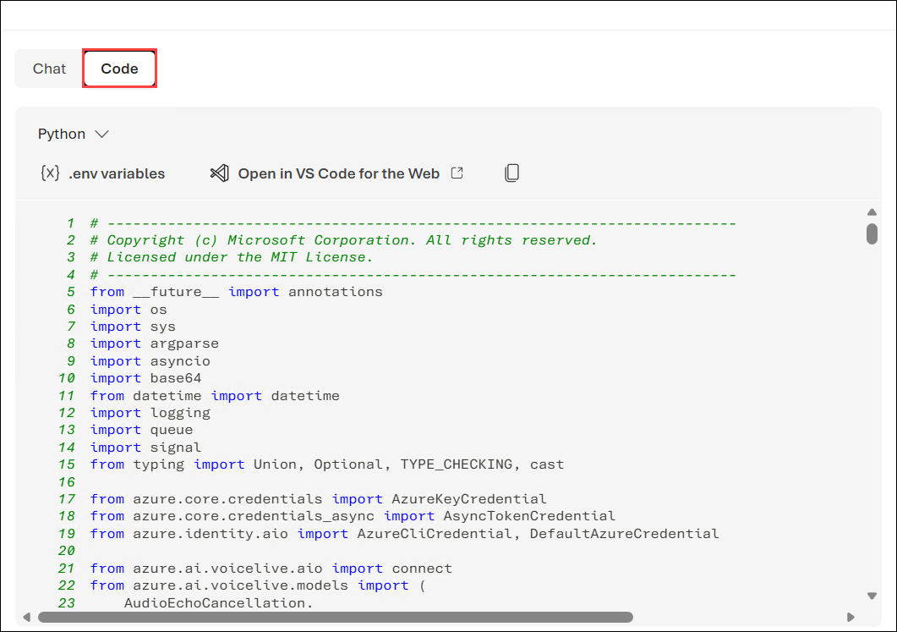

1. In lines `17-32` you can see the specific Azure Speech packages imported. Imported packages provide additional functionality and tools - in this case, additional functions and models that complement the language model used to respond to the conversation text itself. By importing these packages, you can leverage prebuilt, optimized solutions instead of writing everything from scratch, making code more efficient, readable, and maintainable.  

    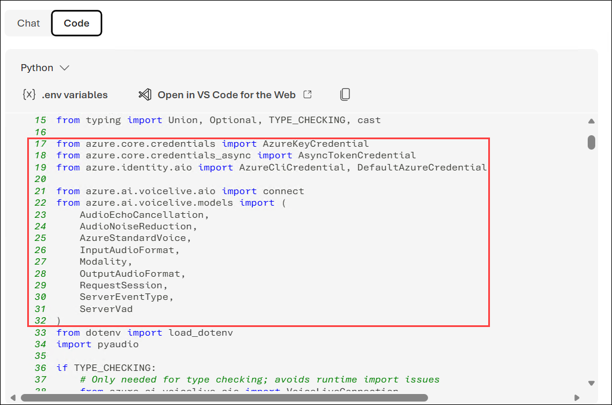

1. The web live voice assistant is composed of two major functionalities: the Audio Processor and the Voice Assistant.  In lines `63-238`, you can review the code for the `AudioProcessor` class to see how it handles real-time audio capture and playback. 

    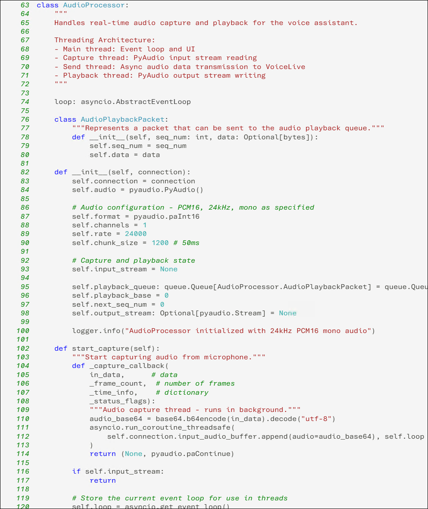

1. The `BasicVoiceAssistant` class begins on line `240`. The code in this class uses the VoiceLive Python SDK to handle the events from the VoiceLive connection. Notice how the `BasicVoiceAssistant` has a dependency on the `AudioProcessor` class (such as in line `258`).   

    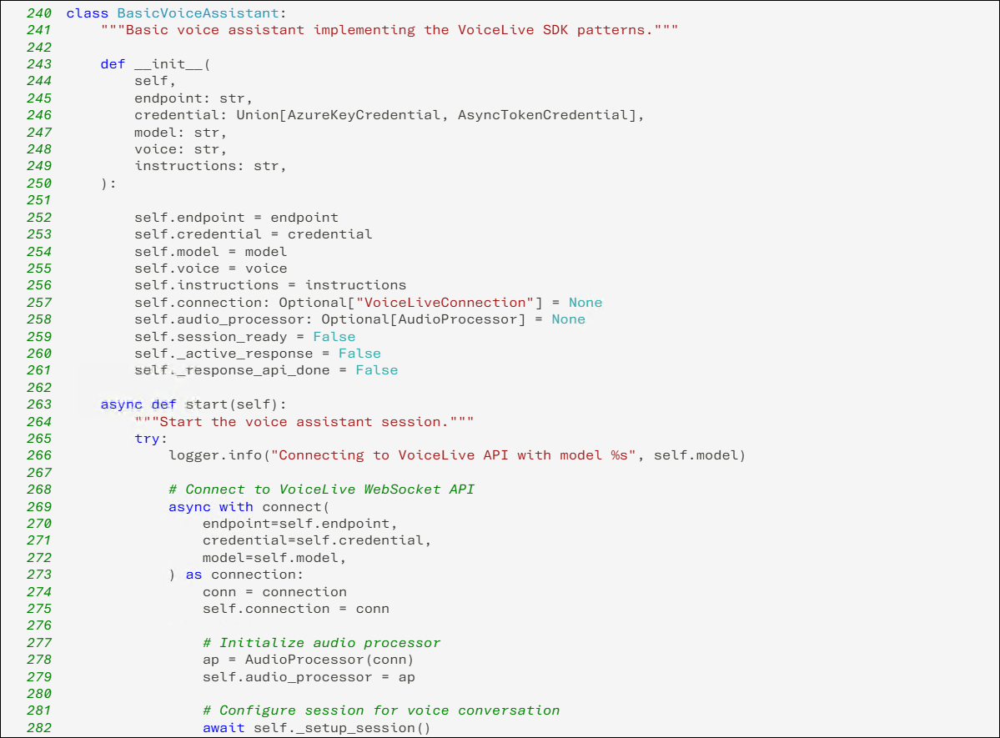

1. The configurations from the playground settings and your credentials (such as AI voice, model, and instructions) are handled by the global `parse_arguments` function that starts on line `417`.

    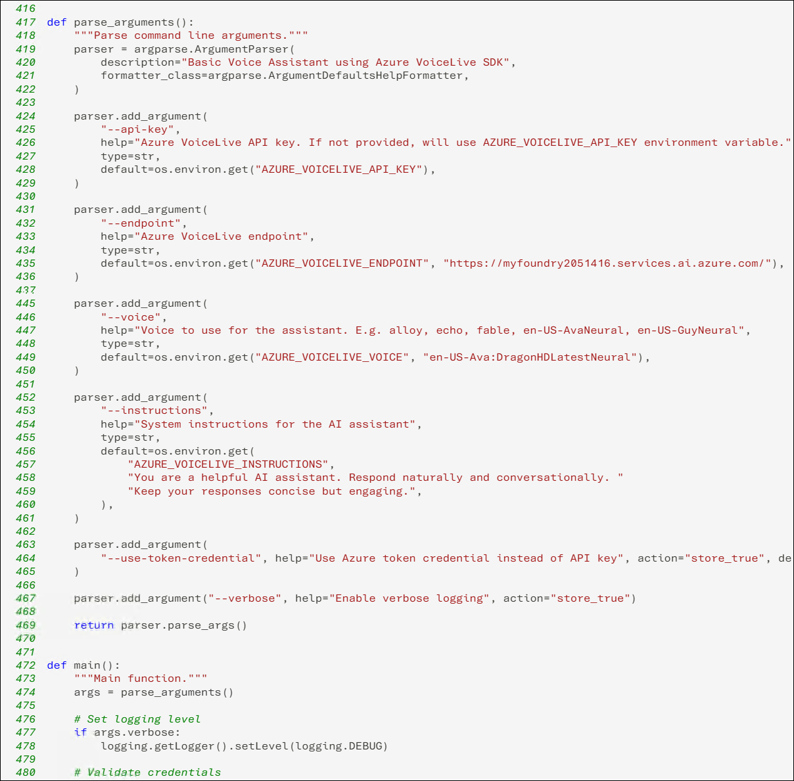

1. Click on **{X} .env variables** at the top of the code screen to your VoiceLive credentials.

    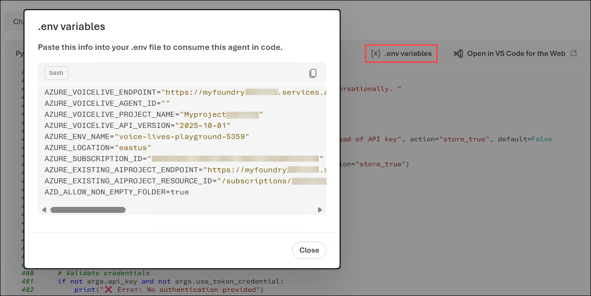

1. Stitched all together, we can understand what is executed with the `main` function that starts on line `472`: 
    - Your Azure credentials are validated (*notice how parse_arguments() is saved to the variable `args`*)
    - Your client is created
    - The voice assistant is created (*notice how the assistant is created on line `497` by calling the `BasicVoiceAssistant`*)
    - The voice assistant is given code for proper shutdown
    - The voice assistant has started 

        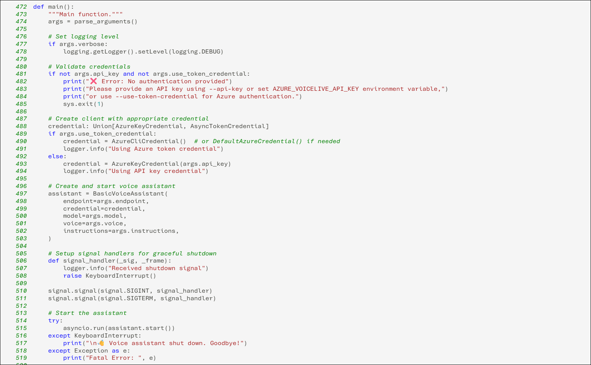

## Summary

In this exercise, you explored how to use Microsoft Foundry and Azure Speech - Voice Live to build and test a speech-enabled generative AI assistant. You configured a generative AI model, selected a voice, interacted with the model using speech, adjusted system prompts and parameters, and reviewed the client code that enables real-time voice interactions.

This lab demonstrates how quickly you can get started with building voice-based AI experiences. From this foundation, you can extend your solution to create more advanced conversational agents that support natural, real-time interactions.

### Congratulations, you’ve successfully completed the hands-on lab!
