# Get started with computer vision in Microsoft Foundry

## Lab overview

In this exercise, you'll use Microsoft Foundry to deploy and explore generative AI models that work with visual data. You will analyze images, generate new images from text prompts, and create videos using vision-enabled models.

## Lab objectives

In this exercise, you will perform:

- Task 1: Create a Microsoft Foundry project
- Task 2: Use a generative AI model to analyze images
- Task 3: Use a generative AI model to create new images
- Task 4: Use a generative AI model to create video

## Task 1: Create a Microsoft Foundry project

In this task, you'll create a Microsoft Foundry project and configure the basic settings required to organize models, resources, and services used throughout the lab.

1. Copy the **Microsoft Foundry** link and paste it into a new browser tab to access the portal: `https://ai.azure.com?azure-portal=true`


1. On the **Microsoft Foundry** home page, click on **Sign in** in the top right corner.

   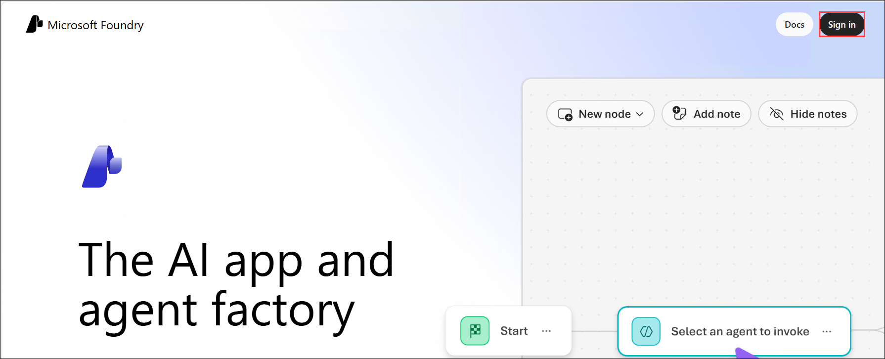

1. If prompted to sign in, enter your credentials:
 
   - **Email/Username:** <inject key="AzureAdUserEmail"></inject> **(1)** and click on **Next (2)**.
 
      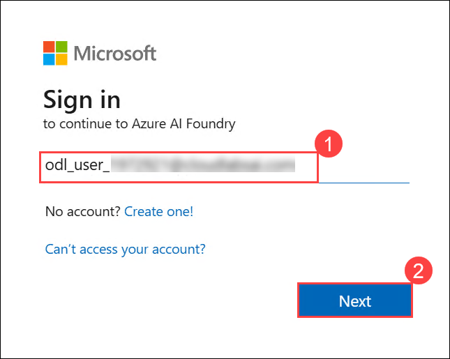
 
   - **Password:** <inject key="AzureAdUserPassword"></inject> **(1)** and click on **Sign in (2)**.
 
     .png)

1. If prompted to **Stay signed in?**, you can click **No**.

   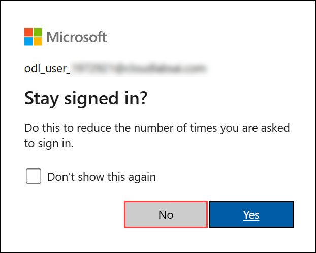

   > **Note:** Close any tips or quick start panes that are opened the first time you sign in, and if necessary, use the **Foundry** logo at the top left to navigate to the home page.

1. At the top of the **Microsoft Foundry** portal, enable the **New Foundry toggle (1)** to switch to the latest Foundry user interface.

1. From the **Select a project to continue** dialog, click the drop-down under **Select or search for a project**, and then select **Create a new project (2)**.

    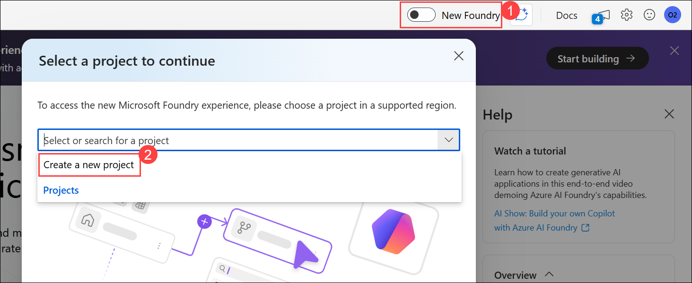

1. In the **Create a project** wizard, enter project name **Myproject<inject key="DeploymentID" enableCopy="false" /> (1)**, and expand **Advanced options (2)** to specify the following settings for your project: 

    - Subscription : **Leave default subscription (3)** 
    - Resource Group : Select **AI-900-Module-05a (4)** 
    - Microsoft Foundry resource: **MyFoundry<inject key="DeploymentID" enableCopy="false" /> (5)**
    - Region : Select **<inject key="location" enableCopy="false"/> (6)**
    - Click on **Create** **(7)**

      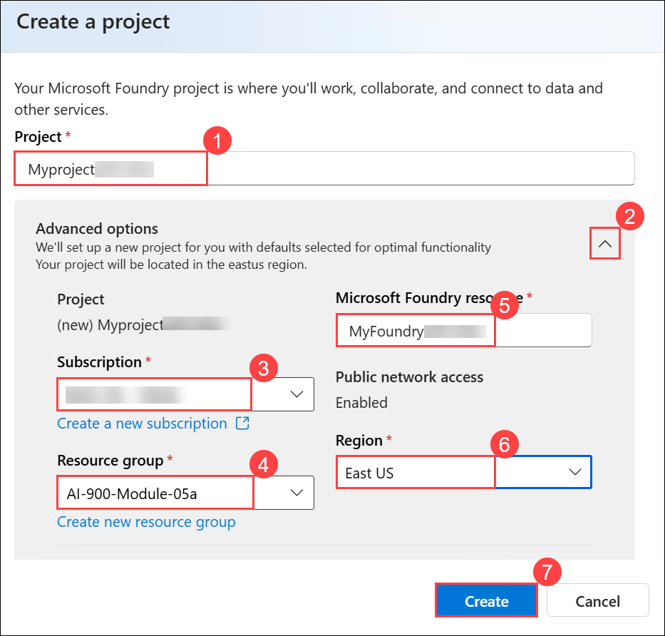
      
      >**Note:** Model deployments are restricted by regional quotas. If you select a region in which you have insufficient available quota, you may need to select an alternative region for a new resource later.

1. Wait for your project created. It may take a few minutes, once the setup is complete, you are automatically redirected to the **Microsoft Foundry home page** for the newly created project.

    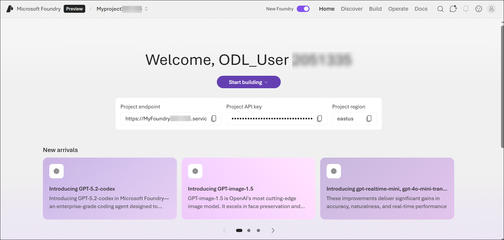

## Task 2: Use a generative AI model to analyze images

In this task, you'll deploy a vision-enabled generative AI model and use it to analyze images, allowing you to understand visual content and generate meaningful text-based responses.

1. Open a new browser tab and download the file from the following link to your local computer:

    ```
    https://microsoftlearning.github.io/mslearn-ai-fundamentals/data/images.zip
    ```
1. From the download prompt, click the **Show in folder** icon to open the file location.

    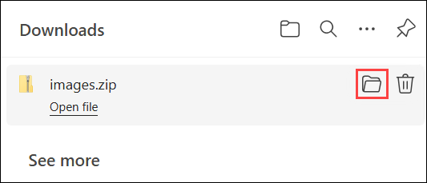

1. Select the **images.zip (1)** file, right-click it, and choose **Extract All (2)**.

    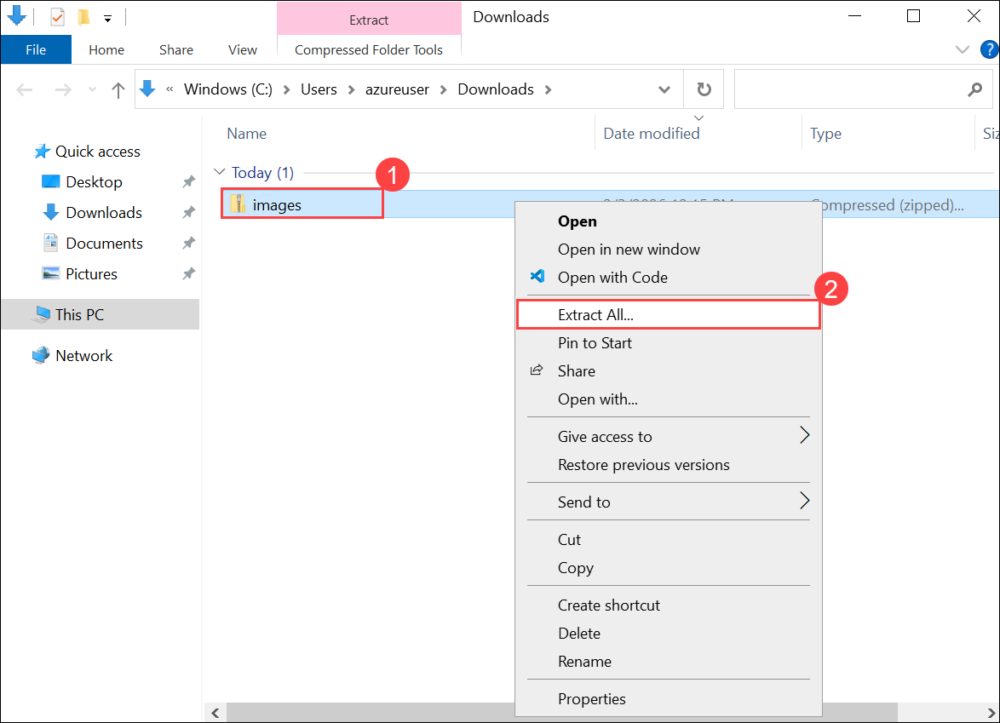

1. In the **Extract Compressed (Zipped) Folders** window, keep the default settings and click **Extract**.

    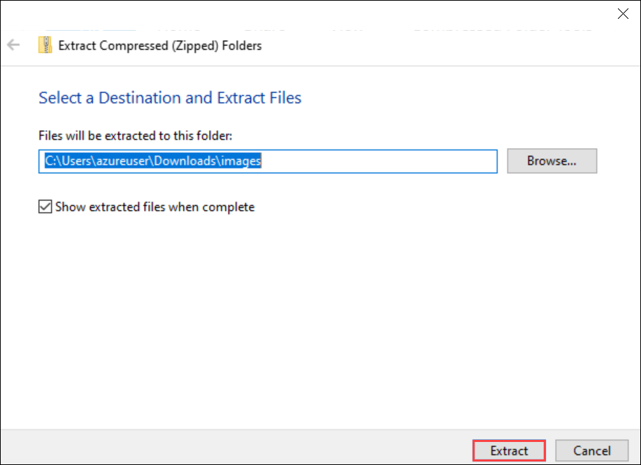

1. The folder contains three image files, and these images will be used for AI analysis.

    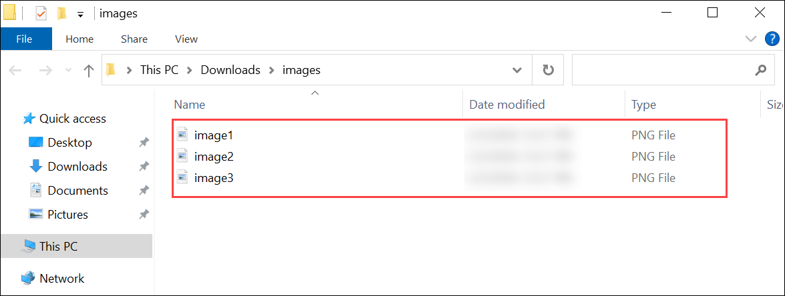

1. Return to the browser tab containing your Microsoft Foundry project. Then, click on the **Start building (1)** menu and select **Browse models (2)** to view the Microsoft Foundry model catalog.

    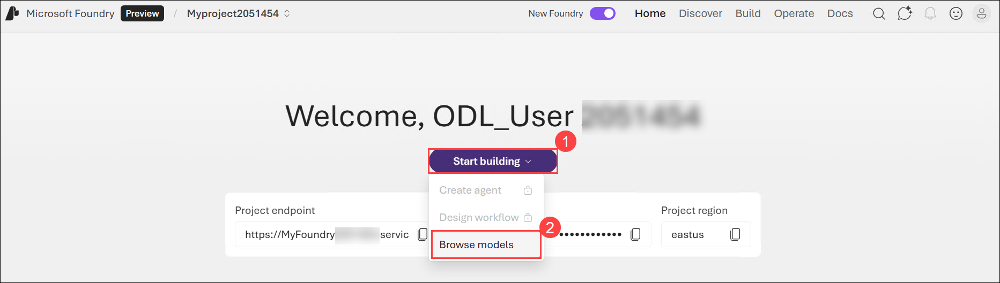

1. Search for the `gpt-4.1-mini` **(1)** model and select the same **(2)** from the result section. 

    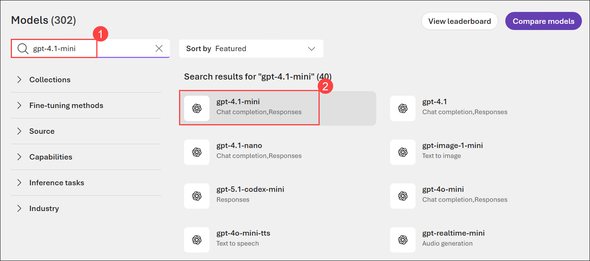

1. On the **gpt-4.1-mini** page, click on **Deploy (1)** and select **Default settings (2)**.

    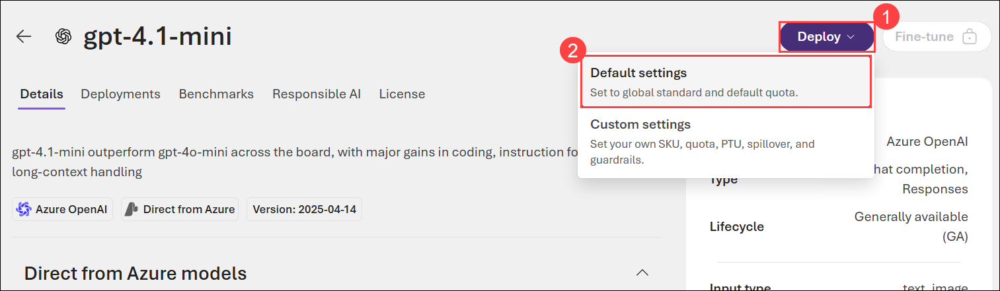

1. When the model has been deployed, view the model playground page that is opened, in which you can chat with the model.

    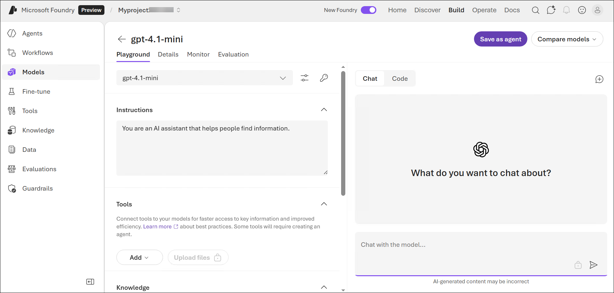

1. Use the button at the bottom of the left navigation pane to hide it and give yourself more room to work with.

    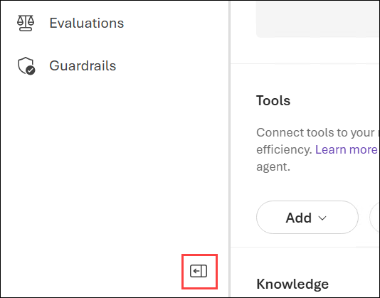

1. In the left pane, update the **Instructions** field to: `You are an AI cooking assistant who helps chefs with recipes.`

    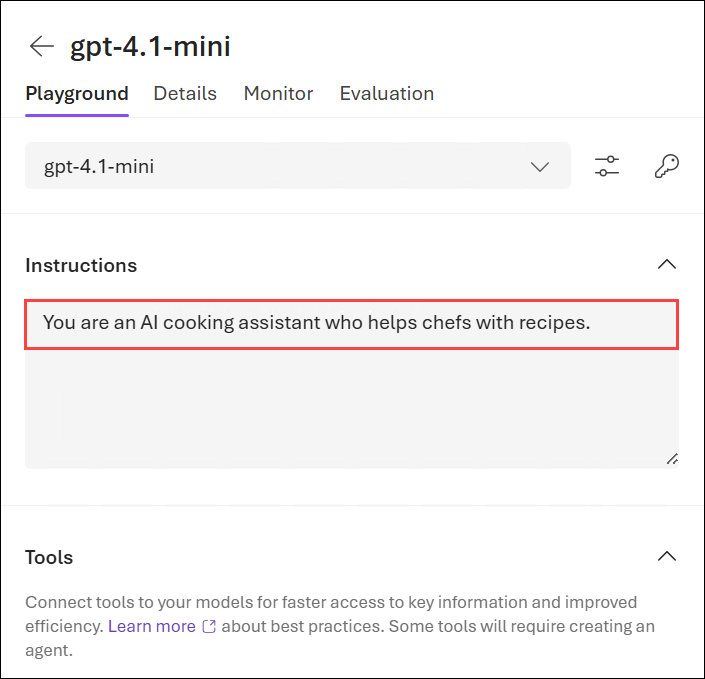

1. In the chat pane, click on the **Attach files (1)** icon and then in the Open window, select **image1 (2)** and then click on **Open (3)**. The image will be added to the prompt area.

    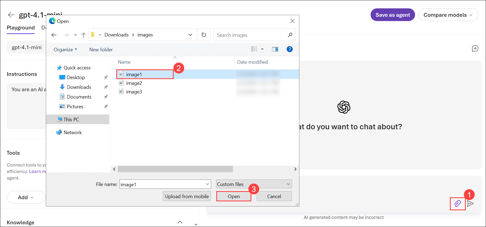

1. Enter a prompt such as `What recipes can I use this in?`, then press **Enter** to submit it.

    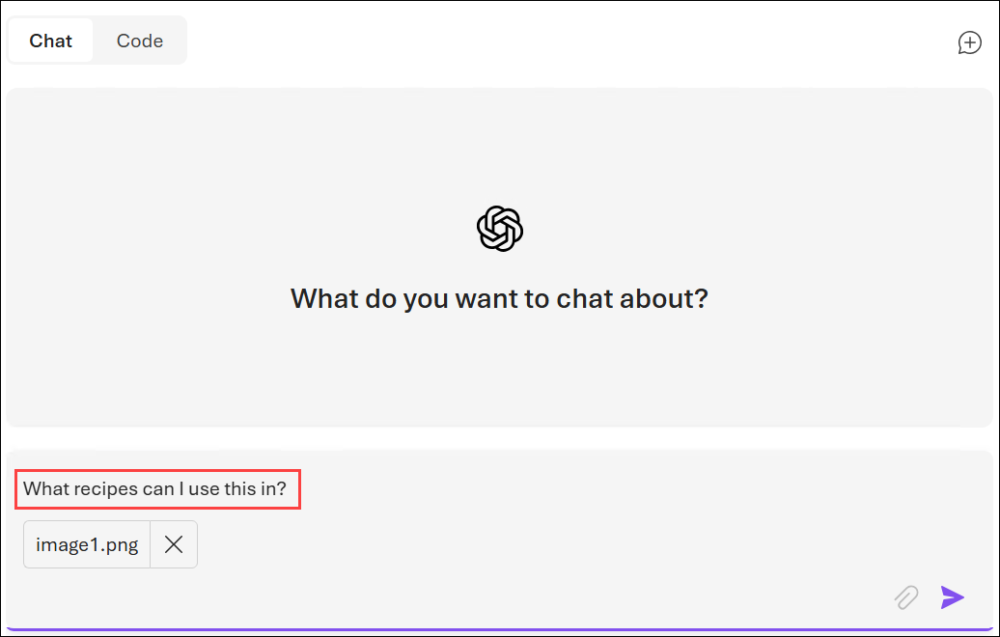

1. Review the response, which should include relevant recipe suggestions for the image you uploaded.

   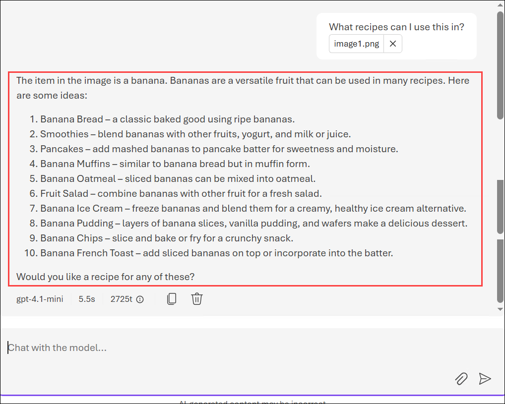

1. Submit prompts that include the other images, such as `How should I cook this?` or `What desserts could I make with this?`

### View code

To develop a client app or agent that can use the model to interpret images, you can use the OpenAI **Responses** API.

1. In the **Chat** pane, select the **Code** tab to view sample code.

    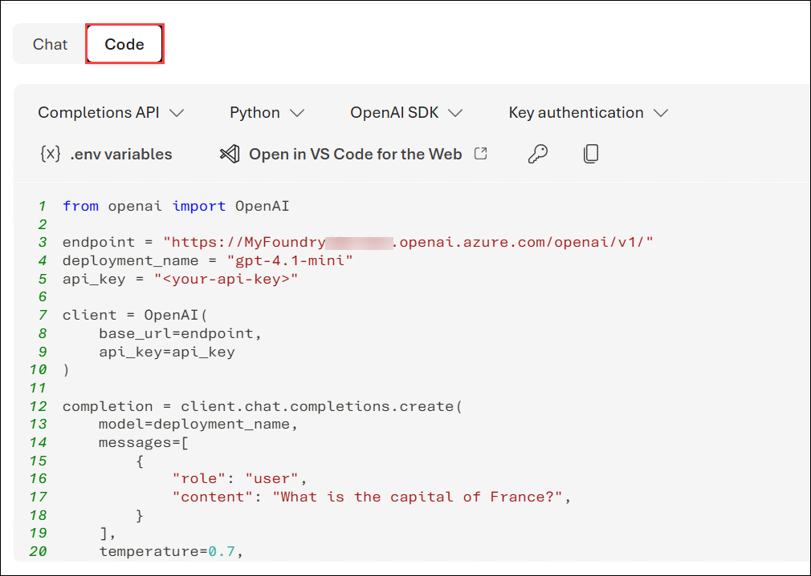

1. Select the following code options:
    - **API**: Responses API
    - **Language**: Python
    - **SDK**: OpenAI SDK
    - **Authentication**: Key authentication

    The default sample code includes only a text-based prompt. To submit a prompt that analyzes an image, you can modify the **input** parameter to include both text and image content, as shown here:

    ```python
    from openai import OpenAI
    
    endpoint = "https://your-project-resource.openai.azure.com/openai/v1/"
    deployment_name = "gpt-4.1-mini"
    api_key = "<your-api-key>"
    
    client = OpenAI(
        base_url=endpoint,
        api_key=api_key
    )
    
    response = client.responses.create(
        model=deployment_name,
        input=[{
            "role": "user",
            "content": [
                {"type": "input_text", "text": "what's in this image?"},
                {"type": "input_image", "image_url": "https://an-online-image.jpg"},
            ],
        }],
    )
    
    print(f"answer: {response.output[0]}")
    ```

    > **Tip**: If you are using a work or school account to sign into Azure, and you have sufficient permissions in the Azure subscription, you can open the sample code in VS Code for Web to experiment with image-based input content. You can obtain the **key** for your service in the **Code** tab of the model playground (above the sample code) and you can use the image **[orange.jpg](https://microsoftlearning.github.io/mslearn-ai-fundamentals/data/orange.jpg){:target="_blank"}** at `https://microsoftlearning.github.io/mslearn-ai-fundamentals/data/orange.jpg`. To learn more about using rhe OpenAI API to analyze images, see the [OpenAI documentation](https://platform.openai.com/docs/guides/images-vision#analyze-images).

## Task 3: Use a generative AI model to create new images

In this task, you'll deploy an image-generation model and use text prompts to create new images that match your described scenarios.

1. Use the **back** arrow next to the **gpt-4.1-mini** header to view the model deployments in your project.

    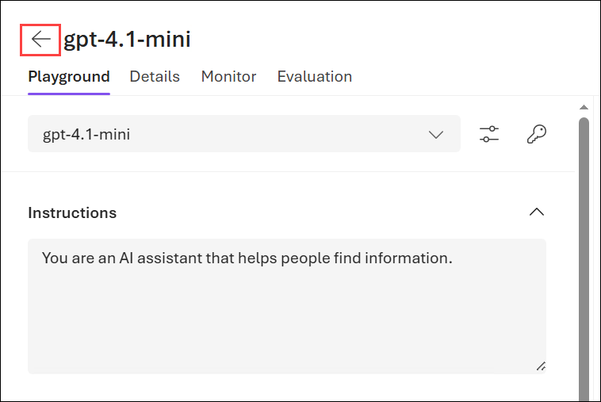

1. Select **Deploy a base model** to open the model catalog.

    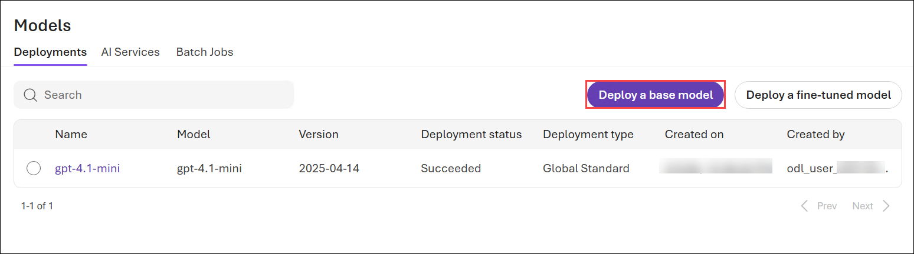

1. In the **Collections** drop-down list, select **Direct from Azure (1)**, and in the **Inference tasks** drop-down list, select **Text to image (2)**. Then view the available models for image generation.

   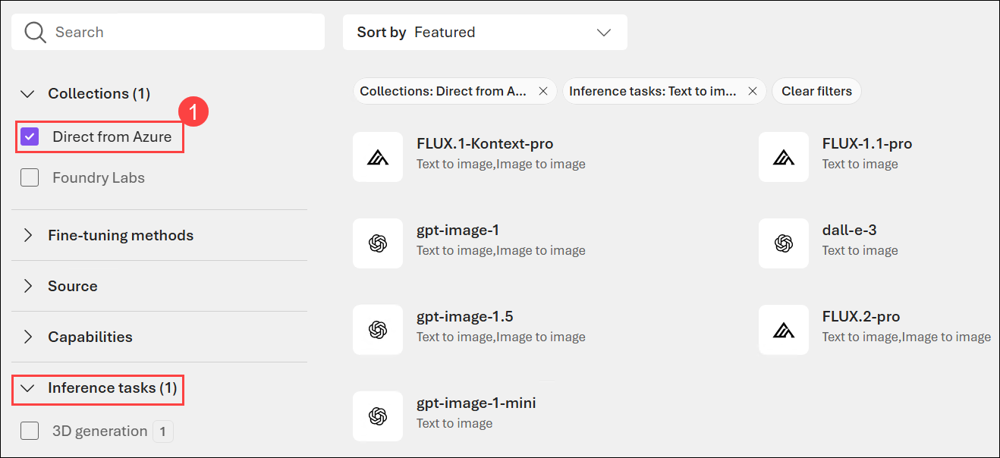

    .png)

    > **Note**: The available models in your subscription may vary. Additionally, the ability to deploy models depends on regional availabilty and quota.

1. Select the **FLUX.1-Kontext-pro** model.

    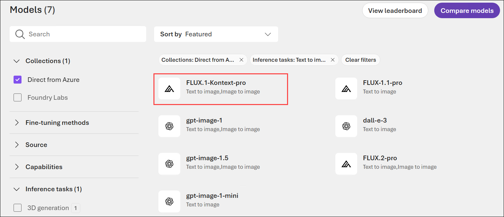

    >**Note:** If you are unable to deploy the model in your subscription, try one of the other image-generation models.

1. On the **FLUX.1-Kontext-pro** page, click on **Deploy (1)** and then select **Default settings (2)**.

    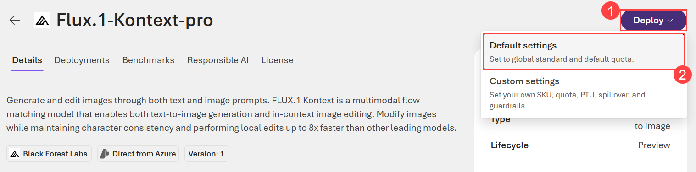

1. When the model has been deployed, it opens in the image playground.

    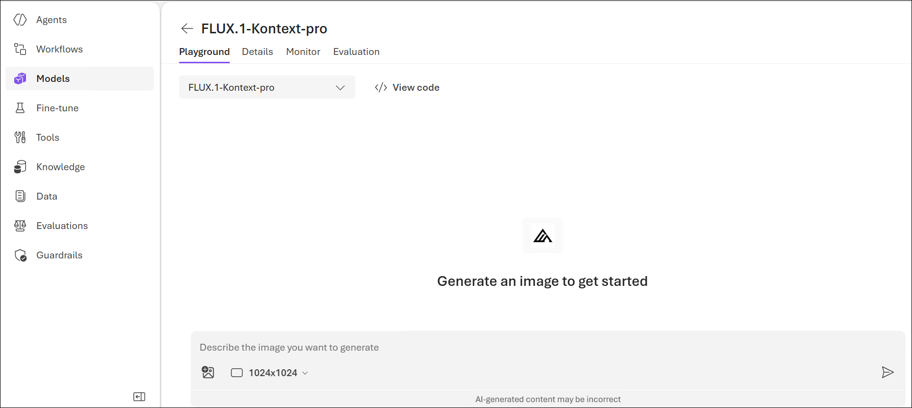

1. Enter a prompt that describes the image you want, such as `A chef preparing a meal.`, then press **Enter** and review the generated image.

   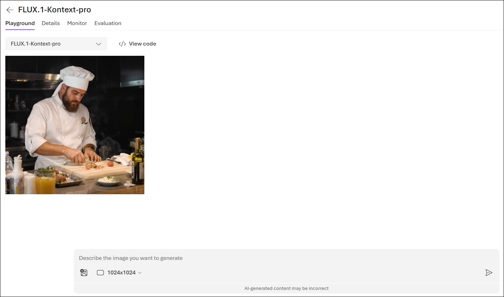

### View code

If you want to develop a client app or agent that generates images using your model, you can use the OpenAI API.

1. In the **Chat** pane, select the **View code** tab to view sample code.

    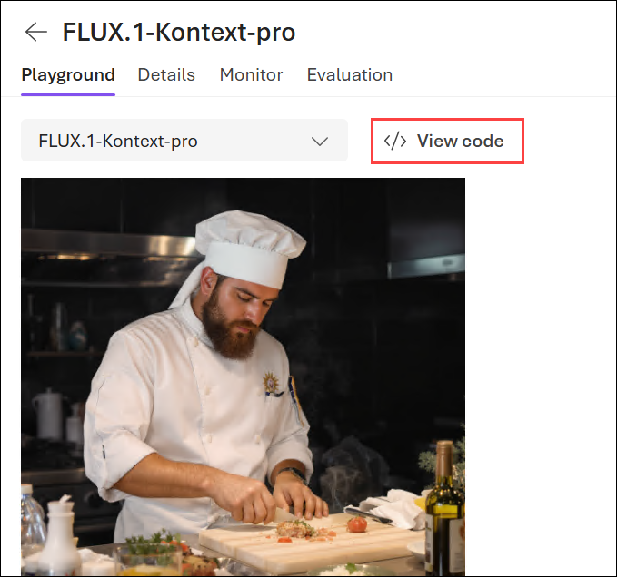

1. Select the following code options:
    - **Language**: Python
    - **SDK**: OpenAI SDK
    - **Authentication**: Key authentication

    The default sample code should look similar to this:

    ```python
    import base64
    from openai import OpenAI
    
    endpoint = "https://your-project-resource.openai.azure.com/openai/v1/"
    deployment_name = "FLUX.1-Kontext-pro"
    api_key = "<your-api-key>"
    
    client = OpenAI(
        base_url=endpoint,
        api_key=api_key
    )
    
    img = client.images.generate(
        model=deployment_name,
        prompt="A cute baby polar bear",
        n=1,
        size="1024x1024",
    )
    
    image_bytes = base64.b64decode(img.data[0].b64_json)
    with open("output.png", "wb") as f:
        f.write(image_bytes)
    ```

    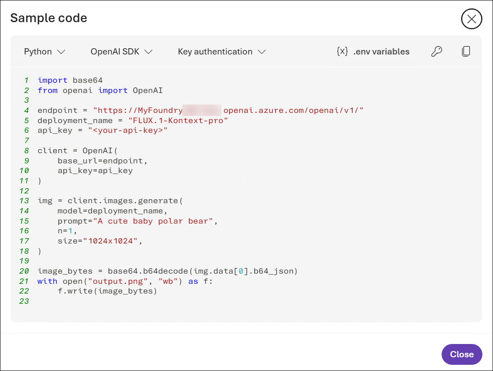

## Task 4: Use a generative AI model to create video

In this task, you'll deploy a video-generation model and use text prompts to generate short videos based on your descriptions.

1. Use the **back** arrow next to the image-generation model header to view the model deployments in your project.

    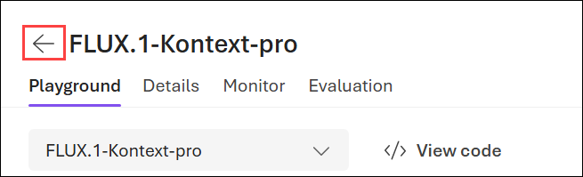

1. From the Models page, select **Deploy a base model** to open the model catalog.

    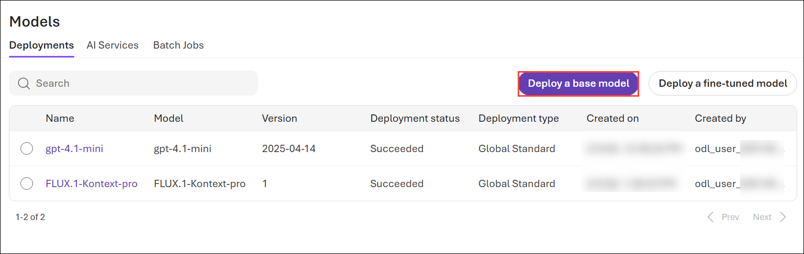

1. From the **Collections** drop-down, choose **Direct from Azure (1)**, and from the **Inference tasks** drop-down, select **Video generation (2)**. Then review the list of available video generation models.

    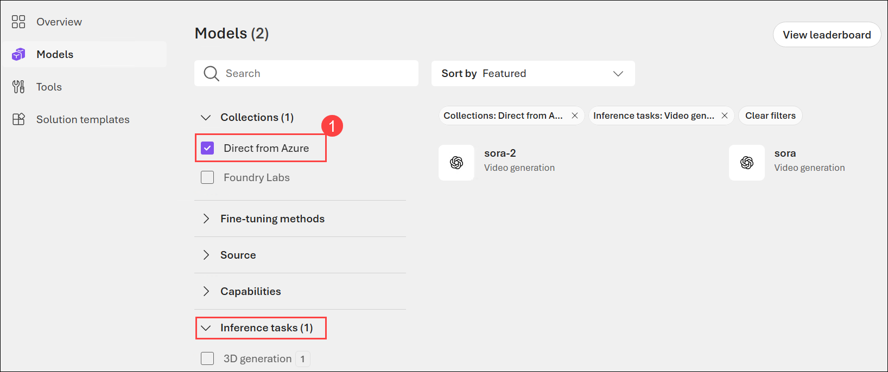

    .png)

    > **Note**: The available models in your subscription may vary. Additionally, the ability to deploy models depends on regional availabilty and quota.

1. Select the **sora** model from the list.

    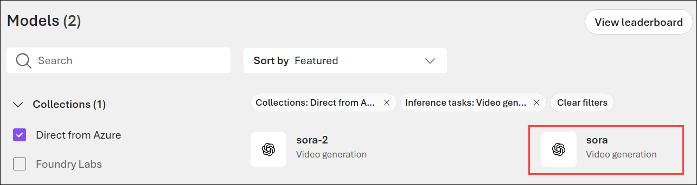

    >**Note:**If you are unable to deploy the model in your subscription, try one of the other video-generation models.

1. On the **sora** page, click on **Deploy (1)** and then select **Default settings (2)**.

    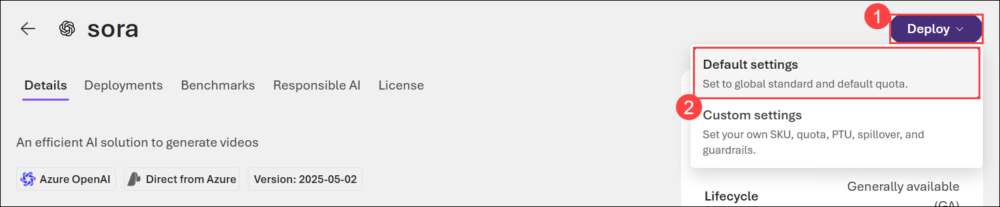

1. When the model has been deployed, it opens in the video playground.

    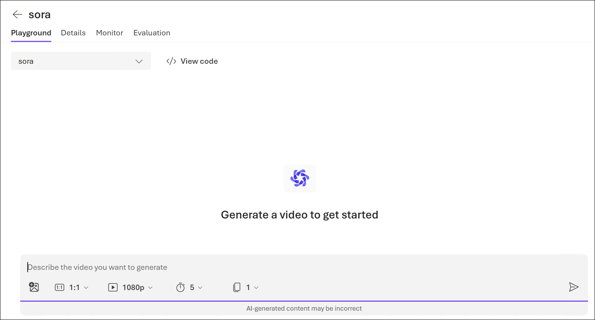

1. Enter a prompt that describes the video you want, such as `A chef in a busy kitchen.`, then press **Enter** and review the generated result.

   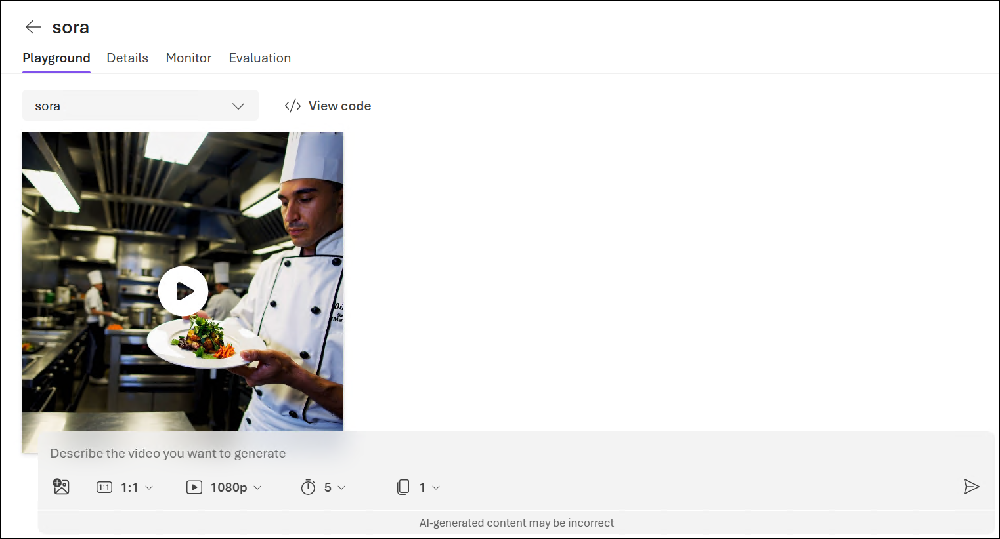

### View code

If you want to develop a client app or agent that generates videos using your model, you can use the REST API.

1. In the **Chat** pane, select the **Code** tab to view sample code.

    The default sample code uses the *curl* command to call the REST endpoint, and should look similar to this:

    ```bash
    curl -X POST "https://your-project-resource.openai.azure.com/openai/v1/video/generations/jobs" \
    -H "Content-Type: application/json" \
    -H "Authorization: Bearer $AZURE_API_KEY" \
    -d '{
        "prompt" : "A video of a cat",
         "height" : "1080",
         "width" : "1080",
         "n_seconds" : "5",
         "n_variants" : "1",
        "model": "sora"
        }'
    ```

    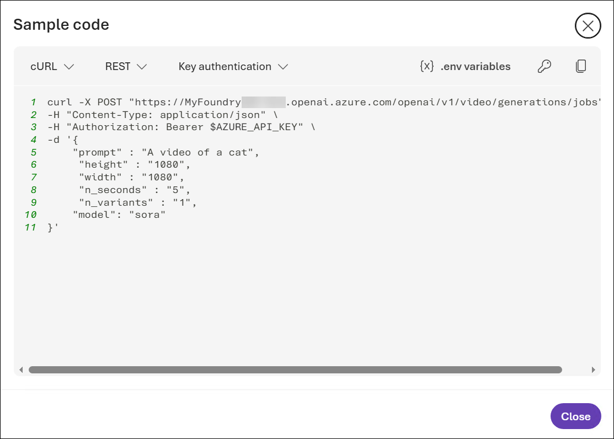

## Summary

In this exercise, you explored how to deploy and use vision-enabled generative AI models in Microsoft Foundry. You analyzed images, generated new images from text prompts, and created videos using generative AI models.

The scenarios in this exercise demonstrate how easily you can get started building applications that understand and generate visual content. From this foundation, you could build richer AI solutions that combine image analysis, image generation, and video generation to support advanced real-world use cases.

### Congratulations, you’ve successfully completed the hands-on lab!