# Analyze text in the Microsoft Foundry portal

## Lab overview

Natural Language Processing (NLP) is a branch of AI that focuses on understanding and processing written and spoken language. NLP enables solutions that can extract meaning from text, identify important information, analyze sentiment, detect languages, and generate meaningful responses in natural language.

Azure AI Language service includes capabilities such as entity recognition, key phrase extraction, text summarization, sentiment analysis, and language detection. Additionally, Azure AI Translator enables seamless translation of text between multiple languages. For example, suppose the fictitious travel agent Margie's Travel encourages customers to submit reviews for hotel stays. Using these AI services, you can extract key insights from reviews, analyze customer sentiment, detect the language used, and translate feedback to better understand customer experiences.

In this exercise, you will use Azure AI Language and Azure AI Translator in the Microsoft Foundry portal, Microsoft's platform for building intelligent applications, to analyze and interpret hotel reviews using various natural language processing capabilities.

## Lab objectives

In this lab, you will perform:

- Task 1: Create a project in the Microsoft Foundry portal
- Task 2: Extract named entities with Azure AI Language in the Microsoft Foundry portal
- Task 3: Extract key phrases with Azure AI Language in the Microsoft Foundry portal
- Task 4: Summarize text with Azure AI Language in the Microsoft Foundry portal

- Task 5: Analyze sentiment in text

- Task 6: Detect language and translate text

## Task 1: Create a project in the Microsoft Foundry portal

In this task, we are creating an Microsoft Foundry project and configuring the necessary resources to explore AI language capabilities in the Language Playground.

1. Copy the **Microsoft Foundry** link and paste it into a new browser tab to access the portal: `https://ai.azure.com?azure-portal=true`

1. On the **Microsoft Foundry** home page, click on **Sign in** in the top right corner.

   

1. If prompted to sign in, enter your credentials:
 
   - **Email/Username:** <inject key="AzureAdUserEmail"></inject> **(1)** and click on **Next (2)**.
 
      
 
   - **Password:** <inject key="AzureAdUserPassword"></inject> **(1)** and click on **Sign in (2)**.
 
     .png)

1. If prompted to **Stay signed in?**, you can click **No**.

   

1. In the browser, navigate to `https://ai.azure.com/managementCenter/allResources` and click on **Create new**.

    

1. Choose the option to create a **Microsoft Foundry resource (1)** and then select **Next (2)**.

   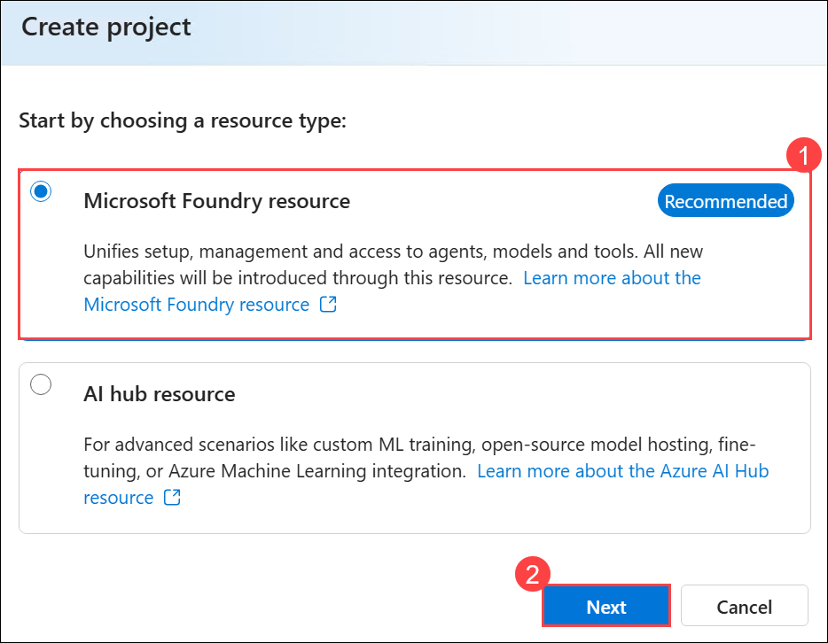

1. In the **Create a project** wizard, enter project name **Myproject<inject key="DeploymentID" enableCopy="false" /> (1)**, and **Expand Advanced options (2)** to specify the following settings for your project: 

    - Subscription : **Leave default subscription (3)** 
    - Resource Group : Select **AI-900-Module-06 (4)** 
    - Microsoft Foundry resource: **AI<inject key="DeploymentID" enableCopy="false" /> (5)**
    - Region : Select **<inject key="location" enableCopy="false"/> (6)**
    - Click on **Create** **(7)**

      .png)

1. Wait for your project created.

1. When the project is created, you will be taken to an **Overview** page of the project details.

   .png)

> **Congratulations** on completing the task! Now, it's time to validate it. Here are the steps:
> - Hit the Validate button for the corresponding task. If you receive a success message, you can proceed to the next task.
> - If not, carefully read the error message and retry the step, following the instructions in the lab guide. 
> - If you need any assistance, please contact us at cloudlabs-support@spektrasystems.com. We are available 24/7 to help you out.

   <validation step="07c3e734-e32f-44b6-b8e8-7b5b85f4a45b" />

## Task 2: Extract named entities with Azure AI Language in the Microsoft Foundry portal

This task demonstrates how to use Azure AI Language Playground for Named Entity Recognition (NER). By analyzing a hotel review, Azure AI extracts key entities like locations, dates, and organizations, along with confidence scores. 

*Named entities* are words that describe people, places, and objects with proper names. Let's use the named entity extraction capability of Azure AI Language to identify types of information in a review.

1. On the left-hand menu on the screen, select **Playgrounds**.

   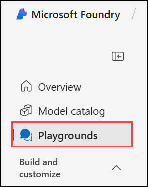

1. Scroll down to the **Language playground** tile and select **Try the Language playground**.

    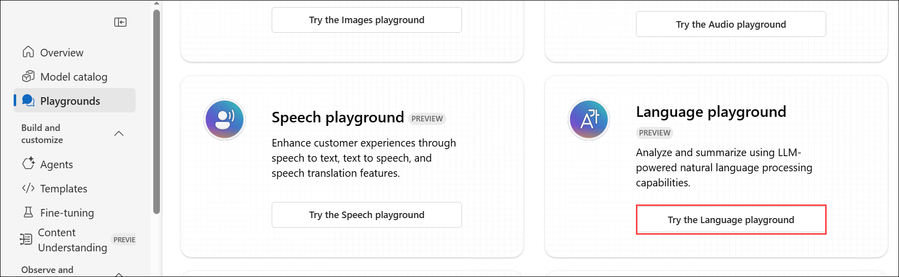

1. In the Language playground, select **Extract Information (1)**. Then select the **Extract named entities (2)** tile. 

   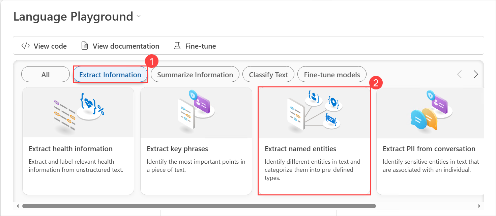

1. In the **Sample** box, copy and paste **(1)** the following review and then click **Run (2)** to process the text:

    ```
    Tired hotel with poor service
    The Royal Hotel, London, United Kingdom
    5/6/2018
    This is an old hotel (has been around since 1950's) and the room furnishings are average - becoming a bit old now and require changing. The internet didn't work and had to come to one of their office rooms to check in for my flight home. The website says it's close to the British Museum, but it's too far to walk.
    ```

   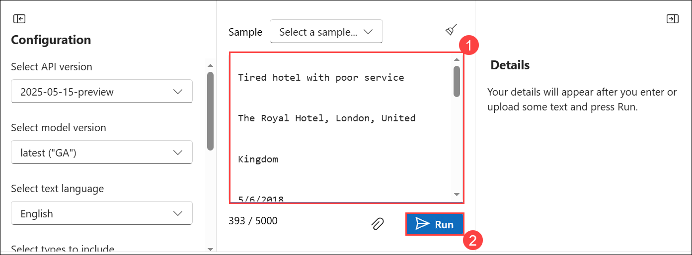

2. Review the output and observe the **Details** section, where the extracted entities are accompanied by additional information such as type and confidence scores. The confidence score indicates the probability that the identified type correctly belongs to the specified category.

   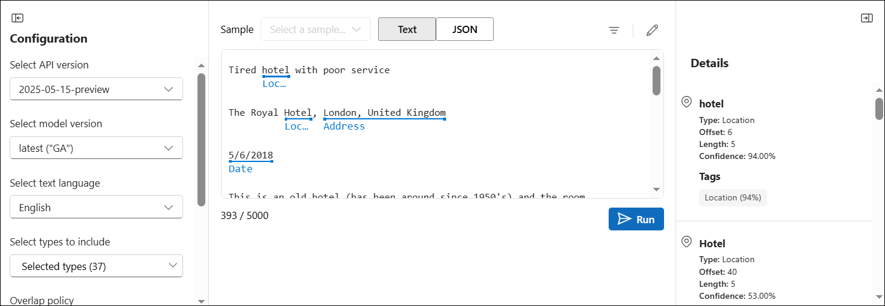

## Task 3: Extract key phrases with Azure AI Language in the Microsoft Foundry portal

This task demonstrates how to use Azure AI Language Playground for key phrase extraction. By analyzing a hotel review, Azure AI identifies important phrases that summarize the text's main points. 

**Key phrases** are the most important pieces of information in the text. Let's use the key phrase extraction capability of Azure AI Language to pull important information from a review.

1. In the Language playground, select **Extract Information (1)**. Then select the **Extract key phrases (2)** tile. 

   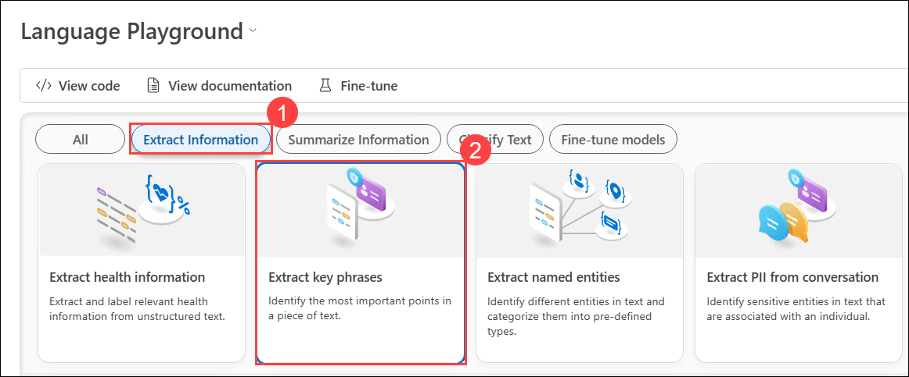

1. Under **Sample**, copy and paste **(1)** the following review and then click **Run (2)** to process the text:

    ```
    Good Hotel and staff
    The Royal Hotel, London, UK
    3/2/2018
    Clean rooms, good service, great location near Buckingham Palace and Westminster Abbey, and so on. We thoroughly enjoyed our stay. The courtyard is very peaceful and we went to a restaurant which is part of the same group and is Indian ( West coast so plenty of fish) with a Michelin Star. We had the taster menu which was fabulous. The rooms were very well appointed with a kitchen, lounge, bedroom and enormous bathroom. Thoroughly recommended.
    ```

   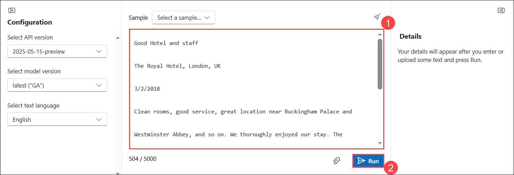

1. Review the output and observe the different phrases extracted in the **Details** section. These phrases should represent key elements that contribute the most to the overall meaning of the text.

   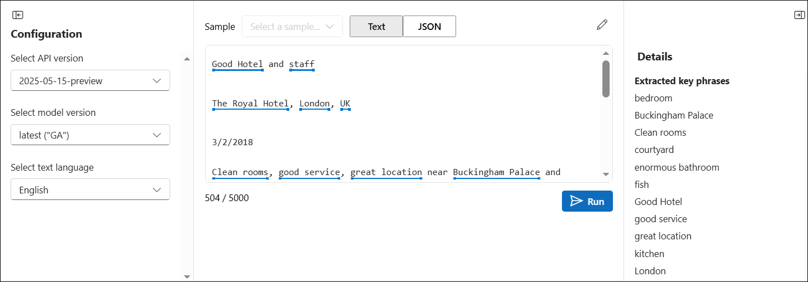

## Task 4: Summarize text with Azure AI Language in Microsoft Foundry portal

In this task, we are using Azure AI Language to generate an extractive summary by identifying key sentences from a hotel review.
 
1. In the Language playground, select **Summarize Information (1)**, and then click on the **Summarize text (2)** tile.

   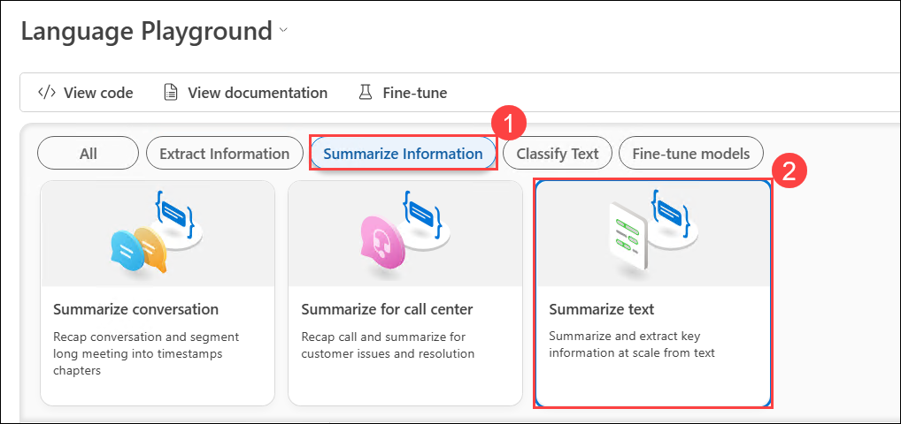

1. Under **Sample**, copy and paste **(1)** the following review and then click **Run (2)** to process the text.:
    
    ```
    Very noisy and rooms are tiny
    The Lombard Hotel, San Francisco, USA
    9/5/2018
    Hotel is located on Lombard street which is a very busy SIX lane street directly off the Golden Gate Bridge. Traffic from early morning until late at night especially on weekends. Noise would not be so bad if rooms were better insulated but they are not. Had to put cotton balls in my ears to be able to sleep--was too tired to enjoy the city the next day. Rooms are TINY. I picked the room because it had two queen size beds--but the room barely had space to fit them. With family of four in the room it was tight. With all that said, rooms are clean and they've made an effort to update them. The hotel is in Marina district with lots of good places to eat, within walking distance to Presidio. May be good hotel for young stay-up-late adults on a budget
    ```

   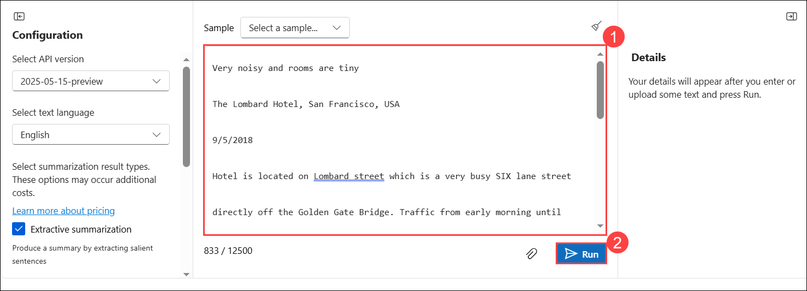

1. Review the output and observe that the **Extractive summary** in the **Details** section provides rank scores for the most significant sentences, highlighting their relevance to the overall text.  

   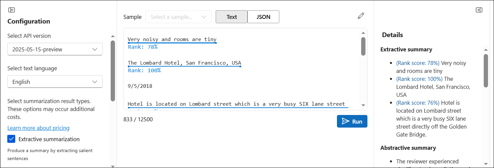

## Task 5: Analyze sentiment in text

In this task, we are using Azure AI Language to generate an extractive summary by identifying key sentences from a hotel review.

1. In the Language playground, select **Classify text (1)** and then select the **Analyze sentiment (2)** tile.

   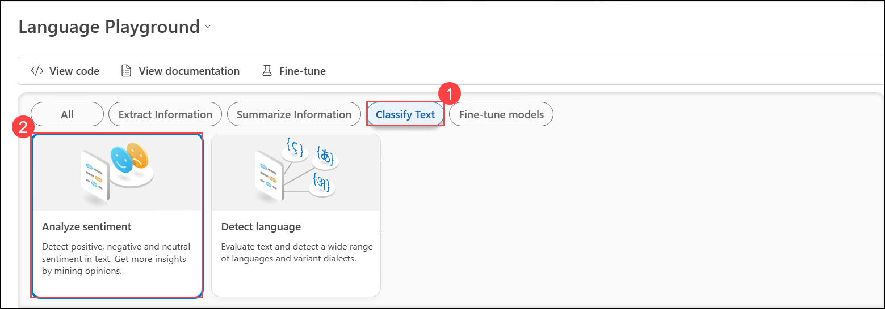

1. Under *Sample*, enter the following review **(1)**:
    
    ```
    Disappointing Stay at The City Hotel
    The City Hotel, London
    9/5/2018
    My experience at The City Hotel in London was far from pleasant. The constant noise from nearby train tracks made it nearly impossible to sleep, with vibrations felt throughout the building. The rooms were outdated, dusty, and poorly maintained—dripping faucets, squeaky beds, and broken fixtures were just the beginning. Sound insulation was nonexistent, so every conversation from neighboring rooms was clearly audible. While the location near public transport was convenient and the staff were friendly, these positives couldn't make up for the overall discomfort and lack of value. I wouldn’t recommend this hotel to anyone seeking a restful or enjoyable stay.
    ```

1. Then click on **Run (2)**. 

   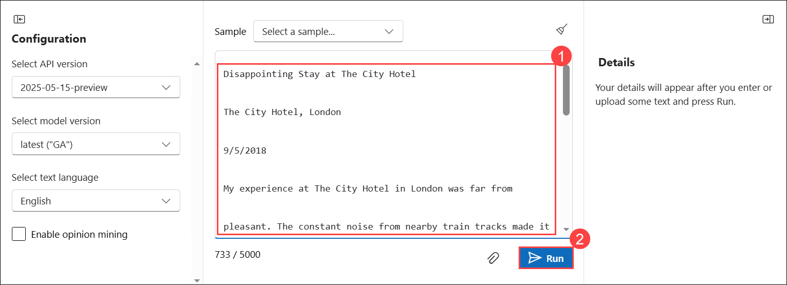

1. Review the results displayed in the **Details** pane. Notice that the analysis provides an **overall sentiment classification** for the entire text, along with **individual sentiment scores (positive, neutral, and negative)**. You can also see the **sentence-level analysis**, where each sentence is evaluated separately to determine its sentiment.

    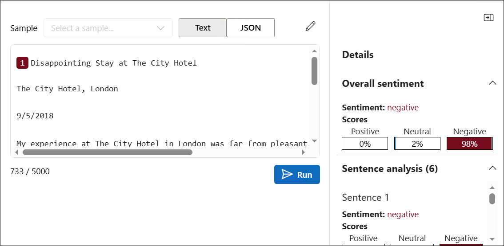

## Task 6: Detect language and translate text

In this task, you will use Azure AI Language to detect the language of a hotel review and then use Azure AI Translator to translate the detected text from French to English, demonstrating how AI services can identify and convert text across languages while preserving its meaning and context.

### Detect language

Let's start by detecting the language a review is written in.

1. Select the **Classify Text (1)** tab from the options at the top of the **Language Playground**. Then choose the **Detect language (2)** tile to analyze text and identify the language used in the provided content.

   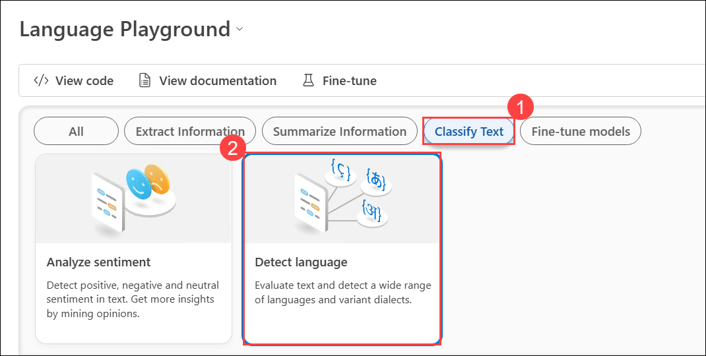

1. Under *Sample*, enter the following review **(1)**:
    
    ```
    Un séjour mémorable à l’Hôtel d’Ville
    l’Hôtel d’Ville, Paris
    9/5/2018
    J’ai passé un excellent séjour à l’Hôtel d’Ville à Paris. L’emplacement est idéal, en plein cœur de la ville, ce qui permet de découvrir facilement les principaux sites touristiques. Le personnel était chaleureux, professionnel et toujours prêt à aider. La chambre était propre, confortable et bien équipée, avec une vue charmante sur les rues parisiennes. Le petit-déjeuner était varié et délicieux, parfait pour commencer la journée. Je recommande vivement cet hôtel à tous ceux qui recherchent une expérience parisienne authentique et agréable.
    ```

1. Then select **Run (2)**.

   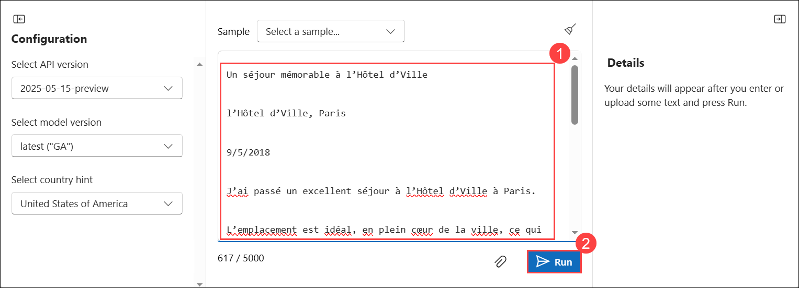

1. Review the results in the **Details** pane. Notice that the service identifies the **language of the text**, displays the **ISO language code**, and provides a **confidence score** indicating how accurately the language was detected.

   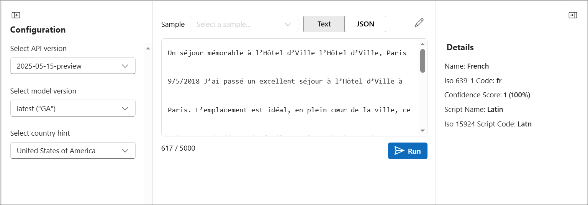 

### Translate text

Now let's translate the French review to English.

1. From the left navigation pane, click on **Playgrounds** twice. 

   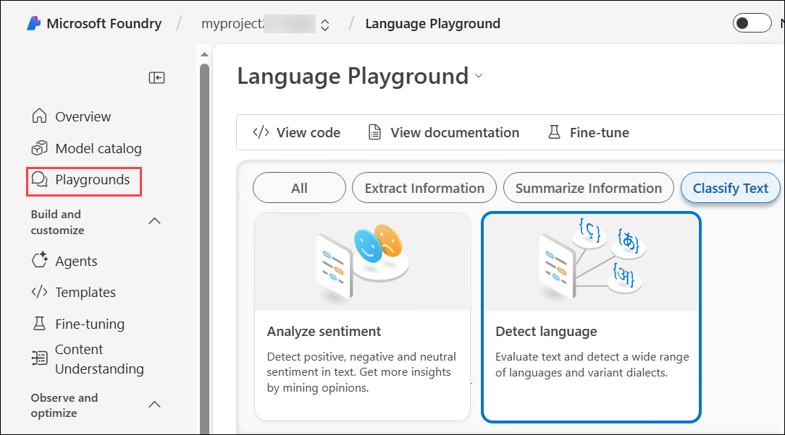

1. From the list of playgrounds, locate the **Translator playground** tile and select **Try the Translator playground**.

   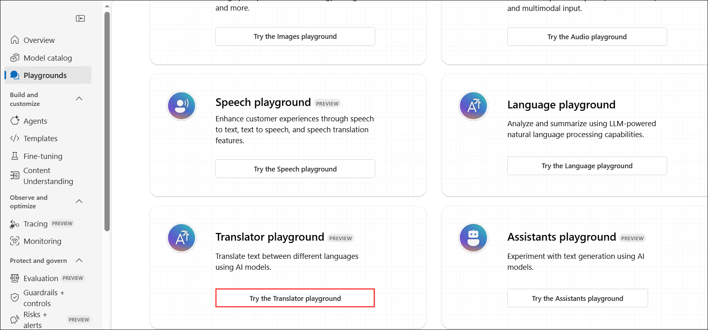

1. In the Translator playground, select **Text translation (1)**.

1. In the **Configure** pane, select the following language options:

    - **Translate from**: French **(2)**
    - **Translate to**: English **(3)**

      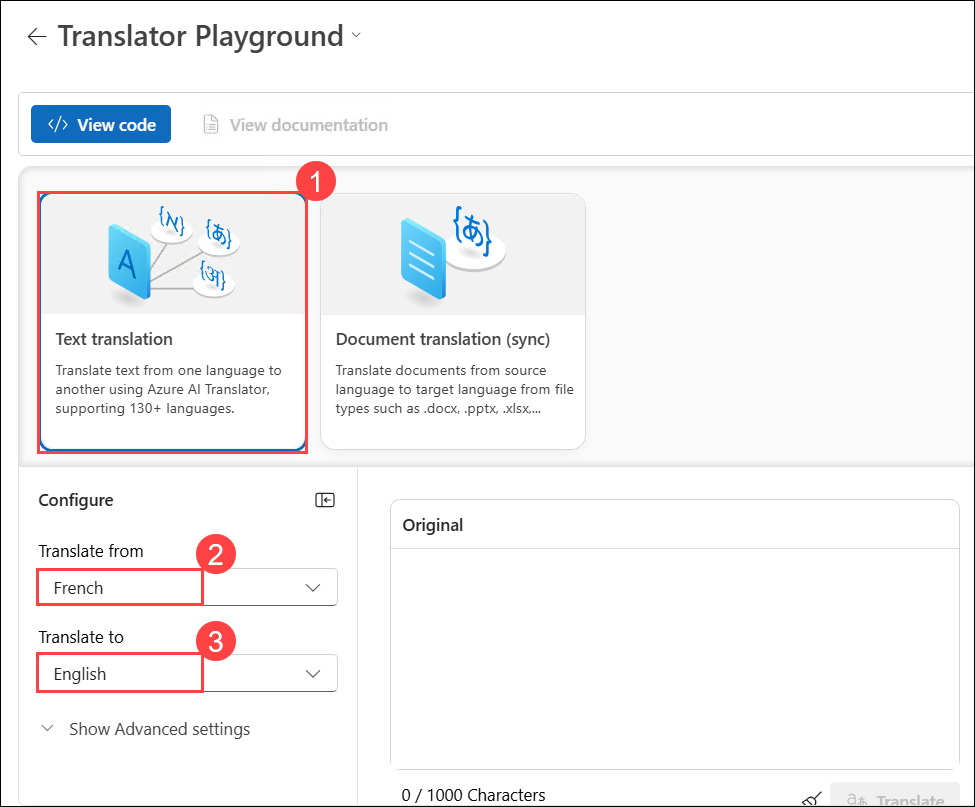

1. Under *Sample*, enter the French-language review **(1)**:
    
    ```
    Un séjour mémorable à l’Hôtel d’Ville
    l’Hôtel d’Ville, Paris
    9/5/2018
    J’ai passé un excellent séjour à l’Hôtel d’Ville à Paris. L’emplacement est idéal, en plein cœur de la ville, ce qui permet de découvrir facilement les principaux sites touristiques. Le personnel était chaleureux, professionnel et toujours prêt à aider. La chambre était propre, confortable et bien équipée, avec une vue charmante sur les rues parisiennes. Le petit-déjeuner était varié et délicieux, parfait pour commencer la journée. Je recommande vivement cet hôtel à tous ceux qui recherchent une expérience parisienne authentique et agréable.
    ```

1. Select **Translate (2)**. 

   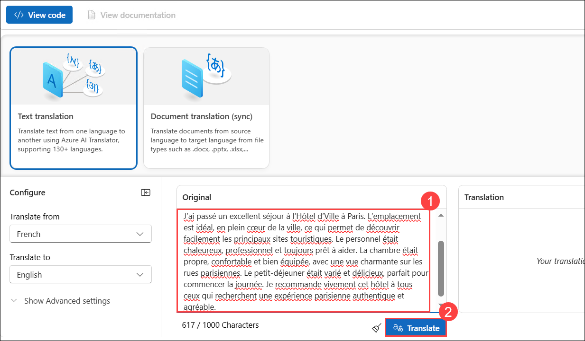

1. Review the translated output in the **Translation** pane. Notice that the service automatically converts the original **French text** into **English**, preserving the meaning and context of the content.

    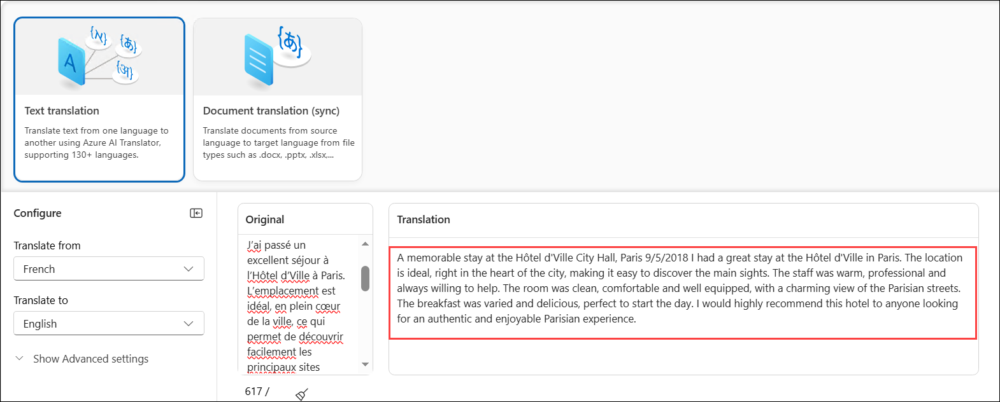

### Review

In this exercise, you have completed the following tasks:

- Created a project in the **Microsoft Foundry portal**
- Extracted **named entities** with **Azure AI Language** in the Microsoft Foundry portal
- Extracted **key phrases** with **Azure AI Language** in the Microsoft Foundry portal
- Summarized text with **Azure AI Language** in the Microsoft Foundry portal
- Analyzed **sentiment in text** using Azure AI Language
- Detected the **language of text and translated it** using Azure AI Language and Azure AI Translator in the Microsoft Foundry portal

## Learn more

To learn more about what you can do with this service, see the [Language service page](https://learn.microsoft.com/azure/ai-services/language-service/overview).

## You have successfully completed this lab.
