# Get started with information extraction in Microsoft Foundry

## Lab overview

In this exercise, you'll use Microsoft Foundry and Azure Content Understanding to analyze documents and extract structured information. You will explore invoice data extraction in the Foundry portal and perform the same analysis programmatically using REST APIs.

## Lab objectives

In this exercise, you will perform:

- Task 1: Create a Microsoft Foundry project
- Task 2: Extract information from an invoice in Foundry portal (classic)
- Task 3: Extract information with the REST API

## Task 1: Create a Microsoft Foundry project

In this task, you'll create and configure a Microsoft Foundry project to organize the resources, models, and settings required for using Azure Content Understanding.

1. Copy the **Microsoft Foundry** link and paste it into a new browser tab to access the portal: `https://ai.azure.com/`

1. On the **Microsoft Foundry** home page, click on **Sign in** in the top right corner.

   

1. If prompted to sign in, enter your credentials:
 
   - **Email/Username:** <inject key="AzureAdUserEmail"></inject> **(1)** and click on **Next (2)**.
 
      
 
   - **Password:** <inject key="AzureAdUserPassword"></inject> **(1)** and click on **Sign in (2)**.
 
     .png)

1. If prompted to **Stay signed in?**, you can click **No**.

   

   > **Note:** Close any tips or quick start panes that are opened the first time you sign in, and if necessary, use the **Foundry** logo at the top left to navigate to the home page.

1. Scroll to the bottom of the page, and select the **Explore Azure AI Services** tile.

    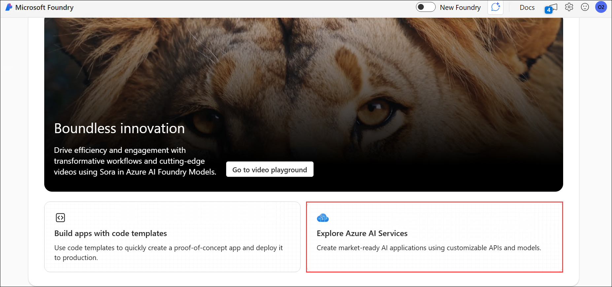

1. On the Azure AI Services page, select **Try Content Understanding**.

    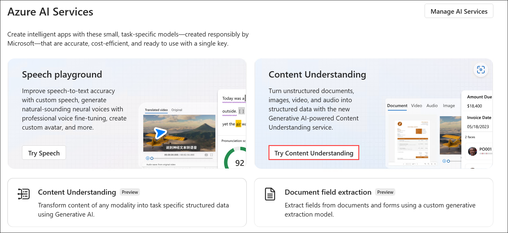

1. On the Content Understanding page, select **Create a project to start (1)**. Then in the **Create project** dialog, select the recommended **Microsoft Foundry resource (2)** and then click on **Next (3)**.

    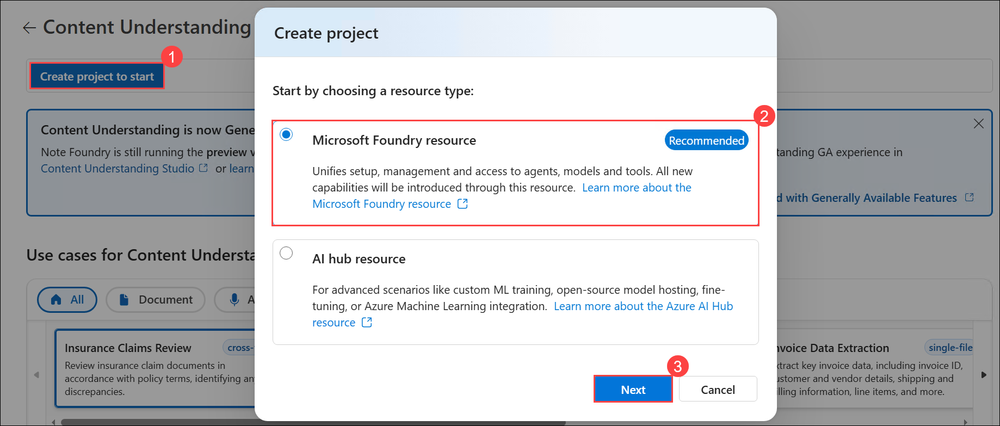

1. In the **Create a project** wizard, enter project name **Myproject<inject key="DeploymentID" enableCopy="false" /> (1)**, and expand **Advanced options (2)** to specify the following settings for your project: 

    - Subscription : **Leave default subscription (3)** 
    - Resource Group : Select **AI-900-Module-06a (4)** 
    - Microsoft Foundry resource: **MyFoundry<inject key="DeploymentID" enableCopy="false" /> (5)**
    - Region : Select **<inject key="location" enableCopy="false"/> (6)**
    - Click on **Create** **(7)**

      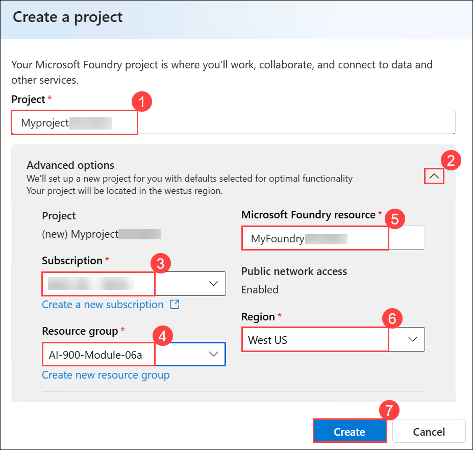
      
      >**Note:** Model deployments are restricted by regional quotas. If you select a region in which you have insufficient available quota, you may need to select an alternative region for a new resource later. At the time of writing, Content Understanding is supported in these regions: `West US`,`Sweden Central`, and `Australia East`.

1. Wait for the set up process to complete. It may take a few minutes.

> **Congratulations** on completing the task! Now, it's time to validate it. Here are the steps:
 
- Hit the Validate button for the corresponding task. You will receive a success message. 
- If not, carefully read the error message and retry the step, following the instructions in the lab guide.
- If you need any assistance, please contact us at cloudlabs-support@spektrasystems.com. We are available 24/7 to help you out.

  <validation step="ef1ed7b3-d177-4af2-b182-064e6945644b" />

## Task 2: Extract information from an invoice in Foundry portal (classic)

In this task, you'll use the Foundry portal to analyze an invoice with the prebuilt Content Understanding analyzer and review the extracted fields and JSON results.

1. On the Content Understanding page, select the **Try it out (1)** tab, and then select the **Invoice Data Extraction (2)** tile.

    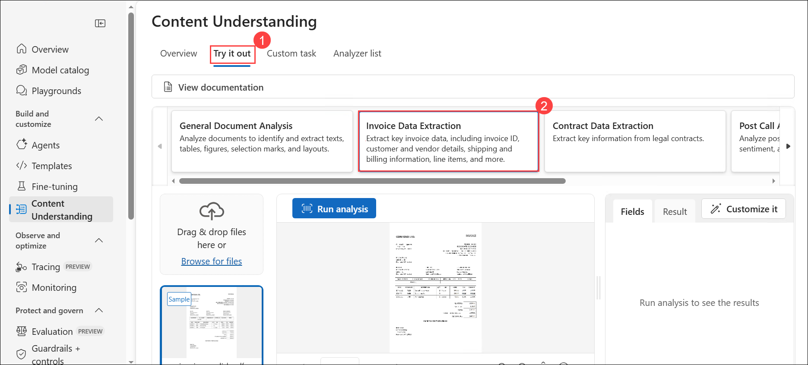

    A sample invoice is provided.

1. Select the sample invoice and click on **Run analysis (1)** button to extract information from it. When analysis is complete, view the results **(2)**.

    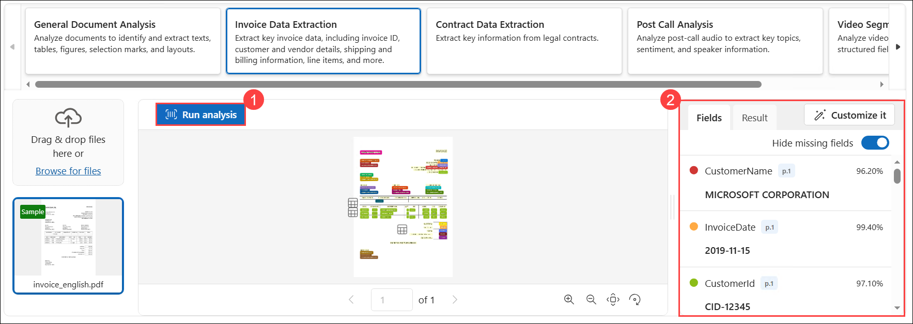

1. Open a new browser tab and paste the following link to download **contoso-invoice-1.pdf**.

    ```
    https://raw.githubusercontent.com/MicrosoftLearning/mslearn-ai-fundamentals/refs/heads/main/data/content-understanding/contoso-invoice-1.pdf
    ``` 

1. Click on the **Browse for files (1)**. In the *Open* window, click on the **Downloads (2)** under *Quick access* section and then select the file  **contoso-invoice-1.pdf (3)** that you downloaded previously, and then click on **Open (4)**.

    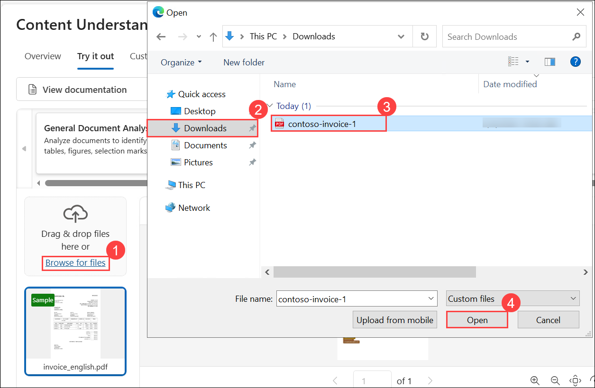

1. Make sure that **contoso-invoice-1.pdf** is selected and then click on **Run analysis**.

    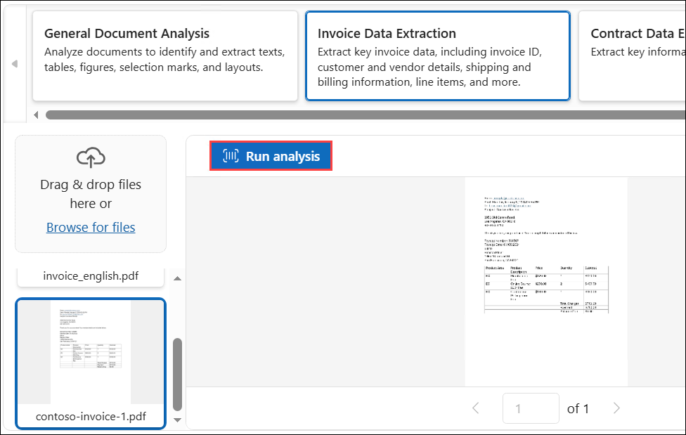

    .png)

    >**Note:** The Content Understanding analyzer is able to extract information from this invoice, even though it is formatted diffferently from the sample.

1. In the right-hand pane showing the extracted fields, open the **Result** tab to view the JSON response sent to a client application, which developers can then process and use to work with the extracted data.

    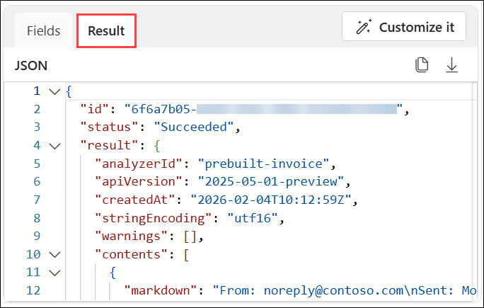

## Task 3: Extract information with the REST API

In this task, you'll call Azure Content Understanding through the REST API to analyze an invoice, retrieve results, and understand how to integrate Content Understanding into applications programmatically.

>**Note**: This section of the exercise requires you to have access to Visual Studio Code (VS Code).  

1. In the (classic) Foundry portal, from the left-side menu, select **Overview** to navigate to your Foundry project's home page.

    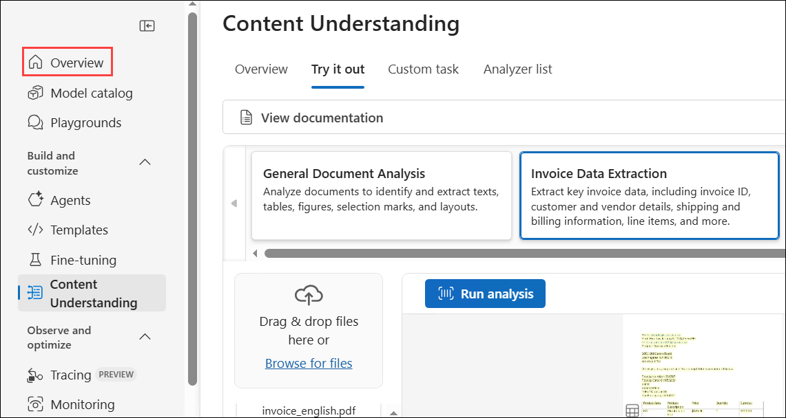

1. On the project home page, click the **Copy API key (1)** icon and the **Copy Microsoft Foundry project endpoint (2)** icon to copy the credentials, then paste them into Notepad for use later in the lab.

    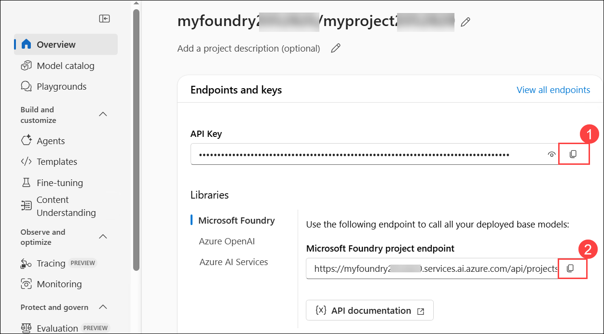

1. Open **Visual Studio Code** (VS Code) from the desktop by double-clicking on it.

    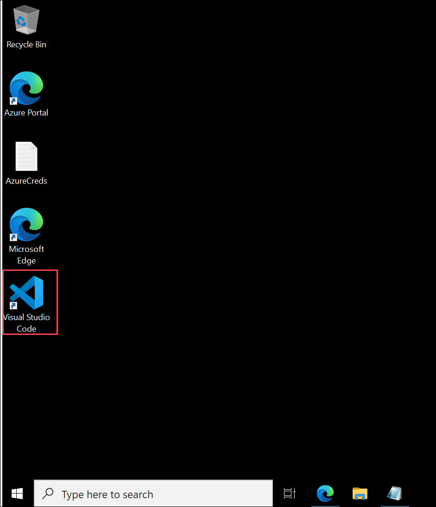

1. In VS Code, from the top menu bar, select  **View (1)** and then click on **Command Palette... (2)**. 

    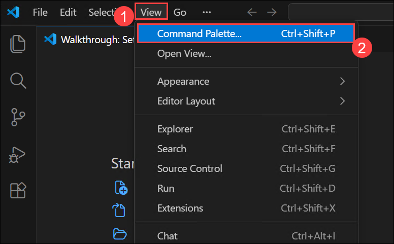

1. Type **Git: Clone (1)** and select it **(2)**. 

    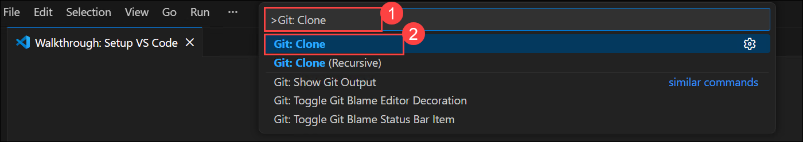

1. Paste the repo URL `https://github.com/MicrosoftLearning/mslearn-ai-fundamentals.git` and press **Enter**.  

    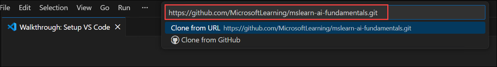

1. From the **Choose a folder to clone** window, select **Downloads (1)** from the Quick access section and then click on **Select as Repository Destination (2)**.

    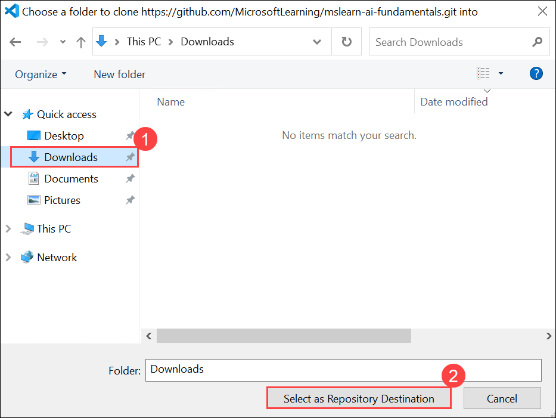

1. When prompted, click **Open** to start working on the cloned project in VS code.

    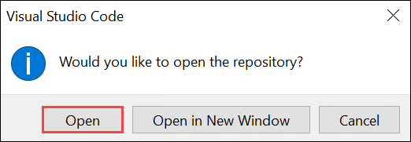

1. In the **Do you trust the authors of the files in this folder?** pop-up window, click on **Yes, I trust the authors**.

    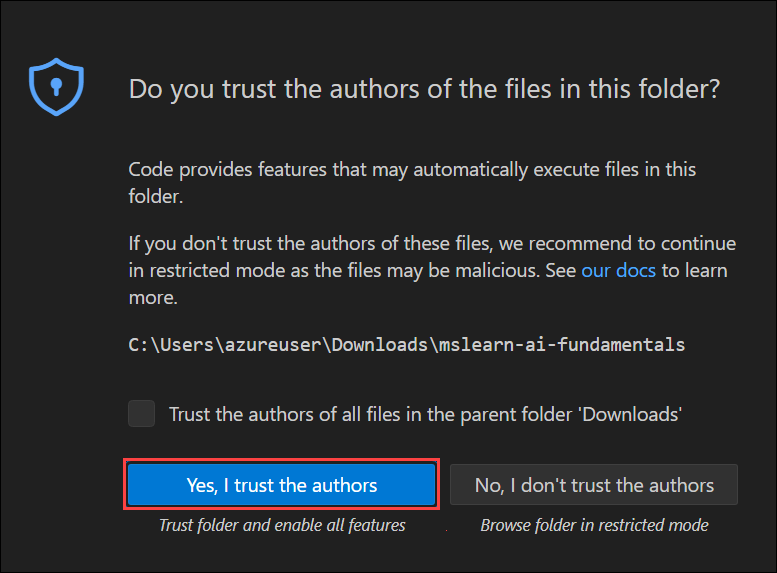

1. In the VS Code file explorer, select the **data (1)** folder, then select the **content-understanding (2)** folder.

    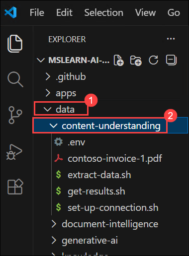

1. In the **content-understanding** folder, open the **.env (1)** file. Copy and paste your Foundry project API key **(2)** and Foundry project endpoint **(3)**. Edit the endpoint by deleting the text after *ai.azure.com*. Your endpoint should look like this `https://...ai.azure.com`. Save the file by pressing **Ctrl + S**. 

    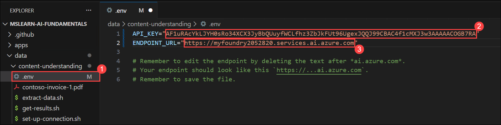

1. Now, return to Foundry portal to create Foundry Model deployments of *GPT-4.1*, *GPT-4.1-mini*, and *text-embedding-3-large* in your Foundry resource. 

1. In the (classic) Foundry portal, select **Models + endpoints (1)** from the menu on your left. In the **Model deployments** screen, select **+ Deploy a model (2)**, then select **Deploy base model (3)**.

    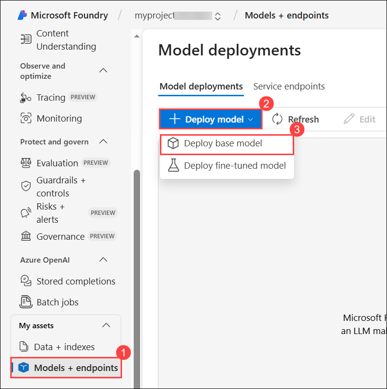

1. Search for **GPT-4.1 (1)** and select it **(2)** from the result, then select **Confirm (3)**. 

    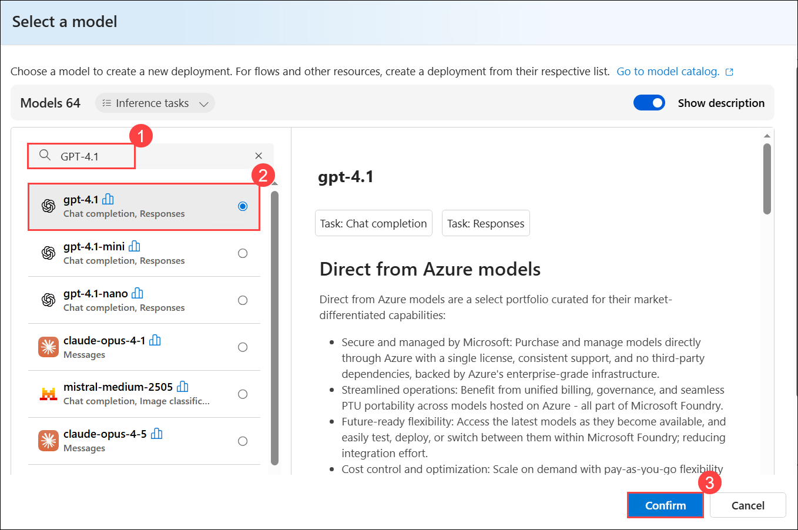

1. Keep the default name and default deployment type. Select **Deploy**.

    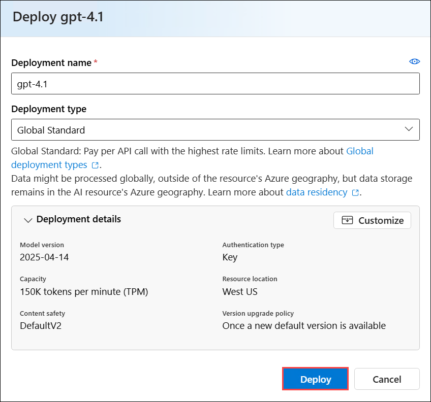

1. Return to the **Model deployments** page by selecting **Models + endpoints (1)** from the left-side menu. In the **Model deployments** screen, select **+ Deploy a model (2)**, then select **Deploy base model (3)**.

    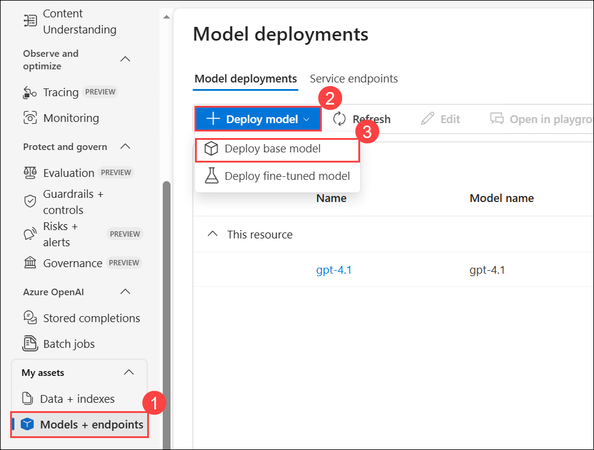

1. Repeat for **GPT-4.1-mini** and **text-embedding-3-large**. Once the models are deployed, note the names of the models (they should be **GPT-4.1**, **GPT-4.1-mini**, and **text-embedding-3-large** unless you customized the names). 

    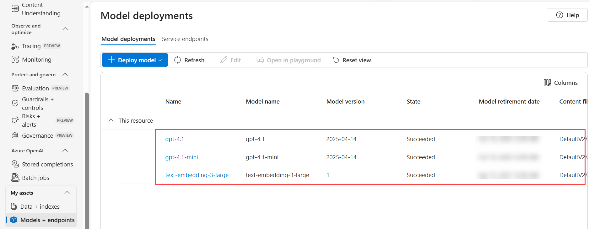

1. To extract information from content using Content Understanding, you can use the *curl* command to call the REST endpoint. You will need to make three calls: 
    - To set up a connection between Content Understanding and your Foundry models 
    - To analyze the content 
    - To retrieve the result of the analysis  

1. Let's set up a connection between Content Understanding and Foundry models in your Foundry resource. Return to VS Code. From the VS Code file explorer, open the **set-up-connection.sh** file. Note where variables for your project endpoint, key, and model deployment names are included in the script. The script should look similar to this:

    ```shell
    curl -i -X PATCH "{endpoint}/contentunderstanding/defaults?api-version=2025-11-01" \
      -H "Ocp-Apim-Subscription-Key: {key}" \
      -H "Content-Type: application/json" \
      -d '{
            "modelDeployments": {
              "gpt-4.1": "{myGPT41Deployment}",
              "gpt-4.1-mini": "{myGPT41MiniDeployment}",
              "text-embedding-3-large": "{myEmbeddingDeployment}"
            }
          }'
    ```

    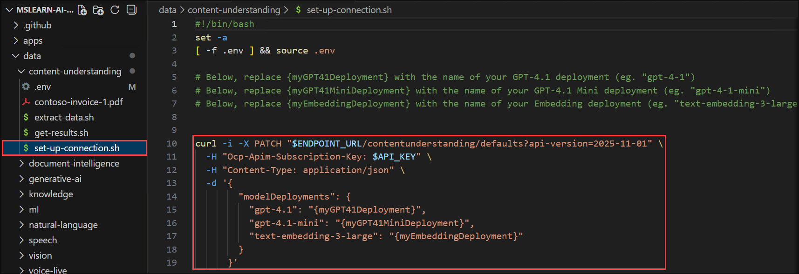

    >**Note:** Your .sh files also include script at the top that exports everything from .env into the script’s environment. You will see the information following ` #!/bin/bash` at the top of your .sh files. Do not edit this portion of the files.  
    
1. Edit the script by replacing `{myGPT41Deployment}`, `{myGPT41MiniDeployment}`, and `{myEmbeddingDeployment}` with your deployed model names. If you haven’t changed them, use `gpt-4.1`, `gpt-4.1-mini`, and `text-embedding-3-large`. Then save the file.

    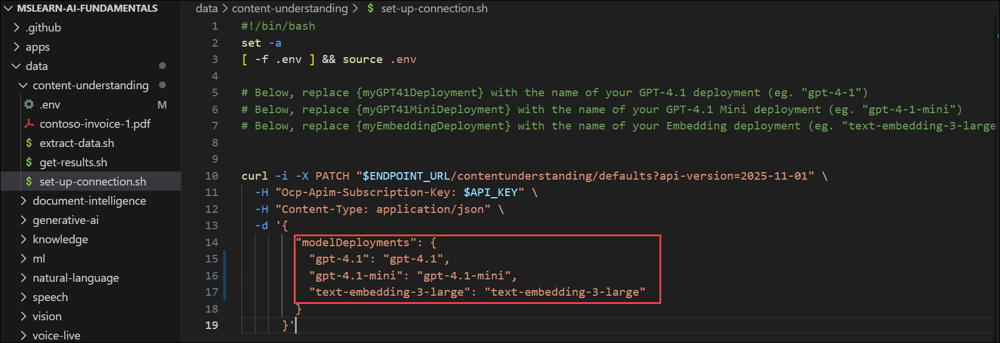

1. In VS Code, open the top menu, select **Ellipsis (…) (1)**, choose **Terminal (2)**, and then click **New Terminal (3)**.

    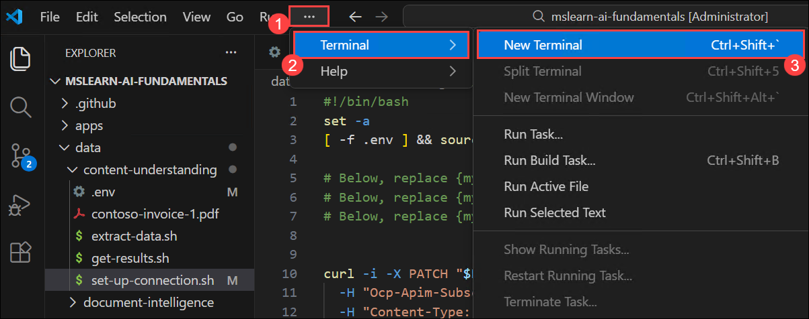

1. From the terminal, click on **Launch profile (1)** and then select **Git Bash (2)** profile from the list.

    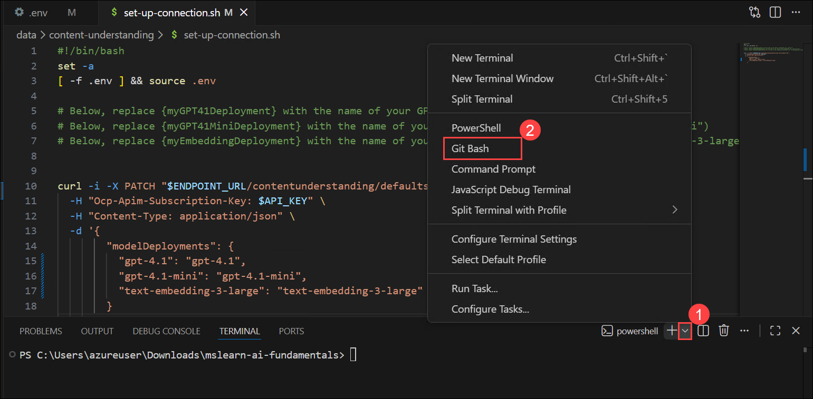

1. In the terminal, navigate to the content-understanding folder. Copy and paste the following into the terminal and press Enter. 

    ```bash
    cd data/content-understanding
    ```
    
    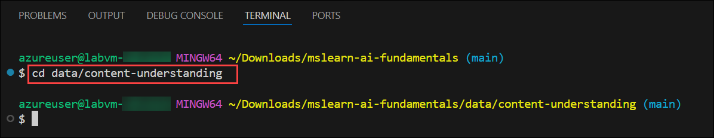
 
1. Copy and paste the following command into the terminal to run the script, which establishes a connection between Content Understanding and the deployed models in your profile. 

    ```bash
    bash set-up-connection.sh
    ```

    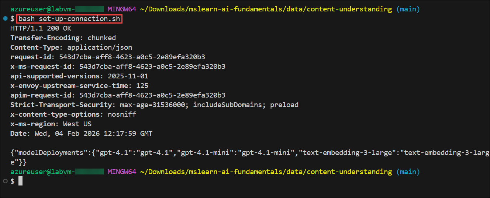 

1. Next, let's analyze our content using the prebuilt-invoice analyzer to extract structured data from an invoice document. We will analyze the same document as we did with the portal earlier in the exercise from `https://raw.githubusercontent.com/MicrosoftLearning/mslearn-ai-fundamentals/refs/heads/main/data/content-understanding/contoso-invoice-1.pdf`. 

1. In the VS Code File Explorer, open the **extract-data.sh** file and review where the project endpoint and key variables are defined, as well as where the document URL is specified in the inputs. The script should resemble the following:

    ```shell
    curl -i -X POST "{endpoint}/contentunderstanding/analyzers/prebuilt-invoice:analyze?api-version=2025-11-01" \
      -H "Ocp-Apim-Subscription-Key: {key}" \
      -H "Content-Type: application/json" \
      -d '{
            "inputs":[{"url": "https://raw.githubusercontent.com/MicrosoftLearning/mslearn-ai-fundamentals/refs/heads/main/data/content-understanding/contoso-invoice-1.pdf"}]
          }'
    ```

    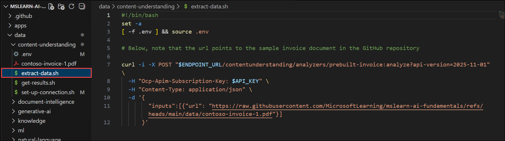

1. Copy and paste the following command into the terminal and press **Enter** to run the script, which sends a POST request to analyze the content:

    ```bash
    bash extract-data.sh
    ```

1. The POST response should look something like this: 

    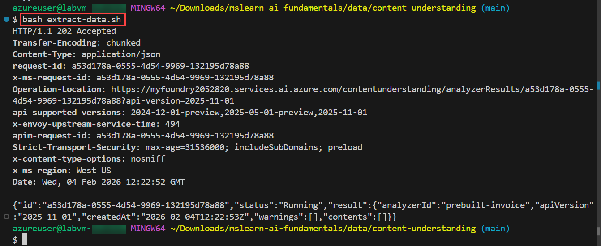

1. Copy the `request-id` from the POST response.

    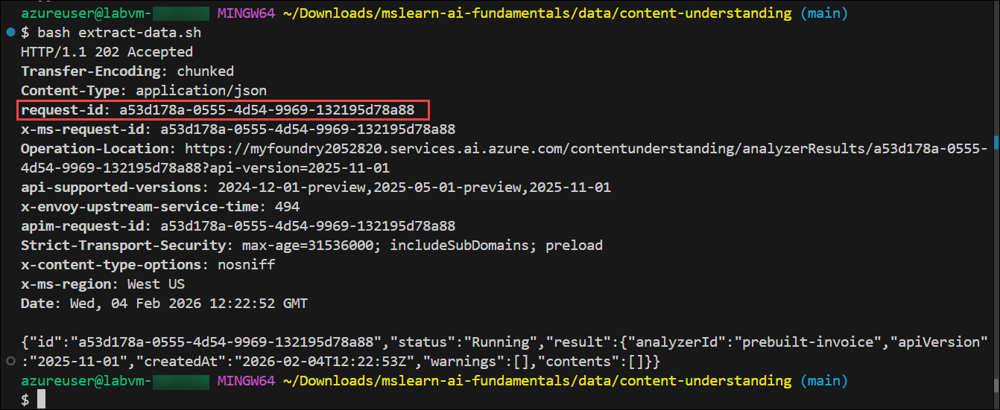

1. From the VS Code file explorer, open **get-results.sh** and review the file. Note where variables for your project endpoint and key are included in the script. The script should look similar to this: 

    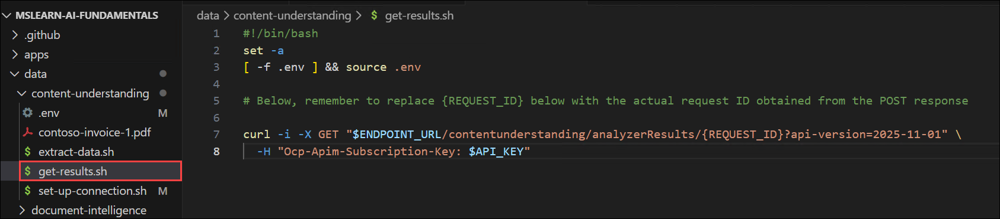

1. In the **get-results.sh** file, delete `{REQUEST_ID}` and paste the `request-id` from the POST response. Remember to save the file.

    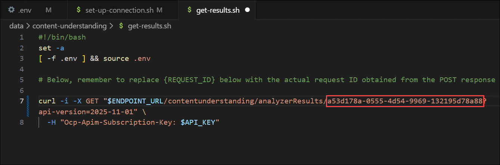
    
1. Copy and paste the following command into the terminal and press **Enter** to run the GET results script, which uses the `request-id` from the POST response to retrieve the analysis result:

    ```bash
    bash get-results.sh
    ```

1. Review the JSON returned. See how it provides the same information you saw from the *Results* tab in the Foundry portal after analyzing the same document.

    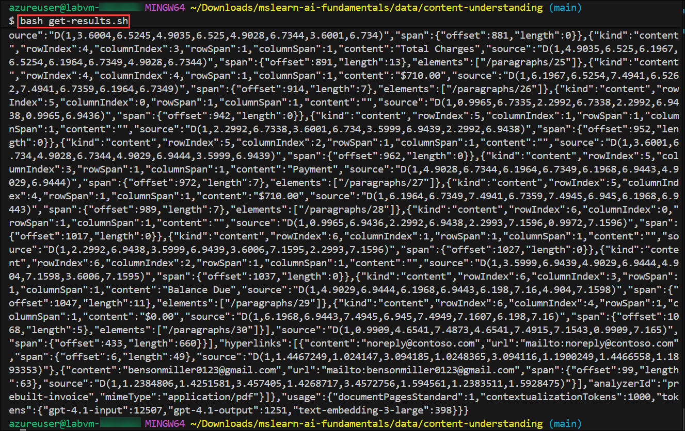

> **Congratulations** on completing the task! Now, it's time to validate it. Here are the steps:
 
- Hit the Validate button for the corresponding task. You will receive a success message. 
- If not, carefully read the error message and retry the step, following the instructions in the lab guide.
- If you need any assistance, please contact us at cloudlabs-support@spektrasystems.com. We are available 24/7 to help you out.

  <validation step="50ef940e-c0bb-40bc-9b5d-f13240344ba3" />

## Summary

In this exercise, you learned how to use Azure Content Understanding in Microsoft Foundry to extract structured information from invoices using both the Foundry portal and the REST API. You created a Foundry project, deployed required models, analyzed documents, and reviewed the extracted results in JSON format.

These scenarios demonstrate how you can integrate Content Understanding with generative AI models to build applications that automatically process and interpret multi-modal content. From this foundation, you can develop intelligent solutions that extract, analyze, and act on information from documents, images, audio, and video in real-world business workflows.

### Congratulations, you’ve successfully completed the hands-on lab!