# Module 08: Use Conversational Language Understanding with Language Studio

## Lab overview
Increasingly, we expect computers to be able to use AI to understand natural language commands, either spoken or typed. For example, you might want a home automation system to control devices in your home by using voice commands such as “switch on the light” or “put the fan on.” AI-powered devices can understand these commands and take appropriate action.

In this exercise, you will use Language Studio to create and test a project that sends instructions to devices such as lights or fans. You’ll use the capabilities of the Conversational Language Understanding service to configure your project. 

## Lab Objectives

In this lab, you will perform:

- Task 1: Create a *Language* resource
- Task 2: Create a Conversational Language Understanding App
- Task 3: Create intents, utterances, and entities
- Task 4: Train the model
- Task 5: Deploy and test the model

## Exercise 1: Use Conversational Language Understanding with Language Studio

### Task 1: Create a *Language* resource

In this task, you will learn how to create a **Language** resource in Azure to unlock advanced natural language processing capabilities for text analysis and AI-driven insights.

You can use many Azure AI Language features with either a **Language** or **Azure AI services** resource. There are some instances where only a Language resource can be used. For the exercise below, we will use a **Language** resource. If you haven't already done so, create a **Language** resource in your Azure subscription.

1. In the azure portal, Click the **&#65291;Create a resource** button.

   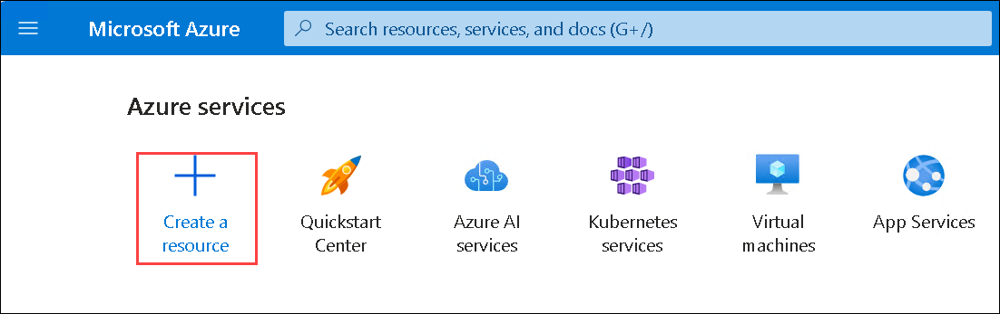

1. In the Marketplace page search for **Language service (1)** press **Enter** and Select **Language service (2)**.

   

1. You will be taken to a page to **Select additional features**. Keep the default selection and click **Continue to create your resource**.

   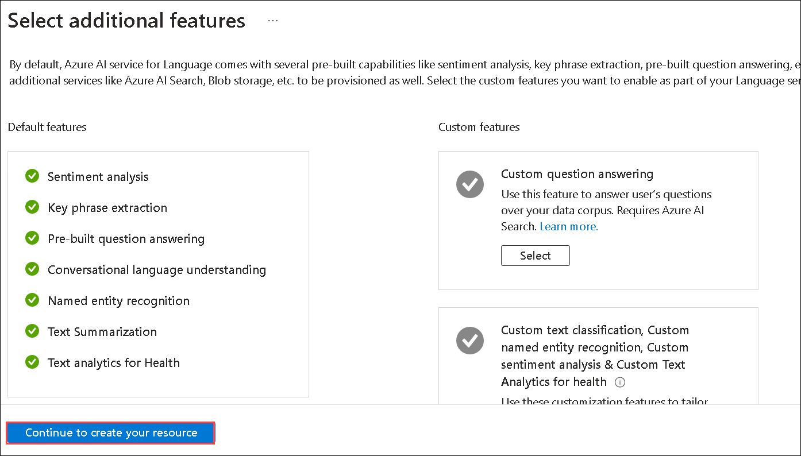

1. On the page **Create Language**, configure it with the following settings:
<<<<<<< HEAD
    - **Subscription**: *Your Azure subscription*.
    - **Resource group**: *Select or create a resource group with a unique name*.
    - **Region**: *Select the closest geographical region. If in eastern US, use "East US 2"*.
    - **Name**: *Enter a unique name*.
    - **Pricing tier**: *Free F0 or S if Free F0 is not available*
    - **By checking this box I acknowledge that I have read and understood all the terms below**: *Selected*.
=======
    - **Subscription**: *Your Azure subscription* **(1)**
    - **Resource group**: **AI-900-Module-08-<inject key="DeploymentID" enableCopy="false" /> (2)**
    - **Region**: Select **<inject key="location" enableCopy="false"/>** **(3)**
    - **Name**: Enter **Conversational<inject key="DeploymentID" enableCopy="false" /> (4)**
    - **Pricing tier**: **Free F0 (5)** (if Free F0 is not available, select *S*)
    - **By checking this box I certify that I have reviewed and acknowledge the terms in the Responsible AI Notice.**: *Selected* **(6)**
    - Select **Review + create (7)**
>>>>>>> 20a06afb6504d7ebfb91f217980cf0897bf34e2e

      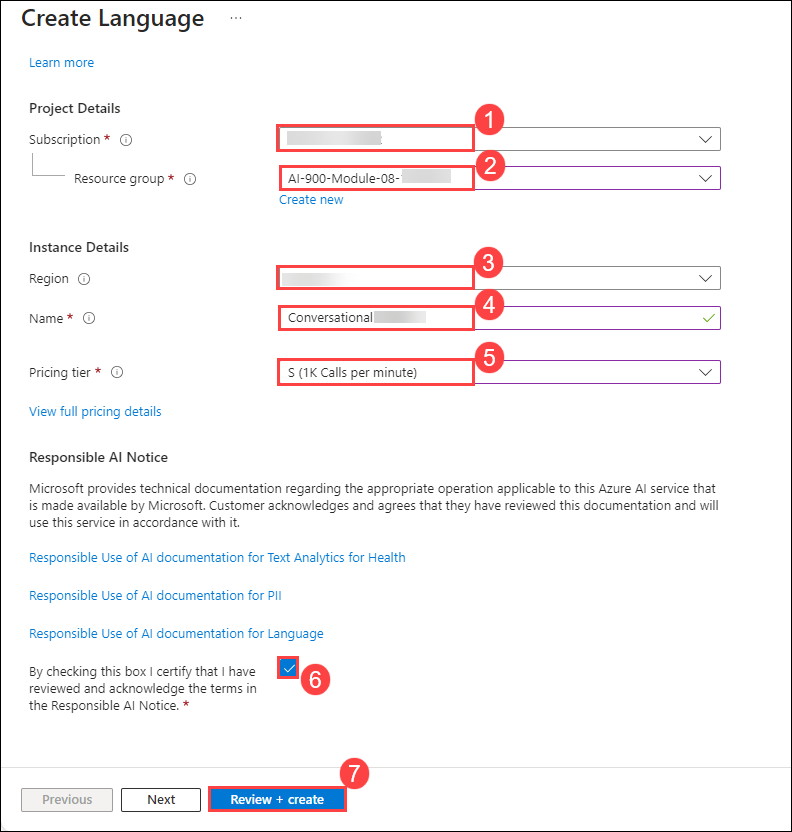   

1. Then **Create** and wait for deployment to complete.

### Task 2: Create a Conversational Language Understanding App

In this task, you will learn how to create a **Conversational Language Understanding (CLU)** app to build intelligent conversational agents that can understand and process natural language input.

To implement natural language understanding with Conversational Language Understanding, you create an app; and then add entities, intents, and utterances to define the commands you want the app to execute.

1. Right click on [https://language.azure.com](https://language.azure.com?azure-portal=true) link, select **Copy link** from the context menu, then paste it into a new tab to access the Language studio portal.

1. Click on **Sign in**.

    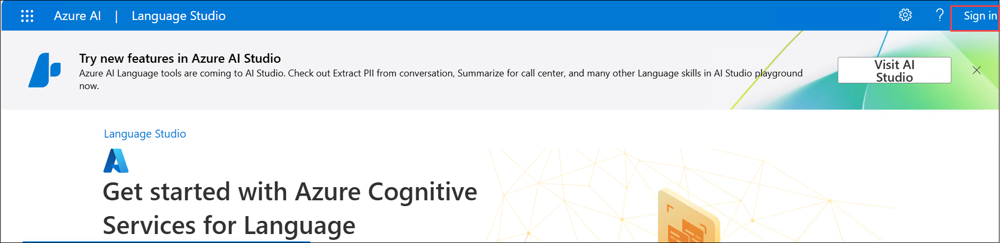

1. If prompted, sign in using the following username and password.
    
    * Email/Username: <inject key="AzureAdUserEmail"></inject>
    
    * Password: <inject key="AzureAdUserPassword"></inject>    

1. If prompted to choose a Language resource, select the following settings, and select **Done (5)**:
   
    - **Azure directory**: *The Azure directory containing your subscription* **(1)**
    - **Azure subscription**: *Your Azure subscription* **(2)**
    - **Resource type**: *Language* **(3)**
    - **Resource name**: *select the Language service resource you just created* **(4)**

    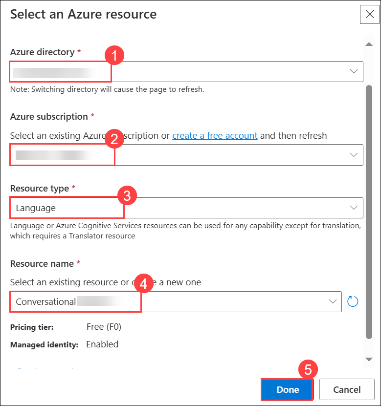

   If you are ***not*** prompted to choose a language resource, it may be because you have multiple Language resources in your subscription; in which case:
    1. On the bar at the top of the page, select **Settings (&#9881;)**.
    2. On the **Settings** page, view the **Resources** tab.
    3. Select the language resource you just created, and make sure the managed identity tab is **enabled.**.
    4. At the top of the page, select **Language Studio** to return to the Language Studio home page.

1. At the top of the portal, select **Create new (1)** menu, and select **Conversational language understanding (2)**.

    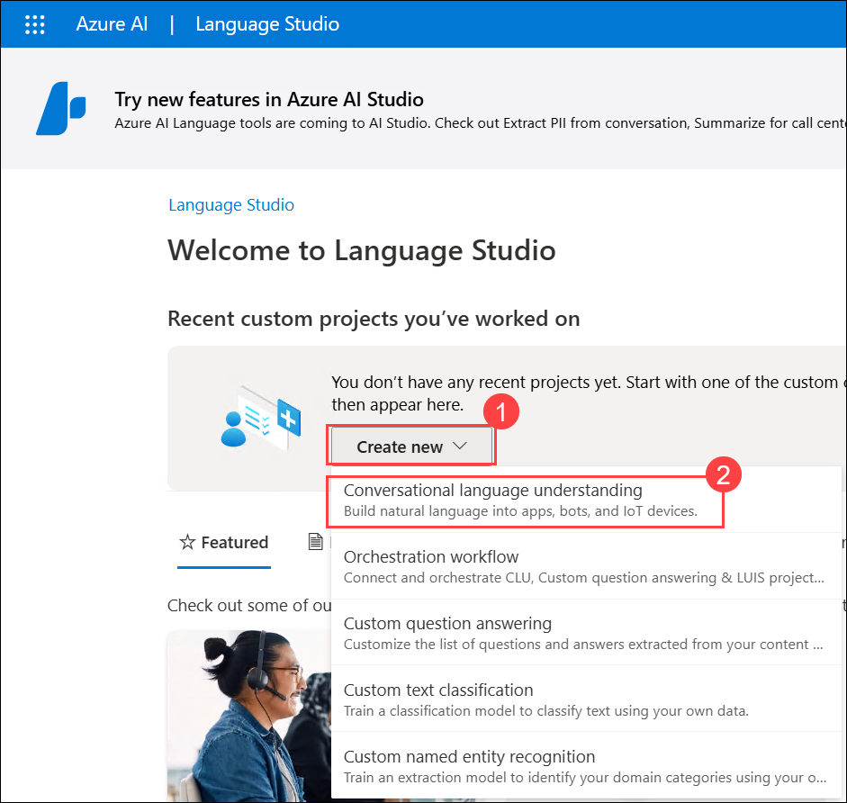
   
1. In the **Create a project** dialog box, on the **Enter basic information** page, enter the following details and select **Next**:  

   - **Name**: **Project<inject key="DeploymentID" enableCopy="false" />** **(1)**  
   - **Utterances primary language**: *English (US)* **(2)**  
   - **Enable multiple languages in project**: **Do not select** **(3)**  
   - **Description**: `Simple home automation` **(4)**  
   
   - Click **Next** **(5)**  
   
     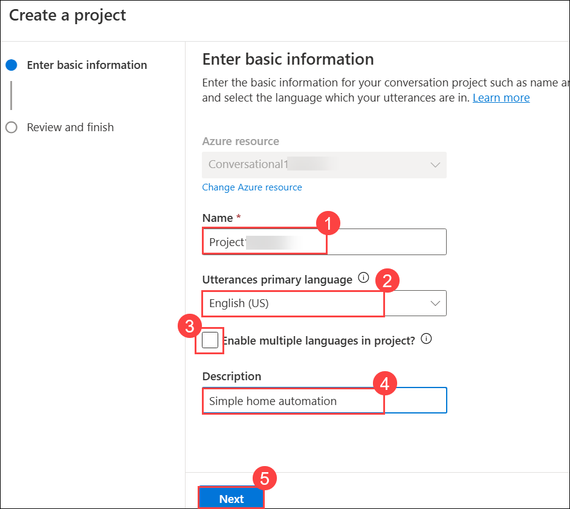  

     > **Tip**: Make a note of your *project name*, as you will need it later.  

     > **Note:** It may take approximately **15-20 minutes** for the **Utterances Primary Language** list to appear.  

1. On the **Review and finish** page, select **Create**. 

    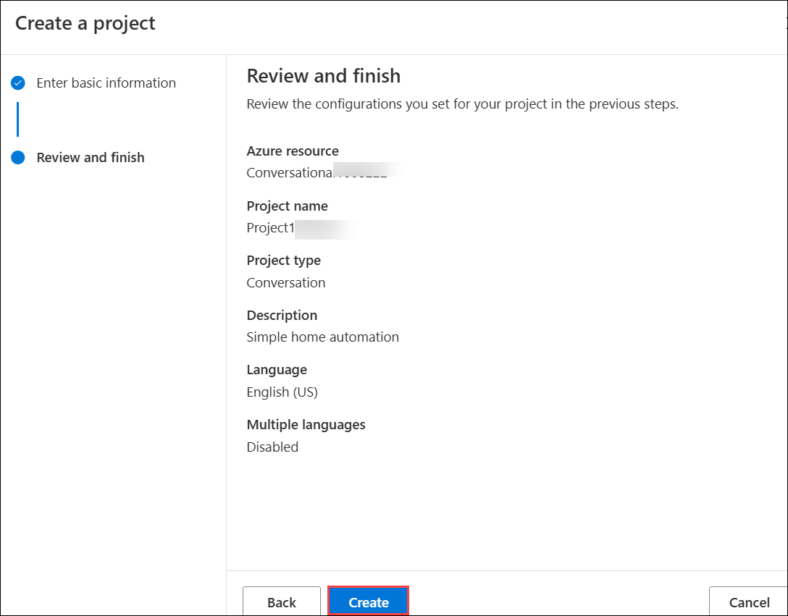
  
### Task 3: Create intents, utterances, and entities

In this task, you will learn how to create intents, utterances, and entities in your **Conversational Language Understanding (CLU)** app to train it to recognize user inputs and respond appropriately.

An *intent* is an action you want to perform - for example, you might want to switch on a light, or turn off a fan. In this case, you'll define two intents: one to switch on a device, and another to switch off a device. For each intent, you'll specify sample *utterances* that indicate the kind of language used to indicate the intent.

1. In the **Schema definition (1)** pane, ensure that **Intents (2)** is selected then select **+ Add (3)**

    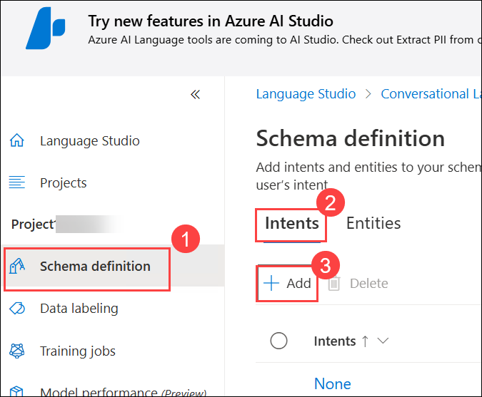

1. Add an intent with the name `switch_on` (in lower-case) **(1)** and select **Add intent (2)**.

    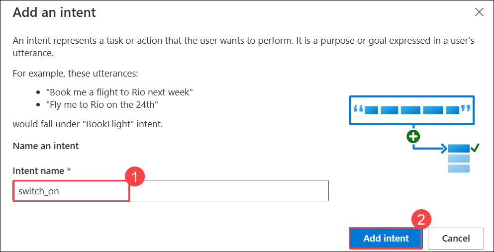

1. Select the **switch_on** intent. 

    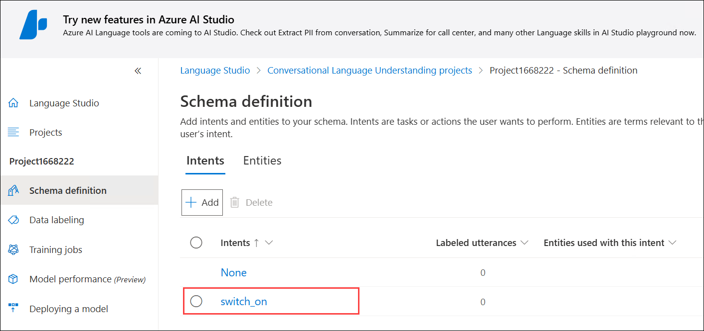

1. It will take you to the **Data labeling (1)** page. In the **Intent** drop down, select **switch_on (2)**. Next to the **switch_on** intent, type the utterance `turn the light on` **(3)** and press **Enter** to submit this utterance to the list.
   
    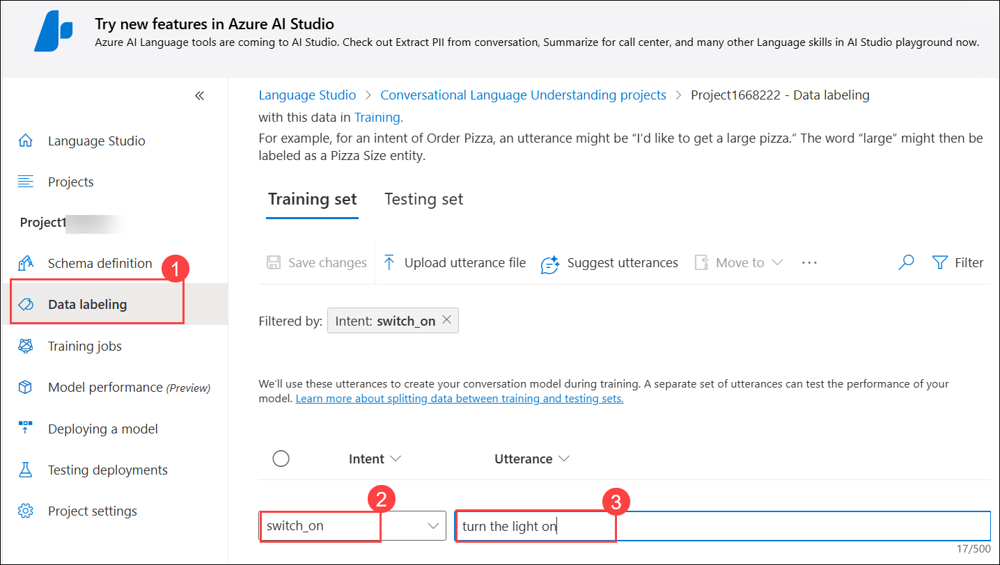

1. The language service needs at least five different utterance examples for each intent to sufficiently train the language model. Add five more utterance examples for the **switch_on** intent:  
    - `switch on the fan`
    - `put the fan on`
    - `put the light on`
    - `switch on the light`
    - `turn the fan on`

        .png)

1. On the **Activity pane** on the right-hand side of the screen, select **Labels (1)**, then select **+ Add entity (2)**.

    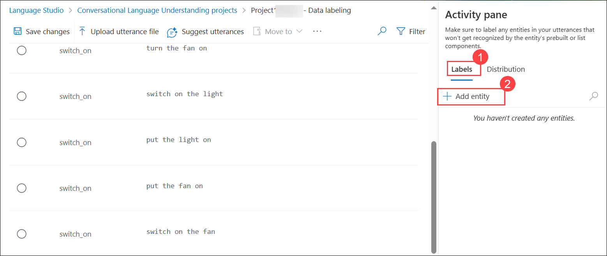

1.  Type `device` (in lower-case) **(1)**, select **List (2)** and select **Add entity (3)**.

    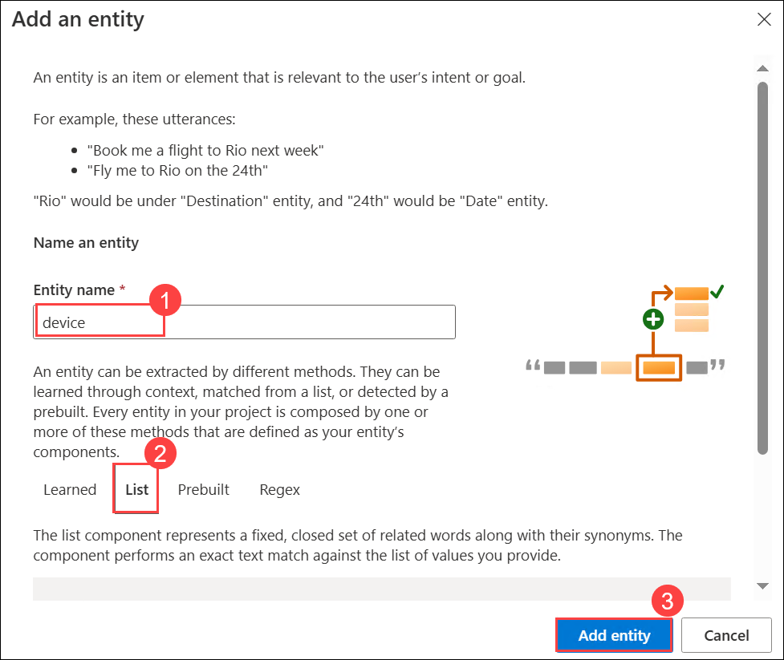

1. In the ***turn the fan on*** utterance, highlight the word `fan` **(1)**. Then in the list that appears, in the *Search for an entity* box select **device (2)**.

    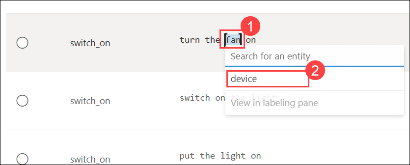

1. Do the same for all the utterances. Label the rest of the `fan` or `light` utterances with the **device** entity **(1)**. When you're finished, verify that you have the following utterances and make sure to select **Save changes (2)**:

    | **intent** | **utterance** | **entity** |
    | --------------- | ------------------ | ------------------ |
    | switch_on   | put the fan on     | Device - *select fan* |
    | switch_on   | put the light on    | Device - *select light* |
    | switch_on   | switch on the light | Device - *select light* |
    | switch_on   | turn the fan on     | Device - *select fan* |
    | switch_on   | switch on the fan   | Device - *select fan* |
    | switch_on   | turn the light on   | Device - *select light* |

    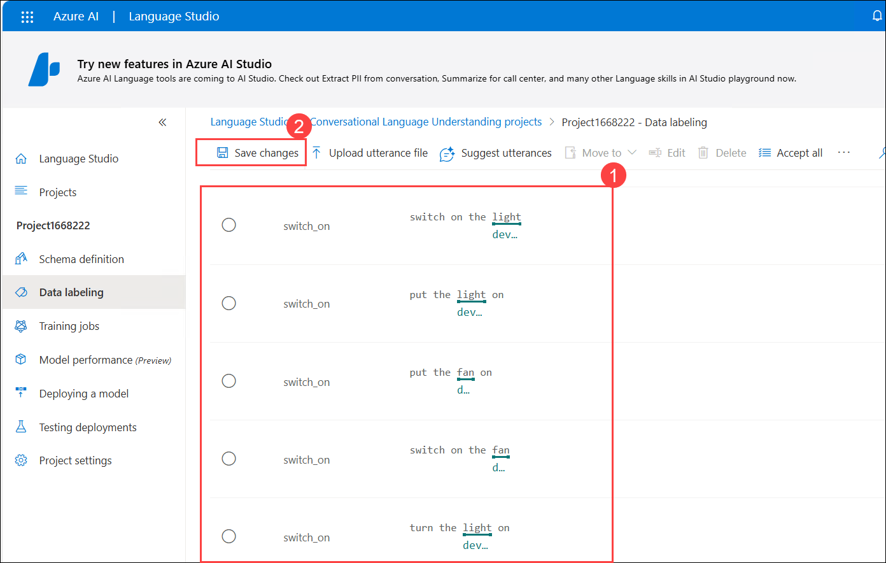

1. In the pane on the left, select **Schema definition (1)** and verify that your **switch_on** intent is listed. Then select **+ Add (2)**. 

    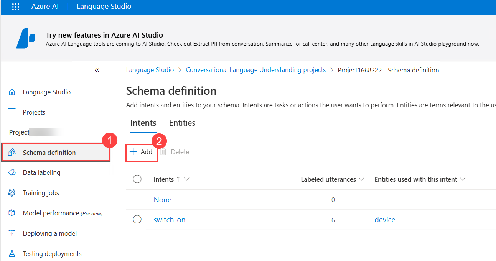

1. Add a new intent with the name `switch_off` (in lower-case) **(1)** and click on **Add intent (2)**. 

    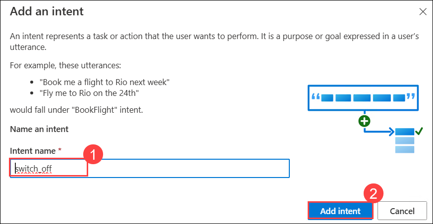

1. Select the **switch_off** intent.

    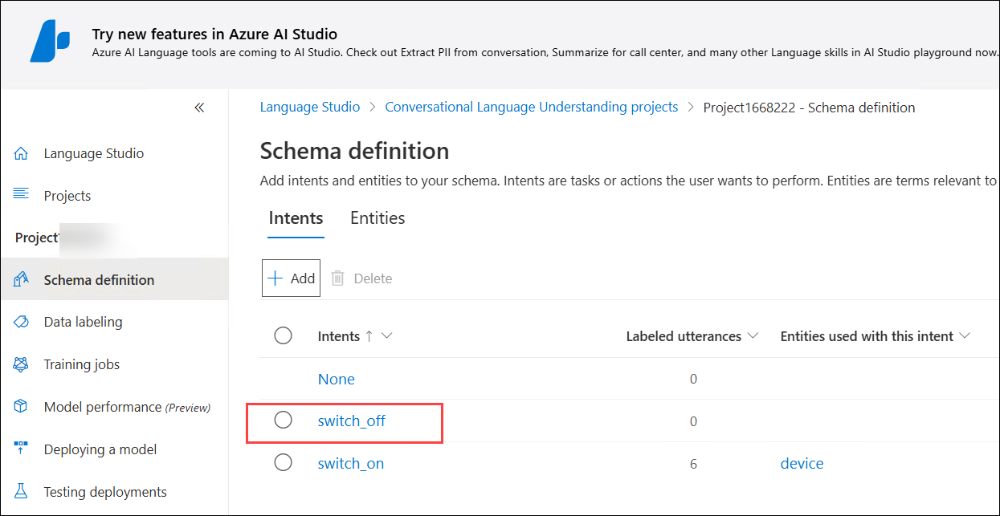

1. It will take you to the **Data labeling (1)** page. In the **Intent** drop down, select **switch_off (2)**. Next to the **switch_off** intent, add the utterance `turn the light off` **(3)**.

    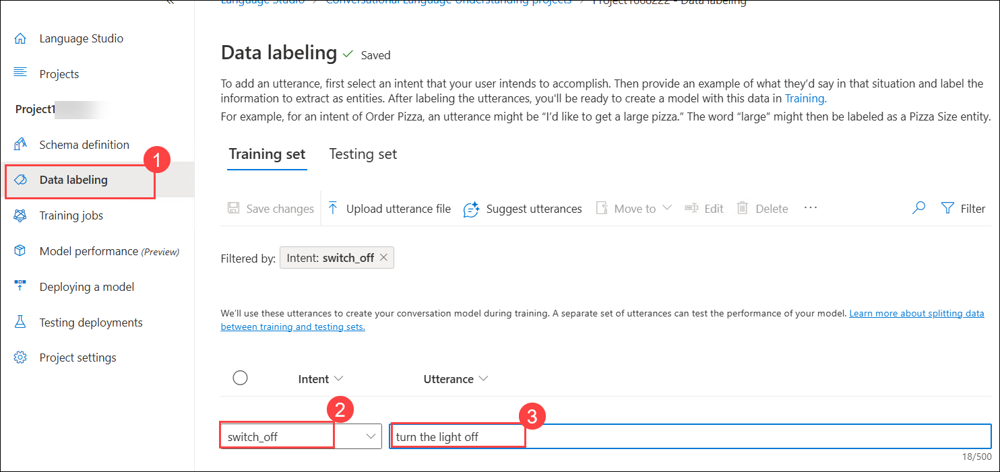

1. Add five more utterance examples to the **switch_off** intent.
    - `switch off the fan`
    - `put the fan off`
    - `put the light off`
    - `turn off the light`
    - `switch the fan off`

      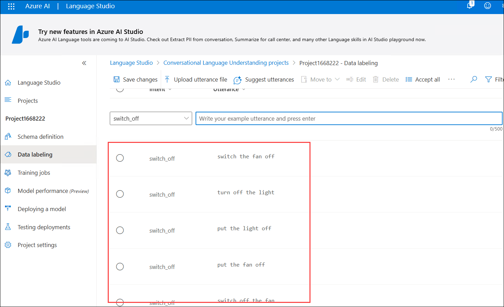    

1. Label the words `light` or `fan` with the **device** entity. When you're finished, verify that you have the following utterances **(1)** and make sure to select **Save changes (2)**:  

    | **intent** | **utterance** | **entity** | 
    | --------------- | ------------------ | ------------------ |
    | switch_off   | put the fan off    | Device - *select fan* | 
    | switch_off   | put the light off  | Device - *select light* |
    | switch_off   | turn off the light | Device - *select light* |
    | switch_off   | switch the fan off | Device - *select fan* |
    | switch_off   | switch off the fan | Device - *select fan* |
    | switch_off   | turn the light off | Device - *select light* |

   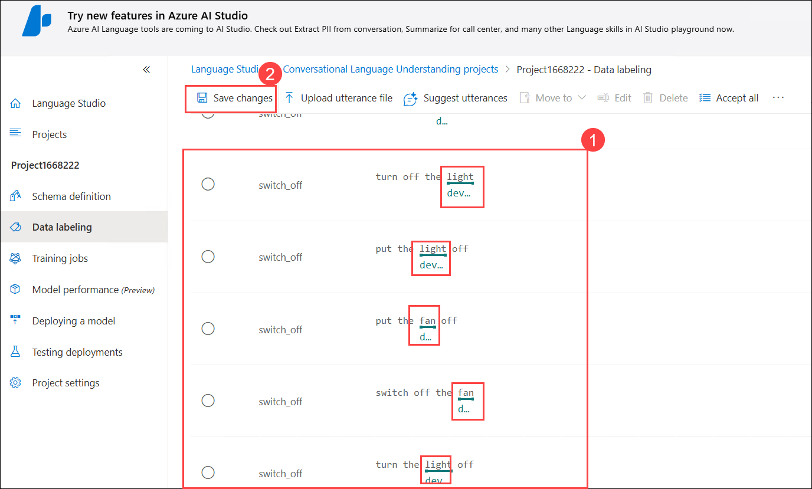
   
### Task 4: Train the model

In this task, you will learn how to train the model in your **Conversational Language Understanding (CLU)** app to improve its ability to recognize and understand user intents, utterances, and entities.

Now you're ready to use the intents and entities you have defined to train the conversational language model for your app.

1. On the left-hand side of Language Studio, select **Training jobs (1)**, then select **+ Start a training job (2)**.
   
   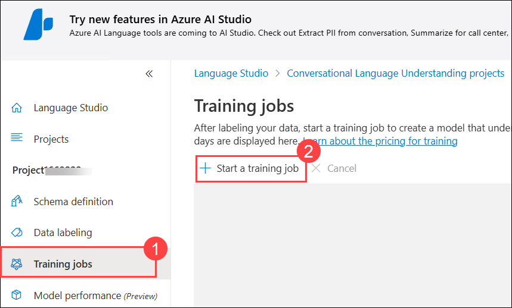
   
1. Use the following settings:
    - Train a new model: **Train<inject key="DeploymentID" enableCopy="false" /> (1)**
    - Training mode: **Standard training (free) (2)**
    - Data Splitting: select **Automatically split the testing set from the training data, keep default percentages (3)**
    - Select **Train (4)** at the bottom of the page.

        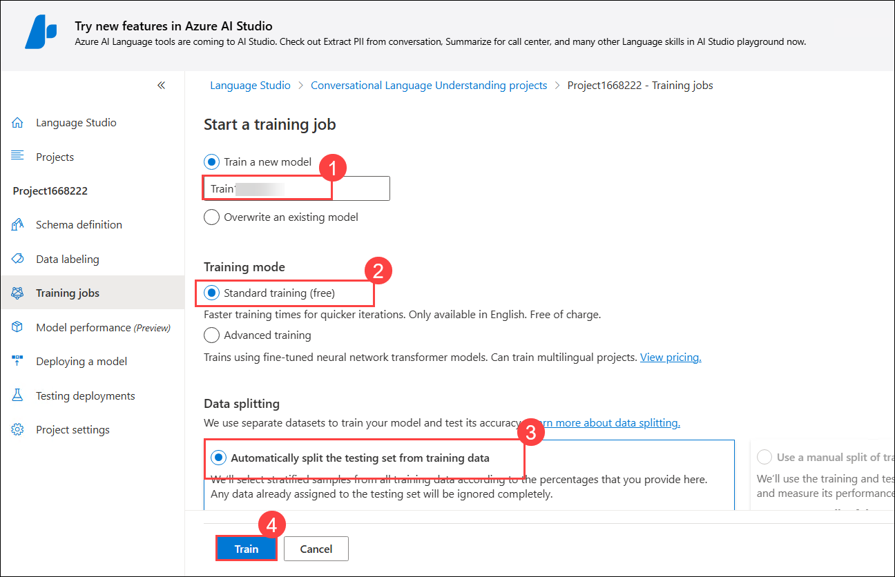
   
1. Wait for training to complete.

   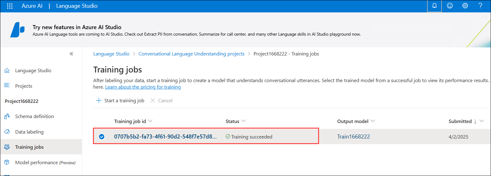

### Task 5: Deploy and test the model

In this task, you will learn how to deploy and test the model in your **Conversational Language Understanding (CLU)** app to ensure it functions correctly and responds accurately to user inputs.

To use your trained model in a client application, you must deploy it as an endpoint to which the client applications can send new utterances; from which intents and entities will be predicted.

1. On the left-hand side of Language Studio, select **Deploying a model (1)**, and select **Add deployment (2)**.

    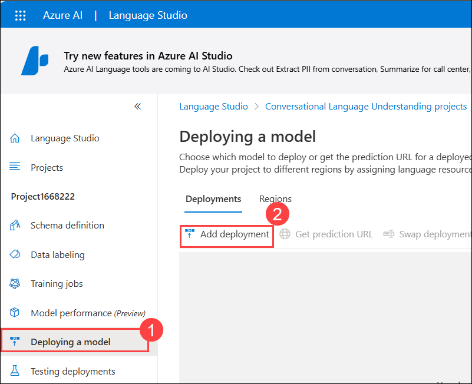

1. Use these settings:
    - Create or select an existing deployment name: **Deploy<inject key="DeploymentID" enableCopy="false" /> (1)**
    - Assign trained model to your deployment name: **Select the name of the trained model (2)**
    - Select **Deploy (3)**

        > **Tip**: Note your *deployment name*, you will use it later.    

        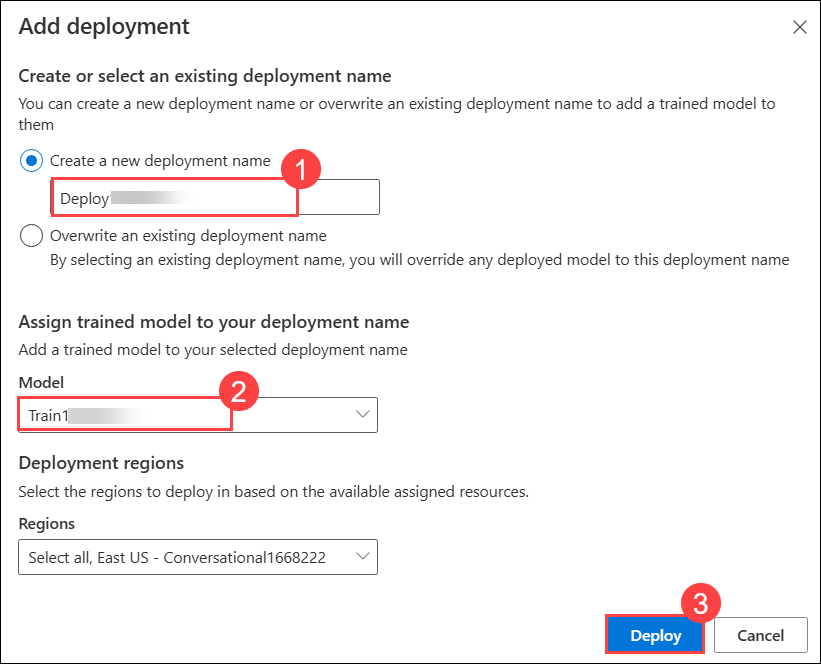
   
1. When the model is deployed, select **Testing deployments (1)** on the left-hand side of the page, and then select your deployed model under **Deployment name (2)**. Enter the following text **(3)**, and then select **Run the test (4)**:

    `switch the light on`

     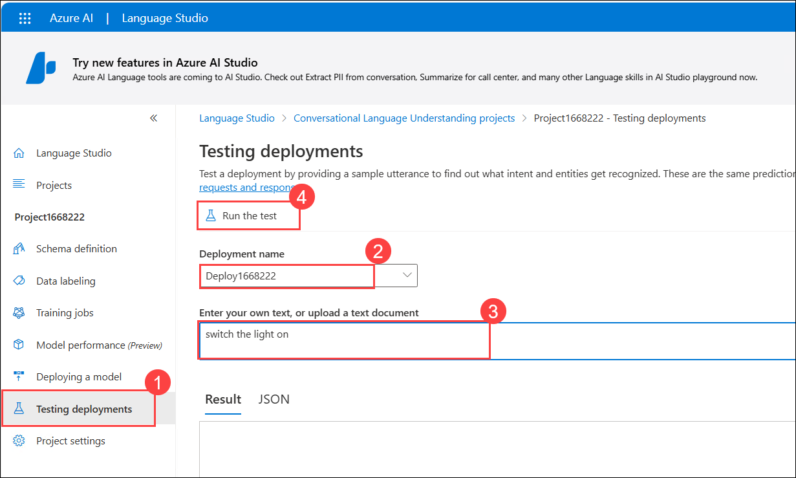    

1. Review the result that is returned, noting that it includes the predicted intent (which should be **switch_on**) and the predicted entity (**device**) with confidence scores that indicate the probability the model calculated for the predicted intent and entity. The JSON tab shows the comparative confidence for each potential intent (the one with the highest confidence score is the predicted intent)

    .png)

1. Clear the text box and test the model with the following utterances under *Enter your own text, or upload a text document*:
    
    - `turn off the fan`
    - `put the light on`
    - `put the fan off`

You have now successfully configured a conversational language project and defined entities, intents, and utterances. You have seen how to train and deploy a model in the Language Studio. And you have tried it out with both utterances you defined, and some that you did not explicitly define but the model was able to determine.

> **NOTE**: Conversational language understanding provides the intelligence to interpret the intention of the input; it doesn't perform any actions such as turning on the light or the fan. A developer would need to build an application that uses the Conversational Language Understanding model to determine the user's intent, and then automate the appropriate action.

## Validation

> **Congratulations** on completing the task! Now, it's time to validate it. Here are the steps:
 
- Hit the Validate button for the corresponding task. you will receive a success message. 
- If not, carefully read the error message and retry the step, following the instructions in the lab guide.
- If you need any assistance, please contact us at cloudlabs-support@spektrasystems.com. We are available 24/7 to help you out.

   <validation step="1c8ee6fe-9783-45b7-9293-38c9766a4fb2" />

## Learn more

This app shows only some of the capabilities of the Conversational Language Understanding feature of the Language service. To learn more about what you can do with this service, see the [Conversational Language Understanding page](https://docs.microsoft.com/azure/cognitive-services/language-service/conversational-language-understanding/overview).

### Review

In this lab, you have completed the following tasks:
- Created a *Language* resource
- Created a Conversational Language Understanding App
- Created intents, utterances, and entities
- Trained the model
- Deployed and tested the model
  
## You have successfully completed this lab.
