# Lab: Explore Speech in the Microsoft Foundry portal

## Lab overview

The **Azure AI Speech** service transcribes speech into text and text into audible speech. You might use AI Speech to create an application that can transcribe meeting notes or generate text from the recording of interviews.

In this exercise, you will use Azure AI Speech in the Microsoft Foundry portal, Microsoft's platform for creating intelligent applications, to transcribe audio using the built-in try-it-out experiences. 

## Lab objectives

In this lab, you will perform:

- Task 1: Create a project in the Microsoft Foundry portal
- Task 2: Explore speech-to-text in Microsoft Foundry's Speech Playground

### Task 1: Create a project in the Microsoft Foundry portal

In this task, we are creating and configuring a project in Microsoft Foundry to explore AI services and speech capabilities.

1. On the Azure Portal home page, select **Foundry** under **Azure services**.

    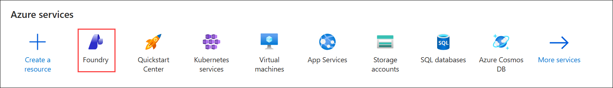 

1. In the left navigation pane for the AI Foundry, select **AI Hubs (2)** under **Use with AI Foundry (1)**. On the AI Hubs page, click on **+ Create (2)** and select **Hub (3)** from the drop-down.

    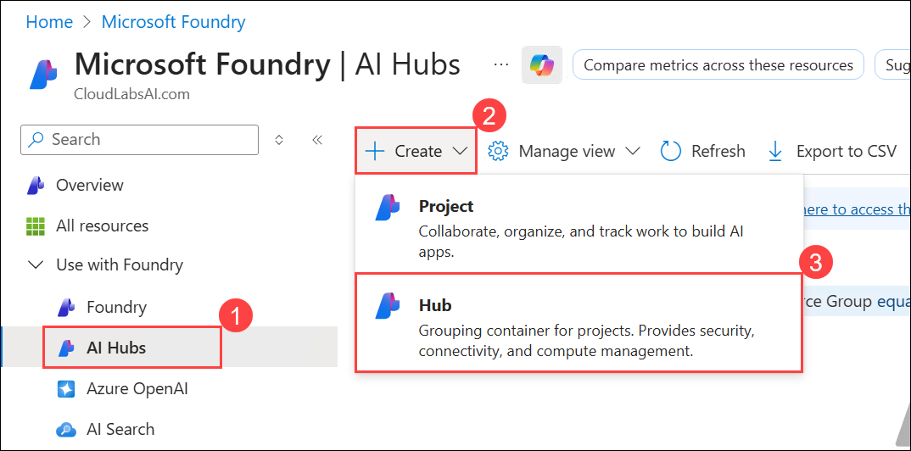 

1. On the **Create an AI hub resource** pane, enter the following details:

    - Subscription : **Leave default subscription (1)** 
    - Resource Group : Select **AI-900-Module-09 (2)** 
    - Region : Select **<inject key="Location" enableCopy="false"/>**  **(3)**
    - Name : Use the format **Myhub-<inject key="Deployment ID" enableCopy="false"></inject> (4)** 
    - Friendly name : This will be automatically generated based on the name you enter for your **AI hub.** **(5)**
    - Default project resource group : This will be pre-filled. Ensure it matches the resource group selected above **(6)**.
    - Connect AI Services incl. OpenAI : Click on **Create New (7)**
    - Create new Azure AI Services: Provide a name to the AI Service,Use the format **AI<inject key="Deployment ID" enableCopy="false"></inject> (8)**  
    - Click on **Save (9)**.
    - Click on **Review + Create (10)**

        

1. Click on the **Create** button to begin the deployment process.

   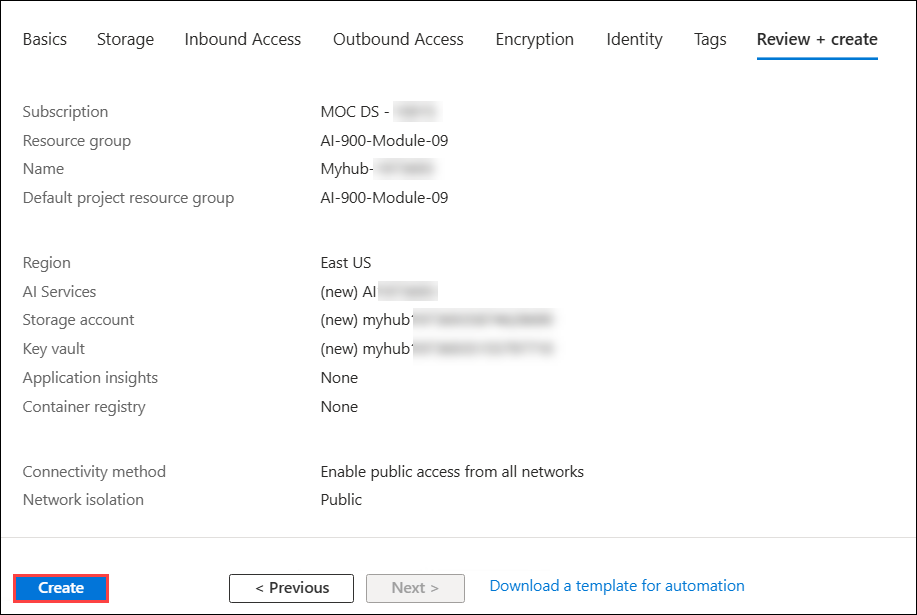 

1. Open the **Microsoft Foundry** portal by pasting `https://ai.azure.com?azure-portal=true` into a new browser tab.

   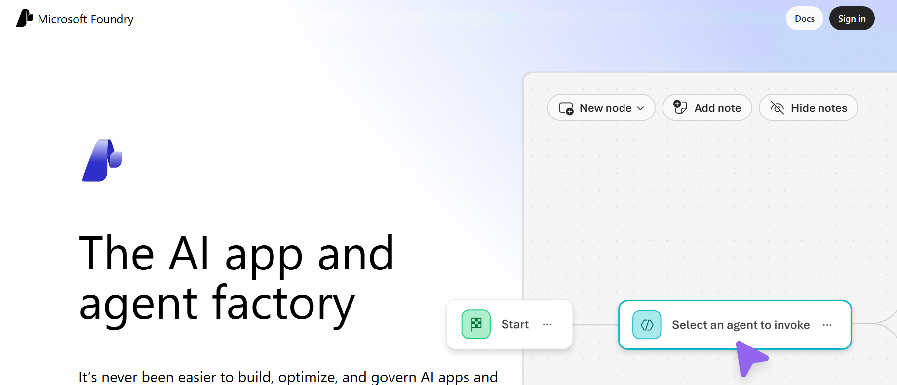

1. On the Welcome to Microsoft Foundry page, Click on **Sign in** in the top right corner.

   

1. If prompted to sign in, enter your credentials:
 
   - **Email/Username:** <inject key="AzureAdUserEmail"></inject> **(1)** and click on **Next (2)**
 
      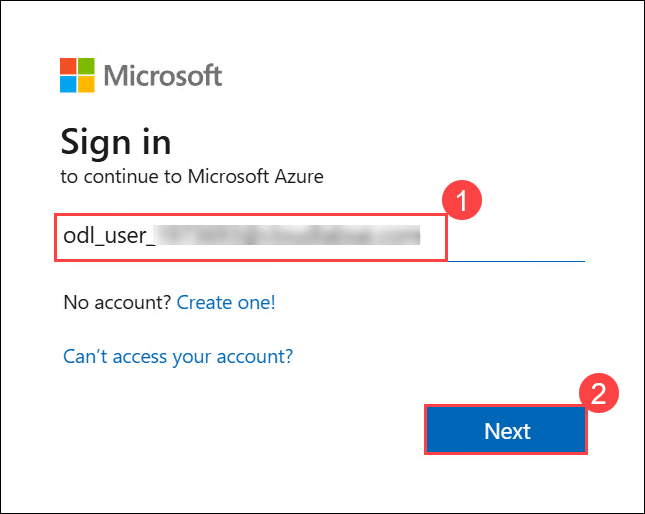
 
   - **Password:** <inject key="AzureAdUserPassword"></inject> **(1)** and click on **Next (2)**.
 
     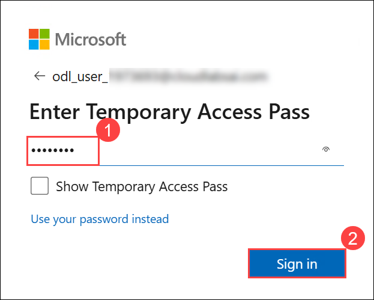

1. If prompted to **Stay signed in?**, you can click **No**.

   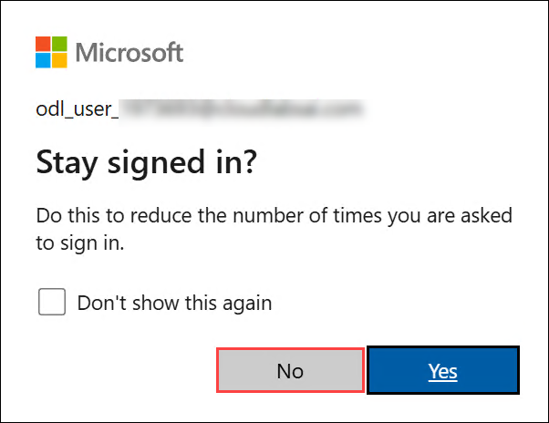

1. Close any tips or quick start panes that are opened the first time you sign in.

1. From the **Microsoft Foundry** home page, select **+ Create new**.

   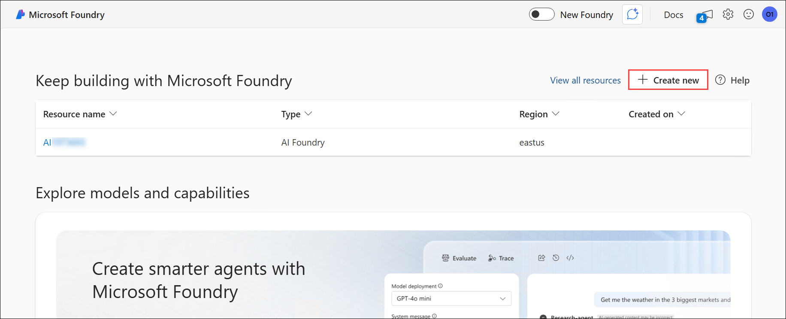

1. From the **Create project** dialog, select the option to create a **AI hub resource (1)** then click **Next (2)**.

   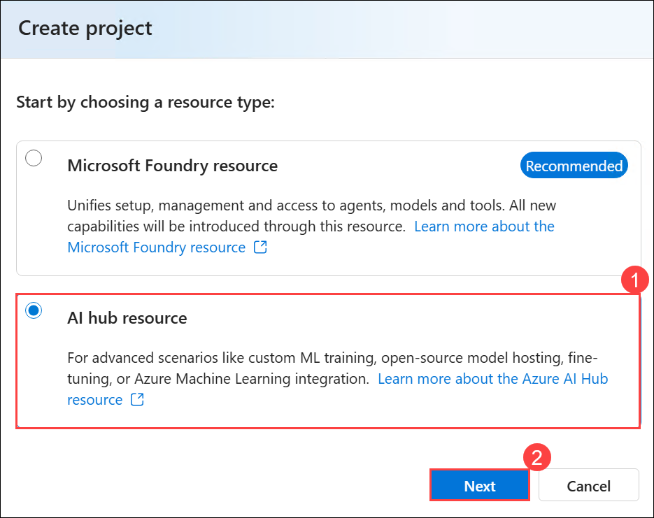

1. In the **Create a new project** wizard, enter project name **Myproject<inject key="DeploymentID" enableCopy="false" /> (1)**, and select newly created **Myhub<inject key="DeploymentID" enableCopy="false" /> (2)** and then click on **Create (3)**.

    

1. Wait for your project to get created.

1. When the project is created, you will be taken to an **Overview** page of the project details.

   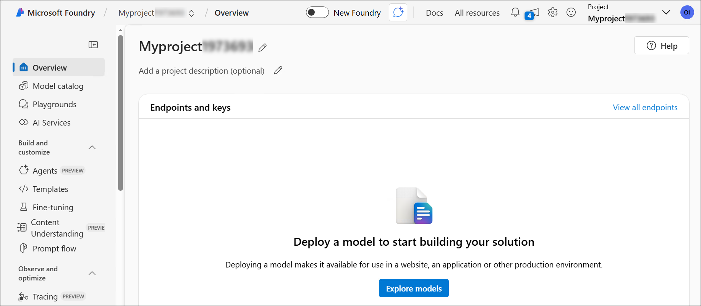

1. From the left-hand menu on the screen, select **Playgrounds (1)**. On the **Playgrounds** page, scroll down and in the **Speech playground** tile click on **Try the Speech playground (2)** to try out some Azure AI Speech capabilities.

   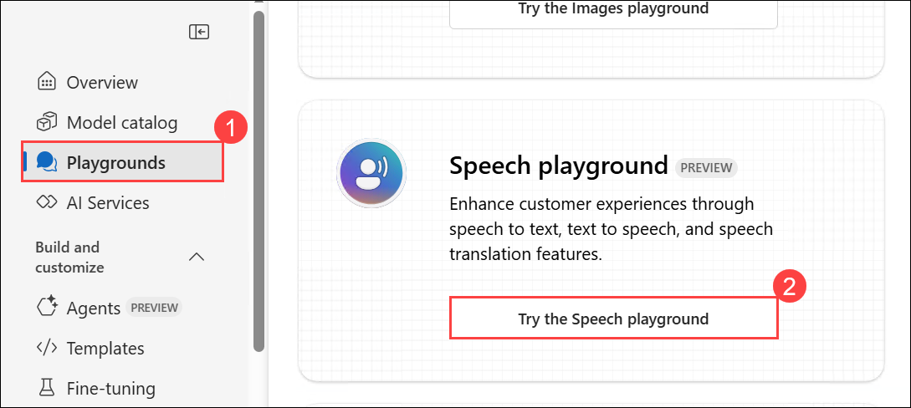
   
> **Congratulations** on completing the task! Now, it's time to validate it. Here are the steps:
 
- Hit the Validate button for the corresponding task. If you receive a success message, you can proceed to the next task. 
- If not, carefully read the error message and retry the step, following the instructions in the lab guide.
- If you need any assistance, please contact us at cloudlabs-support@spektrasystems.com. We are available 24/7 to help you out.

   <validation step="a78cde3c-b21b-4ea4-9230-2d5a5d655239" />

### Task 2: Explore speech to text in Microsoft Foundry's Speech Playground

In this task, we are using Azure AI Speech to transcribe audio into text in real time using the Speech Playground.

Let's try out *real-time speech-to-text* in Microsoft Foundry's Speech Playground. 

1. From the left navigation menu, select **AI Services (1)**, then scroll down to the **Infuse your solutions with AI capabilities** and select the **Speech (2)** tile to try out Azure AI Speech capabilities.

   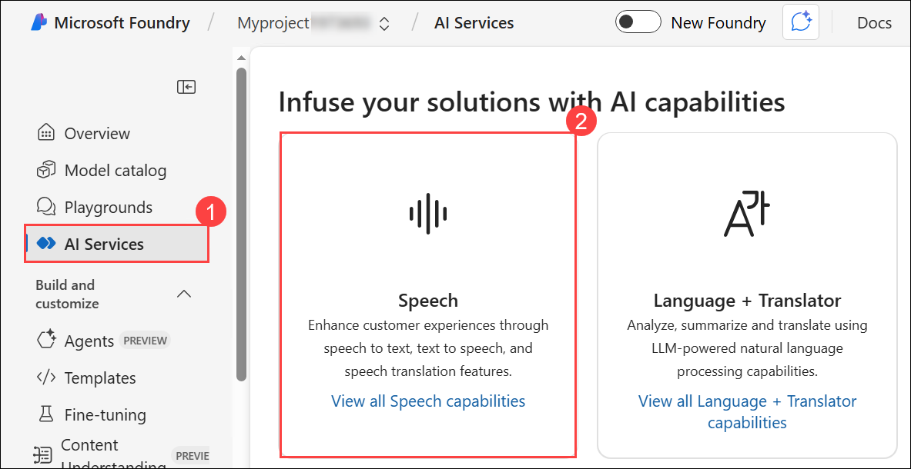

1. On the **Speech Playground** page, scroll down and select **Real-time transcription**.

   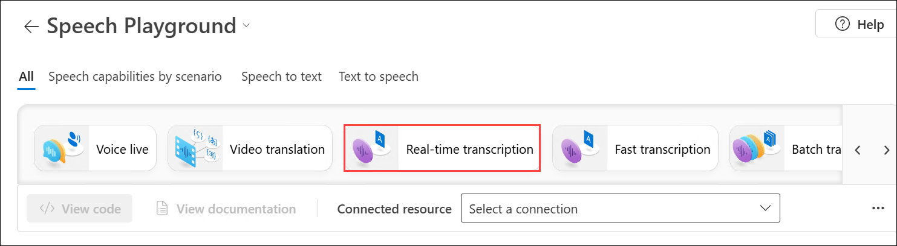

1. Copy the highlighted link by right-clicking the [**https://aka.ms/mslearn-speech-files**](https://aka.ms/mslearn-speech-files) and selecting "Copy link" from the context menu, and paste it into a new tab to download **Speech.zip**. 

1. Click the **download icon (1)** to view your downloads, then click the **folder icon (2)** to open the file location.

   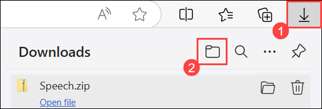

1. **Right-click** the **ZIP file (1)**  and select **Extract All (2)** to **unzip** its contents. 

   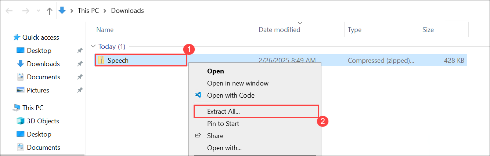

1. Select the destination folder, ensure Show extracted files when complete is checked, and click **Extract** to unzip the files. 

   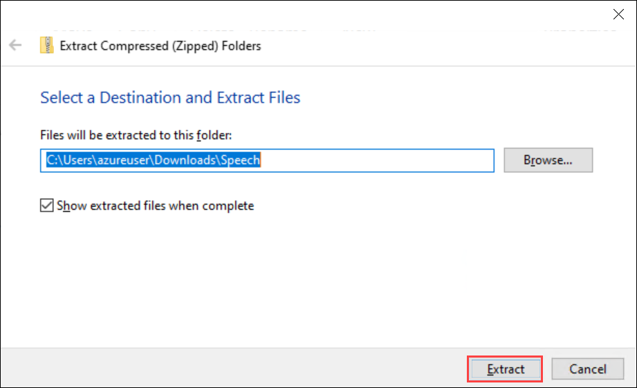

1. The Speech folder contains **m4a** file named **WhatAICanDo**. 

   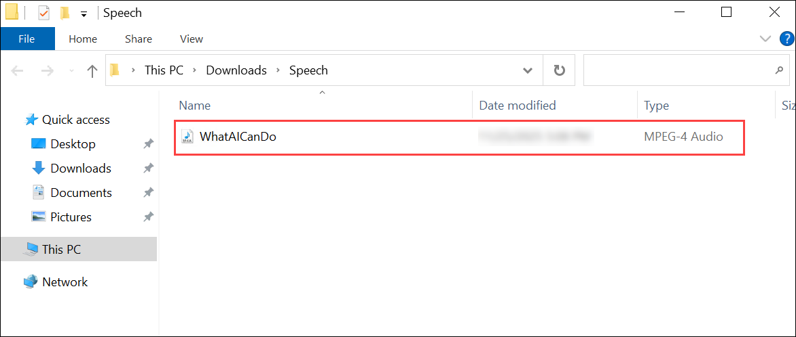

1. Under Real-time transcription section, click on the **Connected resources** drop-down **(1)** and select **Manage AI Services resources (2)**.

   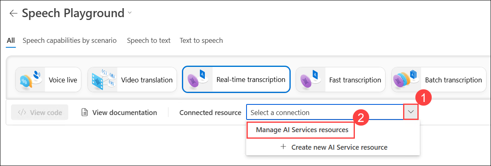

1. On the Manage AI Services Resources page, select **AI<inject key="Deployment ID" enableCopy="false"></inject> (1)** resource and then click on **Connect (2)**.

   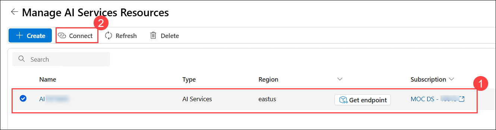

1. On the **Connect an Azure AI services resource** window, from the drop-down select your project **Myproject<inject key="Deployment ID" enableCopy="false"></inject> (1)** and for **Authentication** select **API key (2)** and then click on **Connect (3)**.

   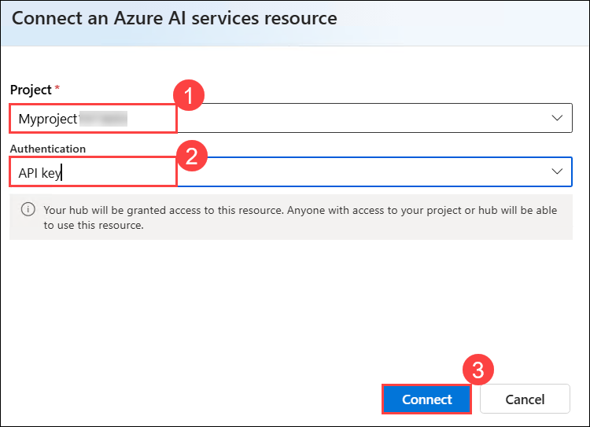

1. Now from the left navigation menu, select **AI Services (1)**, then scroll down to the **Infuse your solutions with AI capabilities** and select the **Speech (2)** tile.

   

1. On the **Speech Playground** page, scroll down and select **Real-time transcription**.

   

1. Now you can see the name of the resource **AI<inject key="Deployment ID" enableCopy="false"></inject>** in the **Connected resource** section. Click **browse files (1)** to upload the **WhatAICanDo.m4a** file, navigate to **`C:\Users\azureuser\Downloads\Speech` (2)**, select **WhatAICanDo.m4a (3)** file, and click **Open (4)** to begin transcription.

   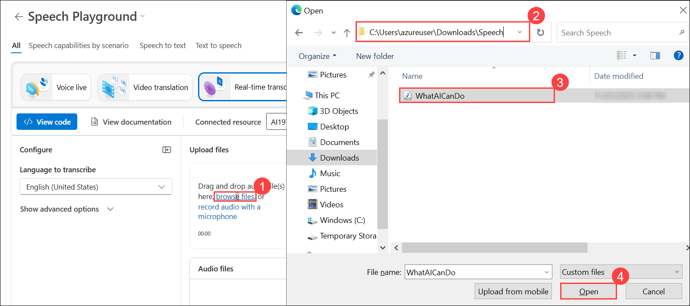

1. The Speech service transcribes and displays the text in real time. If you have audio on your computer, you can listen to the recording as the text is being transcribed.

1. The output successfully transcribes the audio, capturing how AI enhances various aspects of life, including healthcare, accessibility, infrastructure, entertainment, and environmental sustainability.

   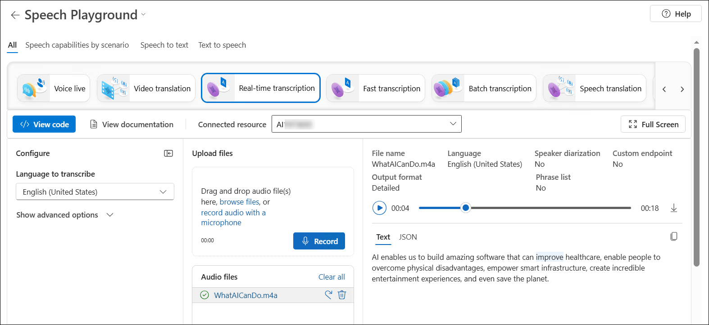

### Review

In this exercise, you have completed the following tasks:

- Explored Azure AI Speech services in the Speech Playground
- Transcribed audio to text using the Real-time speech-to-text service

## Learn more

This exercise demonstrated only some of the capabilities of the Speech service. To learn more about what you can do with this service, see the [Speech page](https://azure.microsoft.com/services/cognitive-services/speech-services).

## You have successfully completed this lab
