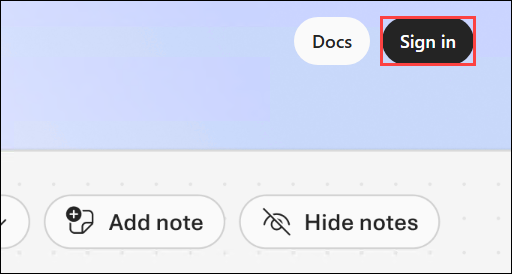
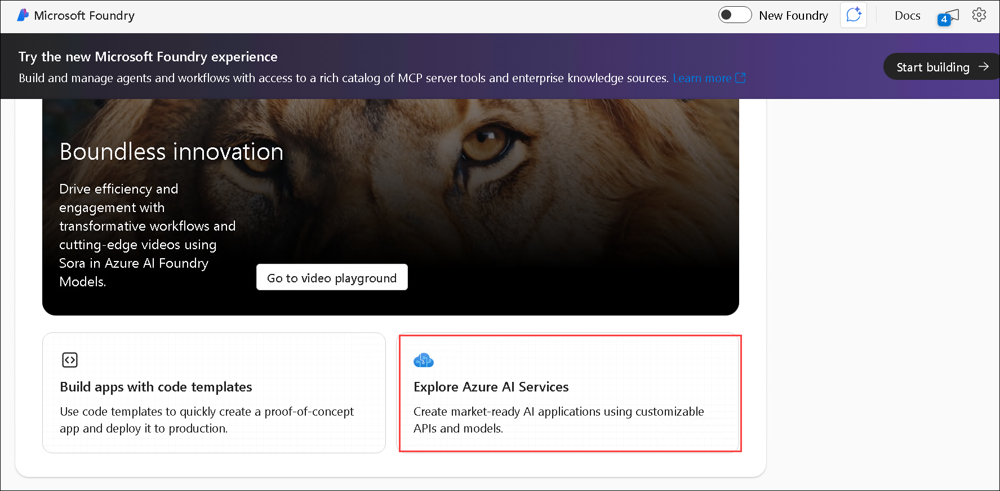
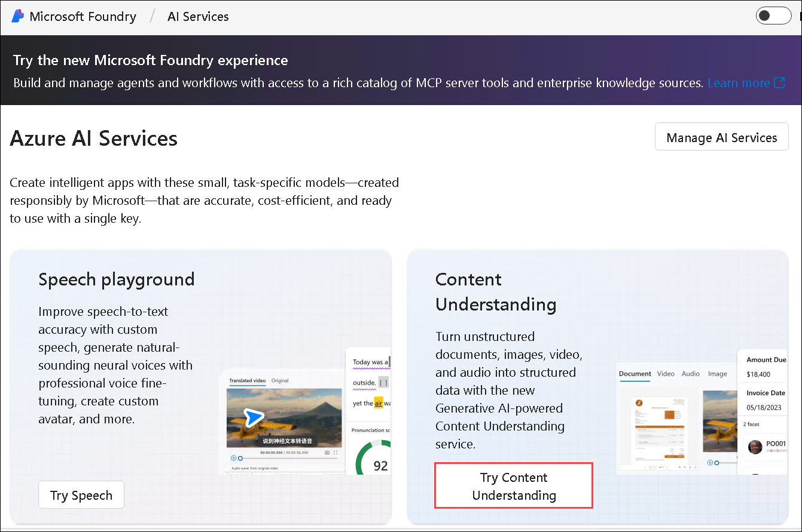
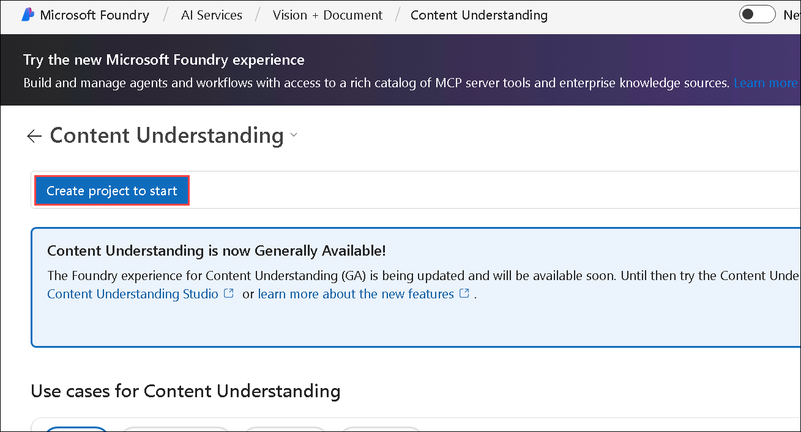
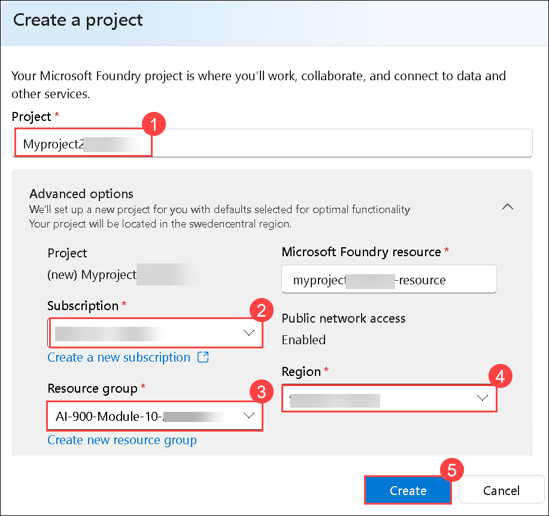
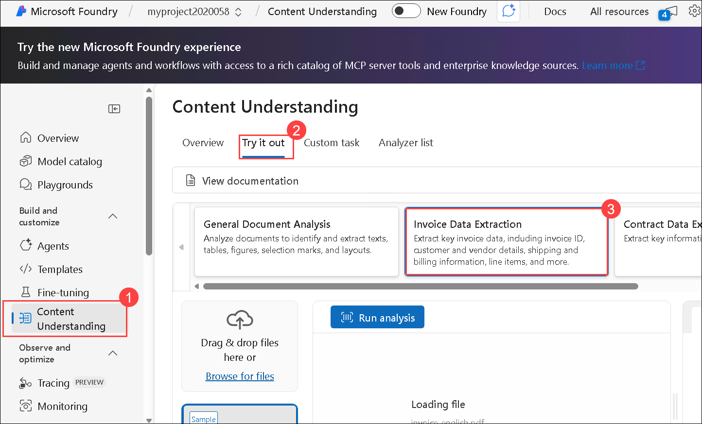
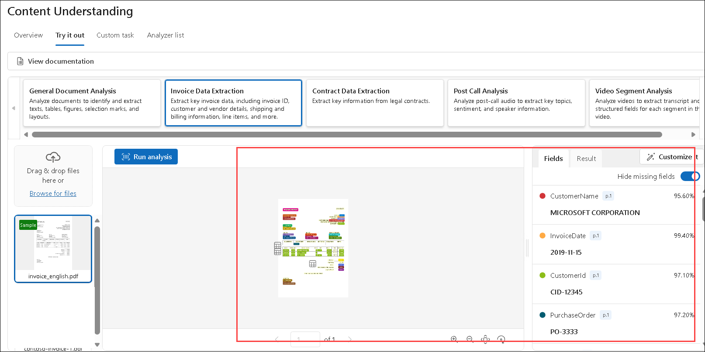
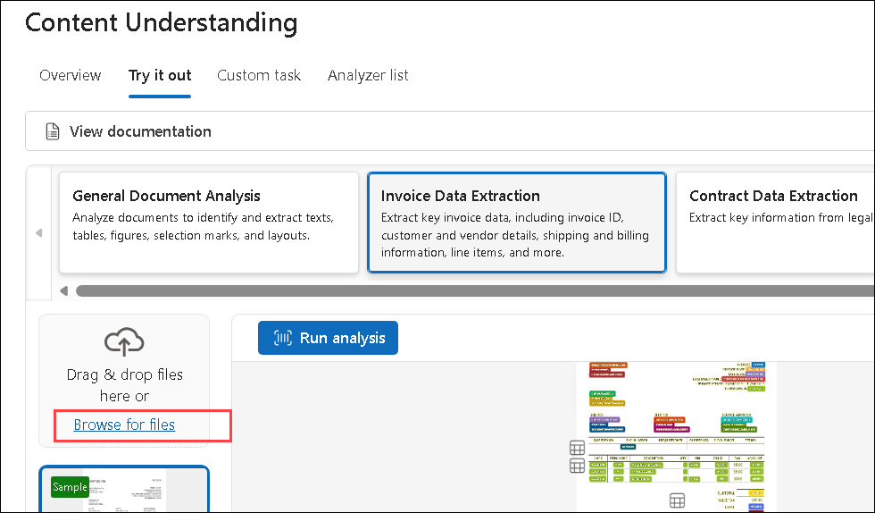
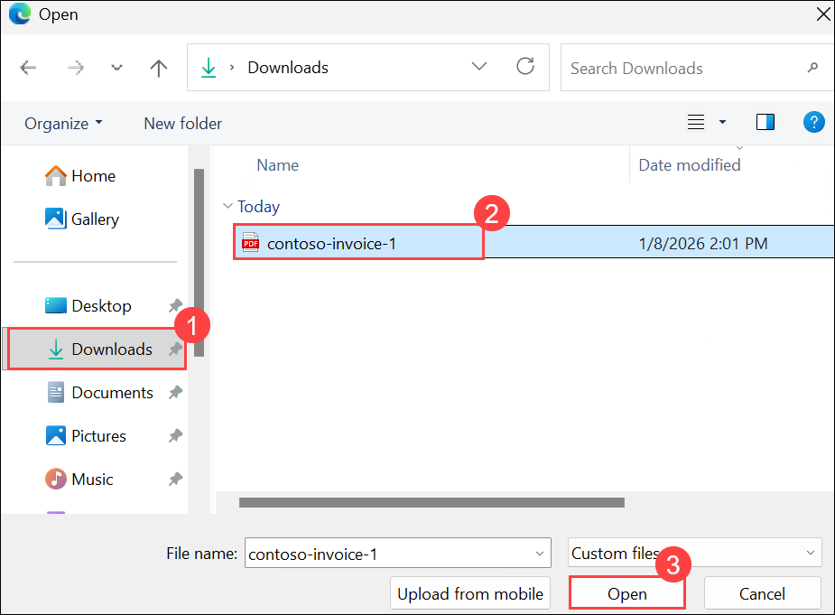
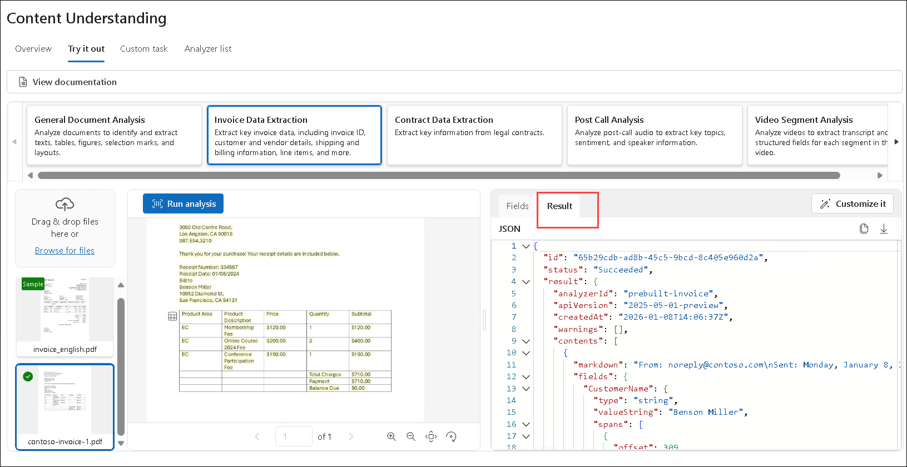

# Extract data with Content Understanding in Microsoft Foundry

## Lab Overview

**Azure Content Understanding** provides multi-modal analysis of documents, audio files, video, and images to extract information.

In this lab, you will use Azure Content Understanding in Foundry, Microsoft's platform for creating intelligent applications, to extract information from invoices.

## Lab Objectives

In this lab, you will perform:
- Task 1: Create a Microsoft Foundry project for content understanding
- Task 2: Extract information from an invoice

## Task 1: Create a Microsoft Foundry project for content understanding

In this task, you will create a Microsoft Foundry project for Content Understanding using the Microsoft Foundry portal.

1. Right click on the following link [Microsoft Foundry](https://ai.azure.com) then select **Copy link** and then paste it on the web browser to navigate to **Microsoft Foundry**.

1. Click on **Sign in**.

    

1. If prompted, sign in using your Azure credentials.

    - **Email/Username:** <inject key="AzureAdUserEmail"></inject>

    - **Password:** <inject key="AzureAdUserPassword"></inject>

1. Scroll to the bottom of the page, and select the **Explore Azure AI Services** tile. 

    

1. On the Azure AI Services page, select **Try Content Understanding**.

    

1. In the Content Understanding page, select **Create a project to start**.

    

1. Then in the **Create project** dialog, select the **Microsoft Foundry resource (1)** and then **Next (2)**.

    

1. On the **Create a project** page, enter the project name as **Myproject<inject key="DeploymentID" enableCopy="false" /> (1)** then expand **Advanced options**:

    - Subscription: **Leave default subscription (2)** 
    - Resource Group : Select **AI-900-Module-10-<inject key="Deployment ID" enableCopy="false"></inject> (3)** 
    - Region : **<inject key="location" enableCopy="false"></inject>** **(4)**
    - Select **Create (5)**

      

1. Wait for the set up process to complete. It may take a few minutes.

> **Congratulations** on completing the task! Now, it's time to validate it. Here are the steps:
 
- Hit the Validate button for the corresponding task. If you receive a success message, you can proceed to the next task. 
- If not, carefully read the error message and retry the step, following the instructions in the lab guide.
- If you need any assistance, please contact us at cloudlabs-support@spektrasystems.com. We are available 24/7 to help you out.

   <validation step="348e3976-3f47-4302-b53a-c2bd7195d99b" />
---

## Task 2: Extract information from an invoice

In this task, you will use Azure AI Content Understanding to extract structured information from an invoice document.

1. Right click on the following link [contoso-invoice-1.pdf](https://raw.githubusercontent.com/MicrosoftLearning/mslearn-ai-fundamentals/refs/heads/main/data/contoso-invoice-1.pdf) then select **Copy link** and then paste it on the browser to download the **contoso-invoice-1.pdf**. 

    

1. On the **Content Understanding (1)** page, select the **Try it out (2)** tab, and then select the **Invoice Data Extraction (3)** tile.

    

1. A sample invoice is provided, select the **sample invoice (1)** and use the **Run analysis (2)** button to extract information from it. 

    

1. When analysis is complete, view the results.

    

1. Use the **Browse for files** link to upload the **contoso-invoice-1.pdf** document you downloaded previously.

    

1. Navigate to **Downloads (1)**, select **contoso-invoice-1.pdf (2)** and then **Open (3)**.    

    

1. select **contoso-invoice (1)** and **Run analysis (2)** on that file.

    

1. Note that the Content Understanding analyzer is able to extract information from this invoice, even though it is formatted diffferently from the sample.

    

1. In the pane pn the right where the extracted fields are displayed, view the **Result** tab to see the JSON response that would be sent to a client application. A developer would write code to process this response and do something with the extracted fields.

    

### Review

In this lab, you have completed the following tasks:

- Created a Microsoft Foundry project for content understanding
- Extracted information from an invoice

## You have successfully completed this lab.