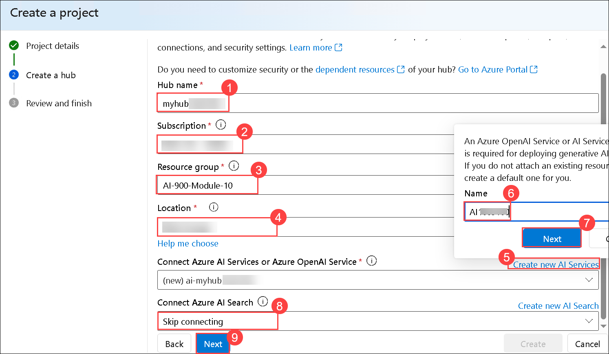
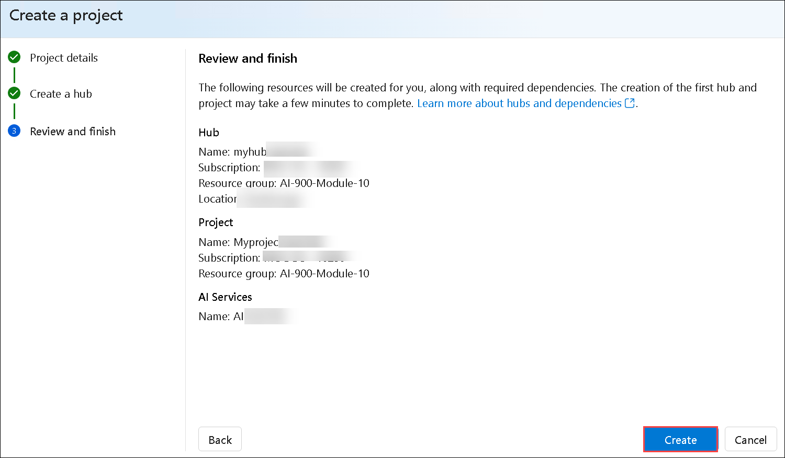
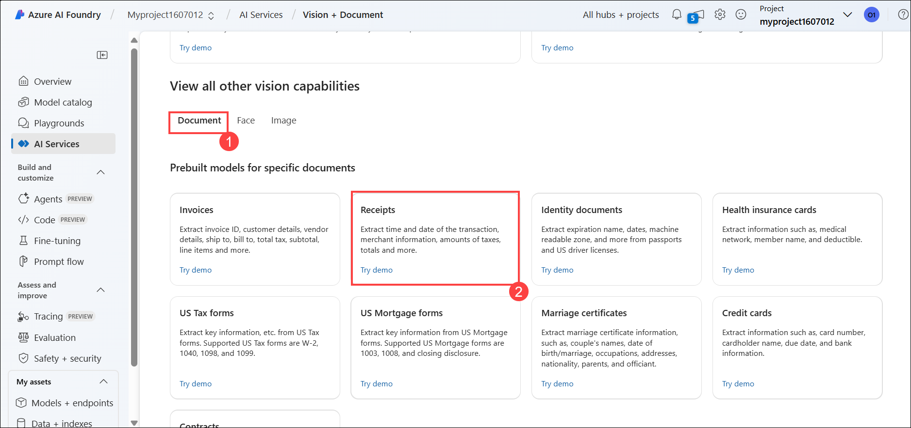
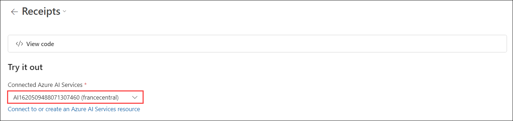

<<<<<<< HEAD
---
lab:
    title: 'Extract data from documents in Azure AI Foundry portal​'
---

# Extract data from documents in Azure AI Foundry portal

**Azure AI Document Intelligence** service enables you to analyze and extract information from forms and documents, then identify field names and data. 

How does Document Intelligence build upon optical character recognition (OCR)? While OCR can read printed or handwritten documents, OCR extracts text in an unstructured format which is difficult to store in a database or analyze. Document intelligence makes sense of the unstructured data by capturing the structure of the text, such as data fields and information in tables. 

In this exercise, you will use Azure AI Document Intelligence's prebuilt models in Azure AI Foundry portal, Microsoft's platform for creating intelligent applications, to recognize data from a receipt. 

## Create a project in Azure AI Foundry portal

1. In a web browser, open the [Azure AI Foundry portal](https://ai.azure.com) at `https://ai.azure.com` and sign in using your Azure credentials. Close any tips or quick start panes that are opened the first time you sign in. 

1. In the browser, navigate to `https://ai.azure.com/managementCenter/allResources` and select **Create**. Then choose the option to create a *new AI hub resource*.

1. In the *Create a project* wizard, enter a valid name for your project, and if an existing hub is suggested, select the option to create a *new* one. 

1. Expand *Advanced options* to specify the following settings for your project:
    - **Subscription**: Your Azure subscription
    - **Resource group**: Create or select a resource group
    - **Region**: Select one of the following locations:
        * East US
        * France Central
        * Korea Central
        * West Europe
        * West US

    Wait for your project and hub to be created.

1. When the project is created, you will be taken to an *Overview* page of the project details. Select **AI services** on the left-hand menu. 

1. On the *AI Services* page, select the *Vision + Document* tile to try out Azure AI Vision and Document capabilities.

    

## Analyze a receipt with Azure AI Document Intelligence in Azure AI Foundry 

You are now ready to analyze a receipt for the fictitious Northwind Traders retail company.

1. On the *Vision + Document* page, scroll down and select **Document**. Under *Prebuilt models for specific documents*, select the **Receipts** tile.

1. In the drop-down list under *Try it out*, note that your Azure AI services resource is selected. Leave it as-is.

1. On your computer, use [**https://aka.ms/mslearn-receipt**](https://aka.ms/mslearn-receipt) to open a sample image of a receipt. Save it in your Downloads folder or to your Desktop. 
 
1. In Azure AI Foundry, on the *Receipts* page, select **Browse for files** and navigate to the folder where you saved the picture. Select the picture of the receipt and then **Open**. The image appears on the left side of the screen.

    

1. On the right, select **Run analysis**.

1. When the analysis has run, the results are returned. Notice that the service has recognized specific data fields such as the merchant’s name, the address, phone number, and the transaction date and time, as well as the line items, subtotal, tax, and total amounts. Next to each field is a percentage probability that the field is correct.

    

In this exercise you have used Azure AI Document Intelligence's prebuilt receipts model in Azure AI Foundry portal. From the results that were returned, you saw how Document Intelligence was able to identify specific fields, enabling data from everyday documents to be more easily processed. Before you close the demo, why not try some of the sample receipts, including those in different languages?
=======

# Module 10: Extract data from documents in Azure AI Foundry portal

## Lab overview

**Azure AI Document Intelligence** service enables you to analyze and extract information from forms and documents, and then identify field names and data. 

How does Document Intelligence build upon optical character recognition (OCR)? While OCR can read printed or handwritten documents, OCR extracts text in an unstructured format which is difficult to store in a database or analyze. Document intelligence makes sense of the unstructured data by capturing the structure of the text, such as data fields and information in tables. 

In this exercise, you will use Azure AI Document Intelligence's prebuilt models in Azure AI Foundry portal, Microsoft's platform for creating intelligent applications, to recognize data from a receipt. 

## Lab Objectives

In this lab, you will perform:
- Task 1: Create a project in Azure AI Foundry portal
- Task 2: Analyze a receipt with Azure AI Document Intelligence in Azure AI Foundry

## Task 1: Create a project in the Azure AI Foundry portal

In this task, we are creating an Azure AI Foundry project and setting up AI resources to explore Vision and Document capabilities.

1. Right-click on the [Azure AI Foundry](https://ai.azure.com?azure-portal=true) **(1)** link, select **Copy link (2)** from the context menu, then paste it into a new tab to access the Azure AI Foundry portal.

   

1. On the Welcome to Azure AI Foundry page, Click on **Sign in** in the top right corner.

   

1. If prompted to sign in, enter your credentials:
 
   - **Email/Username:** <inject key="AzureAdUserEmail"></inject>
 
      
 
   - **Password:** <inject key="AzureAdUserPassword"></inject>
 
     
     
1. If prompted to stay signed in, you can click **No**.

   

1. If prompted with *Streamlined from the start*, click on **Got it** to proceed.

   
   
1. On the Azure AI Foundry portal home page, select **Create a project**. In Azure AI Foundry, projects are containers that help organize your work.  

    

1. On the **Create a project** pane, enter project name **Myproject<inject key="DeploymentID" enableCopy="false" /> (1)** and then select **Customize (2)**.

    

1. On the **Create a project** pane, Configure it with the following settings:

    - **Hub name**: Enter **myhub<inject key="DeploymentID" enableCopy="false" /> (1)**
    - **Subscription**: **Use existing Azure subscription (2)**
    - **Resource group**: Select **AI-900-Module-10 (3)**
    - **Location**: Select **<inject key="location" enableCopy="false"/> (4)**
    - **Connect Azure AI Services or Azure OpenAI Service**:
    Click on **Create new AI Services (5)** and provide name **AI<inject key="DeploymentID" enableCopy="false" /> (6)** and click on **Next (7)**
    - **Connect Azure AI Search**: Leave as default **(8)**
    - Click on **Next (9)**

        

        > **Important**: You will need an Azure AI services resource provisioned in a specific location to complete the rest of the lab.

1. On the **Review and Finish** page, click on **Create**.

    

1. Keep track of the following created resources: 
    
    - **Azure AI Project**
    - **Azure AI Hub**  
    - **Azure AI Services**    
    - **Storage Account**  
    - **Key Vault**

      

      >**Note:** Once the deployment will succeed, close the *Project help* pane that will appear on right side.

1. If prompted with *Explore and experiment*, click on **Close** to dismiss it.

    

> **Congratulations** on completing the task! Now, it's time to validate it. Here are the steps:
 
- Hit the Validate button for the corresponding task. If you receive a success message, you can proceed to the next task. 
- If not, carefully read the error message and retry the step, following the instructions in the lab guide.
- If you need any assistance, please contact us at cloudlabs-support@spektrasystems.com. We are available 24/7 to help you out.

   <validation step="348e3976-3f47-4302-b53a-c2bd7195d99b" />

## Task 2: Analyze a receipt with Azure AI Document Intelligence in Azure AI Foundry 

In this task, we are using Azure AI Foundry to analyze a receipt image with prebuilt AI models, extracting key details like merchant information, transaction date, and total amount.

You are now ready to analyze a receipt for the fictitious Northwind Traders retail company.

1. In the **Overview (1)** page of your project, on the left-hand menu on the screen, select **AI Services (2)**.
 
      

    >**Note**: If a pop-up appears, please click **Close**.

1. On the **AI Services** page, select the **Vision + Document** tile to try out Azure AI Vision and Document capabilities.

    
>>>>>>> 20a06afb6504d7ebfb91f217980cf0897bf34e2e

1. On the *Vision + Document* page, scroll down and select **Document (1)**. Under *Prebuilt models for specific documents*, select the **Receipts (2)** tile.

    

1. In the drop-down list under *Try it out*, note that your Azure AI services resource is selected. Leave it as-is.

   

1. Open a new tab and go to [**https://aka.ms/mslearn-receipt**](https://aka.ms/mslearn-receipt) to view a sample image of a receipt.

1. Right-click on the image and choose **"Save image as"** to save it in your Downloads folder or to your Desktop.

   

1. Click on **Save**.

   
 
1. Go back to the Azure AI Foundry portal and upload the **receipt.jpg** image by clicking **Browse files (1)**. Then, navigate to the **C:\Users\azureuser\Downloads (2)** folder, select **receipt (3)**, and click **Open (4)**.

   

1. Click **Run analysis** to process the document.

   

1. When the analysis has run, the results are returned. Notice that the service has recognized specific data fields such as the merchant’s name, address, phone number, and transaction date and time, as well as the line items, subtotal, tax, and total amounts. Next to each field is a percentage probability that the field is correct.

    

### Review

In this Module, you have used Azure AI Document Intelligence's prebuilt receipts model in Azure AI Foundry portal. From the results that were returned, you saw how Document Intelligence was able to identify specific fields, enabling data from everyday documents to be more easily processed. Before you close the demo, why not try some of the sample receipts, including those in different languages?

In this Module, you have completed the following tasks:
- Created a project in the Azure AI Foundry portal
- Analyzed a receipt with Azure AI Document Intelligence in Azure AI Foundry 

## Learn more

This lab demonstrated only some of the capabilities of the AI Document Intelligence service. To learn more about what you can do with this service, see the [Document Intelligence](https://learn.microsoft.com/azure/ai-services/document-intelligence/overview?view=doc-intel-3.1.0) page.

## You have successfully completed this lab.
