# Lab 11: Explore an Azure AI Search index (UI)

## Lab overview

Let's imagine you work for Fourth Coffee, a national coffee chain. You're asked to help build a knowledge-mining solution that makes it easy to search for insights about customer experiences. You decide to build an Azure AI Search index using data extracted from customer reviews.  

In this lab, you will:

- Task 1: Create an Azure AI Search resource
- Task 2: Create an AI Services resource
- Task 3: Create a storage account
- Task 4: Upload Documents to Azure Storage
- Task 5: Index the documents
- Task 6: Query the index
- Task 7: Review the knowledge store

### Task 1: Create an Azure AI Search resource

In this task, you will learn how to create an **Azure AI Search** resource to enable powerful search capabilities and AI-driven content exploration for your applications.

1. On the **Azure Portal** homepage, select **+ Create a resource**.

     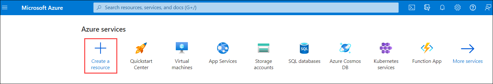

1. In the Marketplace page search for **Azure AI Search (1)** and select **Azure AI Search (2)**.
 
    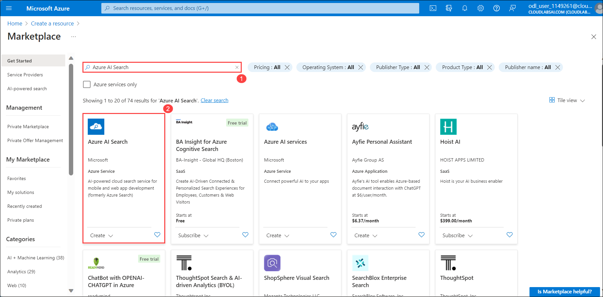

1. On  the **Azure AI Search** page, click on **Create**.

    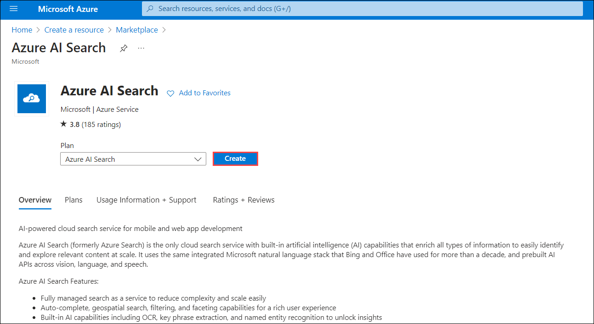

1. Create a new **AI Search** resource with an AI Search plan. Use the following settings:

    - **Subscription (1)**: Select your **existing azure subscription**.
    - **Resource group (2)**: Select **AI-900-Module-11-<inject key="DeploymentID" enableCopy="false" />**
    - **Service name (3)**: **aisearch<inject key="DeploymentID" enableCopy="false" />**
    - **Location (4)**: Select **<inject key="location" enableCopy="false"/>** 
    - **Pricing tier (5)**: Basic
    - Select **Review + create (6)**

      
    
1. You see the response **Validation Success**, select **Create**.

   

1. After deployment completes, select **Go to resource**.

   

1. On the Azure AI Search overview page, you can add indexes, import data, and search created indexes.

### Task 2: Create an AI Services resource

In this task, you will learn how to create an **AI Services** resource in Azure to access a wide range of AI capabilities, such as vision, speech, language, and decision-making, for your applications.

You'll need to provision an **Azure AI services** resource that's in the same location as your Azure AI Search resource. Your search solution will use this resource to enrich the data in the datastore with AI-generated insights.

1. In the Azure portal, search for **Azure AI services (1)**. Select an **Microsoft Foundry (2)**.

    

1. In the **Microsoft Foundry**, Expand the **Classic AI services (1)** section from the left-hand menu and select **Azure AI services multi-service account (classic) (2)** to view classic AI resources.

    
 
1. Once you're in the **Azure AI services multi-service account (classic)** page, click on the **+ Create** button in the top menu bar to start provisioning a new AI service.

    

1. You will be taken to a page to create an Azure AI services resource. Please click on **Create** configure it with the following settings:
   
    - **Subscription (1)**: Use the existing Azure subscription.
    - **Resource group (2)**: **AI-900-Module-11-<inject key="DeploymentID" enableCopy="false" />**
    - **Region (3)**: Select **<inject key="location" enableCopy="false"/>**
    - **Name (4)**: Enter **aiservice<inject key="DeploymentID" enableCopy="false"/>**
    - **Pricing tier (5)**:Select **Standard S0**.
    - **By checking this box I acknowledge that I have read and understood all the terms below**: *Selected* **(6)**.

      

1. Select **Review + create (7)** then **Create** and wait for deployment to complete.

### Task 3: Create a storage account

In this task, you will create a Storage account in Azure, configure its settings, and enable Blob anonymous access. This will allow you to store and manage data securely within your Azure environment.

1. Return to the home page of the Azure portal. Select **+ Create a resource**.

    

1. In the Marketplace page search for **Storage account (1)** and select **Storage account (2)**.
 
    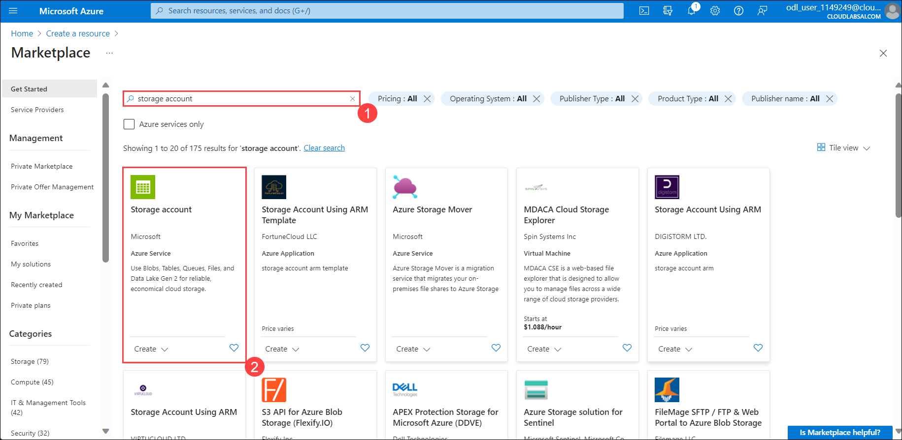

1. On the **Storage account** Page, Click on **Create**.

    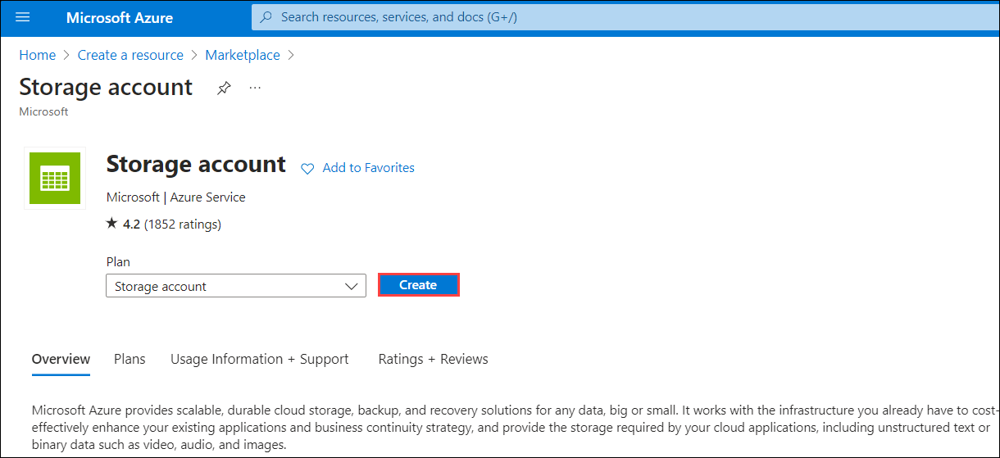
    
1. Create a **Storage account** resource with the following settings:

    - **Subscription (1)**: Select your **existing azure subscription**.
    - **Resource group (2)**: Select **AI-900-Module-11-<inject key="DeploymentID" enableCopy="false" />**
    - **Storage account name (3)**: Enter **aistorage<inject key="DeploymentID" enableCopy="false" />**
    - **Location (4)**: Select **<inject key="location" enableCopy="false"/>** 
    - **Performance (5)**: Standard
    - **Redundancy (6)**: Locally redundant storage (LRS)
   - Click **Review + create (7)**.

      
   
1. On the **Review + create** page, Click **Create**. 

    

1. Wait for deployment to complete, and then go to the deployed resource.

    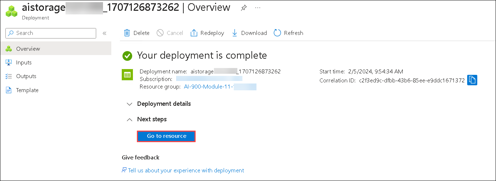

1. In the Azure Storage account you created, in the left-hand menu pane, select **Configuration (1)** (under **Settings**), Change the setting for **Allow Blob anonymous access** to **Enabled (2)**, and then select **Save (3)**.

    .png)

## Task 4: Upload Documents to Azure Storage

In this task, you will upload documents to an Azure Storage container. First, you will create a container called coffee-reviews, configure its access settings, and then upload a set of coffee-review documents into it. This process helps familiarize you with Azure Storage containers and blob uploads, which are crucial for storing and managing data in the cloud.

1. In the left-hand menu pane, select **Containers (1)** (under **Data storage**).

1. Select **+ Container (2)**. A pane on your right-hand side opens.

1. Enter the following settings:

    - **Name (3)**: coffee-reviews  
    - **Anonymous access level (4)**: Container (anonymous read access for containers and blobs)
    - **Advanced (5)**: *no changes*.
    - click **Create (6)**

      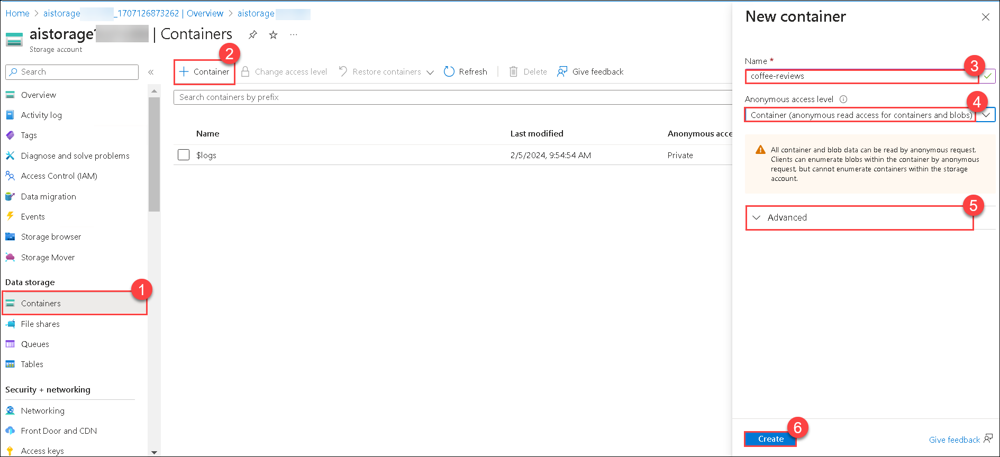

   > **Note**: If you're unable to adjust the Anonymous access level, please refresh the page and attempt the change again.

1. In the lab-VM,  open a  new browser tab, download the [zipped coffee reviews](https://aka.ms/mslearn-coffee-reviews) from `https://aka.ms/mslearn-coffee-reviews`, and extract the files to the *reviews* folder. 

1. In the Azure portal, select your *coffee-reviews* container. In the container, select **Upload (1)**. In the **Upload blob** pane, select **Browse for files (2)**, and In the Explorer window, select **all** the files in the *reviews* folder, select **Open**, and then select **Upload (3)**.

    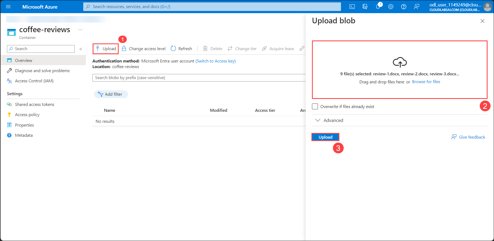

1. After the upload is complete, you can close the **Upload blob** pane. Your documents are now in your *coffee-reviews* storage container.

## Task 5: Index the documents

In this task, you will learn how to index the documents in your **AI Search** resource to make them searchable and enable efficient querying and retrieval of relevant content.

After you have the documents in storage, you can use Azure AI Search to extract insights from the documents. The Azure portal provides an *Import data wizard*. With this wizard, you can automatically create an index and indexer for supported data sources. You'll use the wizard to create an index and import your search documents from storage into the Azure AI Search index.

1. In the Azure portal, browse to your Azure AI Search resource and select the **aisearch<inject key="DeploymentID" enableCopy="false"/>**. 

   

2. On the **Overview** page, select **Import data**.

    

3. On the **Connect to your data** page, in the **Data Source** list, select **Azure Blob Storage (1)**. Complete the data store details with the following values:
    - **Data Source (2)**: Azure Blob Storage
    - **Data source name (3)**: coffee-customer-data
    - **Data to extract (4)**: Content and metadata
    - **Parsing mode**: Default
    - **Connection string (5)**: Select **Choose an existing connection**.
    
       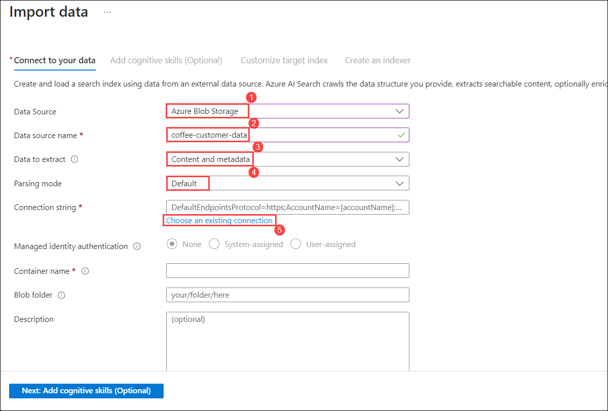
    
    - Select your the **aistorage<inject key="DeploymentID" enableCopy="false" /> (1)** storage account, select the **coffee-reviews (2)** container, and then click **Select (3)**.

      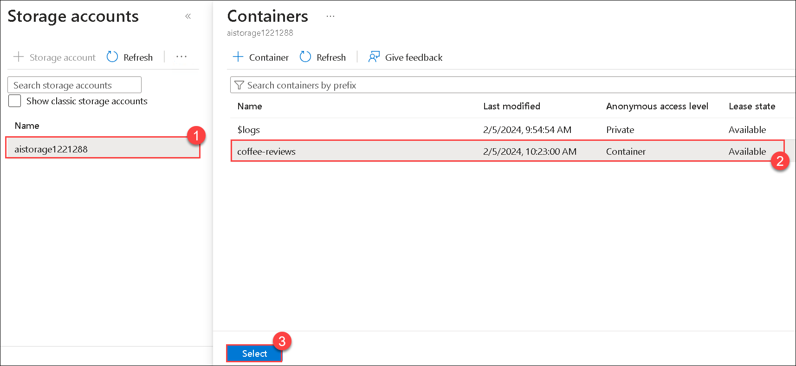

    - **Managed identity authentication (7)**: None
    - **Container name (8)**: *this setting is auto-populated after you choose an existing connection*.
    - **Blob folder (9)**: *Leave this blank*.
    - **Description (10)**: Reviews for Fourth Coffee shops.

4. Select **Next: Add Cognitive Skills (Optional) (11)**.

   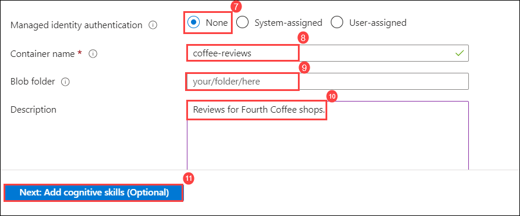

5. In the **Attach AI Services (1)** section, select your **aiservice<inject key="DeploymentID" enableCopy="false" /> (2)** Azure AI services resource.  

   

6. In the **Add enrichments (1)** section:
    - Change the **Skillset name** to **coffee-skillset (2)**.
    - Select the checkbox **Enable OCR and merge all text into merged_content field (3)**.
        > **Note**
        > It's important to select **Enable OCR** to see all of the enriched field options.
    - Ensure that the **Source data field** is set to **merged_content (4)**.
    - Change the **Enrichment granularity level** to **Pages (5000 character chunks) (5)**.
    - Don't select **Enable incremental enrichment (6)**

      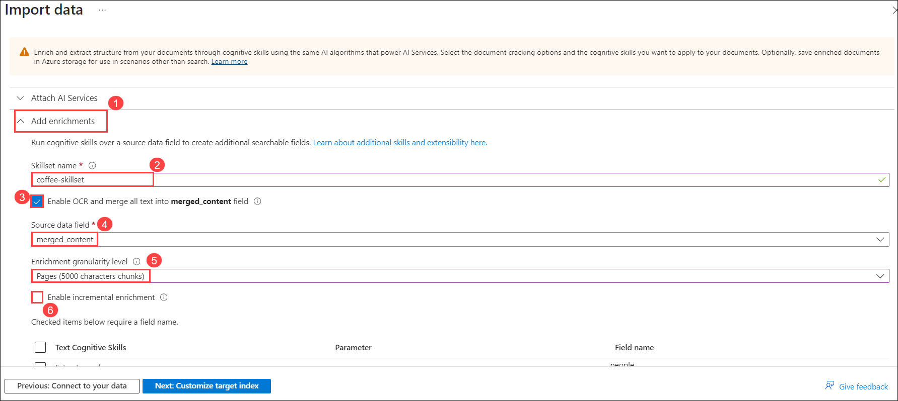
    
    - Select the following enriched fields:

        | AI Skill | Parameter | Field name |
        | --------------- | ---------- | ---------- |
        | Extract location names | | locations |
        | Extract key phrases | | keyphrases |
        | Detect sentiment | | sentiment |
        | Generate tags from images | | imageTags |
        | Generate captions from images | | imageCaption |

        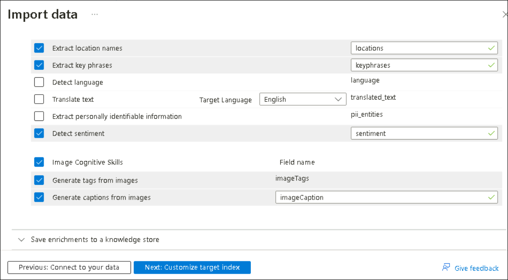

10. Under **Save enrichments to a knowledge store**, Select:
    - Image projections
    - Documents
    - Pages
    - Key phrases
    - Entities
    - Image details
    - Image references

    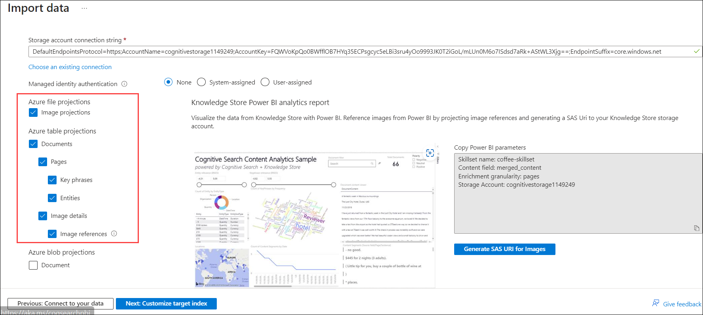

    > **Note**: A warning appears requesting a **Storage Account Connection String**.
    
7. Under **Save enrichments to a knowledge store (1)**, If a warning asking for a **Storage Account Connection String (2)** appears.
    
   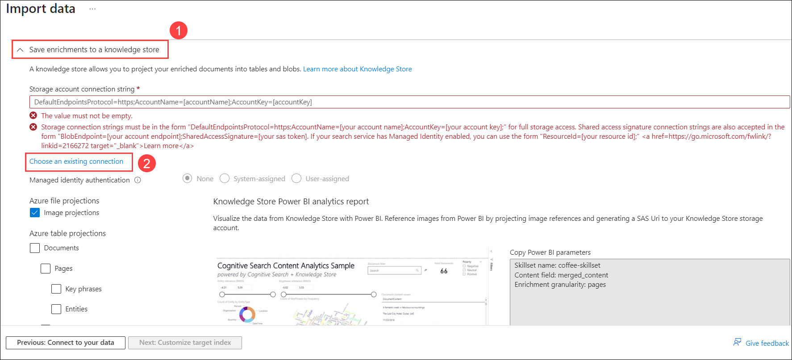
    
8. Select **Choose an existing connection**. Choose the storage account **aistorage<inject key="DeploymentID" enableCopy="false" /> (1)** you created earlier. Click on **+ Container (2)** to create a new container called **knowledge-store (3)** with the Anonymous access level set to **Private (4)**, and select **Create (5)**.

9. Select the **knowledge-store (1)** container, and then click **Select (2)** at the bottom of the screen.

    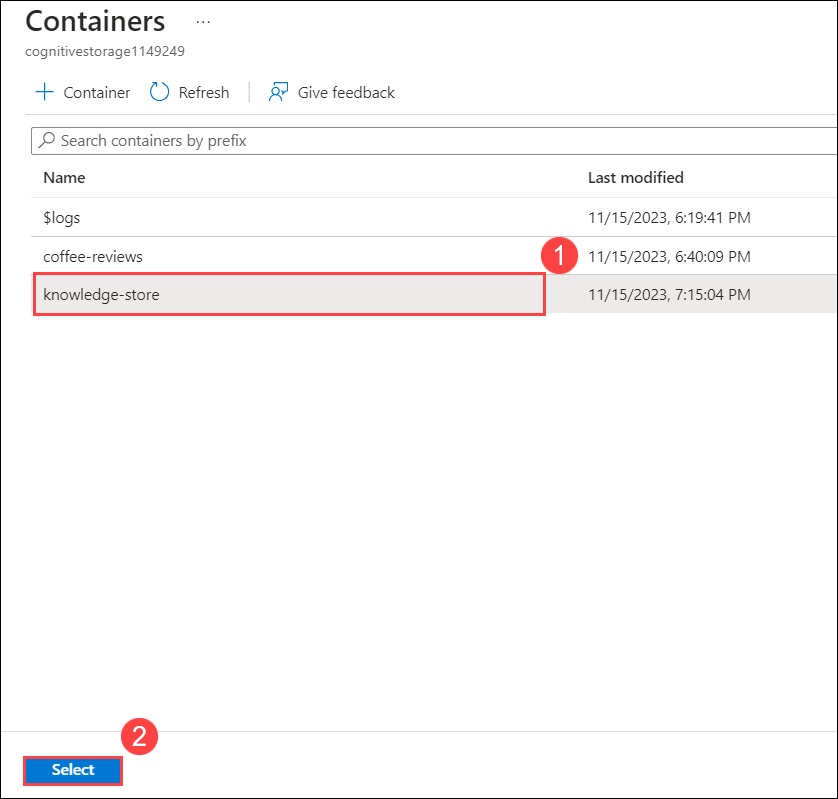

11. Select **Azure blob projections: Document**. A setting for *Container name* with the *knowledge-store* container auto-populated displays. Don't change the container name.

    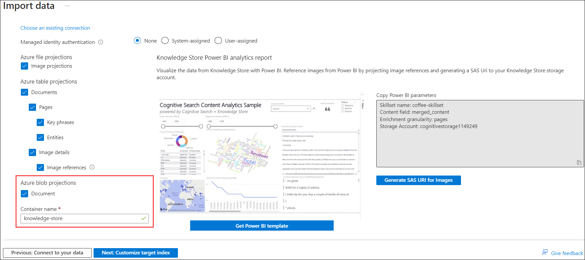

12. Select **Next: Customize target index**.

13. On the **Customize target index** page, follow the following steps:

    -  Change the **Index name** to **coffee-index (1)**.
    - Ensure that the **Key** is set to **metadata_storage_path (2)**.
    - Leave **Suggester name** blank.
    - **Search mode (3)** auto populated.
    - Review the index fields' default settings. Select **filterable (4)** for all the fields that are already selected by default.
    - Select **Next: Create an indexer (5)**.

    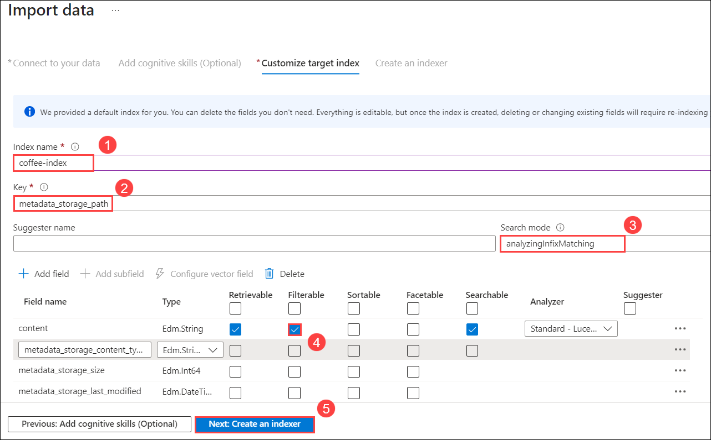
  
15. On the **Create an index** page, follow the following steps:

- Change the **Indexer name** to **coffee-indexer (1)**.
- Leave the **Schedule** set to **Once (2)**.
- Select **Submit (3)** to create the data source, skillset, index, and indexer. The indexer is run automatically and runs the indexing pipeline, which:
    - Extracts the document metadata fields and content from the data source.
    - Runs the skillset of AI skills to generate more enriched fields.
    - Maps the extracted fields to the index.

      

16.  Return to your Azure AI Search resource page. On the left pane, under **Search Management**, select  **Indexers (1)**. Select the newly created **coffee-indexer (2)**. Wait a minute, and select **&orarr; Refresh** until the **Status** indicates success.

     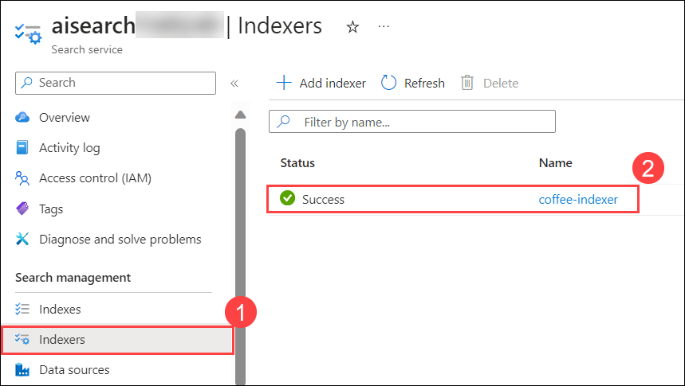

17. Select the indexer name to see more details.

    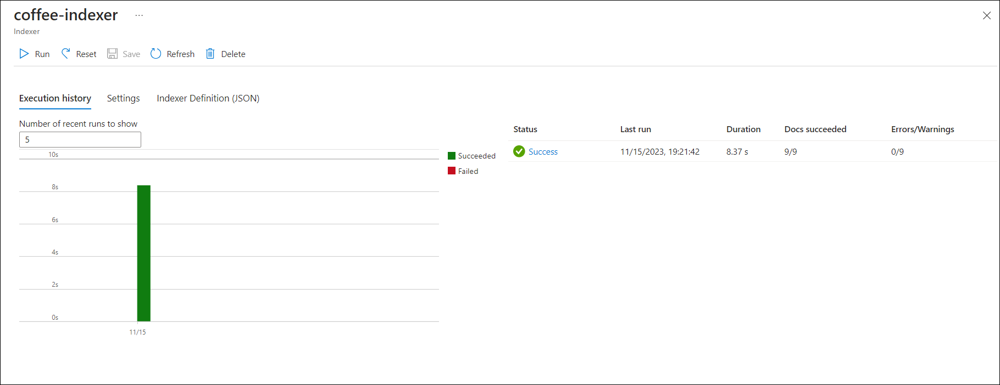

## Task 6: Query the index

In this task, you will learn how to query the index in your **AI Search** resource to retrieve relevant documents and insights based on specific search criteria.

Use the Search Explorer to write and test queries. Search Explorer is a tool built into the Azure portal that gives you an easy way to validate the quality of your search index. You can use Search Explorer to write queries and review results in JSON.

1. In your Search service's *Overview* page, select **Search explorer** at the top of the screen.

   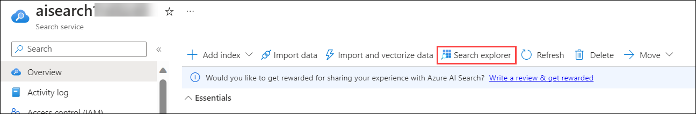

1. Notice how the index selected is the *coffee-index* you created.  Below the index selected, change the *view* to **JSON view**. 

     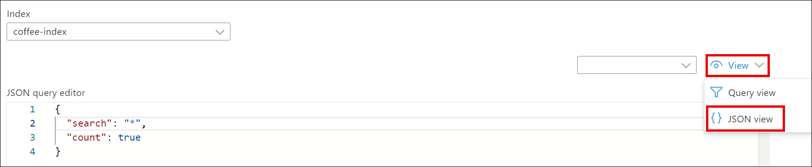

1. In the **JSON query editor** field, copy and paste:
   
    ```json
    {
        "search": "*",
        "count": true
    }
    ```
1. Select **Search**. The search query returns all the documents in the search index, including a count of all the documents in the **@odata.count** field. The search index should return a JSON document containing your search results.

1. Now let's filter by location. In the **JSON query editor** field, copy and paste:
     
    ```json
    {
        "search": "locations:'Chicago'",
        "count": true
    }
    ```
1. Select **Search**. The query searches all the documents in the  index and filters for reviews with a Chicago location. You should see `3` in the `@odata.count` field.

1. Now let's filter by sentiment. In the **JSON query editor** field, copy and paste:
   
    ```json
    {
        "search": "sentiment:'negative'",
        "count": true
    }
    ```
1. Select **Search**. The query searches all the documents in the index and filters for reviews with a negative sentiment. You should see `1` in the `@odata.count` field.

   > **Note**: Notice how the results are sorted by `@search.score`. This score is assigned by the search engine to indicate how closely the results match the given query.

1. One of the problems we might want to solve is why there might be certain reviews. Let's take a look at the key phrases associated with the negative review. What do you think might be the cause of the review?

## Task 7: Review the knowledge store

In this task, you will learn how to review the knowledge store in your **AI Search** resource to analyze and manage the extracted insights, metadata, and search results for improved data understanding.

Let's see the power of the knowledge store in action. When you ran the *Import data wizard*, you also created a knowledge store. Inside the knowledge store, you'll find the enriched data extracted by AI skills persists in the form of projections and tables.

1. In the Azure portal, navigate back to your Azure storage account.

1. In the left-hand menu pane, select **Containers (1)**. Select the **knowledge-store (2)** container.

    .png)

1. Select any of the items.

    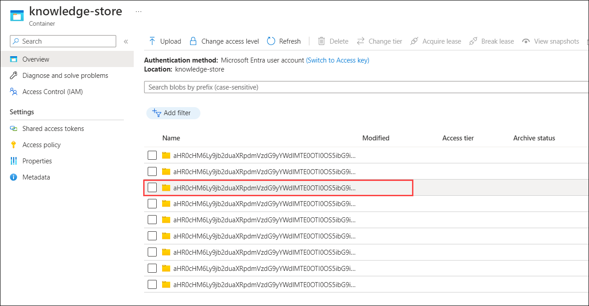

1.  You will see a list of folders. There is one folder for all of the metadata for each review document. **Select any of the folders**. Within the folder, click the **objectprojection.json** file.

    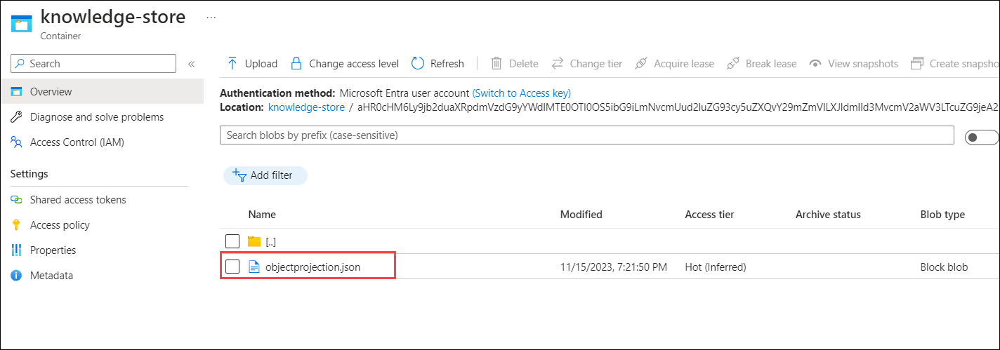

1. Select **Edit** to see the JSON produced for one of the documents from your Azure data store.

    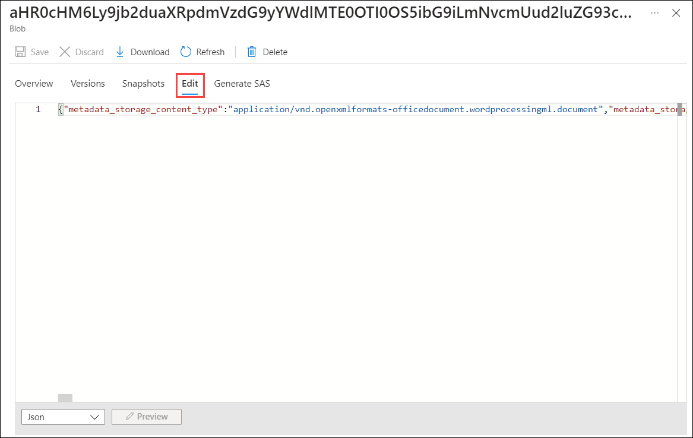

1. Select the storage blob breadcrumb at the top left of the screen to return to the Storage account *Containers*.

    

1. In the **Containers (1)**, select the container **coffee-skillset-image-projection (2)**.

    .png)

1.  Select any of the items.

     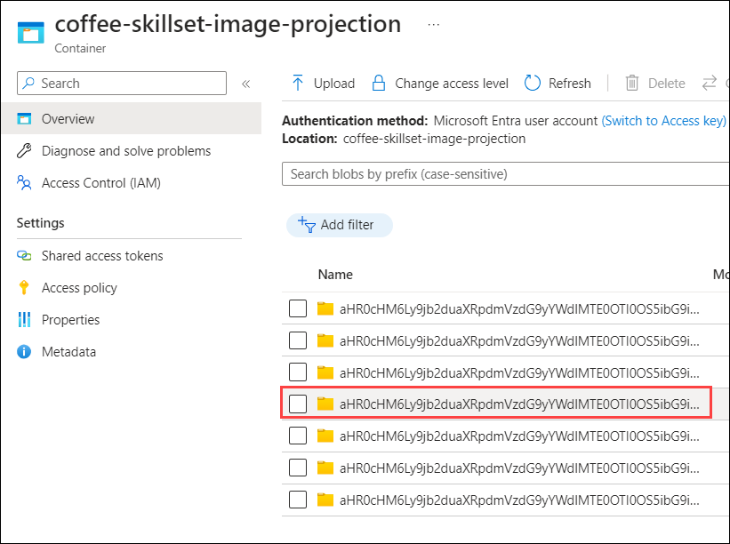

1. Select any of the *.jpg* files. Select **Edit** to see the image stored in the document. Notice how all the images from the documents are stored in this manner.

    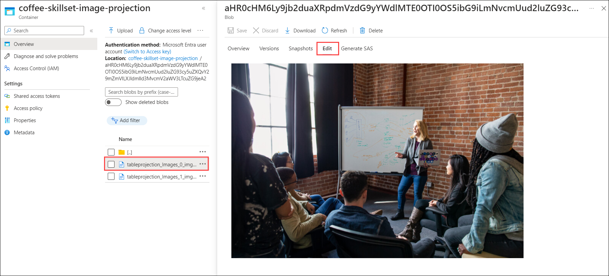

1. Select the storage blob breadcrumb at the top left of the screen to return to the Storage account *Containers*.

1. Select **Storage browser (1)** on the left-hand panel, and select **Tables (2)**. There's a table for each entity in the index. Select the table **coffeeSkillsetKeyPhrases (3)**.

     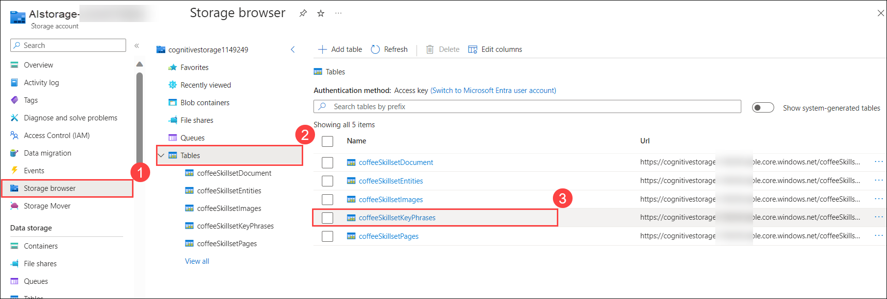

    Look at the key phrases the knowledge store was able to capture from the content in the reviews. Many of the fields are keys, so you can link the tables like a relational database. The last field shows the key phrases that were extracted by the skillset.

## Validation

> **Congratulations** on completing the task! Now, it's time to validate it. Here are the steps:
 
- Hit the Validate button for the corresponding task. you will receive a success message.
- If not, carefully read the error message and retry the step, following the instructions in the lab guide.
- If you need any assistance, please contact us at cloudlabs-support@spektrasystems.com. We are available 24/7 to help you out.

   <validation step="d3283833-c8a5-49e9-8c3b-7db670de2137" />

## Learn more

This simple search index only some of the capabilities of the Azure AI Search service. To learn more about what you can do with this service, see the [Azure AI Search service page](/azure/search/search-what-is-azure-search).

## Review

In this exercise, you have completed the following tasks: 
- Created an *Azure AI Search* resource  
- Created an *AI Services* resource  
- Created a *storage account*  
- Uploaded documents to *Azure Storage*  
- Indexed the documents  
- Queried the index  
- Reviewed the *knowledge store*

## You have successfully completed this lab.
