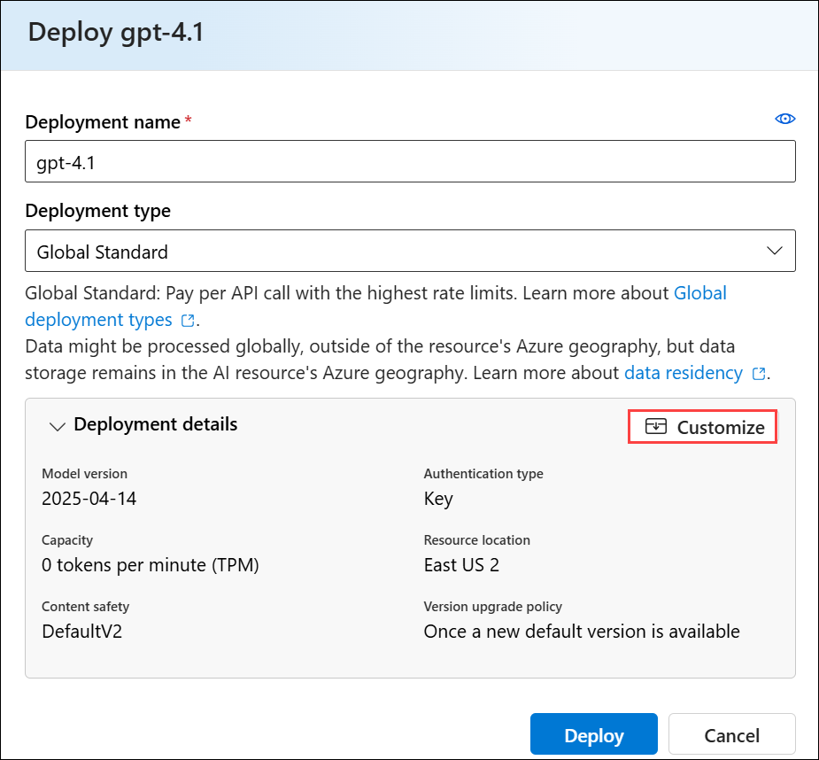
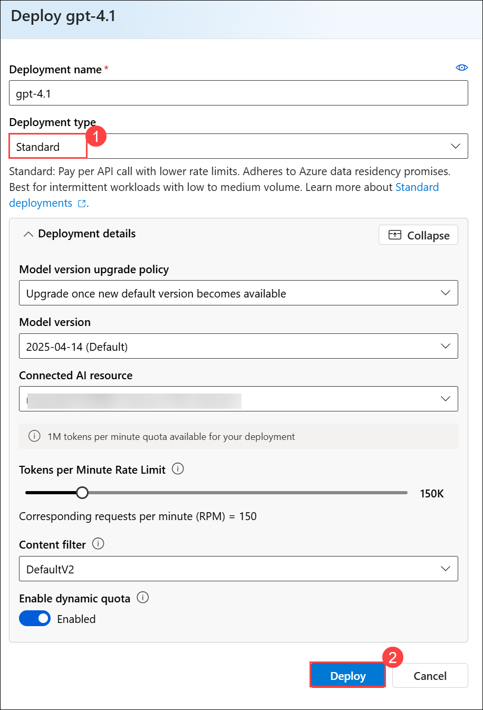
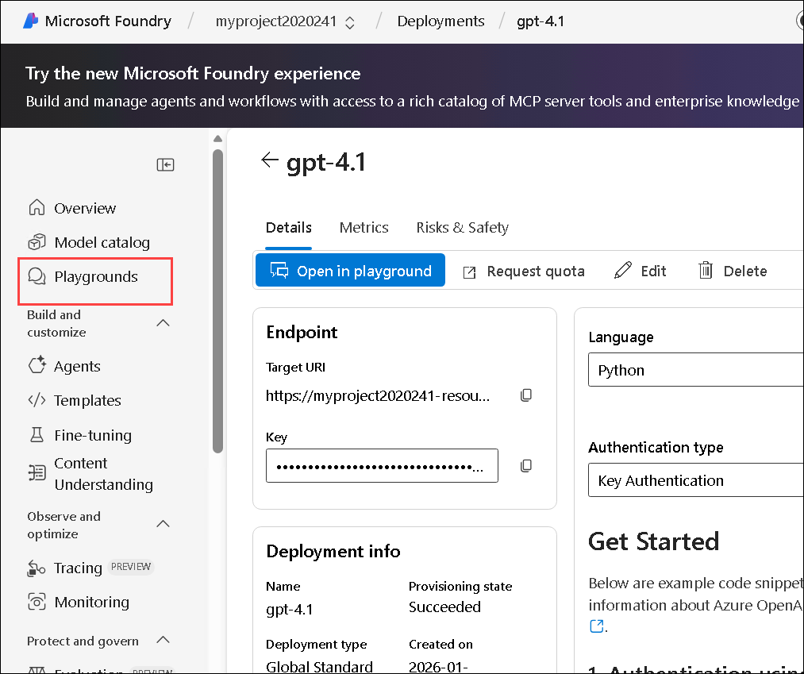
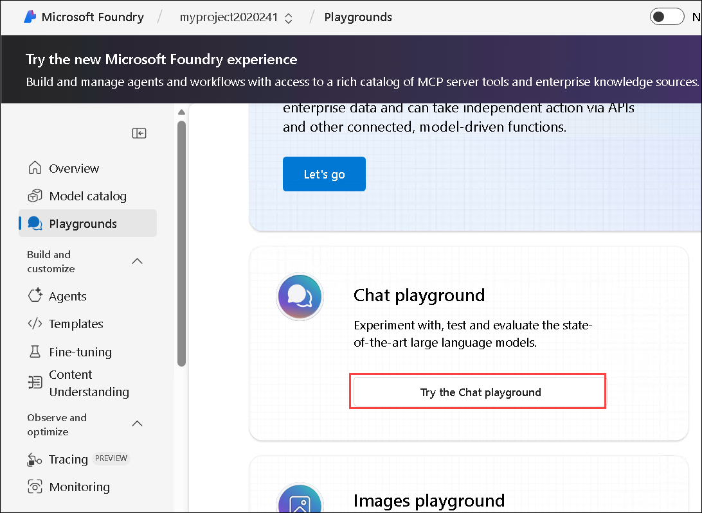
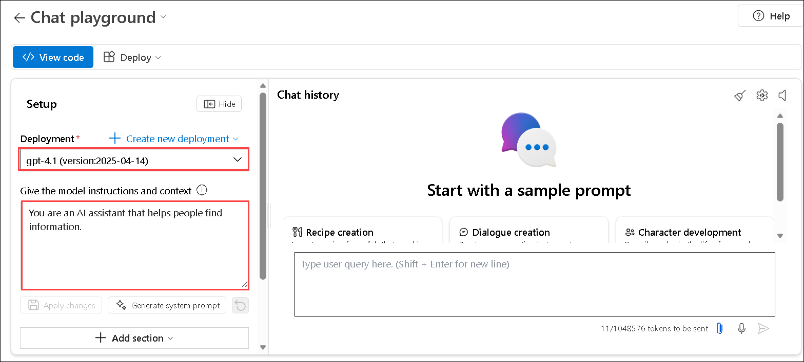
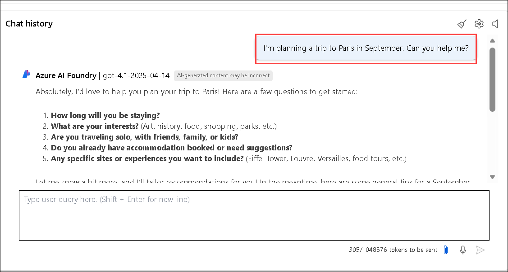

# Explore generative AI in Microsoft Foundry

Generative AI describes a category of capabilities within AI that create content. People often interact with generative AI that has been built into chat applications.

In this lab, you try out generative AI in Microsoft Foundry portal, Microsoft's platform for creating intelligent applications. 

## Lab Objectives

In this lab, you will perform:
- Task 1: Create a project in the Microsoft Foundry portal
- Task 2: Explore generative AI in Foundry's chat playground

## Task 1: Create a project in Microsoft Foundry portal

In this task, you will sign in to Microsoft Foundry, explore available models, and create a new project. You will then select the gpt-4.1 model, configure the project with the provided subscription, resource group, and region, and deploy the model for use within your project.

1. Right click on the following link [Microsoft Foundry](https://ai.azure.com) then select **Copy link** and then paste it on the web browser to navigate to **Microsoft Foundry**.

1. Click on **Sign in**.

    

1. If prompted, sign in using your Azure credentials.

    - **Email/Username:** <inject key="AzureAdUserEmail"></inject>

    - **Password:** <inject key="AzureAdUserPassword"></inject>

1. In the **Explore models and capabilities** section, search for `gpt-4.1` **(1)**. Then, in the search results, select the **gpt-4.1 (2)** model to view its details.    

    

1. Select **Use this model**.    

    

1. On **Select your project**, select **+ Create a new project**.

    

1. On **Select your project**, enter the project name as **Myproject<inject key="DeploymentID" enableCopy="false" /> (1)** then expand **Advanced options (2)**:

    - Subscription: **Leave default subscription (3)** 
    - Resource Group : Select **AI-900-Module-12-<inject key="Deployment ID" enableCopy="false"></inject> (4)** 
    - Region : **<inject key="location" enableCopy="false"></inject>** **(5)**
    - Select **Create and continue (6)**

      

1. Wait for the set up process to complete. It may take a few minutes.

1. On the **Deploy gpt 4.1**, select **Deploy**.

    

    >**Note**: If you encounter any quota issues while deploying the GPT models, kindly change the deployment type to Standard and attempt the deployment again.

    1. In the **Deploy gpt-4.1** pane, select **Customize**

        

    1. In the **Deploy gpt-4.1** pane, verify **Standard (1)** is selected under *Deployment type*, and then click **Deploy (2)**.

        

> **Congratulations** on completing the task! Now, it's time to validate it. Here are the steps:
> - Hit the Validate button for the corresponding task. If you receive a success message, you can proceed to the next task.
> - If not, carefully read the error message and retry the step, following the instructions in the lab guide. 
> - If you need any assistance, please contact us at cloudlabs-support@spektrasystems.com. We are available 24/7 to help you out.

   <validation step="41170453-b806-4a87-8243-fd736e4bfab5" />


## Task 2: Explore generative AI in Foundry's chat playground

In this task, you will explore Foundry’s Chat playground by interacting with a deployed gpt-4.1 model. You will experiment with prompts to understand how generative AI responds to user input, maintains conversational context, follows system instructions, and refines outputs based on additional guidance, constraints, and external information sources.

1. After the project has been created, in the task pane on the left, select **Playgrounds**. 

    

     >*Tip*: If necessary, expand the menu to read its contents by clicking on the top 'expand' icon.

1. In Foundry's Playgrounds page, select **Try the Chat playground**. Close any tips or quick start panes that are opened.

    The Chat playground is a user interface that enables you to try out building a chat application with different generative AI models.

    

    >*Tip*: If you do not see the **Setup** pane in the Chat playground screen, expand the window size.  

1. In order to use Chat playground, you need to associate it with a deployed model. In the Chat playground's **Setup** pane, ensure that the **gpt-4.1** model you deployed previously is selected. 

    >*Note*: You need to select **Apply changes** anytime you make changes in the **Setup** pane.

1. In the **Setup** pane, note the default instructions and context for the model, which should be similar to:

    `You are an AI assistant that helps people find information.`

    These kinds of instructions are commonly referred to as a *system prompt*, and are used to provide guidance and constraints for the model's responses.

        

1. Review the *Chat history* pane, which contains some sample prompts to help you get started and a query box to enter your own prompts. 

1. Let's try generating a response using a prompt with a specific goal. In the chat box, enter the following prompt:

    ```prompt
    I'm planning a trip to Paris in September. Can you help me?
    ```

        

1. Review the response. Keep in mind that the specific response you receive may vary due to the nature of generative AI.

1. Let's try another prompt. Enter the following:

    ```prompt
    Where's a good location in the city to stay?
    ```

1. Review the response, which should provide some places to stay in Paris. Note that the chat session retains the context from previous prompts, so it knows that "the city" in question is Paris.

1. Let's iterate based on previous prompts and responses to refine the result. Enter the following prompt:

    ```prompt
    Can you give me more information about dining options near the first location?
    ```

1. Review the response, which should provide dining options near a location from the previous response. 

1. Now, let's provide a source to ground the response in a specific scope of information. Enter the following: 

    ```prompt
    Based on the information at https://en.wikipedia.org/wiki/History_of_Paris, what were the key events in the city's history?
    ```

1. Review the response, which should provide information based on the provided website. 

1. Let's try to add context to maximize the relevance of the response. Enter the following prompt: 

    ```prompt
    What three places do you recommend I stay in Paris to be within walking distance to historical attractions? Explain your reasoning.
    ```

1. Review the response and reasoning for the response.  

1. Now try setting clear expectations for the response. Enter the following prompt:

    ```prompt
    What are the top 10 sights to see in Paris? Answer with a numbered list in order of popularity.
    ```

1. Review the response, which should provide a numbered list of sights to see in Paris.

### Review

In this lab, you have completed the following tasks:

- Created a project in the Microsoft Foundry portal
- Explored generative AI in Microsoft Foundry's chat playground


## You have successfully completed this lab.
