# Explore AI in Microsoft Foundry

## Lab overview

In this exercise, you will explore Microsoft Foundry and understand how generative AI models power modern AI applications. You will learn how to create a project in Microsoft Foundry, browse available foundation models, deploy a generative AI model, and interact with it using the built-in playground.

## Lab objectives

In this exercise, you will perform:

- Task 1: Create a project in Microsoft Foundry
- Task 2: Browse models and deploy for testing
- Task 3: Test the model in a Playground

### Task 1: Create a project in Microsoft Foundry

In this task, you will learn how to access the Microsoft Foundry portal and create a new project. This project acts as a centralized workspace where AI models, deployments, and tools are managed, forming the foundation for building and testing AI-powered applications.

1. Copy the **Microsoft Foundry** link and paste it into a new browser tab to access the portal: `https://ai.azure.com?azure-portal=true`

1. On the **Microsoft Foundry** home page, click on **Sign in** in the top right corner.

   

1. If prompted to sign in, enter your credentials:
 
   - **Email/Username:** <inject key="AzureAdUserEmail"></inject> **(1)** and click on **Next (2)**.
 
      
 
   - **Password:** <inject key="AzureAdUserPassword"></inject> **(1)** and click on **Sign in (2)**.
 
     .png)

1. If prompted to **Stay signed in?**, you can click **No**.

   

1. At the top of the **Microsoft Foundry** portal, enable the **New Foundry toggle (1)** to switch to the latest Foundry user interface.

1. From the **Select a project to continue** dialog, click the drop-down under **Select or search for a project**, and then select **Create a new project (2)**.

    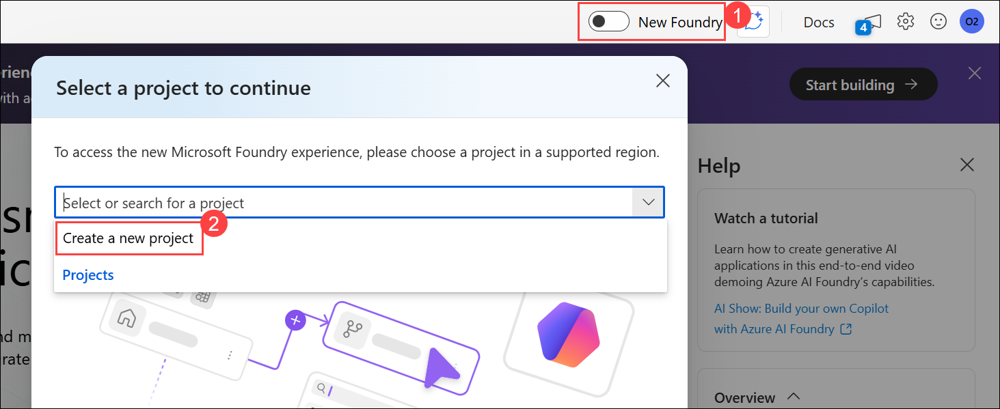

1. In the **Create a project** wizard, enter project name **Myproject<inject key="DeploymentID" enableCopy="false" /> (1)**, and **Expand Advanced options (2)** to specify the following settings for your project: 

    - Subscription : **Leave default subscription (3)** 
    - Resource Group : Select **AI-900-Module-13-<inject key="DeploymentID" enableCopy="false" /> (4)** 
    - Microsoft Foundry resource: **MyFoundry<inject key="DeploymentID" enableCopy="false" /> (5)**
    - Region : Select **<inject key="location" enableCopy="false"/> (6)**
    - Click on **Create** **(7)**

      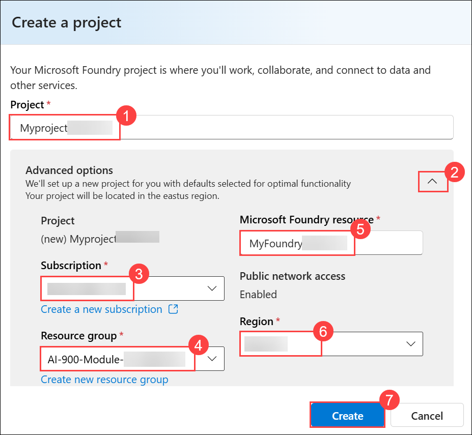

1. Wait for your project created.

   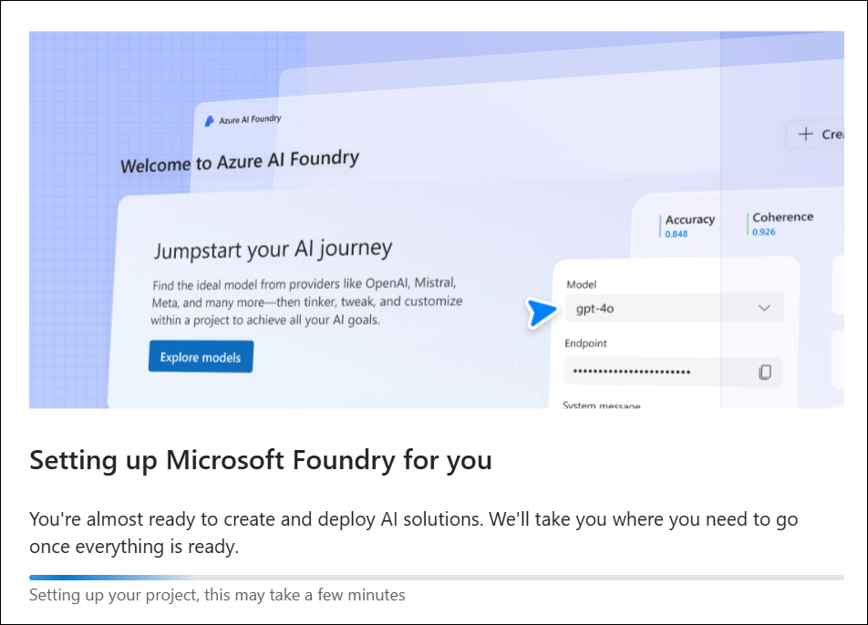

1. Once the setup is complete, you are automatically redirected to the **Microsoft Foundry home page** for the newly created project.

   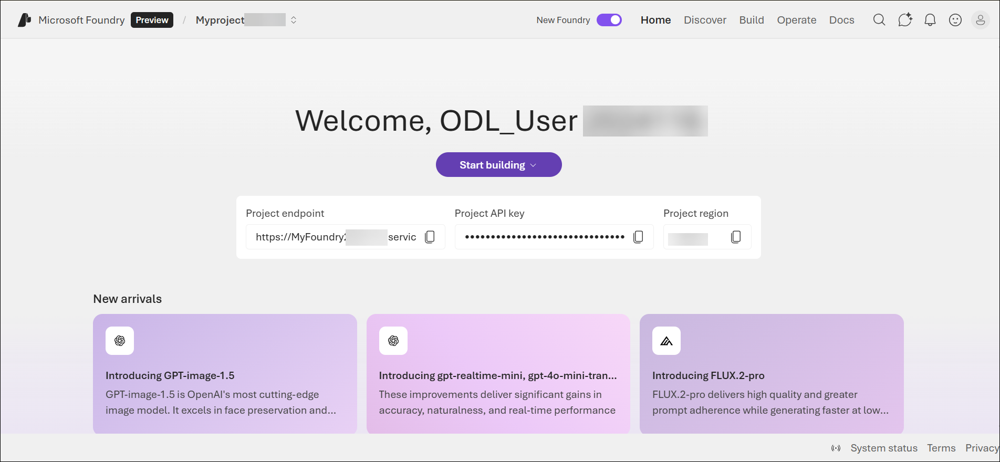

### Task 2: Browse models and deploy for testing

In this task, you will explore the model catalog in Microsoft Foundry to understand the variety of foundation models available. You will search for a generative AI model and deploy it using default settings, preparing it for interactive testing and experimentation.

1. On the **Microsoft Foundry** home page, click **Start building (1)**, and then select **Browse models (2)** from the drop-down menu.

    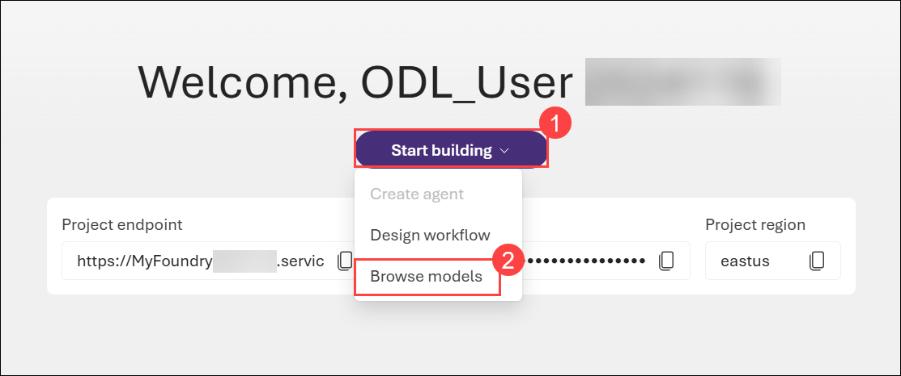

1. With the Models page, you can discover thousands of models that are Microsoft and third-party-owned. These models form the foundation of the AI applications by powering their reasoning capabilities. 

    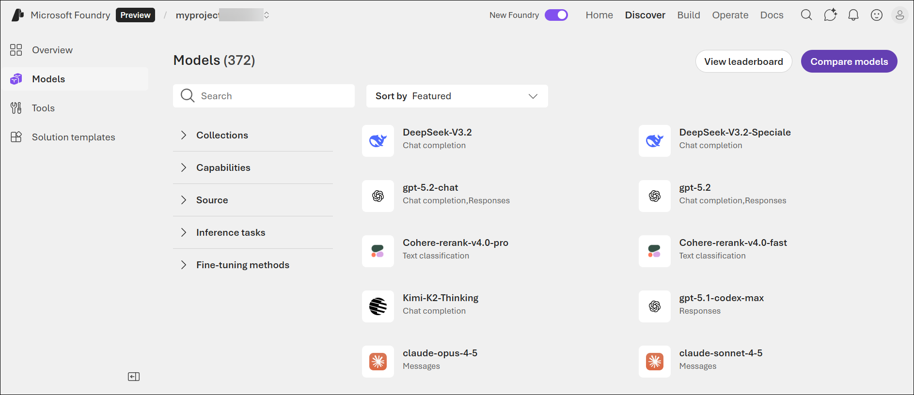

1. On the **Models** page, search for **gpt-4.1 (1)** in the search bar, and then select the **gpt-4.1 (2)** model from the search results.

    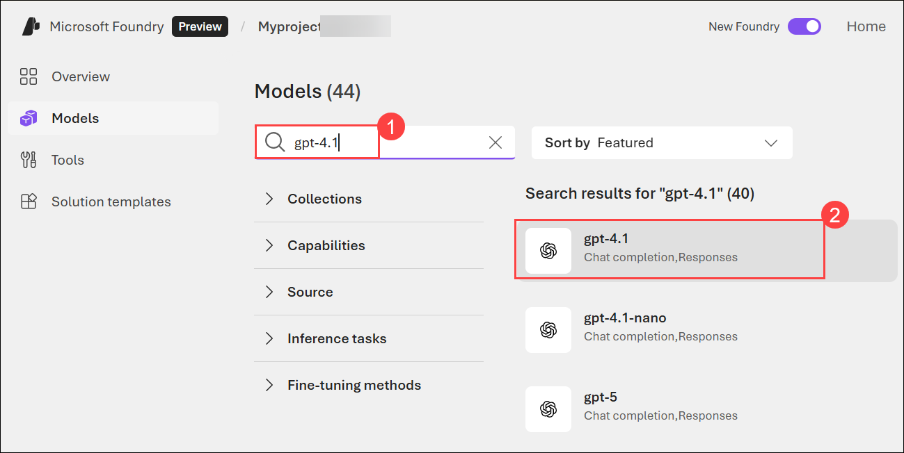

1. On the **gpt-4.1** model details page, click **Deploy (1)**, and then select **Default settings (2)** to deploy the model using the standard configuration.

    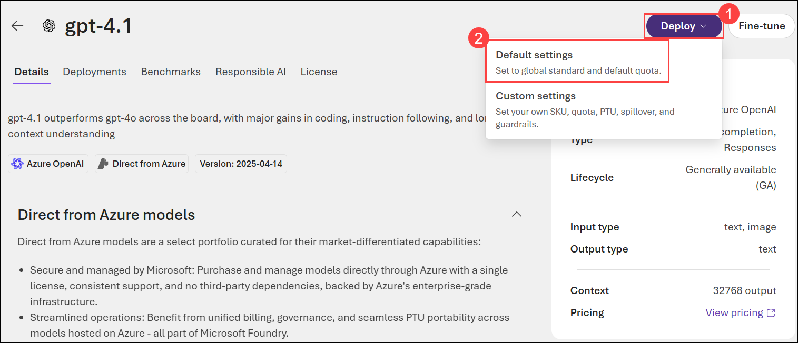

   >**Note**: If you encounter any quota issues while deploying the GPT models, kindly change the deployment type to **Standard** by selecting the **custom settings** and attempt the deployment again.

   1. On the **gpt-4.1** model page, select **Deploy (1)**, and then choose **Custom settings (2)**.

      

   1. In the **Deploy gpt-4.1** pane, verify **Standard (1)** is selected under **Deployment type**, and then click **Deploy (2)**.

      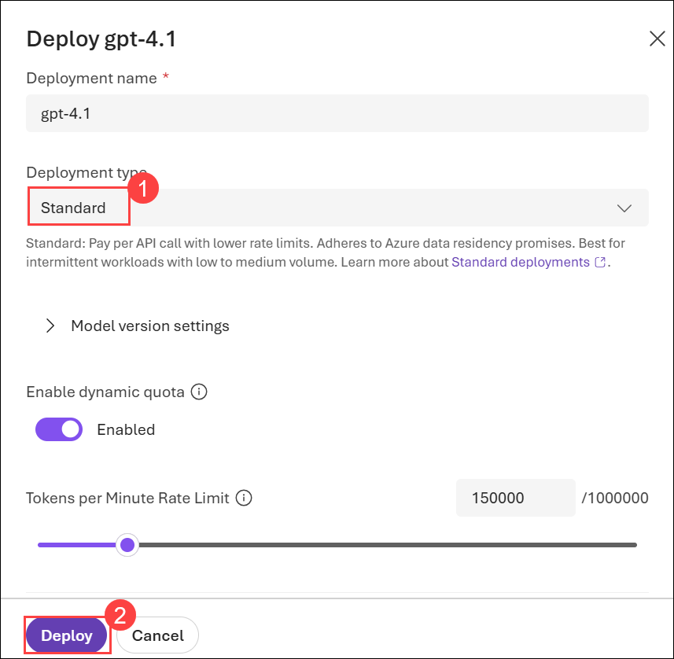
   
## Task 3: Test the model in a Playground

In this task, you will interact with the deployed generative AI model using the Playground interface. By submitting prompts and reviewing responses, you will observe how AI models support different workloads and how users interact with AI applications through chat-based experiences.

1. You can test and customize the deployed model's capabilities in a **Playground** setting. Notice the model you are working with is selected at the top of the screen.

   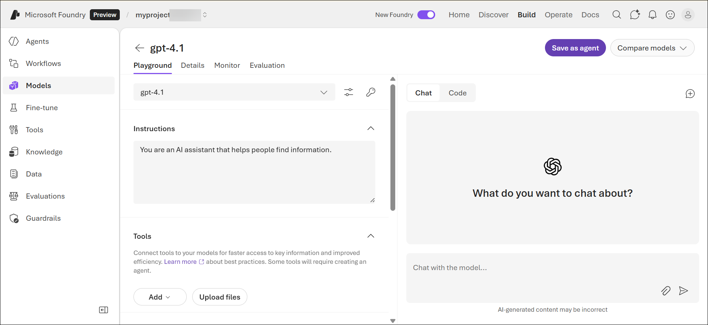

1. Let's try chatting with the model, in the **Chat** pane, enter the following prompt **(1)** and then click **Send (2)** to submit the request to the model.

   ```prompt
    I'm getting started with AI. Can you summarize the relationship between a model and AI application?
    ```

    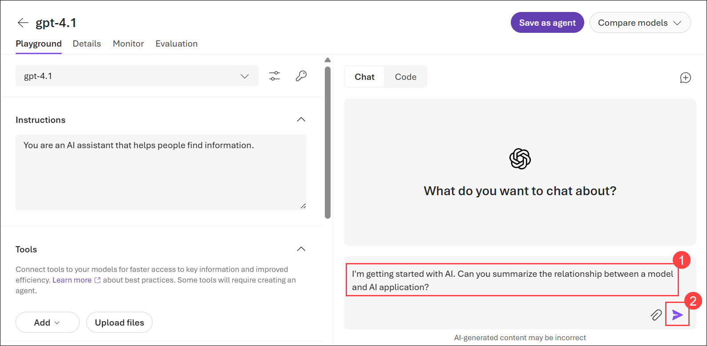

1. Review the results. Does this reflect your understanding of how these models can be used for AI applications? 

    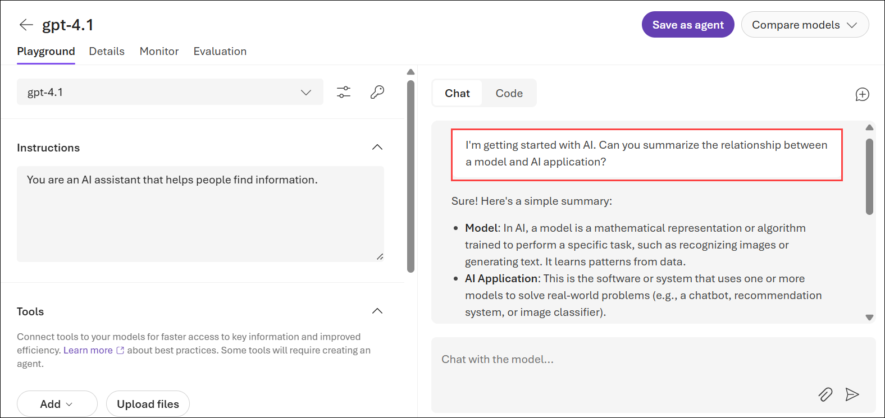

1. In the chat screen, enter the following prompt: 

    ```prompt
    Give one example for each AI workload: generative AI, AI agents and automation, text analysis, computer vision, and information extraction.
    ```
1. Review the results. Feel free to ask for more examples. 

   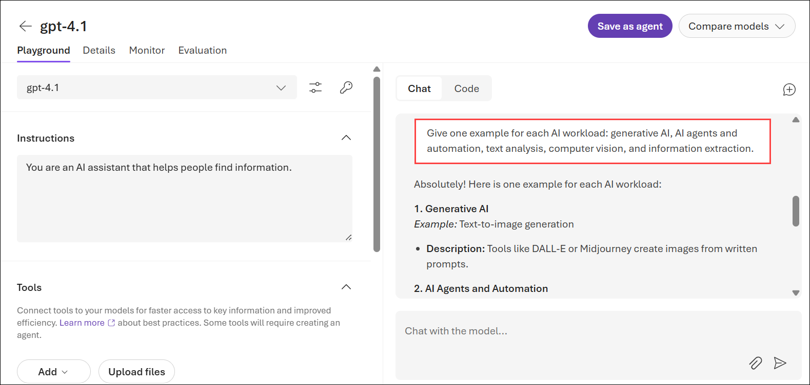

1. When you interact with the model in the playground setting, you are using a chat user interface. The chatbot interface is a common way humans interact with *AI assistants* today.  In the chat screen, enter the following prompt: 

    ```prompt
    List five different ways humans interact with AI other than with a chat interface.
    ```

1. Review the results. The key point is that while *workloads* define the types of tasks an AI application can complete, the *user interface* defines how humans interact with that AI application. Ultimately, each AI application's reasoning is powered by models, which is the core building block we looked at in this exercise. What is very powerful about the models available to us now is that they are capable of solving for multiple workloads, often with one user interface. Thus, with one project in Foundry, you can access models, solve for multiple workloads, and build AI applications at scale. 

   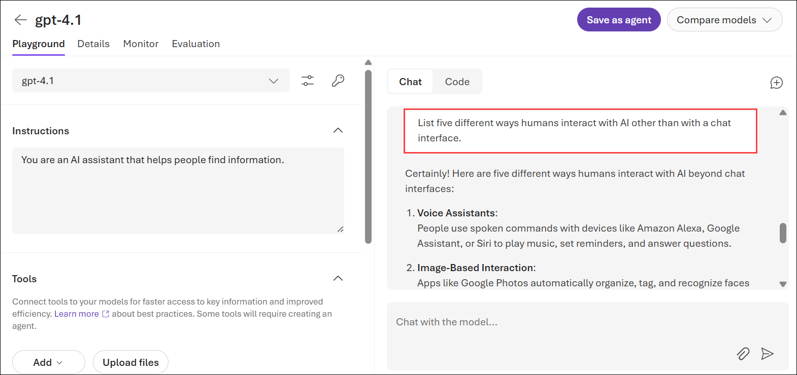


> **Congratulations** on completing the task! Now, it's time to validate it. Here are the steps:
> - Hit the Validate button for the corresponding task. you will receive a success message.
> - If not, carefully read the error message and retry the step, following the instructions in the lab guide. 
> - If you need any assistance, please contact us at cloudlabs-support@spektrasystems.com. We are available 24/7 to help you out.

  <validation step="6b5cc888-bc2a-47c8-b31c-e65157a50f66" />

### Review

In this exercise, you have completed the following tasks:
- Created a project in Microsoft Foundry
- Browsed and deployed model for testing
- Tested the model in a Playground

## You have successfully completed this lab.
