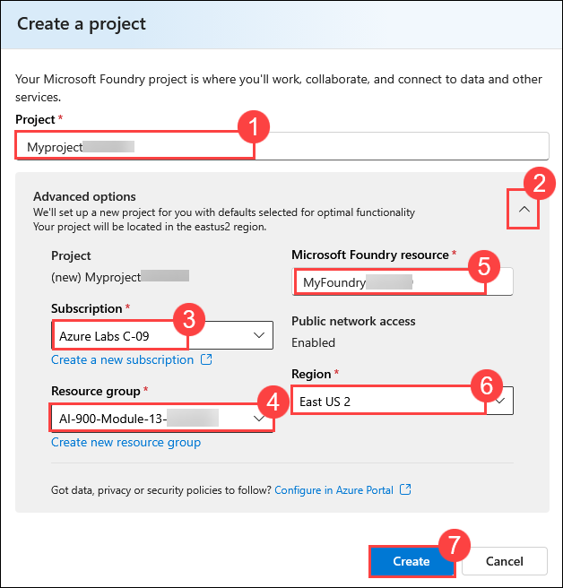
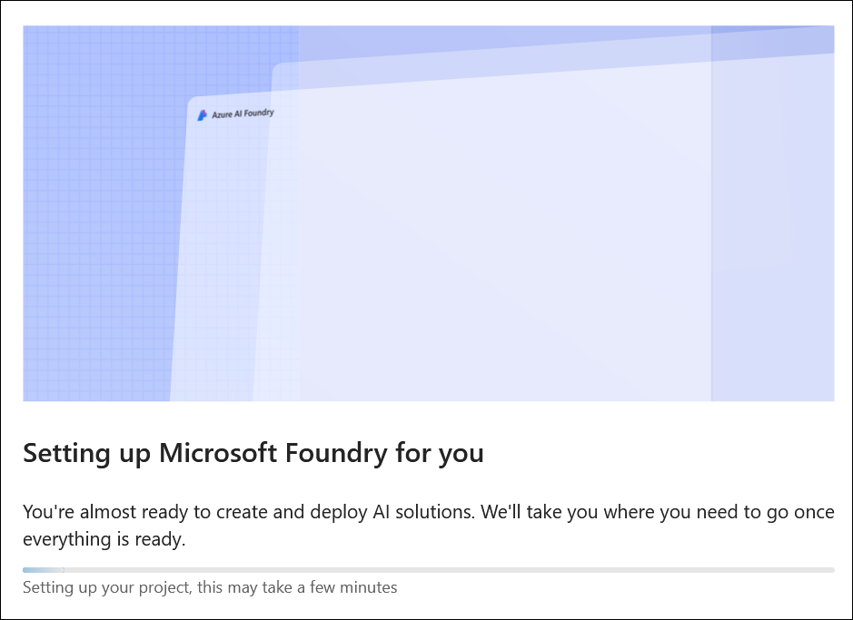
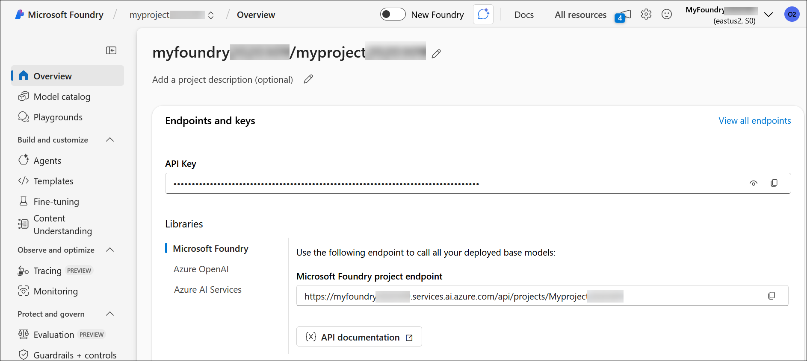
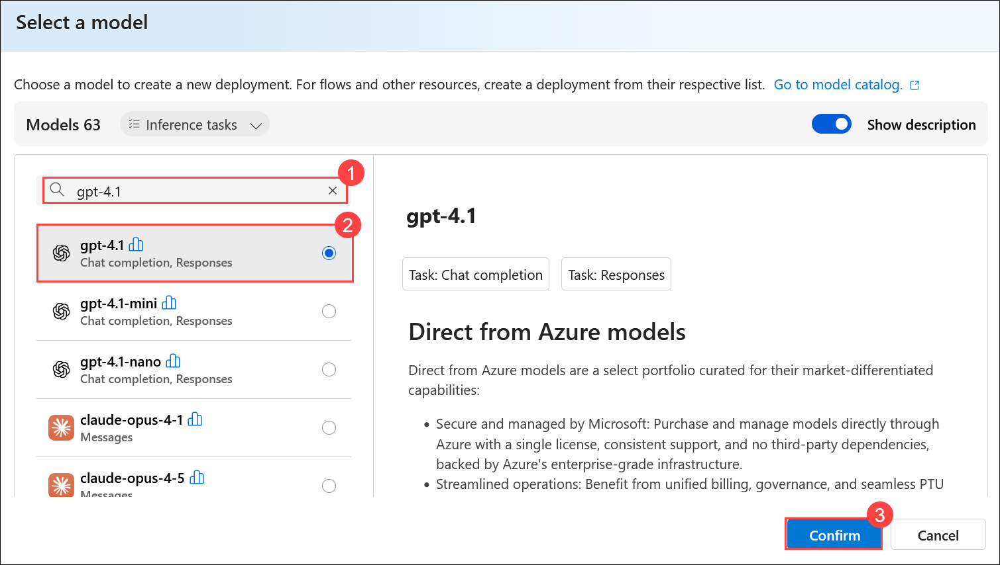
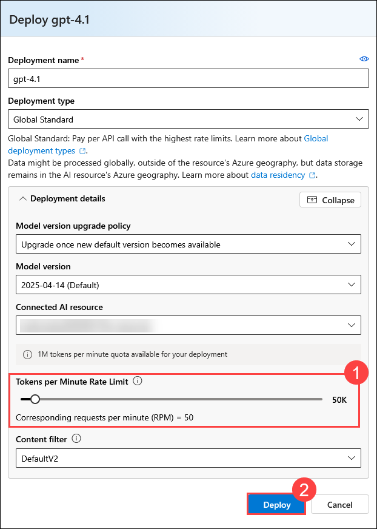
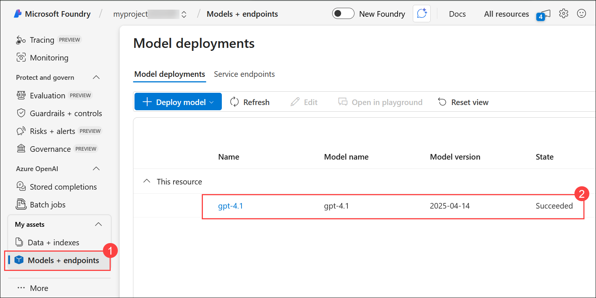
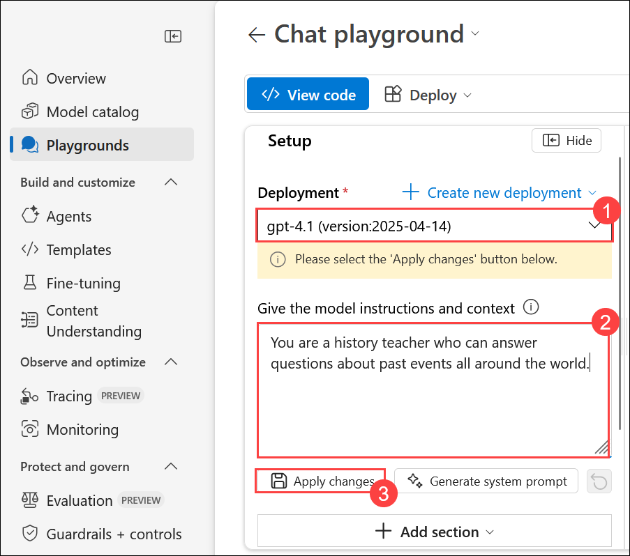
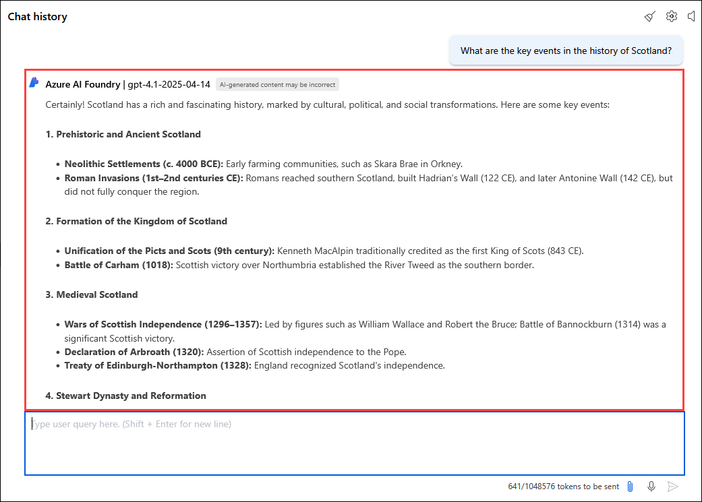

# Explore the components and tools of Microsoft Foundry

## Lab overview

In this exercise, you will explore the Microsoft Foundry portal and learn how to create, manage, and deploy generative AI models within the Azure ecosystem. You will gain hands-on experience working with Azure AI hubs, projects, and deploying AI models like GPT-4.1.

## Lab objectives

In this exercise, you will perform:

- Task 1: Navigate to Microsoft Foundry and create a project
- Task 2: Deploy and test a generative AI model

### Task 1: Navigate to Microsoft Foundry and create a project

In this task, you will gain hands-on experience in setting up a collaborative workspace for AI projects and configuring essential resources.

1. Copy the **Microsoft Foundry** link and paste it into a new browser tab to access the portal: `https://ai.azure.com?azure-portal=true`

1. On the **Microsoft Foundry** home page, click on **Sign in** in the top right corner.

   

1. If prompted to sign in, enter your credentials:
 
   - **Email/Username:** <inject key="AzureAdUserEmail"></inject> **(1)** and click on **Next (2)**.
 
      
 
   - **Password:** <inject key="AzureAdUserPassword"></inject> **(1)** and click on **Sign in (2)**.
 
     .png)

1. If prompted to **Stay signed in?**, you can click **No**.

   

1. In the browser, navigate to `https://ai.azure.com/managementCenter/allResources` and click on **Create new**.

    

1. Choose the option to create a **Microsoft Foundry resource (1)** and then select **Next (2)**.

   

1. In the **Create a project** wizard, enter project name **Myproject<inject key="DeploymentID" enableCopy="false" /> (1)**, and **Expand Advanced options (2)** to specify the following settings for your project: 

    - Subscription : **Leave default subscription (3)** 
    - Resource Group : Select **AI-900-Module-13-<inject key="DeploymentID" enableCopy="false" /> (4)** 
    - Microsoft Foundry resource: **MyFoundry<inject key="DeploymentID" enableCopy="false" /> (5)**
    - Region : Select **<inject key="location" enableCopy="false"/> (6)**
    - Click on **Create** **(7)**

      

1. Wait for your project created.

   

1. When the project is created, you will be taken to an **Overview** page of the project details.

   

1. In the Azure Microsoft Foundry project, go to the **My assets** section, then select **Models + endpoints (1)**. Click **+ Deploy model (2)** and choose **Deploy base model (3)** from the drop-down to continue.

   

1. Search **gpt-4.1 (1)** for and select the **gpt-4.1 model (2)** and click on **Confirm (3)**.

   

1. Click on **Customize**.

   

1. In the window that appears, reduce the token to **50 K (1)** and click on **Deploy (2)**.
   
   

1. After deployment, click **Model + Endpoints (1)** under **My assets** to view the deployed **gpt-4.1 (2)** model.

   

## Task 2: Deploy and test a generative AI model

1. In the navigation pane on the left for your project, select **Playgrounds (1)** and click on  **Try the Chat Playground (2)**.

   

1. In the window that appears, ensure that your **gpt-4.1 (1)** model deployment is selected.

1. In the Setup pane, in the Give the model instructions and context box, enter the instruction as: **You are a history teacher who can answer questions about past events all around the world. (2)** and click on **Apply Changes (3)**.

   

1. For the **Update system message?** prompt, click on **Continue**

   

1. In the chat window, enter a query such as **What are the key events in the history of Scotland? (1)**  and press **send button (2)** to view the response.

   

   

   >**Note**: The output may vary for the query.

> **Congratulations** on completing the task! Now, it's time to validate it. Here are the steps:
> - Hit the Validate button for the corresponding task. you will receive a success message.
> - If not, carefully read the error message and retry the step, following the instructions in the lab guide. 
> - If you need any assistance, please contact us at cloudlabs-support@spektrasystems.com. We are available 24/7 to help you out.

  <validation step="6b5cc888-bc2a-47c8-b31c-e65157a50f66" />

### Summary

In this exercise, you’ve explored Microsoft Foundry and seen how to create projects and explore Azure AI Services and Azure OpenAI models in the Microsoft Foundry portal.

### Review

In this exercise, you have completed the following tasks:
- Naviagted to Microsoft Foundry and created a project  
- Deployed and tested a generative AI model

## You have successfully completed this lab.
