# Hands-on Lab: Explore Automated Machine Learning in Azure ML

## Estimated time: 90-120 Minutes

## Lab scenario

The model will use a dataset of historical bicycle rental details to predict the number of rentals expected on a given day. It leverages seasonal and meteorological features to enhance the accuracy of its forecasts

## Lab Objectives

In this lab, you will perform:

- Task 1: Creating an *Azure Machine Learning workspace* resource
- Task 2: Use automated machine learning to train a model
- Task 3: Deploy the model

## Exercise 1: Explore Automated Machine Learning in Azure Machine Learning

### Task 1: Create an Azure Machine Learning workspace

In this task, you will create an Azure Machine Learning workspace. You will search for Machine Learning, configure the necessary settings like subscription, resource group, and workspace name, and deploy the resource. Once deployed, you will access the workspace through Azure Machine Learning Studio.

1. In the Azure Portal, select **+ Create a resource**.

    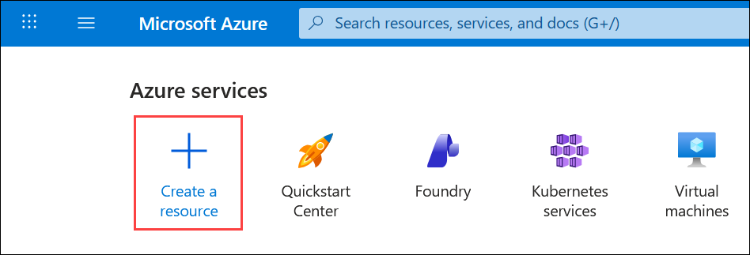

2. In the Marketplace page search for **Azure Machine Learning (1)** and Select **Azure Machine Learning (2)**.
 
   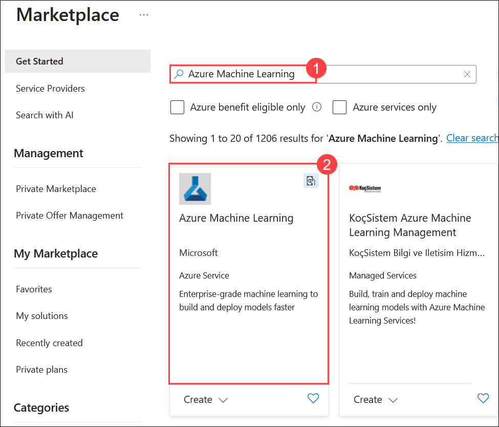

    >**Note:** If **Experiencing authentication issues** pop-up appears, simply close it by clicking on **X**. 

3. On the **Azure Machine Learning** page, click **Create** to proceed.

   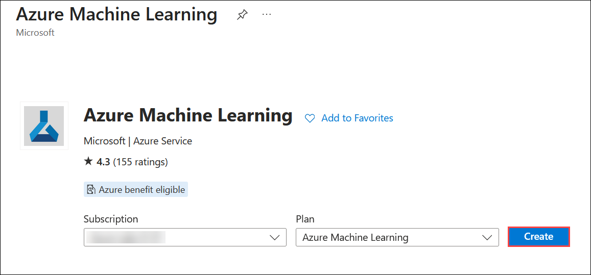
  
4. Create a new **Azure Machine Learning** resource with an *Azure Machine Learning* plan. Use the following settings:

    - **Subscription**: Use existing Azure subscription. **(1)**
    - **Resource group**: Select **AI-900-Module-01 (2)**
    - **Name**: Give name **AI-900-Workspace-<inject key="DeploymentID" enableCopy="false" /> (3)**
    - **Region**: Select <inject key="location" enableCopy="false" /> **(4)**
    - **Storage account**: Note the default new storage account that will be created for your workspace. **(5)**
    - **Key vault**: Note the default new key vault that will be created for your workspace. **(6)**
    - **Application insights**: Note the default new application insights resource that will be created for your workspace. **(7)**
    - **Container registry**: None (one will be created automatically the first time you deploy a model to a container) **(8)**

5. Select **Review + create (9)**.

    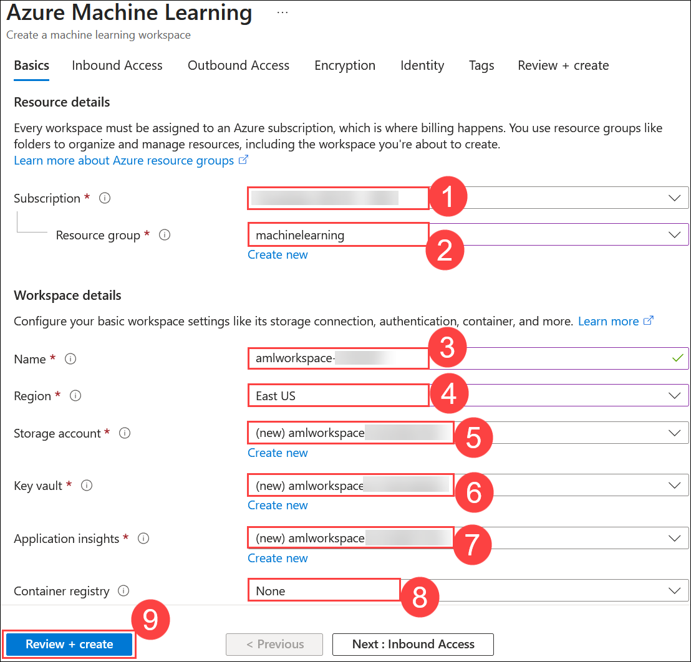

6. After successfully completing the validation process, click on the **Create** button located in the lower left corner of the page.

   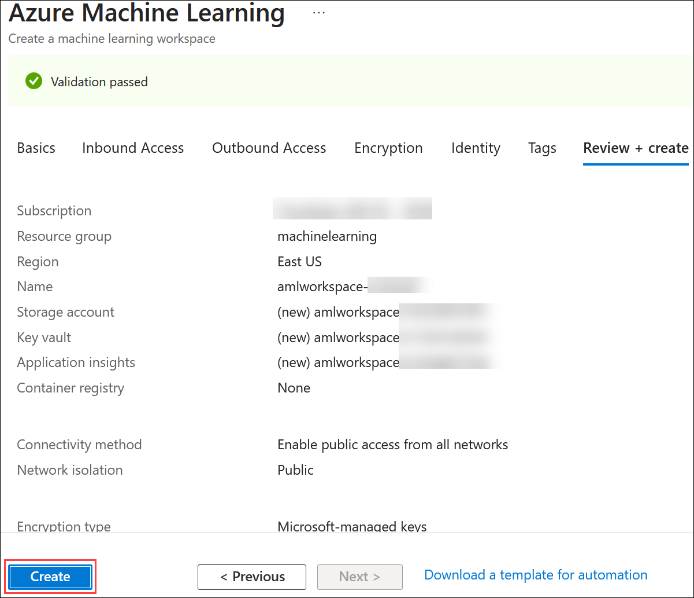
   
7. Wait for deployment to complete(it can take a few minutes), and then click on the **Go to resource** button, this will take you to your workspace resource.

    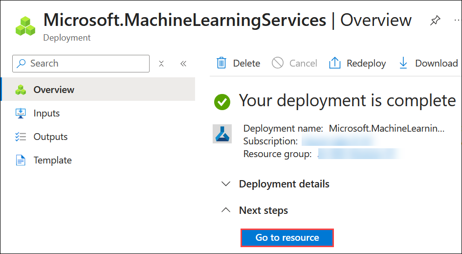

8. On your **Azure Machine Learning workspace** click **Launch studio**.

    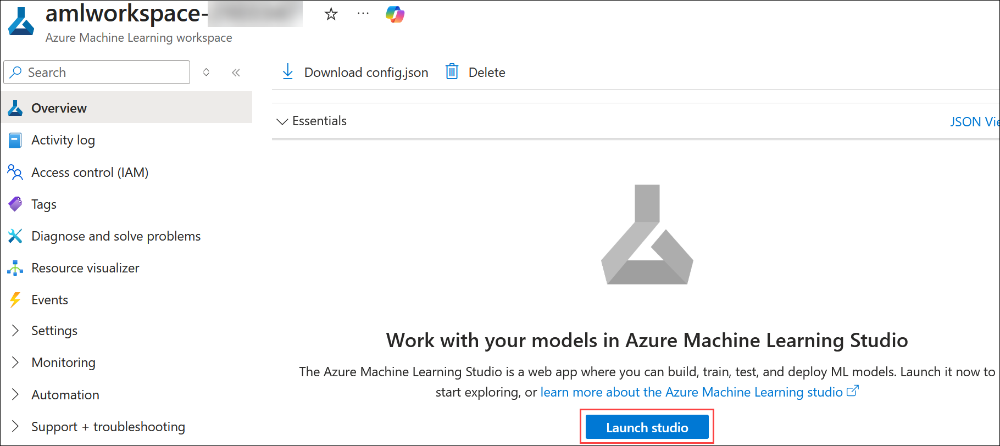

    >**Note:** You can also access the studio via [https://ml.azure.com](https://ml.azure.com?azure-portal=true). If prompted, sign in to **Azure Machine Learning studio** using your Microsoft account credentials from the Environment tab. Close any pop-ups that appear.

9. You will be automatically navigated to your newly created workspace.

    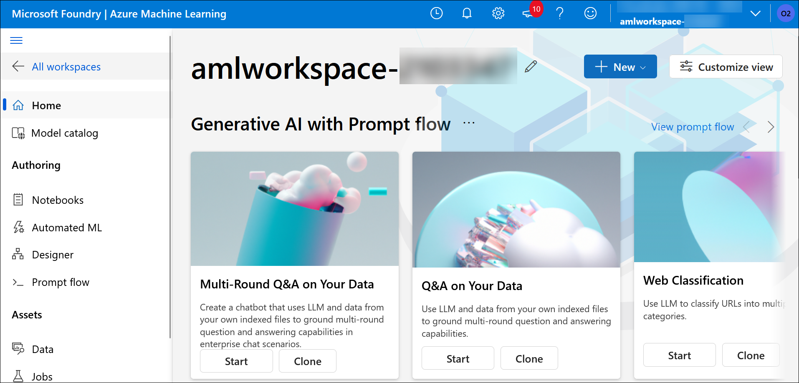 

    >**Note:** If you are not navigated automatically, select **Workspaces (1)** from the left navigation menu and choose the **workspace (2)** that you have created.

    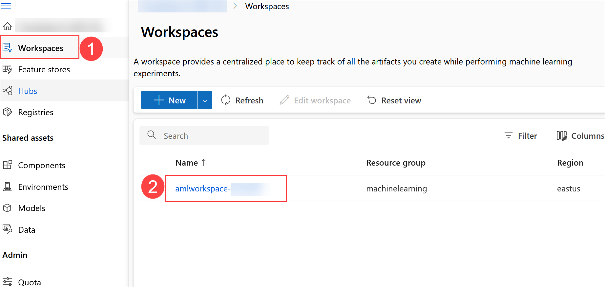

> **Congratulations** on completing the task! Now, it's time to validate it. Here are the steps:
 
- Hit the Validate button for the corresponding task. You will receive a success message. 
- If not, carefully read the error message and retry the step, following the instructions in the lab guide.
- If you need any assistance, please contact us at cloudlabs-support@spektrasystems.com. We are available 24/7 to help you out.

  <validation step="19f87603-9f16-4107-b94f-d92593b422ce" />

#### Enable preview features

Some features of Azure Machine Learning are in preview and need to be explicitly enabled in your workspace.

1. In Azure Machine Learning Studio, click on **manage preview features** (the loud speaker icon - &#128363;).

     

1. Enable the following preview feature, if not enabled.

     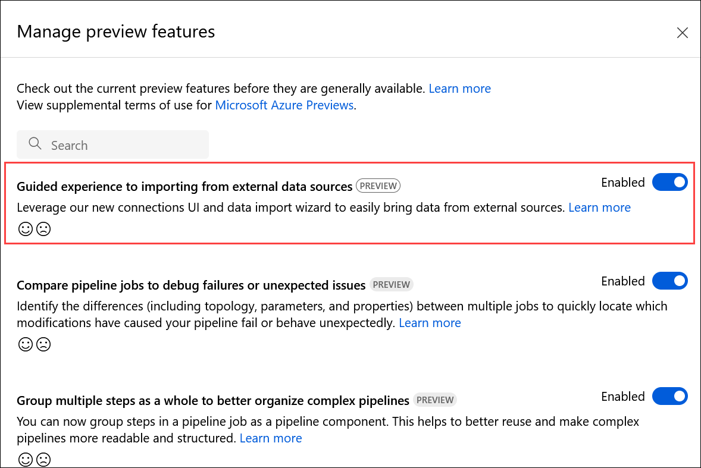

### Task 2: Use automated machine learning to train a model

In this task, you will learn how to use automated machine learning to train a model efficiently without writing extensive code.

Automated machine learning enables you to try multiple algorithms and parameters to train multiple models, and identify the best one for your data. In this exercise, you'll use a dataset of historical bicycle rental details to train a model that predicts the number of bicycle rentals that should be expected on a given day, based on seasonal and meteorological features.

>**Citation**: *The data used in this exercise is derived from [Capital Bikeshare](https://www.capitalbikeshare.com/system-data) and is used in accordance with the published data [license agreement](https://www.capitalbikeshare.com/data-license-agreement)*.

1. In Azure Machine Learning studio, naviage to the **Automated ML (1)** page (under **Authoring**), select  **+ New Automated ML job (2)**.

   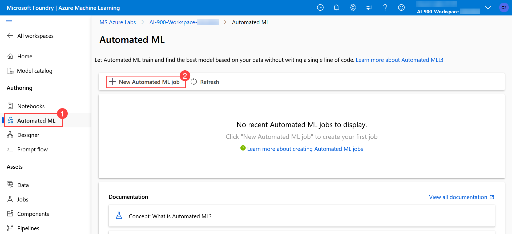  

1. Create a new Automated ML job with the following settings, using **Next (5)** as required to progress through the user interface:

    **Basic settings:**

    - **Job name**: mslearn-bike-automl **(1)**
    - **New experiment name**: mslearn-bike-rental **(2)**
    - **Description**: Automated machine learning for bike rental prediction **(3)**
    - **Tags**: *Leave default* **(4)**

       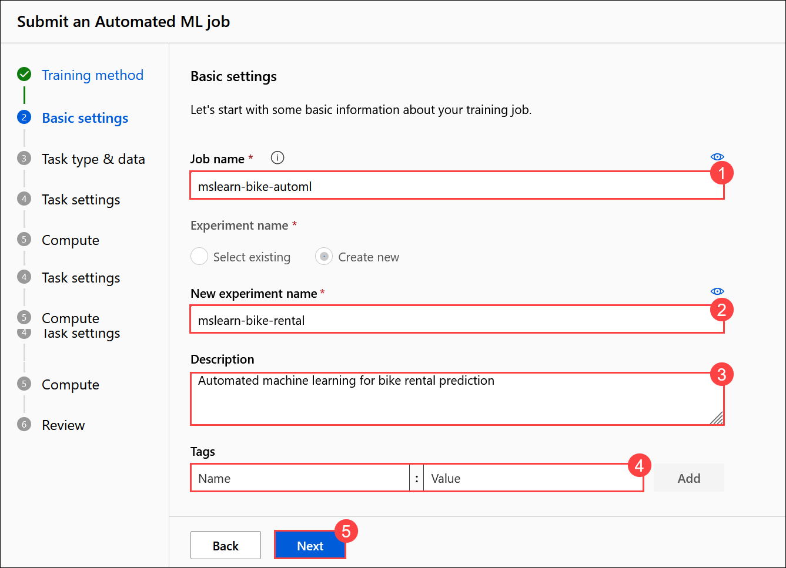

   **Task type & data:**

    - **Select task type**: **Regression** **(1)**
    - **Select data**: Select **+ Create (2)** 

        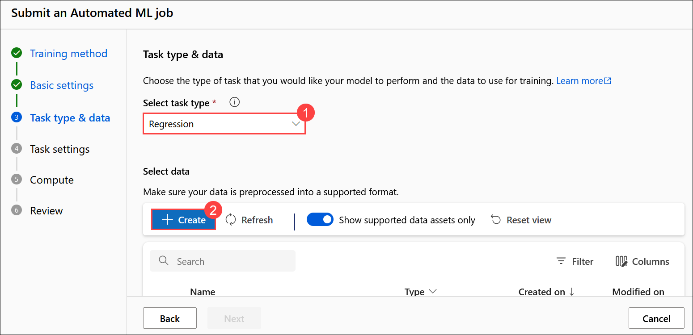

    - To create new data with the following settings:

         - **Data type:**
            
            - **Name**: **`bike-rentals` (1)**
            - **Description**: **`Historic bike rental data` (2)**
            - **Type**: **Table (mltable)** **(3)**
            - Click **Next (4)**

              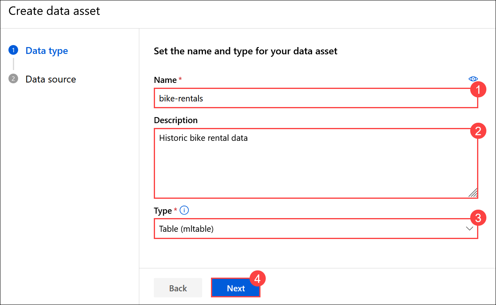
                
        - **Data source:**
            - Select **From local files (1)**
            - Click **Next (2)**
              
              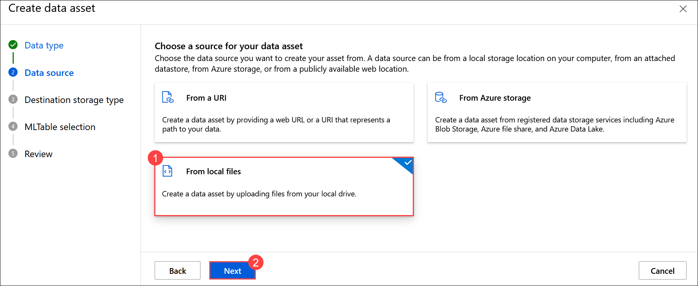
        
        - **Destination storage type:**
            - **Datastore type**: Azure Blob Storage **(1)**
            - **Name**: workspaceblobstore **(2)**
            - Click **Next (3)**

              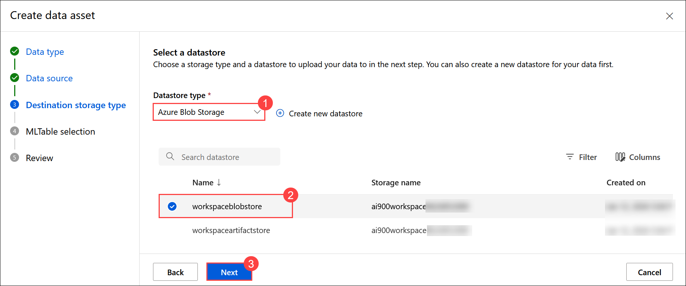
        
        - **MLtable selection:**
            
            - Open a new browser tab and download the file from `https://aka.ms/bike-rentals`.
            - Click the **Downloads (1)** icon in the browser and then click the **Folder (2)** icon to open the downloaded file location. 

                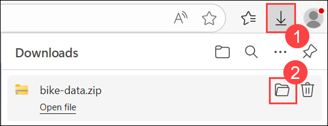

            - In the **Downloads** folder, right-click the **bike-data (1)** file and select **Extract All... (2)**. 

                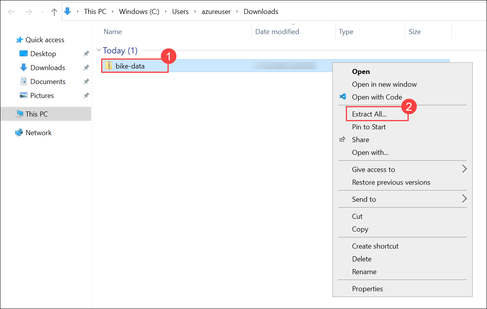

            - On the **Extract Compressed (Zipped) Folders** window, click **Extract** to unzip the files.

                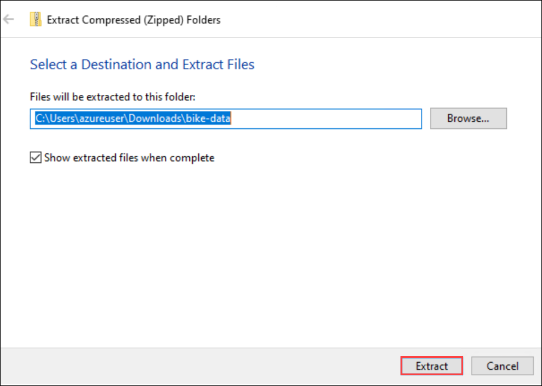

            - Navigate back to the tab in which you are proceeding with **MLtable selection** and click on **Upload folder**.

                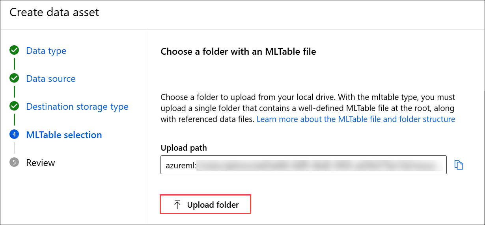

            - Select the **bike-data (1)** folder from the Downloads and click on **Upload (2)**.

                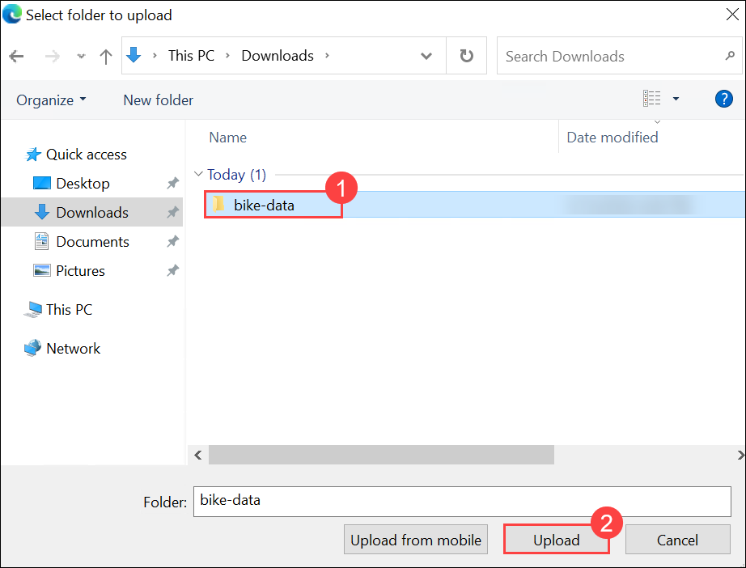

                >**Note:** If any upload related warning pop-up appears, click **Upload**. 

                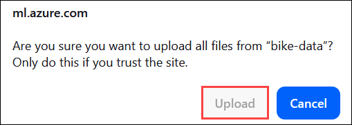

            - The data will get populated under **Upload list (1)** and then click on **Next (2)**. 

              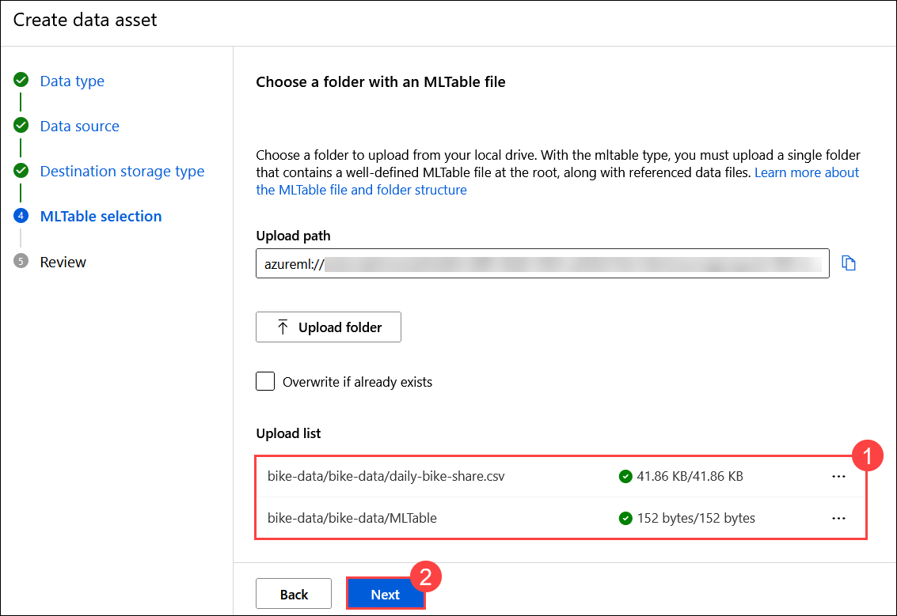
        
        - Select **Create** 
  
           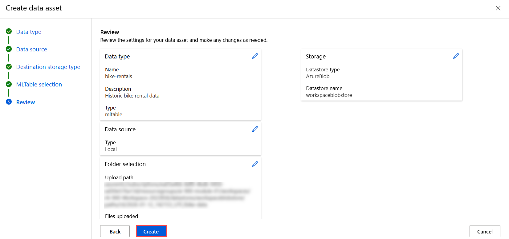
      
        - After the dataset is created, select the **bike-rentals (1)** dataset to continue to submit the Automated ML job. Select **Next (2)**

           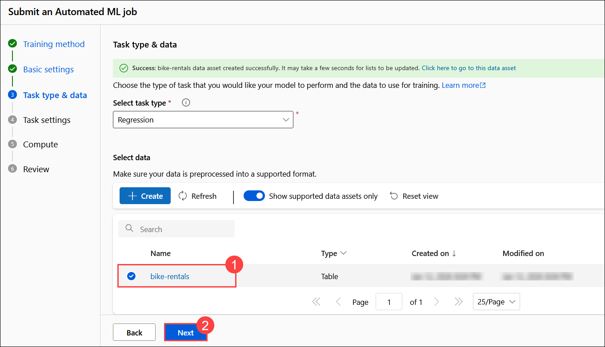
        
    **Task settings:**

    - **Task type**: Regression
    - **Data**: bike-rentals
    - **Target column**: rentals (integer) **(1)**
    - Select **View additional configuration settings (2)** under Target Column:
        - Primary metric: **Normalized root mean squared error** **(3)**
        - Make sure to **Uncheck (4)** the following boxes:
            - Explain best model: **Unselected** 
            - Enable ensemble stacking: **Unselected** 
            - Use all supported models: **Unselected**  *You'll restrict the job to try only a few specific algorithms.*
        - **Allowed models**: *Select only **RandomForest** and **LightGBM** **(5)** — normally you'd want to try as many as possible, but each model added increases the time it takes to run the job.*
        - Click on **Save (6)**.

       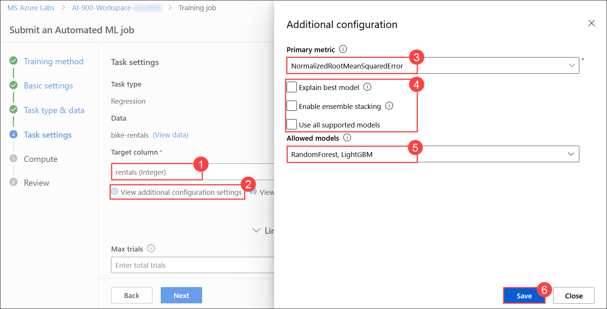

    - **Limits**: *Expand this section*

        - Max trials: **3** **(1)**
        - Max concurrent trials: **3** **(2)**
        - Max nodes: **3** **(3)**
        - Metric score threshold: **0.085** **(4)** (*so that if a model achieves a normalized root mean squared error metric score of 0.085 or less, the job ends.*)
        - Experiment Timeout: **15** **(5)**
        - Iteration timeout: **15** **(6)**
        - Enable early termination: *Selected* **(7)**

    - **Validation and test:**    
        
        - **Validation type**: Train-validation split **(8)**
        - **Percentage validation of data**: **10** **(9)**
        - **Test dataset**: None **(10)** and then select **Next (11)**

          

    **Compute:**
    
    - **Select compute type**: Serverless **(1)**
    - **Virtual machine type**: CPU **(2)**
    - **Virtual machine tier**: Dedicated **(3)**
    - **Virtual machine size**: Standard_DS3_V2 **(4)**
    - **Number of instances**: 1 **(5)** and then select **Next (6)**

      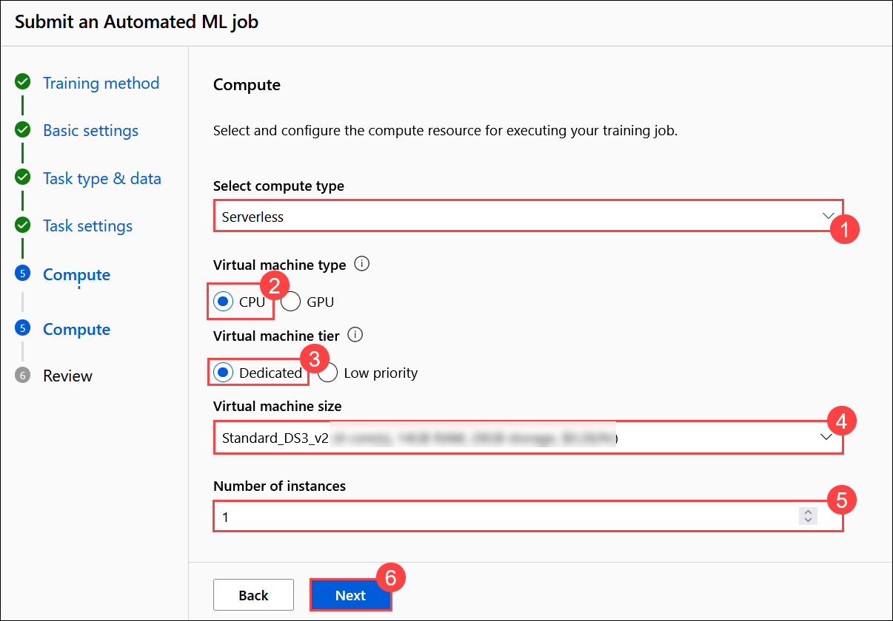

1. Select **Submit training job**. It starts automatically.

   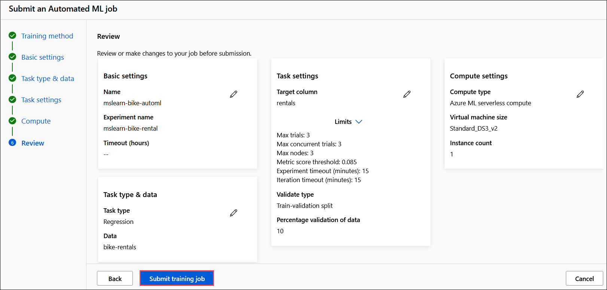

1. Wait for the job to finish. It might take around **10-15 minutes**, while — now might be a good time for a coffee break!

**Review the best model**

When the automated machine learning job has completed, you can review the best model it trained.

1. On the **Overview** tab of the automated machine learning job, note the best model summary.

    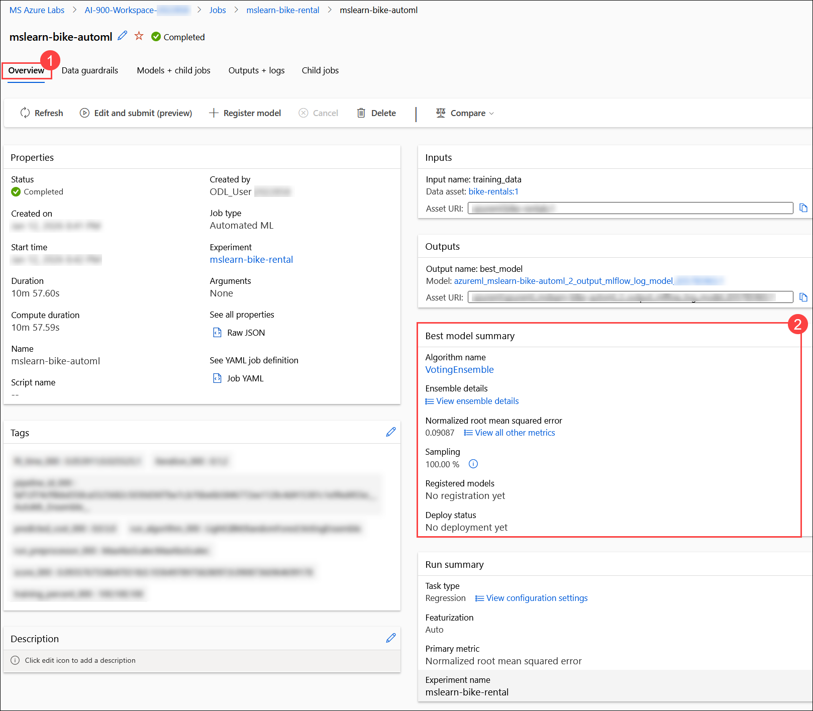

    > **Note**: You may see a message under the status "Warning: User specified exit score reached...". This is an expected message. Please continue to the next step.
  
1. Select the text under **Algorithm name** for the best model to view its details.

    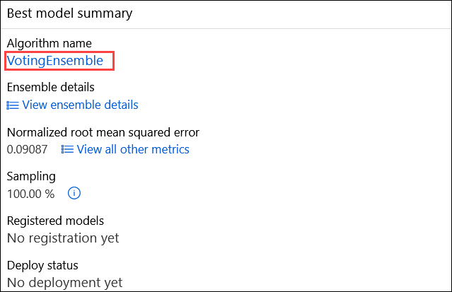

1. Select the **Metrics (1)** tab and select the **predicted_true (2)** and **residuals (3)**  charts if they are not already selected. 

    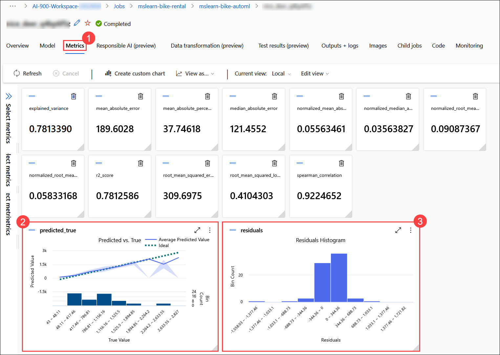

    >**Note:** Review the charts which show the performance of the model. The **residuals** chart shows the *residuals* (the differences between predicted and actual values) as a histogram. The **predicted_true** chart compares the predicted values against the true values.

### Task 3: Deploy and test the model

1. On the **Model** tab for the best model trained by your automated machine learning job, select **Deploy (1)** and use the **Real-time endpoint (2)** option to deploy the model with the following settings:

    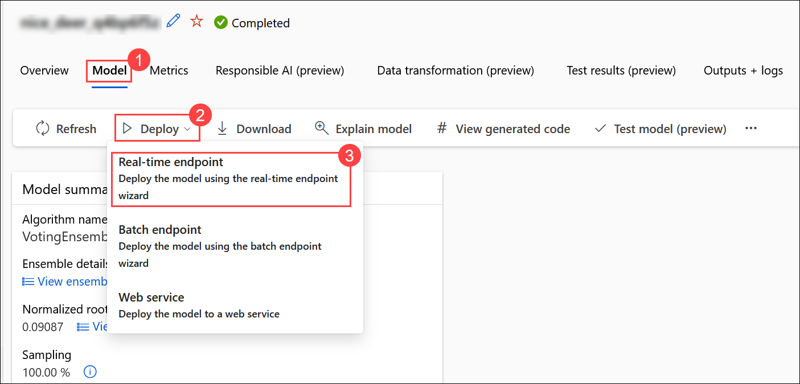

1. Ensure that the following settings are configured for the model and click on **Deploy (8)**.

   - **Instance count**: **3 (1)** 
    - **Virtual machine**: **Standard_DS3_v2 (2)**
    - **Endpoint**: **New (3)**
    - **Endpoint name**: *Leave the default name* **(4)**
    - **Deployment name**: *Leave default* **(5)**
    - **Inferencing data collection**: *Disabled* **(6)**
    - **Package Model**: *Disabled* **(7)**

    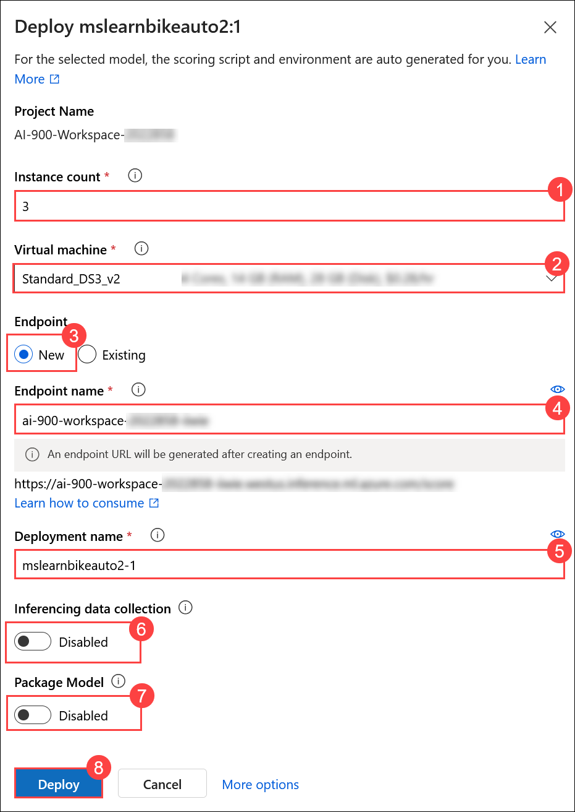

1. Wait for the **Deploy status** to change to *Succeeded*. This may take 5-10 minutes.

   >**Note**: Check the **Notifications** bar to verify the status of the operation.

### Task 4: Test the deployed service

Now you can test your deployed service.

1. From the left navigation pane under Assets click on **Endpoints (1)** and select the **Real-time endpoints (2)** tab and click on the **end-point (3)** created.

    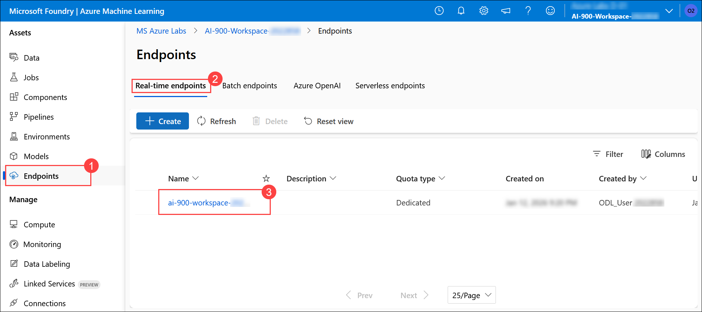

1. On the **real-time endpoint** page view the **Test** tab.

    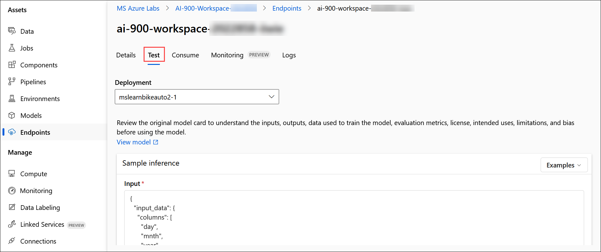

1. In the **Input (1)** section, replace the template JSON with the following input data and click the **Test (2)** button.

    ```json
      {
     "input_data": {
       "columns": [
         "day",
         "mnth",
         "year",
         "season",
         "holiday",
         "weekday",
         "workingday",
         "weathersit",
         "temp",
         "atemp",
         "hum",
         "windspeed"
       ],
       "index": [0],
       "data": [[1,1,2022,2,0,1,1,2,0.3,0.3,0.3,0.3]]
     }
    }

    ```

    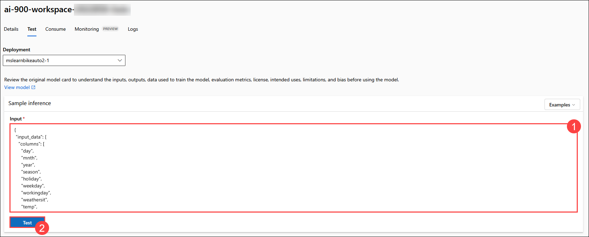

1. Review the test results, which include a predicted number of rentals based on the input features - similar to this:

    ```JSON
    [
      357.3995464578618
    ]
    ```

    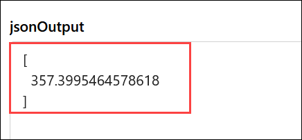

    The test pane took the input data and used the model you trained to return the predicted number of rentals.

Let's review what you have done. You used a dataset of historical bicycle rental data to train a model. The model predicts the number of bicycle rentals expected on a given day, based on seasonal and meteorological *features*.


> **Congratulations** on completing the task! Now, it's time to validate it. Here are the steps:
 
- Hit the Validate button for the corresponding task. You will receive a success message. 
- If not, carefully read the error message and retry the step, following the instructions in the lab guide.
- If you need any assistance, please contact us at cloudlabs-support@spektrasystems.com. We are available 24/7 to help you out.

  <validation step="aa2662f4-59fd-4d38-9d2f-201214b4f21b" />
  
### Review
In this lab, you have completed the following tasks:
- Created an *Azure Machine Learning workspace* resource
- Utilized automated machine learning to train a model
- Deployed the model

Let me know if you'd like any changes!
  
## You have successfully completed this lab.
