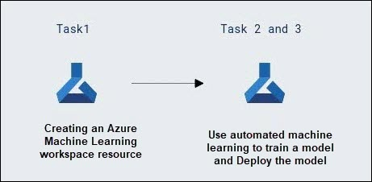

# AI-900: Microsoft Azure AI Fundamentals Workshop

Welcome to your AI-900: Microsoft Azure AI Fundamentals workshop! We've prepared a seamless environment for you to explore and learn Azure Services. Let's begin by making the most of this experience.

# Explore Automated Machine Learning in Azure Machine Learning

### Overall Estimated timing: 60 Minutes

## Overview

In this hands-on lab, you'll gain practical experience using the **browser-based Machine Learning Lab** to automate the process of training, evaluating, and deploying machine learning models. You will learn how to create a Machine Learning Lab workspace, use automated machine learning to train a regression model, and deploy the best-performing model as a real-time endpoint. By following step-by-step tasks, you'll upload and prepare data, configure an Automated ML job, review model performance, and test predictions using sample input. By the end of this lab, you'll understand how automated machine learning simplifies building and operationalizing predictive models without requiring Azure access or extensive coding.

## Objectives

By the end of this lab, you will be able to create a workspace in **Machine Learning Lab**, use automated machine learning to train a predictive model, and deploy the model as a real-time endpoint.

1. **Create a Machine Learning Lab workspace**: You will learn how to access the browser-based ML Lab environment and create a workspace to organize datasets, experiments, models, and endpoints.

2. **Train a model using automated machine learning**: You will use automated machine learning to train a regression model that predicts ice cream sales based on seasonal and weather-related features, and evaluate multiple algorithms to identify the best-performing model.

3. **Deploy and test the model**: You will deploy the trained model as a real-time endpoint and test it using sample input data to verify that it returns accurate predictions.

## Pre-requisites

Basic knowledge of Azure Machine Learning and machine learning concepts. Familiarity with working in the Azure Portal and understanding of datasets and model training would be beneficial.

## Architecture

In this hands-on lab, the architecture consists of a simplified end-to-end machine learning workflow using the browser-based Machine Learning Lab environment.

1. **Machine Learning Lab Workspace and Automated ML**: A workspace is created in ML Lab, and Automated Machine Learning is used to train a regression model on ice cream sales data by evaluating multiple algorithms and selecting the best-performing model.

2. **Model Deployment as a Real-Time Endpoint**: The selected model is deployed as a real-time endpoint, exposing a service that accepts input data and returns predictions for ice cream demand.

## Architecture Diagram

 

## Explanation of Components

1. **Azure Machine Learning Workspace**: A centralized platform for managing machine learning resources, experiments, and models. It allows users to set up, train, and evaluate models efficiently while managing datasets and compute resources.

2. **Automated Machine Learning (AutoML)**: A feature in Azure Machine Learning that automates the process of model selection, training, and evaluation. It allows users to quickly build and optimize models without extensive coding by trying multiple algorithms and configurations.

# Getting Started with lab
 
Welcome to your AI-900: Microsoft Azure AI Fundamentals workshop! We've prepared a seamless environment for you to explore and learn about machine learning and AI concepts and related Microsoft Azure services. Let's begin by making the most of this experience:
 
## Accessing Your Lab Environment
 
Once you're ready to dive in, your virtual machine and **Guide** will be right at your fingertips within your web browser.
 

## Virtual Machine & Lab Guide
 
Your virtual machine is your workhorse throughout the workshop. The lab guide is your roadmap to success.

## Exploring Your Lab Resources
 
To get a better understanding of your lab resources and credentials, navigate to the **Environment** tab.
 

## Lab Guide Zoom In/Zoom Out
 
To adjust the zoom level for the environment page, click the **A↕: 100%** icon located next to the timer in the lab environment.

## Utilizing the Split Window Feature
 
For convenience, you can open the lab guide in a separate window by selecting the **Split Window** button from the Top right corner.
 

## Managing Your Virtual Machine
 
Feel free to **Start, Stop, or Restart (2)** your virtual machine as needed from the **Resources (1)** tab. Your experience is in your hands!
 

## Track Your Progress

Click on the **Progress** tab to track your progress in the lab. The percentage increases as you complete each validation and reaches 100% when all validations are successfully completed.  

On the **Progress (1)** tab, you can view your overall points and validation status, **Validations 0/1 (2)**.    

## Lab Duration Extension

1. To extend the duration of the lab, kindly click the **Hourglass** icon in the top right corner of the lab environment. 

    

    >**Note:** You will get the **Hourglass** icon when 10 minutes are remaining in the lab.

2. Click **OK** to extend your lab duration.
 
   

3. If you have not extended the duration prior to when the lab is about to end, a pop-up will appear, giving you the option to extend. Click **OK** to proceed.

## Let's Get Started with Azure Portal
 
1. On your virtual machine, click on the **Azure Portal** icon as shown below:
 
   .png)

2. You'll see the **Sign into Microsoft Azure** tab. Here, enter your **credentials (1)** and click on **Next (2)**:
 
   - **Email/Username:** <inject key="AzureAdUserEmail"></inject>
 
       
 
3. Next, provide your **password (1)** and click on **Next (2)**:
 
   - **Password:** <inject key="AzureAdUserPassword"></inject>
 
     
 
4. If you see the pop-up **Stay-Signed in?**, click **No**.

    
 
5. If a **Welcome to Microsoft Azure** pop-up window appears, simply click **Cancel**.

    

## Support Contact
 
The CloudLabs support team is available 24/7, 365 days a year, via email and live chat to ensure seamless assistance at any time. We offer dedicated support channels explicitly tailored for both learners and instructors, ensuring that all your needs are promptly and efficiently addressed.
 
Learner Support Contacts:
 
- Email Support: cloudlabs-support@spektrasystems.com
- Live Chat Support: https://cloudlabs.ai/labs-support

Click on **Next** from the lower right corner to move on to the next page.

   .png)

## Happy Learning !!

