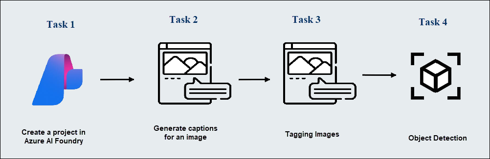

# AI-900: Microsoft Azure AI Fundamentals Workshop

Welcome to your AI-900: Microsoft Azure AI Fundamentals workshop! We've prepared a seamless environment for you to explore and learn Azure Services. Let's begin by making the most of this experience.

# Lab 03: Analyze images in the Microsoft Foundry portal

### Overall Estimated timing: 30 Minutes

## Overview

In this lab, you'll explore Azure AI Vision within the Microsoft Foundry portal to analyze images and extract meaningful information. By using built-in experiences, such as caption generation, image tagging, and object detection, you'll understand how to leverage AI to monitor and interpret images, like those from cameras in a "smart store." You'll be able to apply these tools to provide descriptions, tags, and insights into the content of images, supporting applications like customer assistance in retail environment

## Objectives

By the end of this lab, you will be able to use Azure AI Vision to analyze images and extract information for real-world scenarios. Specifically, you will learn to:

1. **Create a project in Microsoft Foundry portal**: Set up an AI project in the Microsoft Foundry portal to organize and manage your image analysis tasks.

2. **Generate captions and dense captions**: Use Azure AI Vision's captioning capabilities to generate descriptions for images and identify objects within them.

3. **Tag images**: Analyze images and generate a list of descriptive tags, including objects and actions.

4. **Perform object detection**: Identify and label objects within images using bounding boxes and confidence scores.

## Pre-requisites

Basic knowledge of Azure and Azure AI services and familiarity with image analysis concepts like captions, tags, and object detection.

## Architecture

In this lab, the architecture flow involves the following components:

1. **Microsoft Foundry Portal**: A centralized platform for creating and managing AI projects. 

2. **Azure AI Vision**: A service used to analyze images, generate captions, detect objects, and tag them with relevant labels.

## Architecture Diagram

## Explanation of Components

1. **Microsoft Foundry Portal**: A platform that enables you to create projects and organize AI experimentation. It serves as the workspace for working with Azure AI Vision, allowing you to configure and manage resources, run tests, and analyze image data.

2. **Azure AI Vision**: A set of powerful tools for understanding and extracting information from images. It provides capabilities such as captioning, object detection, and tag extraction, making it easy to analyze visual content and integrate these insights into applications.

# Getting Started with lab
 
Welcome to your AI-900: Microsoft Azure AI Fundamentals workshop! We've prepared a seamless environment for you to explore and learn about machine learning and AI concepts and related Microsoft Azure services. Let's begin by making the most of this experience:
 
## Accessing Your Lab Environment
 
Once you're ready to dive in, your virtual machine and **Guide** will be right at your fingertips within your web browser.
 

## Virtual Machine & Lab Guide
 
Your virtual machine is your workhorse throughout the workshop. The lab guide is your roadmap to success.

## Exploring Your Lab Resources
 
To get a better understanding of your lab resources and credentials, navigate to the **Environment** tab.
 

## Lab Guide Zoom In/Zoom Out
 
To adjust the zoom level for the environment page, click the **A↕: 100%** icon located next to the timer in the lab environment.

## Utilizing the Split Window Feature
 
For convenience, you can open the lab guide in a separate window by selecting the **Split Window** button from the Top right corner.
 

## Managing Your Virtual Machine
 
Feel free to **Start, Stop, or Restart (2)** your virtual machine as needed from the **Resources (1)** tab. Your experience is in your hands!
 

## Track Your Progress

Click on the **Progress** tab to track your progress in the lab. The percentage increases as you complete each validation and reaches 100% when all validations are successfully completed.  

On the **Progress (1)** tab, you can view your overall points and validation status, **Validations 0/1 (2)**.    

## Lab Duration Extension

1. To extend the duration of the lab, kindly click the **Hourglass** icon in the top right corner of the lab environment. 

    

    >**Note:** You will get the **Hourglass** icon when 10 minutes are remaining in the lab.

2. Click **OK** to extend your lab duration.
 
   

3. If you have not extended the duration prior to when the lab is about to end, a pop-up will appear, giving you the option to extend. Click **OK** to proceed.

## Let's Get Started with Azure Portal
 
1. On your virtual machine, click on the Azure Portal icon as shown below:
 
   .png)

2. You'll see the **Sign into Microsoft Azure** tab. Here, enter your **credentials (1)** and click on **Next (2)**:
 
   - **Email/Username:** <inject key="AzureAdUserEmail"></inject>
 
       
 
3. Next, provide your **password (1)** and click on **Next (2)**:
 
   - **Password:** <inject key="AzureAdUserPassword"></inject>
 
     
 
4. If you see the pop-up **Stay-Signed in?**, click **No**.

      
 
5. If a **Welcome to Microsoft Azure** pop-up window appears, simply click **Cancel**.

    

## Support Contact
 
The CloudLabs support team is available 24/7, 365 days a year, via email and live chat to ensure seamless assistance at any time. We offer dedicated support channels explicitly tailored for both learners and instructors, ensuring that all your needs are promptly and efficiently addressed.
 
Learner Support Contacts:
 
- Email Support: cloudlabs-support@spektrasystems.com
- Live Chat Support: https://cloudlabs.ai/labs-support

Click on **Next** from the lower right corner to move on to the next page.

   .png)

## Happy Learning !!

