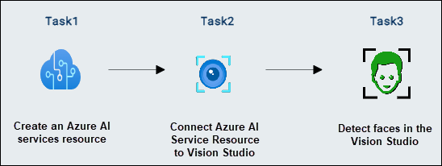
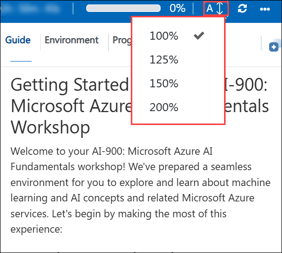

# AI-900: Microsoft Azure AI Fundamentals Workshop

Welcome to your AI-900: Microsoft Azure AI Fundamentals workshop! We've prepared a seamless environment for you to explore and learn Azure Services. Let's begin by making the most of this experience.

# Lab 04: Detect faces in Vision Studio

### Overall Estimated timing: 30 Minutes

## Overview

In this hands-on lab, you'll gain practical experience in using Azure AI services to detect human faces in images with Vision Studio. You will learn how to create and configure an Azure AI Services resource, connect it to Vision Studio, and utilize Azure AI Face to analyze images. By following step-by-step tasks, you’ll explore how to detect facial features, identify bounding box coordinates, and analyze partially obscured faces. By the end of this lab, you'll be proficient in setting up and using Vision Studio for face detection, equipping you with the skills to leverage Azure AI for computer vision applications in real-world scenarios.

## Objectives

By the end of this lab, you will be able to create a project in Microsoft Foundry and analyze a receipt using Azure AI Document Intelligence to extract key information efficiently

1. **Create a project in Microsoft Foundry portal**: You will learn about configuring an Microsoft Foundry project, provisioning necessary AI resources, and exploring Vision and Document Intelligence capabilities for automated data extraction.

2. **Explore speech to text in Microsoft Foundry's Speech Playground**: You will learn about using Azure AI Speech to Text to convert spoken language into written text, extract key insights from audio data, and interpret the results for further processing.

## Pre-requisites

Basic knowledge of Azure AI services and Speech service.

## Architecture

In this hands-on lab, the architecture flow includes several essential components.

1. **Create a project in Microsoft Foundry portal**: Understanding how to set up a new project in Microsoft Foundry, including configuring AI resources to support Vision and Document Intelligence capabilities. This involves selecting the appropriate AI models, setting up access permissions, and ensuring the project is properly structured for document processing workflows.

1. **Explore Speech to Text in Microsoft Foundry's Speech Playground**: Learning how to convert spoken language into text using Microsoft Foundry's Speech Playground. This includes uploading or recording audio, analyzing transcriptions, and extracting key insights such as speaker identification, timestamps, and sentiment analysis. Additionally, understanding how to integrate the transcribed data into business applications for automation and enhanced accessibility.

## Architecture Diagram

## Explanation of Components

1. **Microsoft Foundry**: A centralized platform for managing AI projects, models, and experiments. It provides tools for building, testing, and deploying AI solutions.  

2. **Azure AI Speech**: A cloud-based service that enables speech-to-text, text-to-speech, and speech translation capabilities. It provides tools for real-time transcription, voice synthesis, and speaker recognition, allowing developers to integrate natural voice interactions into applications.

# Getting Started with lab
 
Welcome to your AI-900: Microsoft Azure AI Fundamentals workshop! We've prepared a seamless environment for you to explore and learn about machine learning and AI concepts and related Microsoft Azure services. Let's begin by making the most of this experience:
 
## Accessing Your Lab Environment
 
Once you're ready to dive in, your virtual machine and **lab guide** will be right at your fingertips within your web browser.
 

### Virtual Machine & Lab Guide
 
Your virtual machine is your workhorse throughout the workshop. The lab guide is your roadmap to success.

## Exploring Your Lab Resources
 
To get a better understanding of your lab resources and credentials, navigate to the **Environment** tab.
 

## Lab Guide Zoom In/Zoom Out
 
To adjust the zoom level for the environment page, click the **A↕: 100%** icon located next to the timer in the lab environment.

## Utilizing the Split Window Feature
 
For convenience, you can open the lab guide in a separate window by selecting the **Split Window** button from the Top right corner.
 

## Managing Your Virtual Machine
 
Feel free to **start, stop, or restart (2)** your virtual machine as needed from the **Resources (1)** tab. Your experience is in your hands!
 

## Lab Duration Extension

1. To extend the duration of the lab, kindly click the **Hourglass** icon in the top right corner of the lab environment. 

    

    >**Note:** You will get the **Hourglass** icon when 10 minutes are remaining in the lab.

2. Click **OK** to extend your lab duration.
 
   

3. If you have not extended the duration prior to when the lab is about to end, a pop-up will appear, giving you the option to extend. Click **OK** to proceed.

## Let's Get Started with Azure Portal
 
1. On your virtual machine, click on the Azure Portal icon as shown below:
 
   .png)

2. You'll see the **Sign into Microsoft Azure** tab. Here, enter your **credentials (1)** and click on **Next (2)**:
 
   - **Email/Username:** <inject key="AzureAdUserEmail"></inject> 
 
       
 
3. Next, provide your **password (1)** and click on **Sign in (2)**:
 
   - **Password:** <inject key="AzureAdUserPassword"></inject> 
 
       
 
4. If you see the pop-up Stay-Signed in?, click **No**.

    

5. If a **Welcome to Microsoft Azure** pop-up window appears, simply click **Cancel**.

    

## Support Contact
 
The CloudLabs support team is available 24/7, 365 days a year, via email and live chat to ensure seamless assistance at any time. We offer dedicated support channels explicitly tailored for both learners and instructors, ensuring that all your needs are promptly and efficiently addressed.
 
Learner Support Contacts:
 
- Email Support: cloudlabs-support@spektrasystems.com
- Live Chat Support: https://cloudlabs.ai/labs-support

Click on **Next** from the lower right corner to move on to the next page.

   .png)

## Happy Learning !!
