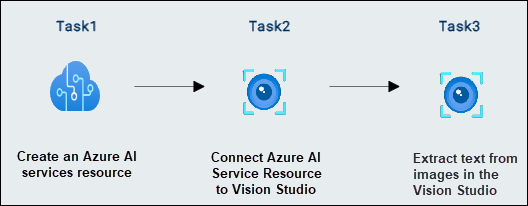
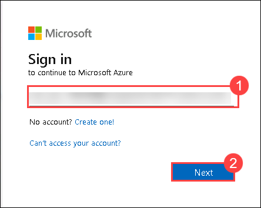
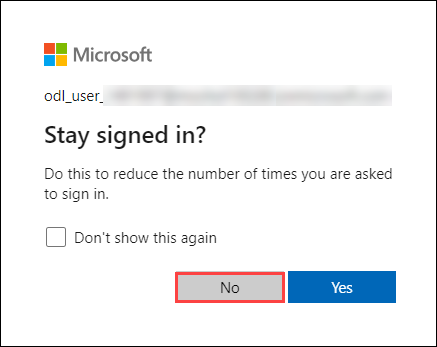

# AI-900: Microsoft Azure AI Fundamentals Workshop

Welcome to your AI-900: Microsoft Azure AI Fundamentals workshop! We've prepared a seamless environment for you to explore and learn Azure Services. Let's begin by making the most of this experience.

# Read text in Vision Studio

### Overall Estimated timing: 30 minutes

## Overview

In this exercise, you will explore the optical character recognition (OCR) capabilities of Azure AI Vision through Vision Studio. OCR enables the detection and interpretation of text embedded within images. This exercise allows you to use Azure AI services to extract text from various types of images without writing any code.

## Objectives

By the end of this lab, you will be able to:

1. Create an **Azure AI Speech** resource to enable OCR capabilities.

2. Connect your **Azure AI service** resource to **Vision Studio** for image analysis.

3. Extract text from images using **OCR technology** in Vision Studio

## Pre-requisites

Basic understanding of Azure AI services and familiarity with Azure portal and Vision Studio.

## Architecture

The architecture for this lab involves the following components:

1. **Azure AI Services** – A multi-service resource that provides access to various AI capabilities, including OCR.

2. **Vision Studio** – The interface where users interact with Azure AI Vision services to experiment with image and text analysis.

## Architecture Diagram

## Explanation of Components

1. **Azure AI Services**: This multi-service resource allows you to integrate various AI capabilities, including OCR, vision, language, and decision-making. It serves as the foundation for accessing Azure AI Vision's text recognition capabilities.

2. **Vision Studio**: Vision Studio is a web-based platform where users can experiment with and access various vision and document capabilities. In this lab, it’s used to upload images and extract text through OCR, providing an interactive and user-friendly experience without requiring code.

# Getting Started with lab
 
Welcome to your AI-900: Microsoft Azure AI Fundamentals workshop! We've prepared a seamless environment for you to explore and learn about machine learning and AI concepts and related Microsoft Azure services. Let's begin by making the most of this experience:
 
## Accessing Your Lab Environment
 
Once you're ready to dive in, your virtual machine and **lab guide** will be right at your fingertips within your web browser.
 

### Virtual Machine & Lab Guide
 
Your virtual machine is your workhorse throughout the workshop. The lab guide is your roadmap to success.

## Exploring Your Lab Resources
 
To get a better understanding of your lab resources and credentials, navigate to the **Environment** tab.
 

## Lab Guide Zoom In/Zoom Out
 
To adjust the zoom level for the environment page, click the **A↕: 100%** icon located next to the timer in the lab environment.

## Utilizing the Split Window Feature
 
For convenience, you can open the lab guide in a separate window by selecting the **Split Window** button from the Top right corner.
 

## Managing Your Virtual Machine
 
Feel free to **start, stop, or restart (2)** your virtual machine as needed from the **Resources (1)** tab. Your experience is in your hands!
 

## Lab Duration Extension

1. To extend the duration of the lab, kindly click the **Hourglass** icon in the top right corner of the lab environment. 

    

    >**Note:** You will get the **Hourglass** icon when 10 minutes are remaining in the lab.

2. Click **OK** to extend your lab duration.
 
   

3. If you have not extended the duration prior to when the lab is about to end, a pop-up will appear, giving you the option to extend. Click **OK** to proceed.

## Let's Get Started with Azure Portal
 
1. On your virtual machine, click on the Azure Portal icon as shown below:
 
   .png)

2. You'll see the **Sign into Microsoft Azure** tab. Here, enter your **credentials (1)** and click on **Next (2)**:
 
   - **Email/Username:** <inject key="AzureAdUserEmail"></inject>
 
       
 
3. Next, provide your **password (1)** and click on **Sign in (2)**:
 
   - **Password:** <inject key="AzureAdUserPassword"></inject>
 
     
 
4. If you see the pop-up Stay-Signed in?, click **No**.

    
 
7. If a **Welcome to Microsoft Azure** pop-up window appears, simply click **Cancel**.

    

## Support Contact
 
The CloudLabs support team is available 24/7, 365 days a year, via email and live chat to ensure seamless assistance at any time. We offer dedicated support channels explicitly tailored for both learners and instructors, ensuring that all your needs are promptly and efficiently addressed.
 
Learner Support Contacts:
 
- Email Support: cloudlabs-support@spektrasystems.com
- Live Chat Support: https://cloudlabs.ai/labs-support

Click on **Next** from the lower right corner to move on to the next page.

   .png)

## Happy Learning !!

