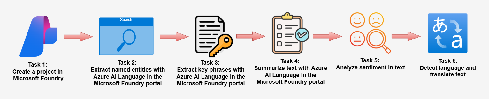

# AI-900: Microsoft Azure AI Fundamentals Workshop

Welcome to your AI-900: Microsoft Azure AI Fundamentals workshop! We've prepared a seamless environment for you to explore and learn Azure Services. Let's begin by making the most of this experience.

# Analyze text in the Microsoft Foundry portal

### Overall Estimated timing: 30 Minutes

## Overview:

In this hands-on lab, you will gain practical experience analyzing text using the Microsoft Foundry portal, a platform for building intelligent applications with Azure AI Language and Translator services. You will learn how to create and configure a project in the Microsoft Foundry portal and explore key Natural Language Processing (NLP) capabilities. Throughout the lab, you will extract named entities, identify key phrases, generate text summaries, analyze sentiment, detect the language of text, and translate content between languages. By the end of this lab, you will understand how to use Microsoft Foundry to perform advanced text analysis and extract meaningful insights from unstructured text data in real-world scenarios.

## Objectives

By the end of this lab, you will be able to:

* **Create and configure a project in the Microsoft Foundry portal:** Learn how to set up a project in Microsoft Foundry to use Azure AI Language capabilities for text analysis.

* **Extract named entities from text:** Use Azure AI Language to identify and categorize entities such as people, locations, and organizations within a hotel review.

* **Extract key phrases from text:** Identify the most important phrases in a piece of text to quickly understand the main topics being discussed.

* **Generate text summaries:** Use Azure AI Language to create concise summaries by extracting the most relevant sentences from a larger body of text.

* **Analyze sentiment in text:** Determine whether the sentiment expressed in text is positive, negative, or neutral, along with sentence-level sentiment insights.

* **Detect the language of text:** Use Azure AI Language to automatically identify the language in which a piece of text is written.

* **Translate text between languages:** Use Azure AI Translator to translate text from one language to another while preserving the meaning and context.

## Pre-requisites

Basic knowledge of Azure AI services, Microsoft Foundry and Azure AI Language.

## Architecture

In this hands-on lab, the architecture demonstrates how **Azure AI Language and Azure AI Translator** services are used within the **Microsoft Foundry portal** to analyze and process text using Natural Language Processing (NLP) capabilities.

1. **Create a project in Microsoft Foundry portal:**
   The workflow begins by creating a project in the Microsoft Foundry portal and configuring the required Azure AI resources. This setup enables access to Azure AI Language and Translator capabilities for performing text analysis and language processing tasks.

2. **Extract named entities with Azure AI Language:**
   Named Entity Recognition (NER) identifies important elements within unstructured text, such as people, organizations, locations, and dates. This capability helps structure unorganized text data and enables better information extraction and categorization.

3. **Extract key phrases with Azure AI Language:**
   Key phrase extraction automatically identifies the most important words or phrases within a document. This helps highlight the main topics discussed in the text and enables quicker understanding of large volumes of information.

4. **Summarize text with Azure AI Language:**
   Text summarization generates a concise overview of longer content by selecting the most relevant sentences. This helps users quickly understand the main ideas in documents such as reviews, reports, or feedback.

5. **Analyze sentiment in text:**
   Sentiment analysis evaluates the emotional tone of text by determining whether it expresses positive, neutral, or negative sentiment. This is commonly used to analyze customer feedback and understand user opinions.

6. **Detect language in text:**
   Language detection identifies the language in which text is written and provides a confidence score. This enables applications to process multilingual content more effectively.

7. **Translate text with Azure AI Translator:**
   Azure AI Translator converts text from one language to another while preserving its meaning and context. This capability enables organizations to analyze and understand content written in different languages.

## Architecture Diagram

## Explanation of Components:

1. **Microsoft Foundry:** A centralized platform for managing AI projects, models, and experiments. It provides tools for building, testing, and deploying AI solutions.    

1. **Azure AI Language**: A cloud-based service that enables natural language processing (NLP) capabilities, including text analysis, entity recognition, sentiment analysis, and language understanding. It provides tools for extracting insights from text, building conversational AI, and enhancing search experiences.

# Getting Started with lab
 
Welcome to your AI-900: Microsoft Azure AI Fundamentals workshop! We've prepared a seamless environment for you to explore and learn about machine learning and AI concepts and related Microsoft Azure services. Let's begin by making the most of this experience:
 
## Accessing Your Lab Environment
 
Once you're ready to dive in, your virtual machine and **Guide** will be right at your fingertips within your web browser.
 

## Virtual Machine & Lab Guide
 
Your virtual machine is your workhorse throughout the workshop. The lab guide is your roadmap to success.

## Exploring Your Lab Resources
 
To get a better understanding of your lab resources and credentials, navigate to the **Environment** tab.
 

## Lab Guide Zoom In/Zoom Out
 
To adjust the zoom level for the environment page, click the **A↕: 100%** icon located next to the timer in the lab environment.

## Utilizing the Split Window Feature
 
For convenience, you can open the lab guide in a separate window by selecting the **Split Window** button from the Top right corner.
 

## Managing Your Virtual Machine
 
Feel free to **Start, Stop, or Restart (2)** your virtual machine as needed from the **Resources (1)** tab. Your experience is in your hands!
 

## Track Your Progress

Click on the **Progress** tab to track your progress in the lab. The percentage increases as you complete each validation and reaches 100% when all validations are successfully completed.  

On the **Progress (1)** tab, you can view your overall points and validation status, **Validations 0/1 (2)**.    

## Lab Duration Extension

1. To extend the duration of the lab, kindly click the **Hourglass** icon in the top right corner of the lab environment. 

    

    >**Note:** You will get the **Hourglass** icon when 10 minutes are remaining in the lab.

2. Click **OK** to extend your lab duration.
 
   

3. If you have not extended the duration prior to when the lab is about to end, a pop-up will appear, giving you the option to extend. Click **OK** to proceed.

## Let's Get Started with Azure Portal
 
1. On your virtual machine, click on the **Azure Portal** icon as shown below:
 
   .png)

2. You'll see the **Sign into Microsoft Azure** tab. Here, enter your **credentials (1)** and click on **Next (2)**:
 
   - **Email/Username:** <inject key="AzureAdUserEmail"></inject>
 
       
 
3. Next, provide your **password (1)** and click on **Next (2)**:
 
   - **Password:** <inject key="AzureAdUserPassword"></inject>
 
     
 
4. If you see the pop-up **Stay-Signed in?**, click **No**.

      
 
6. If a **Welcome to Microsoft Azure** pop-up window appears, simply click **Cancel**.

    

## Support Contact
 
The CloudLabs support team is available 24/7, 365 days a year, via email and live chat to ensure seamless assistance at any time. We offer dedicated support channels explicitly tailored for both learners and instructors, ensuring that all your needs are promptly and efficiently addressed.
 
Learner Support Contacts:
 
- Email Support: cloudlabs-support@spektrasystems.com
- Live Chat Support: https://cloudlabs.ai/labs-support

Click on **Next** from the lower right corner to move on to the next page.

   .png)

## Happy Learning !!
