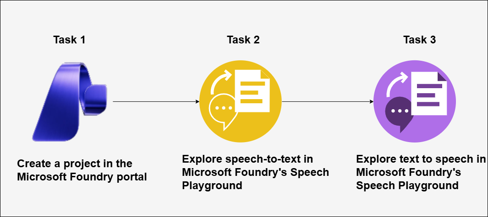

# AI-900: Microsoft Azure AI Fundamentals Workshop

Welcome to your AI-900: Microsoft Azure AI Fundamentals workshop! We've prepared a seamless environment for you to explore and learn Azure Services. Let's begin by making the most of this experience.

# Module 09 : Explore Speech in Microsoft Foundry portal

### Overall Estimated timing: 30 minutes

## Overview

In this hands-on lab, you'll gain practical experience in leveraging Azure AI Speech services within the Microsoft Foundry portal. You will learn how to create and configure an Azure AI Speech project, explore real-time speech-to-text transcription, and work with Azure AI Speech Playground. Through interactive exercises, you will transcribe audio files into text and understand how speech services can be integrated into intelligent applications. By the end of this lab, you will be proficient in using Azure AI Speech for audio transcription, equipping you with the skills to build AI-powered voice applications in your organization’s Azure environment.

## Objective

By the end of this lab, you will be able to create a project in Microsoft Foundry and use Azure AI Speech to Text to convert spoken language into written text, extract key insights from audio data, and interpret the results for further processing efficiently.

1. **Create a project in Microsoft Foundry portal**: You will learn about configuring an Microsoft Foundry project, provisioning necessary AI resources, and exploring Vision and Document Intelligence capabilities for automated data extraction.

1. **Explore speech to text in Microsoft Foundry's Speech Playground**: You will learn about using Azure AI Speech to convert spoken language into written text, extract key insights from audio data, and interpret the results for further processing.

1. **Explore text to speech in Microsoft Foundry's Speech Playground**: You will learn about using Azure AI Speech text into spoken language, extract key insights from audio data, and interpret the results for further processing.

## Pre-requisites

Basic knowledge of Azure AI services and Azure Speech Service.

## Architecture

In this hands-on lab, the architecture flow includes several essential components.

1. **Microsoft Foundry Portal:** A centralized platform for creating and managing AI projects and accessing built-in AI playgrounds.

1. **Azure AI Speech Service:** A cloud-based AI service that provides speech recognition and speech synthesis capabilities.

1. **Speech Playground:** An interactive environment within Microsoft Foundry used to explore speech-to-text and text-to-speech features without writing code.

1. **Audio Input File:** An audio file used as input for speech-to-text transcription in the Speech Playground.

1. **Text Input:** Text provided as input for text-to-speech synthesis using available voice models.

## Architecture Diagram

## Explanation of Components:

1. **Microsoft Foundry Portal:** Microsoft Foundry is the web-based portal used to create and manage AI projects. In this lab, it provides access to the Speech Playground and connects the project to the Azure AI Speech service, enabling hands-on exploration of speech capabilities.

1. **Azure AI Speech Service:**
Azure AI Speech is a managed AI service that enables converting spoken language into text and synthesizing speech from text. In this lab, it processes uploaded audio files for real-time transcription and generates audio output from text using prebuilt voice models.

1. **Speech Playground:**
The Speech Playground is a built-in experience within Microsoft Foundry that allows users to test Azure AI Speech features interactively. It provides tools for real-time speech-to-text transcription and text-to-speech synthesis using preconfigured resources.

# Getting Started with lab
 
Welcome to your AI-900: Microsoft Azure AI Fundamentals workshop! We've prepared a seamless environment for you to explore and learn about machine learning and AI concepts and related Microsoft Azure services. Let's begin by making the most of this experience:
 
## Accessing Your Lab Environment
 
Once you're ready to dive in, your virtual machine and **Guide** will be right at your fingertips within your web browser.
 

### Virtual Machine & Lab Guide
 
Your virtual machine is your workhorse throughout the workshop. The lab guide is your roadmap to success.

## Exploring Your Lab Resources
 
To get a better understanding of your lab resources and credentials, navigate to the **Environment** tab.
 

## Lab Guide Zoom In/Zoom Out
 
To adjust the zoom level for the environment page, click the **A↕: 100%** icon located next to the timer in the lab environment.

## Utilizing the Split Window Feature
 
For convenience, you can open the lab guide in a separate window by selecting the **Split Window** button from the Top right corner.
 

## Managing Your Virtual Machine
 
Feel free to **Start, Stop, or Restart (2)** your virtual machine as needed from the **Resources (1)** tab. Your experience is in your hands!
 

## Lab Duration Extension

1. To extend the duration of the lab, kindly click the **Hourglass** icon in the top right corner of the lab environment. 

    

    >**Note:** You will get the **Hourglass** icon when 10 minutes are remaining in the lab.

2. Click **OK** to extend your lab duration.
 
   

3. If you have not extended the duration prior to when the lab is about to end, a pop-up will appear, giving you the option to extend. Click **OK** to proceed.

## Let's Get Started with Azure Portal
 
1. On your virtual machine, click on the Azure Portal icon as shown below:
 
   .png)

2. You'll see the **Sign into Microsoft Azure** tab. Here, enter your credentials:
 
   - **Email/Username:** <inject key="AzureAdUserEmail"></inject>
 
       
 
3. Next, provide your password:
 
   - **Password:** <inject key="AzureAdUserPassword"></inject>
 
     
 
4. If prompted to stay signed in, you can click "No."

    
 
5. If a **Welcome to Microsoft Azure** pop-up window appears, simply click **Cancel**.

## Support Contact
 
The CloudLabs support team is available 24/7, 365 days a year, via email and live chat to ensure seamless assistance at any time. We offer dedicated support channels explicitly tailored for both learners and instructors, ensuring that all your needs are promptly and efficiently addressed.
 
Learner Support Contacts:
 
- Email Support: cloudlabs-support@spektrasystems.com
- Live Chat Support: https://cloudlabs.ai/labs-support

Click on **Next** from the lower right corner to move on to the next page.

   .png)

## Happy Learning !!
