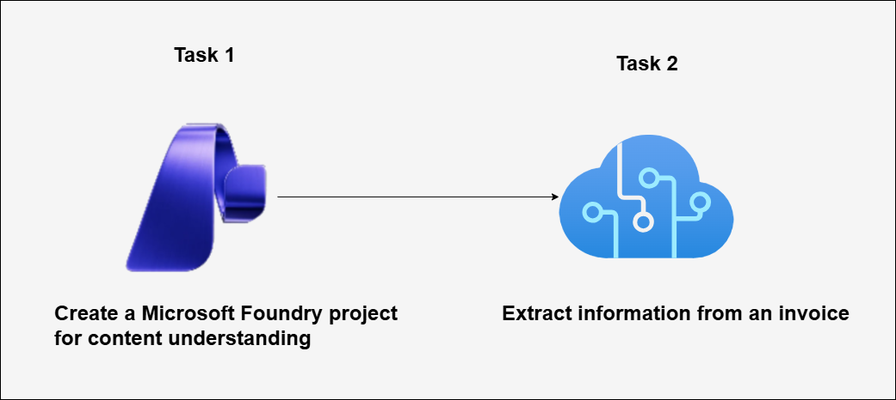

# AI-900: Microsoft Azure AI Fundamentals Workshop

Welcome to your AI-900: Microsoft Azure AI Fundamentals workshop! We've prepared a seamless environment for you to explore and learn Azure Services. Let's begin by making the most of this experience.

# Extract data with Content Understanding in Microsoft Foundry

### Overall Estimated timing: 30 minutes

## Overview

**Azure AI Content Understanding** enables multi-modal analysis of documents, images, audio, and video to extract structured information. In this lab, you will use Content Understanding within Microsoft Foundry to create a project and analyze an invoice document, reviewing the extracted fields and JSON output for downstream use.

## Objectives

By the end of this lab, you will be able to create a project in Microsoft Foundry and use Azure AI Content Understanding to extract key information from an invoice efficiently.

1. **Create a project in Microsoft Foundry:** You will learn how to create and configure a project using the Microsoft Foundry portal and understand how Foundry provisions the required AI resources.

2. **Extract information from an invoice using Content Understanding:** You will learn how to use Azure AI Content Understanding to analyze invoice documents, extract structured fields, and review the JSON response for use in client applications.

## Pre-requisites

## Pre-requisites

- Basic understanding of Azure concepts.

- Familiarity with Azure AI services and document analysis concepts.

## Architecture

In this hands-on lab, the architecture flow includes several essential components.

1. **Microsoft Foundry Portal:** A centralized platform used to create and manage AI projects and access Azure AI services through built-in experiences.

1. **Azure AI Content Understanding:** A multi-modal AI service that analyzes documents and extracts structured information from unstructured content such as invoices.

1. **Content Understanding Project:** A project created within Microsoft Foundry that connects to Azure AI Content Understanding and provides an environment to analyze documents.

1. **Invoice Document:** A PDF invoice file used as input for content analysis and information extraction.

1. **Extraction Results:** Structured output generated by Azure AI Content Understanding, including extracted fields and a JSON response representing the analyzed data.

## Architecture Diagram

## Explanation of Components:

1. **Microsoft Foundry Portal:** A web-based platform for creating and managing AI projects. In this lab, it is used to create a project and access Azure AI Content Understanding capabilities for analyzing invoice documents.

1. **Azure AI Content Understanding:** A multi-modal AI service that extracts structured information from documents, images, audio, and other unstructured content.

1. **Content Understanding Project:** A project within Microsoft Foundry that groups configurations and analysis activities for content understanding scenarios.

1. **Invoice Document:** A document file, such as a PDF invoice, provided as input for content analysis and data extraction.

1. **Extraction Results:** Structured output generated after analysis, including extracted fields and a JSON representation of the analyzed content.

# Getting Started with lab
 
Welcome to your AI-900: Microsoft Azure AI Fundamentals workshop! We've prepared a seamless environment for you to explore and learn about machine learning and AI concepts and related Microsoft Azure services. Let's begin by making the most of this experience:
 
## Accessing Your Lab Environment
 
Once you're ready to dive in, your virtual machine and **Guide** will be right at your fingertips within your web browser.
 

### Virtual Machine & Lab Guide
 
Your virtual machine is your workhorse throughout the workshop. The lab guide is your roadmap to success.

## Exploring Your Lab Resources
 
To get a better understanding of your lab resources and credentials, navigate to the **Environment** tab.
 

## Lab Guide Zoom In/Zoom Out
 
To adjust the zoom level for the environment page, click the **A↕: 100%** icon located next to the timer in the lab environment.

## Utilizing the Split Window Feature
 
For convenience, you can open the lab guide in a separate window by selecting the **Split Window** button from the Top right corner.
 

## Managing Your Virtual Machine
 
Feel free to **Start, Stop, or Restart (2)** your virtual machine as needed from the **Resources (1)** tab. Your experience is in your hands!
 

## Lab Duration Extension

1. To extend the duration of the lab, kindly click the **Hourglass** icon in the top right corner of the lab environment. 

    

    >**Note:** You will get the **Hourglass** icon when 10 minutes are remaining in the lab.

2. Click **OK** to extend your lab duration.
 
   

3. If you have not extended the duration prior to when the lab is about to end, a pop-up will appear, giving you the option to extend. Click **OK** to proceed.

## Let's Get Started with Azure Portal
 
1. On your virtual machine, click on the Azure Portal icon as shown below:
 
   .png)

1. You'll see the **Sign into Microsoft Azure** tab. Here, enter your credentials:
 
   - **Email/Username:** <inject key="AzureAdUserEmail"></inject>
 
       
 
1. Next, provide your password:
 
   - **Password:** <inject key="AzureAdUserPassword"></inject>
 
     
 
1. If prompted to stay signed in, you can click "No."

    
 
1. If a **Welcome to Microsoft Azure** pop-up window appears, simply click **Cancel**.

## Support Contact
 
The CloudLabs support team is available 24/7, 365 days a year, via email and live chat to ensure seamless assistance at any time. We offer dedicated support channels explicitly tailored for both learners and instructors, ensuring that all your needs are promptly and efficiently addressed.
 
Learner Support Contacts:
 
- Email Support: cloudlabs-support@spektrasystems.com
- Live Chat Support: https://cloudlabs.ai/labs-support

Click on **Next** from the lower right corner to move on to the next page.

   .png)

## Happy Learning !!
