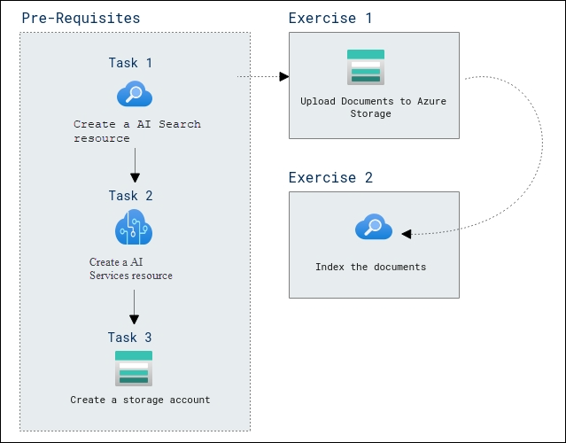

# AI-900: Microsoft Azure AI Fundamentals Workshop

Welcome to your AI-900: Microsoft Azure AI Fundamentals workshop! We've prepared a seamless environment for you to explore and learn Azure Services. Let's begin by making the most of this experience.

# Explore an Azure AI Search index (UI)

### Overall Estimated timing: 120 minutes

## Overview

In this hands-on lab, you'll gain practical experience in building and managing an AI-powered search solution using Azure AI Search and related Azure services. You will learn how to create and configure an Azure AI Search resource, set up an AI Services resource, and create a storage account to store documents. Additionally, you’ll gain expertise in uploading documents to Azure Storage, indexing them for efficient search, and querying the index to retrieve relevant information. By the end of this lab, you’ll be proficient in leveraging Azure AI Search to organize and retrieve data effectively, including reviewing the knowledge store to enhance insights from indexed content. This lab equips you with the skills to build intelligent search solutions within your Azure environment.  

## Objectives

By the end of this lab, you will be able to build and query an AI-powered search index using Azure AI Search.

1. **Create an Azure AI Search resource:** You will learn how to create and configure an Azure AI Search resource to index and query documents.

2. **Create supporting Azure resources:** You will learn how to create an Azure AI Services resource and a Storage account required for document enrichment and storage.

3. **Index documents using Azure AI Search:** You will learn how to upload documents to Azure Storage and use the Import Data wizard to create an index, indexer, and skillset.

4. **Query the search index and review the knowledge store:** You will learn how to query indexed data using Search Explorer and review enriched data stored in the knowledge store.

## Pre-requisites

The solution you'll create for Fourth Coffee requires the following resources in your Azure subscription:

- An **Azure AI Search** resource, which will manage indexing and querying.

- An **Azure AI services** resource, which provides AI services for skills that your search solution can use to enrich the data in the data source with AI-generated insights.

    > **Note**
    > Your Azure AI Search and Azure AI services resources must be in the same location!

- A **Storage account** with blob containers, which will store raw documents and other collections of tables, objects, or files.

## Architecture

In this hands-on lab, the architecture flow includes several essential components.

1. **Provision Azure AI Search and supporting resources:** Create an Azure AI Search resource along with Azure AI Services and Azure Storage to enable document indexing and AI-powered enrichment.

1. **Index and enrich documents using the Import Data wizard:** Use Azure AI Search to extract content from documents stored in Azure Blob Storage, apply AI skills for enrichment, and store enriched data in a knowledge store.

1. **Query indexed data and review enriched outputs:** Query the search index using Search Explorer and review structured and enriched data stored in the knowledge store.

## Architecture Diagram

## Explanation of Components

1. **Azure AI Search**: A cloud-based search service that enables intelligent search and data exploration capabilities. It provides tools for indexing, querying, and analyzing structured and unstructured data, incorporating AI-powered features like semantic search, natural language processing, and document understanding.  

1. **Azure AI Services**: A comprehensive suite of pre-built and customizable AI capabilities, including vision, speech, language, and decision-making models. It provides tools for building intelligent applications with features like image recognition, natural language understanding, real-time transcription, and anomaly detection. 

1. **Azure Storage Account**: A cloud-based storage solution that provides scalable, secure, and highly available storage for various data types, including blobs, files, queues, tables, and disks. It offers redundancy options, encryption, and seamless integration with Azure services for data management and analytics.

# Getting Started with lab
 
Welcome to your AI-900: Microsoft Azure AI Fundamentals workshop! We've prepared a seamless environment for you to explore and learn about machine learning and AI concepts and related Microsoft Azure services. Let's begin by making the most of this experience:
 
## Accessing Your Lab Environment
 
Once you're ready to dive in, your virtual machine and **lab guide** will be right at your fingertips within your web browser.
 

### Virtual Machine & Lab Guide
 
Your virtual machine is your workhorse throughout the workshop. The lab guide is your roadmap to success.

## Exploring Your Lab Resources
 
To get a better understanding of your lab resources and credentials, navigate to the **Environment** tab.
 

## Lab Guide Zoom In/Zoom Out
 
To adjust the zoom level for the environment page, click the **A↕: 100%** icon located next to the timer in the lab environment.

## Utilizing the Split Window Feature
 
For convenience, you can open the lab guide in a separate window by selecting the **Split Window** button from the Top right corner.
 

## Managing Your Virtual Machine
 
Feel free to **start, stop, or restart (2)** your virtual machine as needed from the **Resources (1)** tab. Your experience is in your hands!
 

## Lab Duration Extension

1. To extend the duration of the lab, kindly click the **Hourglass** icon in the top right corner of the lab environment. 

    

    >**Note:** You will get the **Hourglass** icon when 10 minutes are remaining in the lab.

2. Click **OK** to extend your lab duration.
 
   

3. If you have not extended the duration prior to when the lab is about to end, a pop-up will appear, giving you the option to extend. Click **OK** to proceed.

## Let's Get Started with Azure Portal
 
1. On your virtual machine, click on the Azure Portal icon as shown below:
 
   .png)

2. You'll see the **Sign into Microsoft Azure** tab. Here, enter your **credentials (1)** and click on **Next (2)**:
 
   - **Email/Username:** <inject key="AzureAdUserEmail"></inject>
 
       
 
3. Next, provide your **password (1)** and click on **Sign in (2)**:
 
   - **Password:** <inject key="AzureAdUserPassword"></inject>
 
       
 
4. If you see the pop-up Stay-Signed in?, click **No**.

    

5. If a **Welcome to Microsoft Azure** pop-up window appears, simply click **Cancel**.

    

## Support Contact
 
The CloudLabs support team is available 24/7, 365 days a year, via email and live chat to ensure seamless assistance at any time. We offer dedicated support channels explicitly tailored for both learners and instructors, ensuring that all your needs are promptly and efficiently addressed.
 
Learner Support Contacts:
 
- Email Support: cloudlabs-support@spektrasystems.com
- Live Chat Support: https://cloudlabs.ai/labs-support

Click on **Next** from the lower right corner to move on to the next page.

   .png)

## Happy Learning !!
