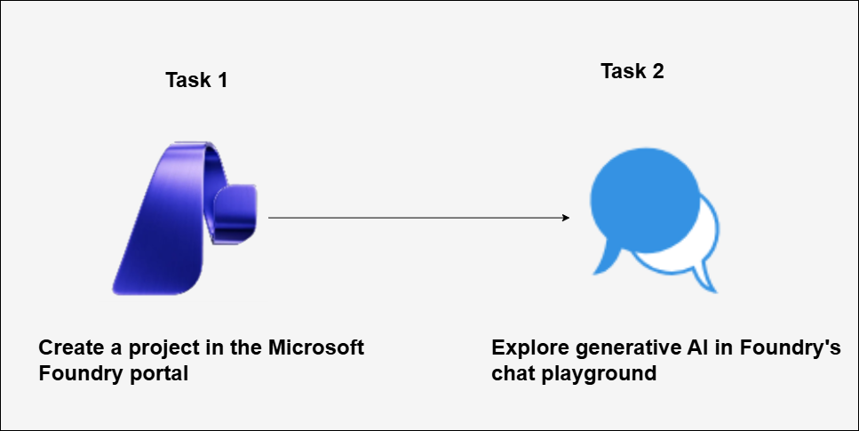

# AI-900: Microsoft Azure AI Fundamentals Workshop

Welcome to your AI-900: Microsoft Azure AI Fundamentals workshop! We've prepared a seamless environment for you to explore and learn Azure Services. Let's begin by making the most of this experience.

# Module 12: Explore generative AI in Microsoft Foundry portal

### Overall Estimated timing: 30 Minutes

## Overview

This lab provides an introduction to generative AI through the Microsoft Foundry portal, Microsoft's platform for creating and deploying intelligent applications. In this lab, you'll interact with the Chat playground in Microsoft Foundry, where you will explore the deployment of the GPT-4.1 model, learn how to optimize responses, and understand effective prompting techniques to refine outputs from generative AI.

## Objective

By the end of this lab, you will be able to create a project in Microsoft Foundry and explore generative AI capabilities by interacting with a deployed GPT model in the Chat playground.

1. **Create a project in Microsoft Foundry:** You will learn how to create and configure a project in the Microsoft Foundry portal, explore available foundation models, and deploy the gpt-4.1 model for use within the project.

2. **Explore generative AI using the Chat playground:** You will learn how to interact with a deployed GPT model in Foundry’s Chat playground, experiment with prompts, understand conversational context, system prompts, and refine responses using prompt design techniques.

## Pre-requisites

Basic Understanding of Generative AI

## Architecture

In this hands-on lab, the architecture flow includes several essential components.

1. **Microsoft Foundry Portal:** A web-based platform for creating and managing AI projects and accessing generative AI capabilities.

1. **Generative AI Model (gpt-4.1):** A large language model used to generate conversational responses based on user prompts.

1. **Foundry Project:** A project created within Microsoft Foundry that organizes deployed models and playground configurations.

1. **Chat Playground:** An interactive interface used to send prompts to the deployed generative AI model and view generated responses.

## Architecture Diagram

## Explanation of Components:

1. **Microsoft Foundry Portal:** Microsoft Foundry Portal is the centralized platform used to create and manage AI projects and access generative AI capabilities. It provides the environment to browse available models, configure projects, deploy models, and access built-in playgrounds for experimentation.

1. **Generative AI Model (gpt-4.1):** The gpt-4.1 model is a large language model designed to generate human-like text responses. It processes natural language prompts and produces coherent, context-aware responses based on the instructions, conversation history, and constraints provided.

1. **Foundry Project:** A Foundry Project serves as a logical container for organizing deployed models and playground configurations. It links the selected subscription, resource group, region, and deployed generative AI model, enabling controlled access to the Chat Playground.

1. **Chat Playground:** The Chat Playground is an interactive interface within Microsoft Foundry that enables conversational interaction with deployed generative AI models. It allows prompts to be submitted, system instructions to be configured, and responses to be reviewed while maintaining conversational context across multiple interactions.

# Getting Started with lab
 
Welcome to your AI-900: Microsoft Azure AI Fundamentals workshop! We've prepared a seamless environment for you to explore and learn about machine learning and AI concepts and related Microsoft Azure services. Let's begin by making the most of this experience:
 
## Accessing Your Lab Environment
 
Once you're ready to dive in, your virtual machine and **Guide** will be right at your fingertips within your web browser.
 

### Virtual Machine & Lab Guide
 
Your virtual machine is your workhorse throughout the workshop. The lab guide is your roadmap to success.

## Exploring Your Lab Resources
 
To get a better understanding of your lab resources and credentials, navigate to the **Environment** tab.
 

## Lab Guide Zoom In/Zoom Out
 
To adjust the zoom level for the environment page, click the **A↕: 100%** icon located next to the timer in the lab environment.

## Utilizing the Split Window Feature
 
For convenience, you can open the lab guide in a separate window by selecting the **Split Window** button from the Top right corner.
 

## Managing Your Virtual Machine
 
Feel free to **Start, Stop, or Restart (2)** your virtual machine as needed from the **Resources (1)** tab. Your experience is in your hands!
 

## Lab Duration Extension

1. To extend the duration of the lab, kindly click the **Hourglass** icon in the top right corner of the lab environment. 

    

    >**Note:** You will get the **Hourglass** icon when 10 minutes are remaining in the lab.

2. Click **OK** to extend your lab duration.
 
   

3. If you have not extended the duration prior to when the lab is about to end, a pop-up will appear, giving you the option to extend. Click **OK** to proceed.

## Let's Get Started with Azure Portal
 
1. On your virtual machine, click on the Azure Portal icon as shown below:
 
   .png)

2. You'll see the **Sign into Microsoft Azure** tab. Here, enter your credentials:
 
   - **Email/Username:** <inject key="AzureAdUserEmail"></inject>
 
       
 
3. Next, provide your password:
 
   - **Password:** <inject key="AzureAdUserPassword"></inject>
 
     
 
6. If prompted to stay signed in, you can click "No."

    
 
7. If a **Welcome to Microsoft Azure** pop-up window appears, simply click **Cancel**.

## Support Contact
 
The CloudLabs support team is available 24/7, 365 days a year, via email and live chat to ensure seamless assistance at any time. We offer dedicated support channels explicitly tailored for both learners and instructors, ensuring that all your needs are promptly and efficiently addressed.
 
Learner Support Contacts:
 
- Email Support: cloudlabs-support@spektrasystems.com
- Live Chat Support: https://cloudlabs.ai/labs-support

Click on **Next** from the lower right corner to move on to the next page.

   .png)

## Happy Learning !!

