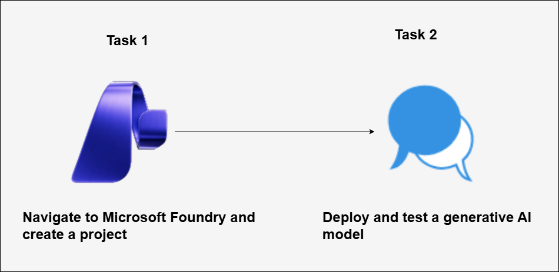

# AI-900: Microsoft Azure AI Fundamentals Workshop

Welcome to your AI-900: Microsoft Azure AI Fundamentals workshop! We've prepared a seamless environment for you to explore and learn Azure Services. Let's begin by making the most of this experience.

# Explore the components and tools of Microsoft Foundry

### Overall Estimated timing: 45 minutes

## Overview

In this hands-on lab, you will explore the Microsoft Foundry portal and learn how to create and manage AI projects. You will create a project, deploy a generative AI model, and test the model using the Chat Playground. This lab helps you understand the core components and tools available in Microsoft Foundry for deploying and experimenting with generative AI models.

## Objectives

By the end of this lab, you will be able to explore and use the core components of Microsoft Foundry.

1. **Navigate Microsoft Foundry and create a project:** You will learn how to access the Microsoft Foundry portal and create a project to organize AI resources.

1. **Deploy and test a generative AI model:** You will learn how to deploy a generative AI model and test it using the Chat Playground.

## Pre-requisites

- Basic knowledge of Azure and familiarity with generative AI concepts.

## Architecture

In this hands-on lab, the architecture flow includes several essential components.

1. **Create a project in Microsoft Foundry portal:** Learn how to create and configure a project in Microsoft Foundry to organize AI resources, manage model assets, and provide a workspace for deploying and testing generative AI models.

1. **Deploy and test a generative AI model:** Use Microsoft Foundry to deploy a base generative AI model and interact with it through the Chat Playground. This enables you to send prompts, apply system instructions, and review generated responses in a controlled environment.

## Architecture Diagram

## Explanation of Components

1. **Microsoft Foundry Portal:** A web-based platform used to create, manage, and deploy AI projects and models. It provides tools to organize resources and experiment with generative AI.

1. **Microsoft Foundry Project:** A workspace within Microsoft Foundry that groups AI assets such as deployed models and playground configurations for experimentation and testing.

1. **Generative AI Model (gpt-4.1):** A large language model deployed in Microsoft Foundry to generate responses based on user prompts and system instructions.

1. **Chat Playground:** An interactive interface in Microsoft Foundry used to test and evaluate generative AI models by sending prompts and reviewing generated outputs.

# Getting Started with lab
 
Welcome to your AI-900: Microsoft Azure AI Fundamentals workshop! We've prepared a seamless environment for you to explore and learn about machine learning and AI concepts and related Microsoft Azure services. Let's begin by making the most of this experience:
 
## Accessing Your Lab Environment
 
Once you're ready to dive in, your virtual machine and **lab guide** will be right at your fingertips within your web browser.
 

### Virtual Machine & Lab Guide
 
Your virtual machine is your workhorse throughout the workshop. The lab guide is your roadmap to success.

## Exploring Your Lab Resources
 
To get a better understanding of your lab resources and credentials, navigate to the **Environment** tab.
 

## Lab Guide Zoom In/Zoom Out
 
To adjust the zoom level for the environment page, click the **A↕: 100%** icon located next to the timer in the lab environment.

## Utilizing the Split Window Feature
 
For convenience, you can open the lab guide in a separate window by selecting the **Split Window** button from the Top right corner.
 

## Managing Your Virtual Machine
 
Feel free to **start, stop, or restart (2)** your virtual machine as needed from the **Resources (1)** tab. Your experience is in your hands!
 

## Lab Duration Extension

1. To extend the duration of the lab, kindly click the **Hourglass** icon in the top right corner of the lab environment. 

    

    >**Note:** You will get the **Hourglass** icon when 10 minutes are remaining in the lab.

2. Click **OK** to extend your lab duration.
 
   

3. If you have not extended the duration prior to when the lab is about to end, a pop-up will appear, giving you the option to extend. Click **OK** to proceed.

## Let's Get Started with Azure Portal
 
1. On your virtual machine, click on the Azure Portal icon as shown below:
 
   .png)

2. You'll see the **Sign into Microsoft Azure** tab. Here, enter your **credentials (1)** and click on **Next (2)**:
 
   - **Email/Username:** <inject key="AzureAdUserEmail"></inject>
 
       
 
3. Next, provide your **password (1)** and click on **Sign in (2)**:
 
   - **Password:** <inject key="AzureAdUserPassword"></inject>
 
     
 
4. If you see the pop-up Stay-Signed in?, click **No**.

    
 
5. If a **Welcome to Microsoft Azure** pop-up window appears, simply click **Cancel**.

    

## Support Contact
 
The CloudLabs support team is available 24/7, 365 days a year, via email and live chat to ensure seamless assistance at any time. We offer dedicated support channels explicitly tailored for both learners and instructors, ensuring that all your needs are promptly and efficiently addressed.
 
Learner Support Contacts:
 
- Email Support: cloudlabs-support@spektrasystems.com
- Live Chat Support: https://cloudlabs.ai/labs-support

Click on **Next** from the lower right corner to move on to the next page.

   .png)

## Happy Learning !!
