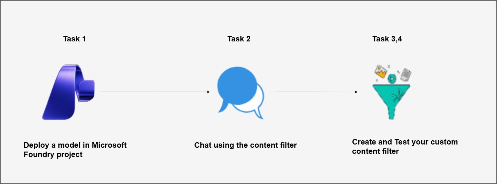

# AI-900: Microsoft Azure AI Fundamentals Workshop

Welcome to your AI-900: Microsoft Azure AI Fundamentals workshop! We've prepared a seamless environment for you to explore and learn Azure Services. Let's begin by making the most of this experience.

# Explore content filters in Microsoft Foundry

### Overall Estimated timing: 30 minutes

## Overview

In this lab, you will explore how content filters work in Microsoft Foundry to support responsible AI practices. You will deploy a generative AI model, observe the behavior of default content filters, and create custom content filters to control harmful or inappropriate prompts and responses. By testing different prompts, you will understand how content filtering helps enforce safe and responsible use of generative AI models in Microsoft Foundry.

## Objectives

By the end of this lab, you will be able to explore and apply content filtering capabilities in Microsoft Foundry.

1. **Deploy a model in Microsoft Foundry:** You will learn how to deploy a generative AI model in a Microsoft Foundry project.

1. **Chat using the default content filter:** You will learn how default content filters behave when interacting with a deployed model.

1. **Create and apply a custom content filter:** You will learn how to define a custom content filter with stricter blocking thresholds and apply it to a model deployment.

1. **Test the custom content filter:** You will learn how to validate the behavior of a custom content filter by testing blocked and allowed prompts.

## Pre-requisites

Familiarity with Azure AI services and deploying models in a cloud environment and basic understanding of content filtering and responsible AI practices.

## Architecture

In this hands-on lab, the architecture flow includes several essential components.

1. **Deploy a generative AI model in Microsoft Foundry:** You will learn how to deploy a generative AI model within a Microsoft Foundry project to enable interaction through the Chat Playground.

1. **Apply default and custom content filters:** Use Microsoft Foundry to observe default content filtering behavior and create custom content filters to control harmful or inappropriate prompts and responses.

1. **Test content filtering using the Chat Playground:** Interact with the deployed model through the Chat Playground to validate how content filters block or allow prompts based on defined thresholds.

## Architecture Diagram

## Explanation of Components

1. **Microsoft Foundry Portal:** A web-based platform used to create, manage, and deploy generative AI models. It provides tools to configure model deployments and apply responsible AI controls such as content filters.

1. **Generative AI Model (Phi-4):** A language model deployed in Microsoft Foundry that generates text responses based on user prompts and is subject to content filtering rules.

1. **Content Filters:** Rules applied to model inputs and outputs to block or allow content based on categories such as violence, hate, sexual content, and self-harm, helping enforce responsible AI usage.

1. **Chat Playground:** An interactive interface in Microsoft Foundry used to test model behavior and observe how default and custom content filters affect generated responses.

# Getting Started with lab
 
Welcome to your AI-900: Microsoft Azure AI Fundamentals workshop! We've prepared a seamless environment for you to explore and learn about machine learning and AI concepts and related Microsoft Azure services. Let's begin by making the most of this experience:
 
## Accessing Your Lab Environment
 
Once you're ready to dive in, your virtual machine and **Guide** will be right at your fingertips within your web browser.
 

### Virtual Machine & Lab Guide
 
Your virtual machine is your workhorse throughout the workshop. The lab guide is your roadmap to success.

## Exploring Your Lab Resources
 
To get a better understanding of your lab resources and credentials, navigate to the **Environment** tab.
 

## Lab Guide Zoom In/Zoom Out
 
To adjust the zoom level for the environment page, click the **A↕: 100%** icon located next to the timer in the lab environment.

## Utilizing the Split Window Feature
 
For convenience, you can open the lab guide in a separate window by selecting the **Split Window** button from the Top right corner.
 

## Managing Your Virtual Machine
 
Feel free to **start, stop, or restart (2)** your virtual machine as needed from the **Resources (1)** tab. Your experience is in your hands!
 

## Lab Duration Extension

1. To extend the duration of the lab, kindly click the **Hourglass** icon in the top right corner of the lab environment. 

    

    >**Note:** You will get the **Hourglass** icon when 10 minutes are remaining in the lab.

2. Click **OK** to extend your lab duration.
 
   

3. If you have not extended the duration prior to when the lab is about to end, a pop-up will appear, giving you the option to extend. Click **OK** to proceed.

## Let's Get Started with Azure Portal
 
1. On your virtual machine, click on the Azure Portal icon as shown below:
 
   .png)

2. You'll see the **Sign into Microsoft Azure** tab. Here, enter your **credentials (1)** and click on **Next (2)**:
 
   - **Email/Username:** <inject key="AzureAdUserEmail"></inject>
 
       
 
3. Next, provide your **password (1)** and click on **Sign in (2)**:
 
   - **Password:** <inject key="AzureAdUserPassword"></inject>
 
       
 
4. If you see the pop-up Stay-Signed in?, click **No**.

    

5. If a **Welcome to Microsoft Azure** pop-up window appears, simply click **Cancel**.

    

## Support Contact
 
The CloudLabs support team is available 24/7, 365 days a year, via email and live chat to ensure seamless assistance at any time. We offer dedicated support channels explicitly tailored for both learners and instructors, ensuring that all your needs are promptly and efficiently addressed.
 
Learner Support Contacts:
 
- Email Support: cloudlabs-support@spektrasystems.com
- Live Chat Support: https://cloudlabs.ai/labs-support

Click on **Next** from the lower right corner to move on to the next page.

   .png)

## Happy Learning !!

