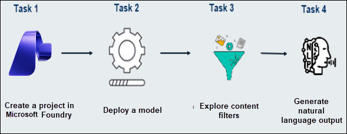

# AI-900: Microsoft Azure AI Fundamentals Workshop

Welcome to your AI-900: Microsoft Azure AI Fundamentals workshop! We've prepared a seamless environment for you to explore and learn Azure Services. Let's begin by making the most of this experience.

# Explore content filters in Microsoft Foundry

### Overall Estimated timing: 30 minutes

## Overview

In this lab, you’ll explore the content filters in Microsoft Foundry to ensure responsible AI behavior. You’ll deploy a model, set up content filters to manage harmful outputs, and generate natural language content using Azure's generative AI capabilities. This exercise is vital for understanding how to ensure ethical AI development and deployment.

## Objectives

By the end of this lab, you will be able to create a project in Microsoft Foundry and analyze a receipt using Azure AI Document Intelligence to extract key information efficiently

1. Create an AI hub and project in Microsoft Foundry.

2. Deploy the GPT-4o model for natural language generation.

3. Explore and customize content filters to prevent harmful outputs.

4. Generate natural language output through the deployed model.

## Pre-requisites

Familiarity with Azure AI services and deploying models in a cloud environment and basic understanding of content filtering and responsible AI practices.

## Architecture

In this hands-on lab, the architecture flow includes several essential components.

1. **Microsoft Foundry Portal**: Centralized platform for managing AI projects, models, and services.

2. **AI Hub**: A container for organizing AI projects.

3. **Content Filters**: Applied to prevent the generation of harmful or inappropriate content based on defined categories (Hate, Sexual, Violence, Self-harm).

4. **Chat Playground**: Interface for interacting with the model and testing content filtering.

## Architecture Diagram

## Explanation of Components

1. **Microsoft Foundry Portal**: The portal provides a user-friendly interface for managing AI models and resources. It allows users to deploy, configure, and monitor generative AI models.

2. **AI Hub**: An organizational structure within Microsoft Foundry. It enables you to manage and track multiple projects and related resources, keeping your AI work organized.

3. **GPT-4o Model**: A generative language model deployed in Microsoft Foundry to produce text. You can customize it and apply content filters to ensure outputs are ethical and adhere to guidelines.

4. **Content Filters**: These filters help monitor and control the output of generative AI models. Filters can be set for different levels of severity (safe, low, medium, high) for categories like hate speech, sexual content, violence, and self-harm.

5. **Chat Playground**: The interactive space for testing the AI model. You can provide prompts and see how the model responds, while also ensuring that the content adheres to the rules set by the content filters.

# Getting Started with lab
 
Welcome to your AI-900: Microsoft Azure AI Fundamentals workshop! We've prepared a seamless environment for you to explore and learn about machine learning and AI concepts and related Microsoft Azure services. Let's begin by making the most of this experience:
 
## Accessing Your Lab Environment
 
Once you're ready to dive in, your virtual machine and **lab guide** will be right at your fingertips within your web browser.
 

### Virtual Machine & Lab Guide
 
Your virtual machine is your workhorse throughout the workshop. The lab guide is your roadmap to success.

## Exploring Your Lab Resources
 
To get a better understanding of your lab resources and credentials, navigate to the **Environment** tab.
 

## Lab Guide Zoom In/Zoom Out
 
To adjust the zoom level for the environment page, click the **A↕: 100%** icon located next to the timer in the lab environment.

## Utilizing the Split Window Feature
 
For convenience, you can open the lab guide in a separate window by selecting the **Split Window** button from the Top right corner.
 

## Managing Your Virtual Machine
 
Feel free to **start, stop, or restart (2)** your virtual machine as needed from the **Resources (1)** tab. Your experience is in your hands!
 

## Lab Duration Extension

1. To extend the duration of the lab, kindly click the **Hourglass** icon in the top right corner of the lab environment. 

    

    >**Note:** You will get the **Hourglass** icon when 10 minutes are remaining in the lab.

2. Click **OK** to extend your lab duration.
 
   

3. If you have not extended the duration prior to when the lab is about to end, a pop-up will appear, giving you the option to extend. Click **OK** to proceed.

## Let's Get Started with Azure Portal
 
1. On your virtual machine, click on the Azure Portal icon as shown below:
 
   .png)

2. You'll see the **Sign into Microsoft Azure** tab. Here, enter your **credentials (1)** and click on **Next (2)**:
 
   - **Email/Username:** <inject key="AzureAdUserEmail"></inject>
 
       
 
3. Next, provide your **password (1)** and click on **Sign in (2)**:
 
   - **Password:** <inject key="AzureAdUserPassword"></inject>
 
       
 
4. If you see the pop-up Stay-Signed in?, click **No**.

    

5. If a **Welcome to Microsoft Azure** pop-up window appears, simply click **Cancel**.

    

## Support Contact
 
The CloudLabs support team is available 24/7, 365 days a year, via email and live chat to ensure seamless assistance at any time. We offer dedicated support channels explicitly tailored for both learners and instructors, ensuring that all your needs are promptly and efficiently addressed.
 
Learner Support Contacts:
 
- Email Support: cloudlabs-support@spektrasystems.com
- Live Chat Support: https://cloudlabs.ai/labs-support

Click on **Next** from the lower right corner to move on to the next page.

   .png)

## Happy Learning !!

