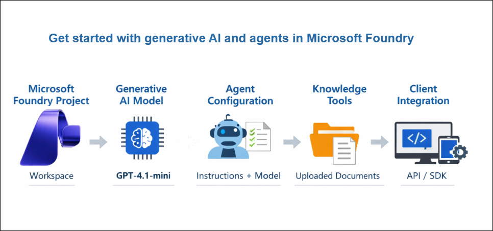
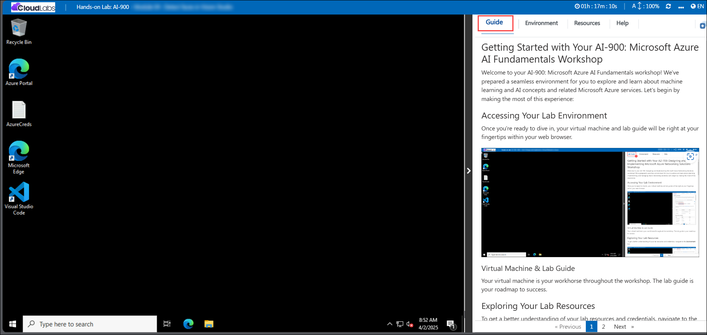
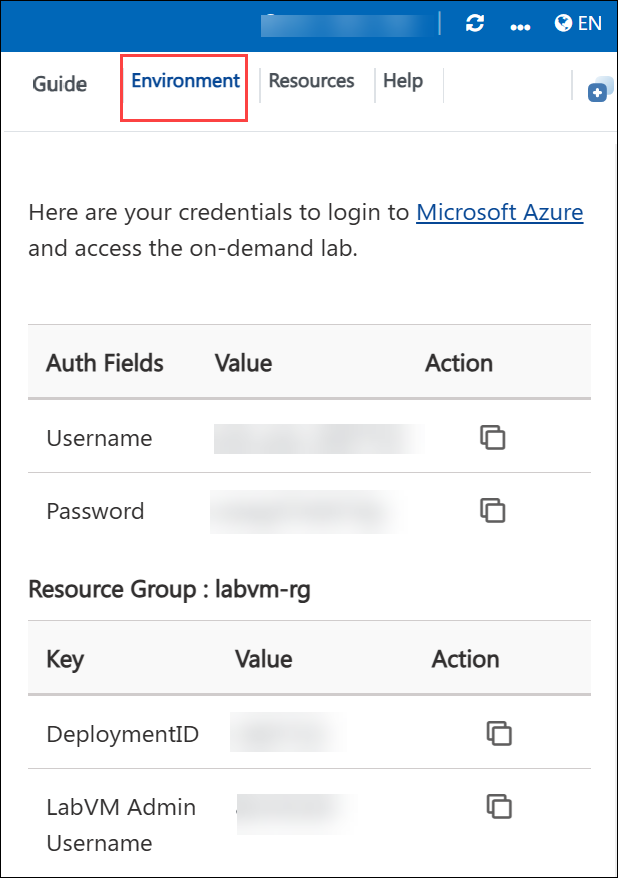
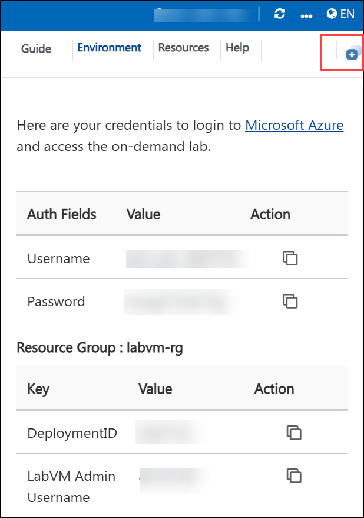
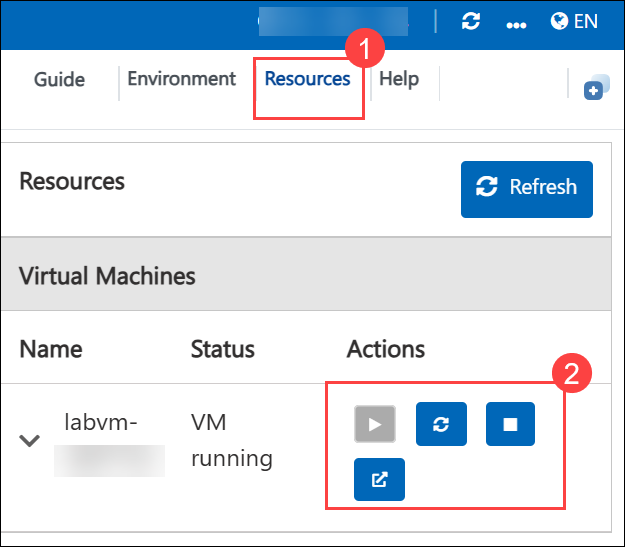
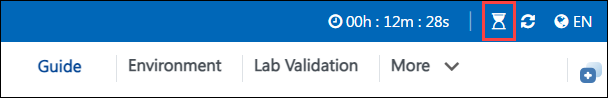
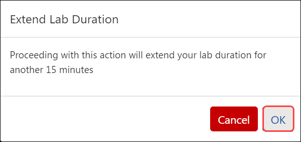
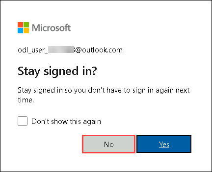

# AI-900: Microsoft Azure AI Fundamentals Workshop

Welcome to your AI-900: Microsoft Azure AI Fundamentals workshop! We're excited to guide you through hands-on learning with Azure AI services. Let’s continue by diving deeper into content moderation.

# Module 2a: Get started with generative AI and agents in Microsoft Foundry

### Overall Estimated Timing: 45 Minutes

## Overview

In this lab, you will explore Microsoft Foundry to deploy and interact with a generative AI model. You will then extend the model into an agent that can use knowledge tools to answer user questions accurately. The lab demonstrates how to manage AI resources, experiment with model prompts and parameters, and build an agentic AI solution that can be integrated into applications.

## Objectives

By the end of this lab, you will be able to:

1. **Create a Microsoft Foundry project:** set up a workspace to organize and manage AI resources.  
2. **Deploy and interact with a generative AI model:** explore chat functionality and conversation context.  
3. **Experiment with system prompts and parameters:** control response style, length, and creativity.  
4. **Save a model as an agent and configure instructions:** turn a model into an agentic AI assistant.  
5. **Add knowledge tools and preview the agent:** enable informed responses and explore integration options.

## Pre-requisites

* Basic knowledge of Azure Portal.
* Familiarity with generative AI concepts and chat-based AI interactions.  

## Architecture

This lab demonstrates how Microsoft Foundry supports generative AI model deployment and agent creation. The architecture shows how models, agents, and knowledge tools interact to provide an AI-powered assistant experience.

1. **Microsoft Foundry Project:** A workspace to manage AI resources, models, and agents.  

2. **Generative AI Model:** Deployed from the Foundry model catalog (e.g., GPT-4.1-mini) for interactive chat and testing.  

3. **Agent Configuration:** Encapsulates the model, instructions, and tools to create an agentic AI assistant.  

4. **Knowledge Tools:** Uploaded documents (like company policies) that the agent can use to provide informed responses.  

5. **Client Integration:** Sample code and APIs to consume the agent programmatically or integrate it into enterprise applications.  

## Architecture Diagram

## Explanation of Components

**Microsoft Foundry Project:** The project is the central workspace to manage AI resources, including models, agents, and knowledge tools. It provides a hub to organize deployments, access model catalogs, and test models in the playground.

**Generative AI Model:** This is the deployed model (e.g., GPT-4.1-mini) that powers chat interactions and generates responses. It can be configured with system prompts and parameters to control style, length, and behavior.

**Agent Configuration:** An agent wraps the model with instructions and parameters to create a task-specific AI assistant. For example, an `expenses-agent` can help employees with expense claims and maintain consistent behavior.

**Knowledge Tools:** Knowledge tools are files or data sources that the agent can query to provide accurate, context-aware responses. For instance, uploading `expenses_policy.docx` allows the agent to answer questions based on company policies.

**Client Integration:** Applications interact with the agent using APIs or SDKs, such as Python or OpenAI Responses API. This allows embedding the agent in Microsoft 365, Teams, or custom apps for real-time AI assistance.

# Getting Started with lab
 
Welcome to your AI-900: Microsoft Azure AI Fundamentals workshop! We've prepared a seamless environment for you to explore and learn about machine learning and AI concepts and related Microsoft Azure services. Let's begin by making the most of this experience:
 
## Accessing Your Lab Environment
 
Once you're ready to dive in, your virtual machine and **Guide** will be right at your fingertips within your web browser.
 

### Virtual Machine & Lab Guide
 
Your virtual machine is your workhorse throughout the workshop. The lab guide is your roadmap to success.

## Exploring Your Lab Resources
 
To get a better understanding of your lab resources and credentials, navigate to the **Environment** tab.
 

## Lab Guide Zoom In/Zoom Out
 
To adjust the zoom level for the environment page, click the **A↕: 100%** icon located next to the timer in the lab environment.

## Utilizing the Split Window Feature
 
For convenience, you can open the lab guide in a separate window by selecting the **Split Window** button from the Top right corner.
 

## Managing Your Virtual Machine
 
Feel free to **start, stop, or restart (2)** your virtual machine as needed from the **Resources (1)** tab. Your experience is in your hands!
 

## Lab Duration Extension

1. To extend the duration of the lab, kindly click the **Hourglass** icon in the top right corner of the lab environment. 

    

    >**Note:** You will get the **Hourglass** icon when 10 minutes are remaining in the lab.

2. Click **OK** to extend your lab duration.
 
   

3. If you have not extended the duration prior to when the lab is about to end, a pop-up will appear, giving you the option to extend. Click **OK** to proceed.

## Let's Get Started with Azure Portal
 
1. On your virtual machine, click on the Azure Portal icon as shown below:
 
   .png)

2. You'll see the **Sign into Microsoft Azure** tab. Here, enter your credentials:
 
   - **Email/Username:** <inject key="AzureAdUserEmail"></inject>
 
       
 
3. Next, provide your password:
 
   - **Password:** <inject key="AzureAdUserPassword"></inject>
 
     
 
4. If prompted to stay signed in, you can click **No**.

6. If prompted to stay signed in, you can click "No."

    
 
7. If a **Welcome to Microsoft Azure** pop-up window appears, simply click **Cancel**.

## Support Contact
 
The CloudLabs support team is available 24/7, 365 days a year, via email and live chat to ensure seamless assistance at any time. We offer dedicated support channels explicitly tailored for both learners and instructors, ensuring that all your needs are promptly and efficiently addressed.
 
Learner Support Contacts:
 
- Email Support: cloudlabs-support@spektrasystems.com
- Live Chat Support: https://cloudlabs.ai/labs-support

Click on **Next** from the lower right corner to move on to the next page.

   .png)

## Happy Learning !!
