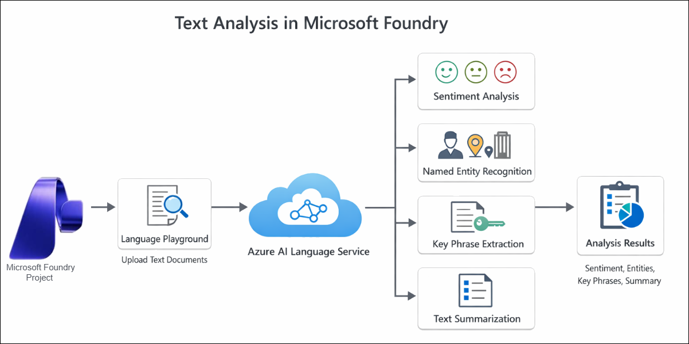
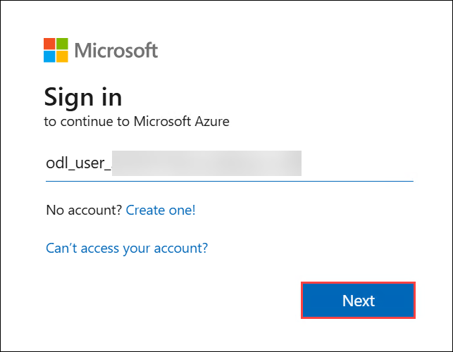
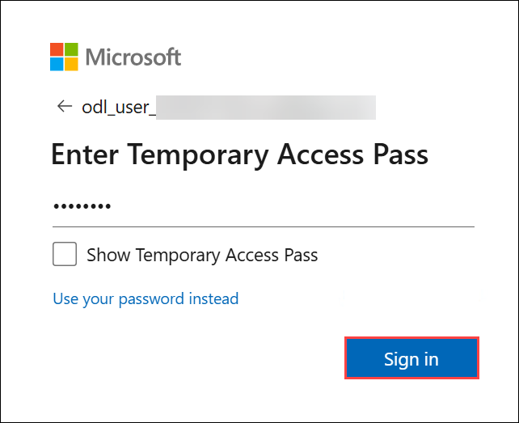
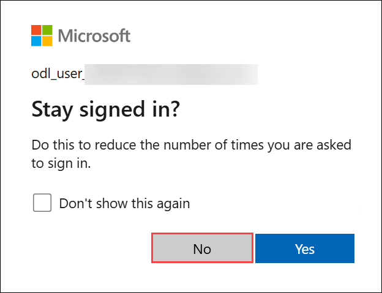
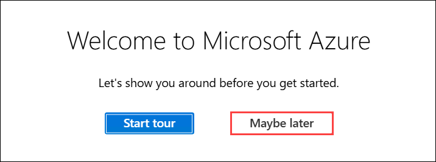

# AI-900: Microsoft Azure AI Fundamentals Workshop

Welcome to your AI-900: Microsoft Azure AI Fundamentals workshop! We're excited to guide you through hands-on learning with Azure AI services. Let’s continue by diving deeper into content moderation.

# Module 3a: Get started with text analysis in Microsoft Foundry

### Overall Estimated Timing: 30 Minutes

## Overview

In this lab, you will use Microsoft Foundry to explore Azure AI Language - Text Analytics capabilities. You will create a project in the Foundry portal and use the Language Playground to analyze text without writing code. The lab demonstrates how to perform sentiment analysis, key phrase extraction, named entity recognition, and text summarization, which are common text analysis techniques used in real-world AI solutions.

## Objectives

By the end of this lab, you will be able to:

1. **Create a Microsoft Foundry project:** You will learn how to create and configure a Microsoft Foundry project to access Azure AI Language services through the Language Playground.   
2. **Analyze sentiment with Azure AI Language in Microsoft Foundry portal:** You will learn how to use sentiment analysis to evaluate text and determine whether it expresses positive, neutral, or negative sentiment.
3. **Extract key phrases with Azure AI Language in Microsoft Foundry portal:** You will learn how to use key phrase extraction to identify important terms and concepts from unstructured text data.
4. **Extract named entities with Azure AI Language in Microsoft Foundry portal:** You will learn how to use named entity recognition to automatically extract information such as people, locations, and organizations from text.
5. **Summarize text with Azure AI Language in Microsoft Foundry portal:** You will learn how to generate extractive summaries to identify the most important sentences in a document.

## Pre-requisites

* Basic knowledge of Azure AI services, Microsoft Foundry and Azure AI Language.

## Architecture

In this hands-on lab, the architecture flow includes several essential components.

1. **Create a project in Microsoft Foundry portal:** Understanding how to set up a new project in Microsoft Foundry to access Azure AI Language services and use the Language Playground for text analysis.  

2. **Analyze sentiment with Azure AI Language in Microsoft Foundry portal:** Sentiment analysis is used to evaluate text and determine whether it expresses positive, neutral, or negative sentiment, helping categorize opinions in reviews and feedback.  

3. **Extract named entities with Azure AI Language in Microsoft Foundry portal:** Named entity extraction identifies key information such as people, locations, and organizations from unstructured text using Azure AI Language capabilities.  

4. **Extract key phrases with Azure AI Language in Microsoft Foundry portal:** Key phrase extraction automatically identifies important terms and concepts from text, enabling quicker understanding of the main topics.

5. **Summarize text with Azure AI Language in Microsoft Foundry portal:** Text summarization condenses large documents into concise summaries, highlighting the most important sentences for easier analysis.

## Architecture Diagram

## Explanation of Components

1. **Microsoft Foundry:** A centralized platform used to create and manage AI projects. In this lab, it provides access to Azure AI Language services through the Language Playground.

1. **Azure AI Language:** A cloud-based service that provides natural language processing capabilities such as sentiment analysis, key phrase extraction, named entity recognition, and text summarization.

1. **Language Playground:** An interactive interface in Microsoft Foundry that allows users to upload text and run text analysis features without writing code.

1. **Input Text Documents:** Sample text files used as input for performing various text analysis operations in the Language Playground.

1. **Analysis Results:** The output generated by Azure AI Language, including sentiment scores, extracted entities, key phrases, and summarized text.

# Getting Started with lab
 
Welcome to your AI-900: Microsoft Azure AI Fundamentals workshop! We've prepared a seamless environment for you to explore and learn about machine learning and AI concepts and related Microsoft Azure services. Let's begin by making the most of this experience:
 
## Accessing Your Lab Environment
 
Once you're ready to dive in, your virtual machine and **Guide** will be right at your fingertips within your web browser.
 

### Virtual Machine & Lab Guide
 
Your virtual machine is your workhorse throughout the workshop. The lab guide is your roadmap to success.

## Exploring Your Lab Resources
 
To get a better understanding of your lab resources and credentials, navigate to the **Environment** tab.
 

## Lab Guide Zoom In/Zoom Out
 
To adjust the zoom level for the environment page, click the **A↕: 100%** icon located next to the timer in the lab environment.

## Utilizing the Split Window Feature
 
For convenience, you can open the lab guide in a separate window by selecting the **Split Window** button from the Top right corner.
 

## Managing Your Virtual Machine
 
Feel free to **Start, Stop, or Restart (2)** your virtual machine as needed from the **Resources (1)** tab. Your experience is in your hands!
 

## Lab Duration Extension

1. To extend the duration of the lab, kindly click the **Hourglass** icon in the top right corner of the lab environment. 

    

    >**Note:** You will get the **Hourglass** icon when 10 minutes are remaining in the lab.

2. Click **OK** to extend your lab duration.
 
   

3. If you have not extended the duration prior to when the lab is about to end, a pop-up will appear, giving you the option to extend. Click **OK** to proceed.

## Let's Get Started with Azure Portal
 
1. On your virtual machine, click on the Azure Portal icon as shown below:
 
   .png)

2. You'll see the **Sign into Microsoft Azure** tab. Here, enter your credentials:
 
   - **Email/Username:** <inject key="AzureAdUserEmail"></inject>
 
       
 
3. Next, provide your password:
 
   - **Temporary Access Pass:** <inject key="AzureAdUserPassword"></inject>
 
     
 
4. If prompted to stay signed in, you can click **No**.

    
 
7. If a **Welcome to Microsoft Azure** pop-up window appears, simply click **Maybe later**.

    

## Support Contact
 
The CloudLabs support team is available 24/7, 365 days a year, via email and live chat to ensure seamless assistance at any time. We offer dedicated support channels explicitly tailored for both learners and instructors, ensuring that all your needs are promptly and efficiently addressed.
 
Learner Support Contacts:
 
- Email Support: cloudlabs-support@spektrasystems.com
- Live Chat Support: https://cloudlabs.ai/labs-support

Click on **Next** from the lower right corner to move on to the next page.

   .png)

## Happy Learning !!
