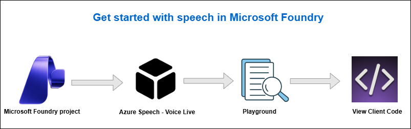

# AI-900: Microsoft Azure AI Fundamentals Workshop

Welcome to your AI-900: Microsoft Azure AI Fundamentals workshop! We're excited to guide you through hands-on learning with Azure AI services. Let’s continue by diving deeper into content moderation.

# Module 4a: Get started with speech in Microsoft Foundry

### Overall Estimated Timing: 30 Minutes

## Overview

In this lab, you will explore Microsoft Foundry to access and interact with a speech-enabled generative AI model. You will use Azure Speech - Voice Live to enable real-time speech-to-text and text-to-speech interactions, experiment with voices, prompts, and model parameters, and review client code to understand how voice-based AI assistants are built.

## Objectives

By the end of this lab, you will be able to:

1. **Create a Microsoft Foundry project:** Set up a workspace in Microsoft Foundry to organize AI resources and speech services for voice-enabled AI development.
2. **Access Azure Speech - Voice Live:** Navigate to the Speech Playground and explore real-time speech-to-text and text-to-speech capabilities.
3. **Configure a speech-enabled generative AI model:** Select a generative AI model and choose a voice for spoken output.
4. **Interact with a model using speech:** Use spoken input to converse with the model and receive natural-sounding spoken responses.
5. **Experiment with system prompts and parameters:** Adjust instructions and model settings to control response style, length, and creativity.
6. **Review client code for voice-based assistants:** Examine sample code to understand how speech and generative AI services are integrated into applications.

## Pre-requisites

* Basic knowledge of Azure Portal.
* Familiarity with generative AI concepts and chat-based AI interactions.  

## Architecture

This lab demonstrates how Microsoft Foundry integrates generative AI models with Azure Speech - Voice Live to enable real-time, voice-based AI interactions. The architecture shows how speech services, generative AI models, and client applications work together to create a conversational voice assistant.

1. **Microsoft Foundry Project:** A workspace to manage AI resources, models, and speech services.

2. **Generative AI Model (GPT-4.1 Mini):** Selected within the Speech Playground and used to generate conversational responses.

3. **Azure Speech - Voice Live Service:** Provides real-time speech-to-text and text-to-speech capabilities for voice interaction.

4. **Speech Playground / Voice Assistant App:** A browser-based client that connects speech services with the generative AI model.

5. **Client Code and APIs:** Sample Python code and SDKs that demonstrate how to build and integrate a voice-enabled assistant into applications.
 
## Architecture Diagram

## Explanation of Components

1. **Microsoft Foundry Project:**
   The project acts as the central workspace for managing AI resources and accessing Foundry tools. It provides a single place to organize settings, select models, and use the Speech Playground for experimentation.

2. **Generative AI Model (GPT-4.1 Mini):**
   This is the selected language model used in the Speech Playground to generate conversational responses. It can be configured with system prompts and parameters to control response style, length, and creativity.

3. **Azure Speech - Voice Live Service:**
   This service enables real-time speech-to-text and text-to-speech capabilities. It converts spoken input into text for the model and converts model responses back into natural-sounding speech.

4. **Speech Playground / Voice Assistant App:**
   A browser-based application that connects the speech service with the generative AI model, allowing users to have live, voice-based conversations with the assistant.

5. **Client Code and APIs:**
   Sample Python code and SDKs demonstrate how audio processing and Voice Live connections are implemented, showing how developers can build their own voice-enabled assistants using the same approach.

# Getting Started with lab
 
Welcome to your AI-900: Microsoft Azure AI Fundamentals workshop! We've prepared a seamless environment for you to explore and learn about machine learning and AI concepts and related Microsoft Azure services. Let's begin by making the most of this experience:
 
## Accessing Your Lab Environment
 
Once you're ready to dive in, your virtual machine and **Guide** will be right at your fingertips within your web browser.
 

### Virtual Machine & Lab Guide
 
Your virtual machine is your workhorse throughout the workshop. The lab guide is your roadmap to success.

## Exploring Your Lab Resources
 
To get a better understanding of your lab resources and credentials, navigate to the **Environment** tab.
 

## Lab Guide Zoom In/Zoom Out
 
To adjust the zoom level for the environment page, click the **A↕: 100%** icon located next to the timer in the lab environment.

## Utilizing the Split Window Feature
 
For convenience, you can open the lab guide in a separate window by selecting the **Split Window** button from the Top right corner.
 

## Managing Your Virtual Machine
 
Feel free to **Start, Stop, or Restart (2)** your virtual machine as needed from the **Resources (1)** tab. Your experience is in your hands!
 

## Lab Duration Extension

1. To extend the duration of the lab, kindly click the **Hourglass** icon in the top right corner of the lab environment. 

    

    >**Note:** You will get the **Hourglass** icon when 10 minutes are remaining in the lab.

2. Click **OK** to extend your lab duration.
 
   

3. If you have not extended the duration prior to when the lab is about to end, a pop-up will appear, giving you the option to extend. Click **OK** to proceed.

## Let's Get Started with Azure Portal
 
1. On your virtual machine, click on the Azure Portal icon as shown below:
 
   .png)

2. You'll see the **Sign into Microsoft Azure** tab. Here, enter your credentials:
 
   - **Email/Username:** <inject key="AzureAdUserEmail"></inject>
 
       
 
3. Next, provide your password:
 
   - **Temporary Access Pass:** <inject key="AzureAdUserPassword"></inject>
 
     
 
4. If prompted to stay signed in, you can click **No**.

    
 
7. If a **Welcome to Microsoft Azure** pop-up window appears, simply click **Maybe later**.

    

## Support Contact
 
The CloudLabs support team is available 24/7, 365 days a year, via email and live chat to ensure seamless assistance at any time. We offer dedicated support channels explicitly tailored for both learners and instructors, ensuring that all your needs are promptly and efficiently addressed.
 
Learner Support Contacts:
 
- Email Support: cloudlabs-support@spektrasystems.com
- Live Chat Support: https://cloudlabs.ai/labs-support

Click on **Next** from the lower right corner to move on to the next page.

   .png)

## Happy Learning !!
