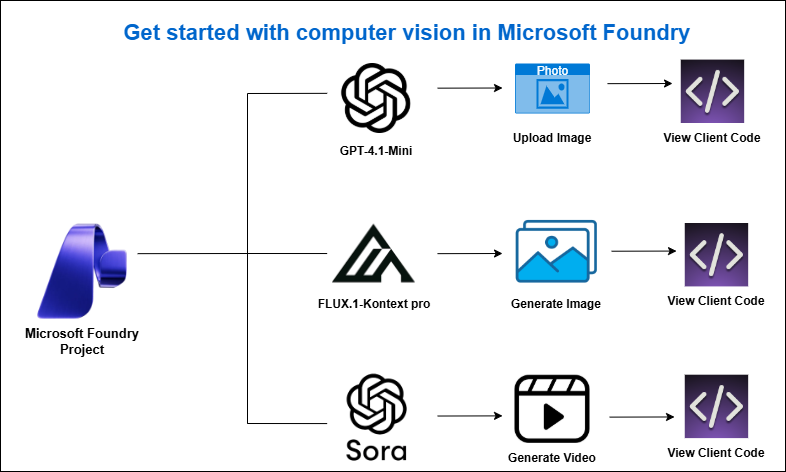
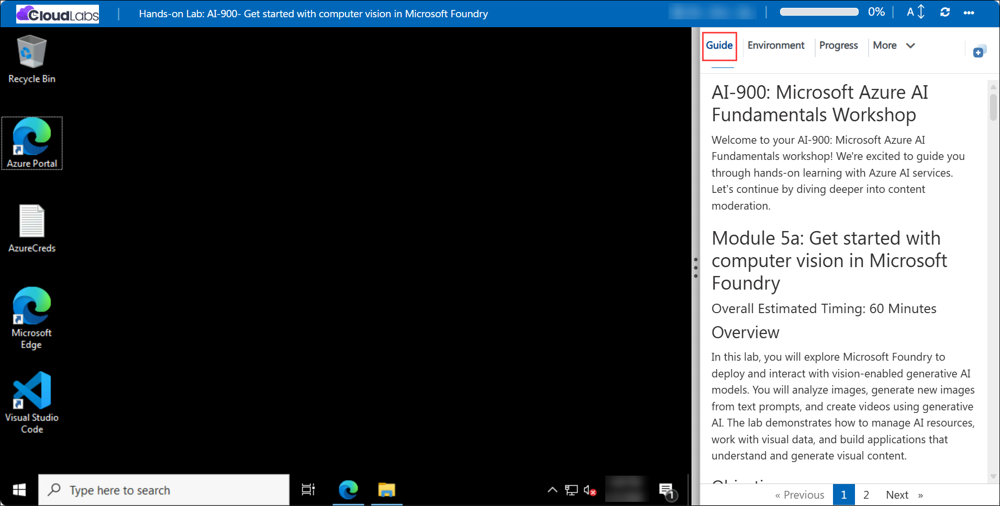

# AI-900: Microsoft Azure AI Fundamentals Workshop

Welcome to your AI-900: Microsoft Azure AI Fundamentals workshop! We're excited to guide you through hands-on learning with Azure AI services. Let’s continue by diving deeper into content moderation.

# Module 5a: Get started with computer vision in Microsoft Foundry

### Overall Estimated Timing: 60 Minutes

## Overview

In this lab, you will explore Microsoft Foundry to deploy and interact with vision-enabled generative AI models. You will analyze images, generate new images from text prompts, and create videos using generative AI. The lab demonstrates how to manage AI resources, work with visual data, and build applications that understand and generate visual content.

## Objectives

By the end of this lab, you will be able to:

1. **Create a Microsoft Foundry project:** Set up a workspace in Microsoft Foundry to organize AI resources, models, and services used for computer vision solutions.
2. **Deploy and use a vision-enabled generative AI model:** Deploy a model and use the playground to analyze images and generate meaningful text-based insights.
3. **Generate images from text prompts:** Use an image-generation model to create new images based on descriptive text.
4. **Generate videos from text prompts:** Use a video-generation model to create short videos from natural language descriptions.
5. **Review sample code for vision scenarios:** Examine example code to understand how image and video generation can be implemented in applications.

## Pre-requisites

* Basic knowledge of Azure Portal.
* Familiarity with generative AI concepts and chat-based AI interactions.  

## Architecture

This lab demonstrates how Microsoft Foundry supports deploying and using vision-enabled generative AI models for analyzing and generating visual content. The architecture shows how models, playground experiences, and client applications interact to enable computer vision scenarios.

1. **Microsoft Foundry Project:** A workspace to manage AI resources, models, and services used for computer vision workloads.

2. **Vision-Enabled Generative AI Models:** Models deployed from the Foundry model catalog (for example, GPT-4.1 Mini, FLUX-1-Kontext-pro, and Sora) to analyze images, generate images, and create videos.

3. **Model Playgrounds:** Browser-based environments for interacting with deployed models to test image analysis, image generation, and video generation.

4. **Prompt and Parameter Configuration:** Instructions and model parameters that control how models interpret images and generate visual or textual outputs.

5. **Client Integration:** Sample code and APIs that demonstrate how image and video generation capabilities can be integrated into applications.

## Architecture Diagram

## Explanation of Components

1. **Microsoft Foundry Project:**
   The project serves as the central workspace for managing AI resources and services. It provides a hub to organize model deployments, access the model catalog, and use playgrounds for vision-based experimentation.

2. **Vision-Enabled Generative AI Models:**
   These are the deployed models (for example, GPT-4.1 Mini for image analysis, FLUX-1-Kontext-pro for image generation, and Sora for video generation) that process visual input or generate visual output based on text prompts.

3. **Model Playgrounds:**
   Browser-based environments that allow you to interact with deployed models to test image analysis, image generation, and video generation scenarios without writing code.

4. **Prompt and Parameter Configuration:**
   Instructions and model parameters that control how models interpret images and generate text, images, or videos, enabling customization of output style and behavior.

5. **Client Integration:**
   Applications interact with vision-enabled models using APIs or SDKs, such as Python and the OpenAI Responses API, allowing developers to integrate image and video capabilities into custom applications.

# Getting Started with lab
 
Welcome to your AI-900: Microsoft Azure AI Fundamentals workshop! We've prepared a seamless environment for you to explore and learn about machine learning and AI concepts and related Microsoft Azure services. Let's begin by making the most of this experience:
 
## Accessing Your Lab Environment
 
Once you're ready to dive in, your virtual machine and **Guide** will be right at your fingertips within your web browser.
 

### Virtual Machine & Lab Guide
 
Your virtual machine is your workhorse throughout the workshop. The lab guide is your roadmap to success.

## Exploring Your Lab Resources
 
To get a better understanding of your lab resources and credentials, navigate to the **Environment** tab.
 

## Lab Guide Zoom In/Zoom Out
 
To adjust the zoom level for the environment page, click the **A↕: 100%** icon located next to the timer in the lab environment.

## Utilizing the Split Window Feature
 
For convenience, you can open the lab guide in a separate window by selecting the **Split Window** button from the Top right corner.
 

## Managing Your Virtual Machine
 
Feel free to **Start, Stop, or Restart (2)** your virtual machine as needed from the **Resources (1)** tab. Your experience is in your hands!
 

## Lab Duration Extension

1. To extend the duration of the lab, kindly click the **Hourglass** icon in the top right corner of the lab environment. 

    

    >**Note:** You will get the **Hourglass** icon when 10 minutes are remaining in the lab.

2. Click **OK** to extend your lab duration.
 
   

3. If you have not extended the duration prior to when the lab is about to end, a pop-up will appear, giving you the option to extend. Click **OK** to proceed.

## Let's Get Started with Azure Portal
 
1. On your virtual machine, click on the Azure Portal icon as shown below:
 
   .png)

2. You'll see the **Sign into Microsoft Azure** tab. Here, enter your credentials:
 
   - **Email/Username:** <inject key="AzureAdUserEmail"></inject>
 
       
 
3. Next, provide your password:
 
   - **Temporary Access Pass:** <inject key="AzureAdUserPassword"></inject>
 
     
 
4. If prompted to stay signed in, you can click **No**.

    
 
7. If a **Welcome to Microsoft Azure** pop-up window appears, simply click **Maybe later**.

    

## Support Contact
 
The CloudLabs support team is available 24/7, 365 days a year, via email and live chat to ensure seamless assistance at any time. We offer dedicated support channels explicitly tailored for both learners and instructors, ensuring that all your needs are promptly and efficiently addressed.
 
Learner Support Contacts:
 
- Email Support: cloudlabs-support@spektrasystems.com
- Live Chat Support: https://cloudlabs.ai/labs-support

Click on **Next** from the lower right corner to move on to the next page.

   .png)

## Happy Learning !!
