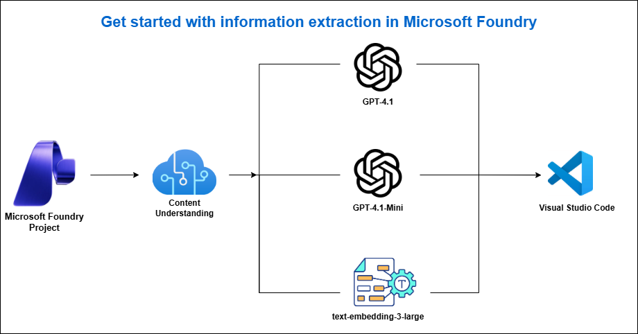
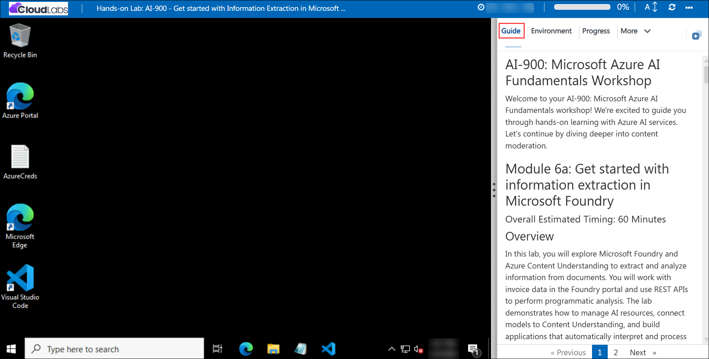

# AI-900: Microsoft Azure AI Fundamentals Workshop

Welcome to your AI-900: Microsoft Azure AI Fundamentals workshop! We're excited to guide you through hands-on learning with Azure AI services. Let’s continue by diving deeper into content moderation.

# Module 6a: Get started with information extraction in Microsoft Foundry

### Overall Estimated Timing: 40 Minutes

## Overview

In this lab, you will explore Microsoft Foundry and Azure Content Understanding to extract and analyze information from documents. You will work with invoice data in the Foundry portal and use REST APIs to perform programmatic analysis. The lab demonstrates how to manage AI resources, connect models to Content Understanding, and build applications that automatically interpret and process document content.

## Objectives

By the end of this lab, you will be able to:

1. **Create a Microsoft Foundry project:** Set up and configure a Foundry project to organize resources, models, and services for using Azure Content Understanding.
2. **Extract invoice data using the Foundry portal:** Use the prebuilt invoice analyzer in the Foundry portal to extract structured information from an invoice and review the results.
3. **Deploy required Foundry models:** Deploy GPT-4.1, GPT-4.1-mini, and text-embedding-3-large models in your Foundry resource.
4. **Configure Content Understanding with deployed models:** Establish a connection between Azure Content Understanding and your Foundry model deployments.
5. **Extract information using the REST API:** Analyze an invoice and retrieve results programmatically using REST API calls.

## Pre-requisites

* Basic knowledge of the Azure portal and navigating cloud resources.
* Familiarity with REST APIs and basic command-line usage.
* Familiarity with Visual Studio Code (VS Code).
* General understanding of generative AI and document processing concepts.

## Architecture

This lab demonstrates how Microsoft Foundry and Azure Content Understanding work together to extract structured information from documents using both the portal experience and REST APIs. The architecture shows how projects, model deployments, analyzers, and client applications interact to enable document understanding scenarios.

1. **Microsoft Foundry Project:** A centralized workspace to manage AI resources, models, and services used for Content Understanding workloads.

2. **Foundry Model Deployments:** Generative AI and embedding models (for example, GPT-4.1, GPT-4.1-mini, and text-embedding-3-large) deployed from the Foundry model catalog and used by Content Understanding.

3. **Azure Content Understanding Service:** A service that analyzes multi-modal content such as documents and extracts structured fields using prebuilt analyzers (for example, prebuilt-invoice).

4. **Foundry Portal (Classic):** Browser-based interface to test invoice extraction, review extracted fields, and view JSON results.

5. **REST API Layer:** Endpoints used to configure model connections, submit documents for analysis, and retrieve results programmatically.

6. **Client Tools (VS Code & Scripts):** Shell scripts and command-line tools used to call REST APIs and integrate Content Understanding into applications.

## Architecture Diagram

## Explanation of Components

1. **Microsoft Foundry Project:**
   The project acts as the central workspace for organizing AI resources, model deployments, and services used in the lab. It provides access to Content Understanding, model management, and project-level settings.

2. **Foundry Model Deployments:**
   These are the deployed generative AI and embedding models (such as GPT-4.1, GPT-4.1-mini, and text-embedding-3-large) that Content Understanding uses to interpret documents and generate structured outputs.

3. **Azure Content Understanding Service:**
   This service analyzes multi-modal content, including documents, and extracts structured information using prebuilt analyzers (for example, the prebuilt invoice analyzer).

4. **Foundry Portal (Classic):**
   A browser-based interface used to upload documents, run Content Understanding analyzers, and review extracted fields and JSON results.

5. **REST API Layer:**
   Provides endpoints to configure model connections, submit content for analysis, and retrieve results, enabling programmatic access to Content Understanding capabilities.

6. **Client Tools (VS Code & Scripts):**
   Visual Studio Code and shell scripts are used to call REST APIs, test requests, and demonstrate how Content Understanding can be integrated into applications.

# Getting Started with lab
 
Welcome to your AI-900: Microsoft Azure AI Fundamentals workshop! We've prepared a seamless environment for you to explore and learn about machine learning and AI concepts and related Microsoft Azure services. Let's begin by making the most of this experience:
 
## Accessing Your Lab Environment
 
Once you're ready to dive in, your virtual machine and **Guide** will be right at your fingertips within your web browser.
 

### Virtual Machine & Lab Guide
 
Your virtual machine is your workhorse throughout the workshop. The lab guide is your roadmap to success.

## Exploring Your Lab Resources
 
To get a better understanding of your lab resources and credentials, navigate to the **Environment** tab.
 

## Lab Guide Zoom In/Zoom Out
 
To adjust the zoom level for the environment page, click the **A↕: 100%** icon located next to the timer in the lab environment.

## Utilizing the Split Window Feature
 
For convenience, you can open the lab guide in a separate window by selecting the **Split Window** button from the Top right corner.
 

## Managing Your Virtual Machine
 
Feel free to **Start, Stop, or Restart (2)** your virtual machine as needed from the **Resources (1)** tab. Your experience is in your hands!
 

## Lab Duration Extension

1. To extend the duration of the lab, kindly click the **Hourglass** icon in the top right corner of the lab environment. 

    

    >**Note:** You will get the **Hourglass** icon when 10 minutes are remaining in the lab.

2. Click **OK** to extend your lab duration.
 
   

3. If you have not extended the duration prior to when the lab is about to end, a pop-up will appear, giving you the option to extend. Click **OK** to proceed.

## Let's Get Started with Azure Portal
 
1. On your virtual machine, click on the Azure Portal icon as shown below:
 
   .png)

2. You'll see the **Sign into Microsoft Azure** tab. Here, enter your credentials:
 
   - **Email/Username:** <inject key="AzureAdUserEmail"></inject>
 
       
 
3. Next, provide your password:
 
   - **Temporary Access Pass:** <inject key="AzureAdUserPassword"></inject>
 
     
 
4. If prompted to stay signed in, you can click **No**.

    
 
7. If a **Welcome to Microsoft Azure** pop-up window appears, simply click **Maybe later**.

    

## Support Contact
 
The CloudLabs support team is available 24/7, 365 days a year, via email and live chat to ensure seamless assistance at any time. We offer dedicated support channels explicitly tailored for both learners and instructors, ensuring that all your needs are promptly and efficiently addressed.
 
Learner Support Contacts:
 
- Email Support: cloudlabs-support@spektrasystems.com
- Live Chat Support: https://cloudlabs.ai/labs-support

Click on **Next** from the lower right corner to move on to the next page.

   .png)

## Happy Learning !!
