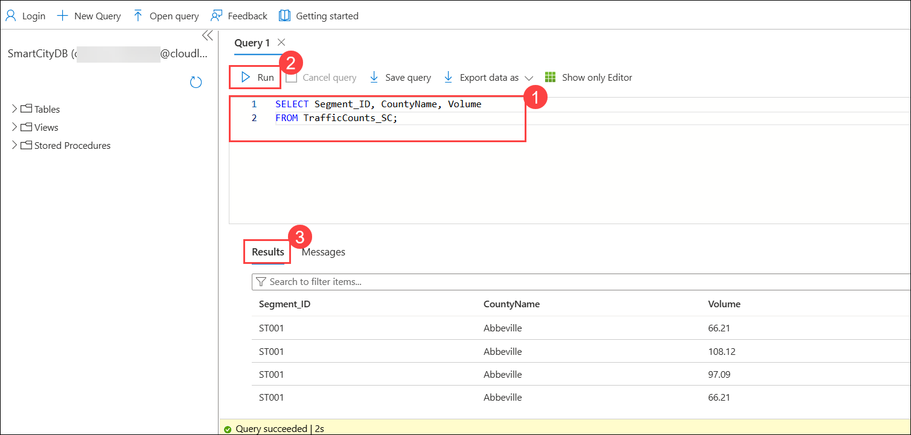
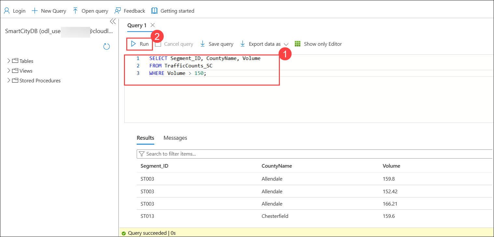
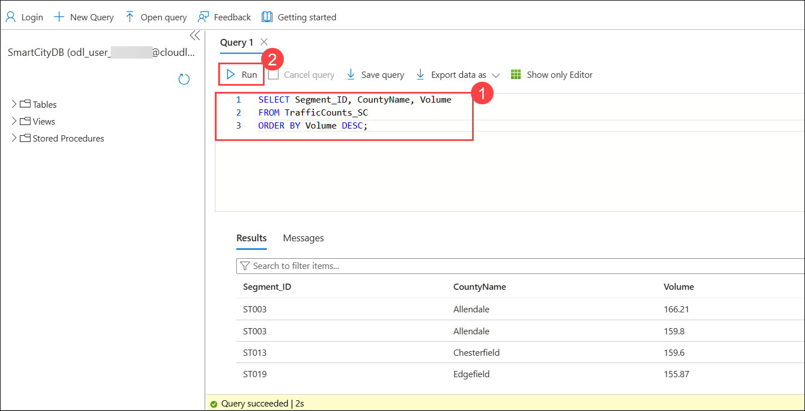
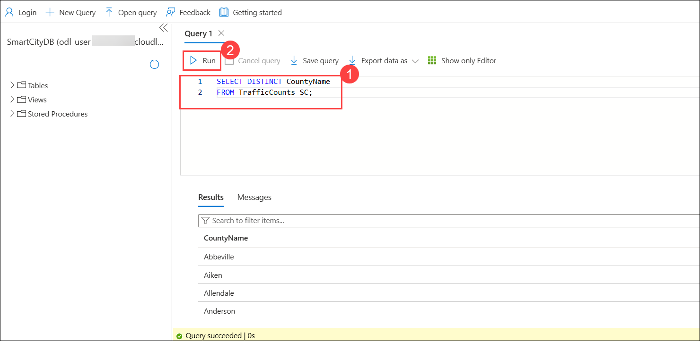
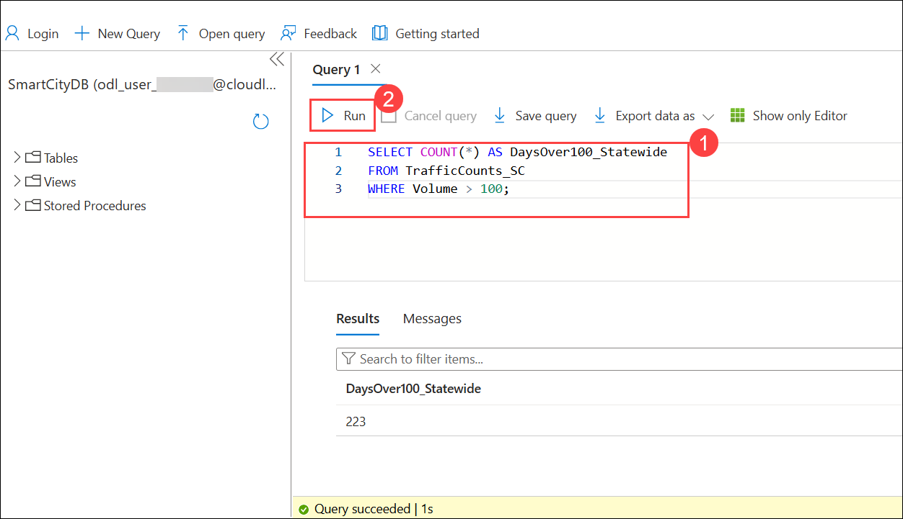
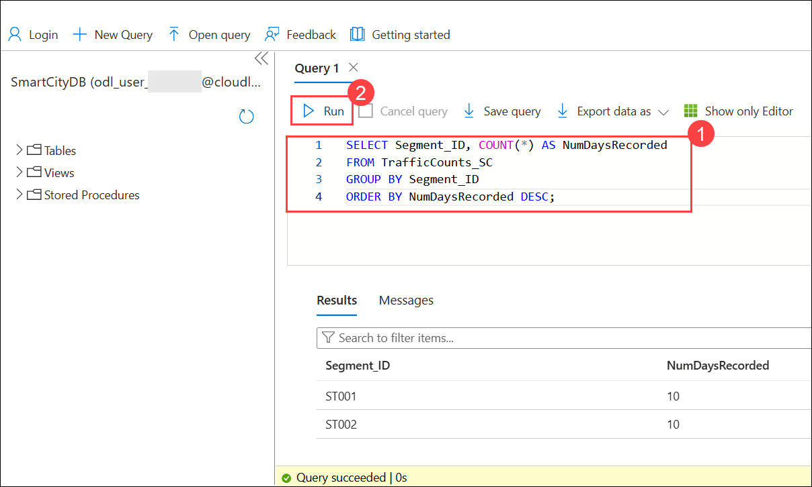

# Lesson 8: Core SQL Commands on Transportation Data


### Overview

In this lab, you will explore how to connect to an Azure SQL Database and run basic SQL queries using the Query Editor. You will retrieve, filter, sort, and analyze traffic data from the **TrafficCounts_SC** table to understand traffic patterns and identify high-volume road segments.

In this exercise, you will perform the following tasks:

+ **Task 1:** Analyzing Traffic Data Using Azure SQL

### Estimated Timing: 20 Minutes

### Task 1: Analyzing Traffic Data Using Azure SQL

1. On the Azure portal, search for **Azure SQL Database (1)**. From the search results under **Services**, click on **Azure SQL Database (2)**.

    

1. On the **SQL databases** page, under the list of databases, click on **SmartCityDB (smartcity-sqlserver-<inject key="DeploymentID" enableCopy="false" />)** to open the database overview page.

     

1. On the **smartcity-sqlserver-<inject key="Deployment ID" enableCopy="false" />** page please select **Query Editor (1)**, provide the login as **<inject key="SQL Admin Login" enableCopy="false" /> (2)** and Password **<inject key="SQL Admin Password" enableCopy="false" /> (3)** then click **Ok (4)**.

     

1. In the query editor, enter the SQL query **(1)**, select **Run (2)** to execute it, and view the output in the **Results (3)** pane.

    ```sql
    SELECT TOP 5 *  
    FROM TrafficCounts_SC;
    ```

     

1. In the query editor, enter the SQL query **(1)**, select **Run (2)** to execute it, and view the output in the **Results (3)** pane.

    ```sql
    SELECT Segment_ID, CountyName, Volume
    FROM TrafficCounts_SC;
    ```

     

1. This query retrieves only the segment ID, county name, and traffic volume, helping you focus on the most relevant data for quick traffic analysis.

1. In the query editor, enter the SQL query **(1)** with a `WHERE` clause to filter records, then select **Run (2)** to execute it.

    ```sql
    SELECT Segment_ID, CountyName, Volume
    FROM TrafficCounts_SC
    WHERE Volume > 150;
    ```

    

1. This query filters the table to return only records where the **Volume** value exceeds 150. The results highlight road segments with high traffic levels, helping planners identify areas that may require congestion management or further investigation.

1. In the query editor, enter the SQL query **(1)** to retrieve the segment ID, county name, and traffic volume, sorted in descending order. Then select **Run (2)** to execute the query.

    ```sql
    SELECT Segment_ID, CountyName, Volume
    FROM TrafficCounts_SC
    ORDER BY Volume DESC;
    ```

1. Review the results in the **Results (3)** pane and observe that the road segments are listed from highest to lowest traffic volume, helping identify the busiest areas first.

     

1. In the query editor, enter the SQL query **(1)** to retrieve distinct county names from the table, then select **Run (2)** to execute it. Review the unique county list in the **Results** pane **(3)** to see each county displayed only once without duplicates.

     ```sql
     SELECT DISTINCT CountyName
    FROM TrafficCounts_SC;
    ```

     

1. In the query editor, enter the SQL query **(1)** to count the number of records where traffic volume is greater than 100. Then select **Run (2)** to execute the query and view the total in the **Results** pane **(3)**, which shows how many high-traffic days occurred statewide.

    ```sql
    SELECT COUNT(*) AS DaysOver100_Statewide
    FROM TrafficCounts_SC
    WHERE Volume > 100;
    ```

     

1. In the query editor, enter the SQL query **(1)** to count how many records exist for each road segment. Then select **Run (2)** to execute the query and view the results in the **Results** pane, which shows the number of days recorded for each segment, sorted from highest to lowest.

    ```sql
    SELECT Segment_ID, COUNT(*) AS NumDaysRecorded
    FROM TrafficCounts_SC
    GROUP BY Segment_ID
    ORDER BY NumDaysRecorded DESC;
    ```

    

## Summary

In this lab, you used Azure SQL Database to run queries on traffic data and analyze key patterns. You practiced filtering, sorting, and summarizing records using SQL functions such as `WHERE`, `ORDER BY`, `DISTINCT`, and `COUNT`. This helped you identify high-traffic areas and support data-driven transportation planning.