# Lesson 9: SQL Aggregations and Joins

### Estimated Timing: 20 Minutes

## Lab overview

In this lab, you will connect to an Azure SQL Database and apply aggregation, filtering, and join techniques to analyze transportation data in the **TrafficCounts_SC** table. You will explore how SQL commands such as **GROUP BY, HAVING, JOIN, LIKE, IN**, and **UNION** transform raw traffic records into meaningful insights that support smart city and transportation planning decisions.

## Lab objectives

In this exercise, you will perform the following tasks:

- Task 1: Analyzing and Summarizing Traffic Data Using SQL Aggregations and Joins

## Task 1: Analyzing and Summarizing Traffic Data Using SQL Aggregations and Joins

In this task, you will use SQL queries in Azure Query Editor to group, filter, and combine traffic datasets in order to identify traffic patterns, compare counties and regions, and generate summaries that reflect real-world transportation planning needs.

1. On the Azure portal, search for **Azure SQL Database (1)**. From the search results under **Services**, click on **Azure SQL Database (2)**.

    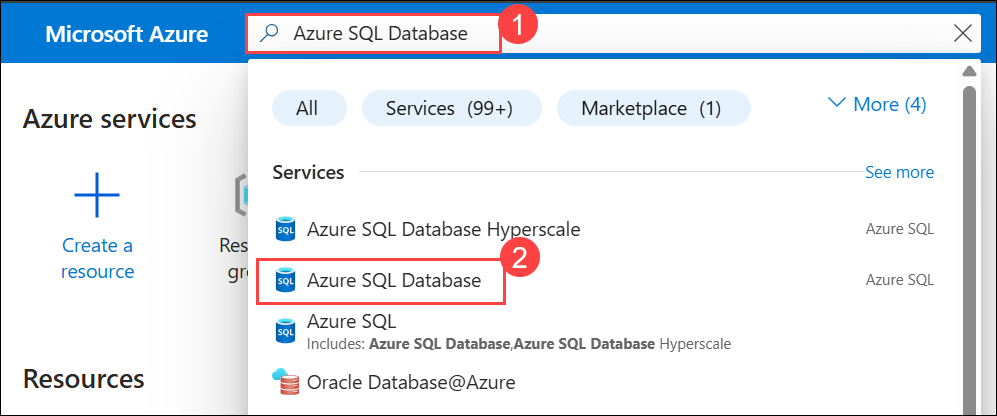

1. On the **SQL databases** page, under the list of databases, click on **SmartCityDB (smartcity-sqlserver-<inject key="DeploymentID" enableCopy="false" />)** to open the database overview page.

     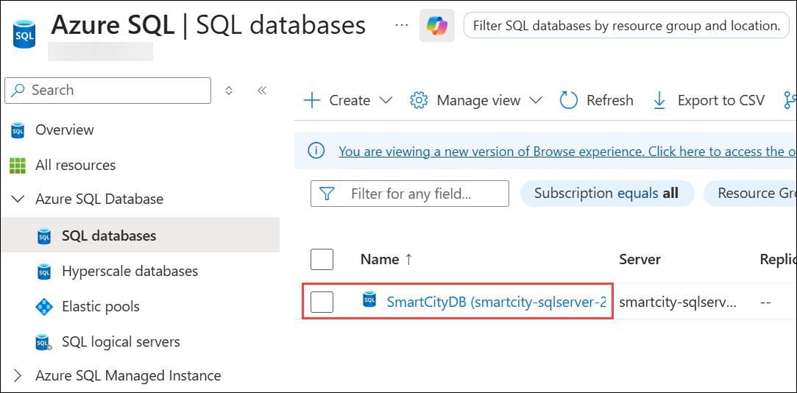

1. On the **smartcity-sqlserver-<inject key="Deployment ID" enableCopy="false" />** page please select **Query Editor (1)** from the left navigation pane, and enter the following login credentials: 
    - **Login** : **<inject key="SQL Admin Login" enableCopy="false" /> (2)**
    - **Password** : **<inject key="SQL Admin Password" enableCopy="false" /> (3)** 
    - Click **OK (4)**

        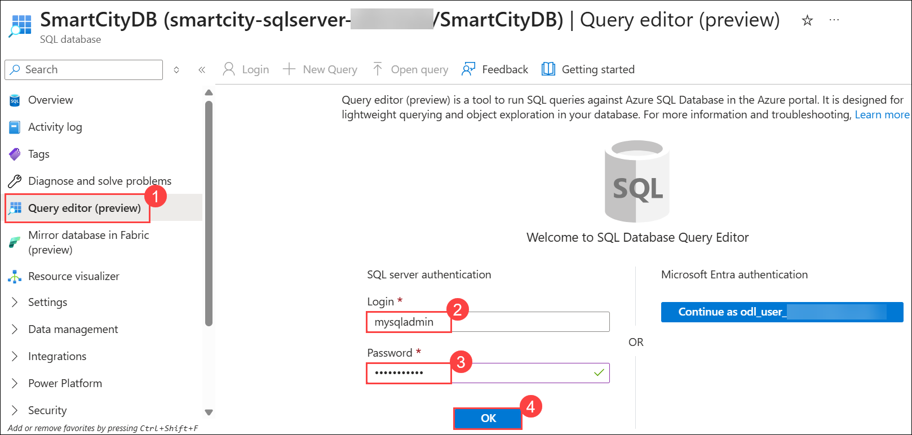

1. In the Query Editor, type the SQL query **(1)**, click **Run (2)** to execute it, and review the output in the **Results (3)** pane.

    ```sql
    SELECT TOP 5 *
    FROM TrafficCounts_SC;
    ```

     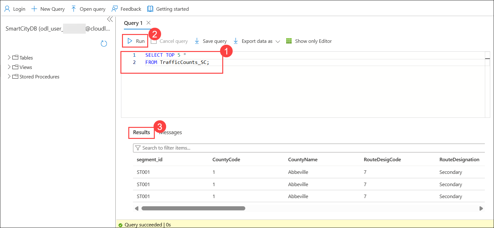

1. In the query editor, enter the SQL query **(1)**, select **Run (2)** to execute it, and view the output in the **Results (3)** pane.

    ```sql
    SELECT CountyName, AVG(Volume) AS AvgVolume
    FROM TrafficCounts_SC
    GROUP BY CountyName;
    ```

     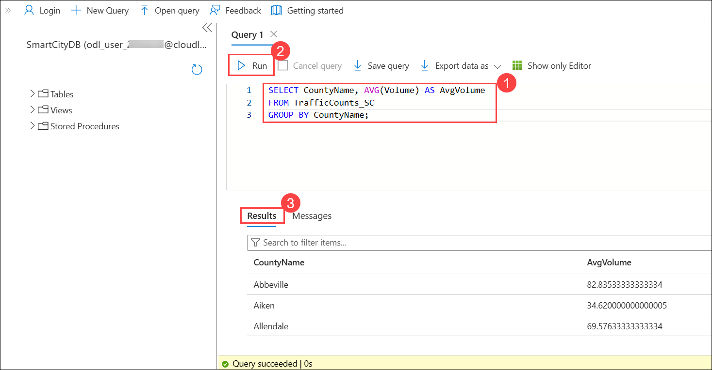

1. This query groups traffic records by county and calculates each county’s average traffic volume, helping identify overall traffic patterns and compare counties with higher or lower typical roadway usage.

1. In the query editor, enter the SQL query **(1)**, click **Run (2)**, and review the filtered results showing only counties with an average traffic volume above 50.

    ```sql
    SELECT CountyName, AVG(Volume) AS AvgVolume
    FROM TrafficCounts_SC
    GROUP BY CountyName
    HAVING AVG(Volume) > 50;
    ```

    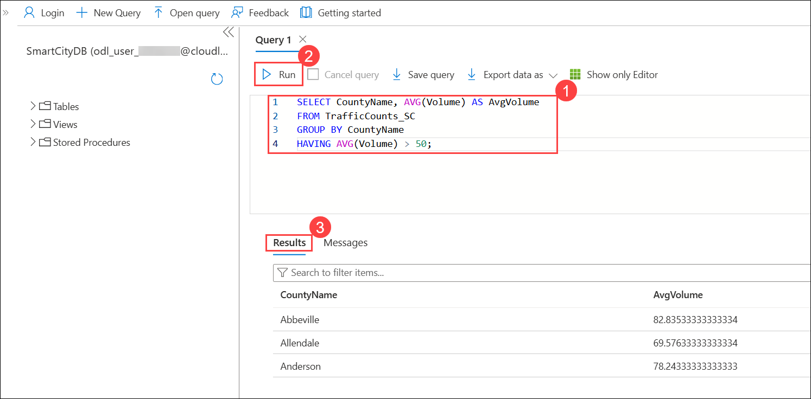

1. This query groups traffic data by county, computes average volume, and returns only counties exceeding 50, highlighting higher-traffic areas and demonstrating how HAVING filters results after aggregation.

1. Enter the following query **(1)** in the Azure Query Editor, click on **Run (2)**, and confirm that the CountyLookup table is successfully created.

    ```sql
    -- 3A) Create the CountyLookup table (run once)
    IF OBJECT_ID('dbo.CountyLookup', 'U') IS NOT NULL
        DROP TABLE dbo.CountyLookup;

    CREATE TABLE dbo.CountyLookup (
        CountyName NVARCHAR(100) PRIMARY KEY,
        Region     NVARCHAR(50)
    );
    ```

1. Review the output in the **Results (3)** pane. This script drops any existing CountyLookup table and creates a new one containing county names and regions for use in future **JOIN** operations.

     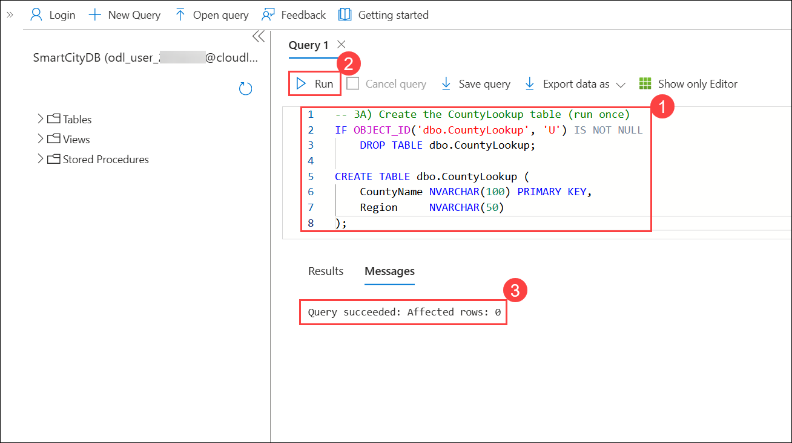

1. Enter the following query **(1)** in the Azure Query Editor, **Run (2)** it, and review the results in the **Results (3)** pane. This script inserts sample county-to-region mappings into the CountyLookup table, adding regional context so traffic data can later be joined and analyzed by geographic region.

     ```sql
    -- 3B) Insert sample data into CountyLookup (run once)
    INSERT INTO dbo.CountyLookup (CountyName, Region) VALUES
    ('Richland',   'Midlands'),
    ('Lexington',  'Midlands'),
    ('Greenville', 'Upstate'),
    ('Spartanburg','Upstate'),
    ('Anderson',   'Upstate'),
    ('Charleston', 'Lowcountry'),
    ('Berkeley',   'Lowcountry'),
    ('Beaufort',   'Lowcountry'),
    ('Horry',      'Grand Strand'),
    ('Florence',   'Pee Dee'),
    ('York',       'Piedmont');
    ```

     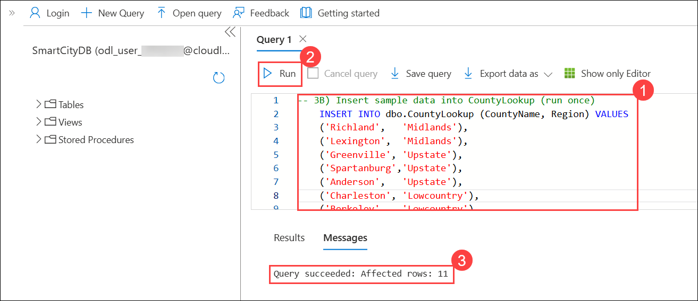

1. Enter the following query **(1)** in the Azure Query Editor, **Run (2)** it, and review the results in the **Results (3)** pane. This query joins traffic data with county-region lookup information, adding regional context so planners can compare traffic volumes and analyze trends across broader geographic areas.

    ```sql
    -- 3C) Join traffic counts with region data
    SELECT t.Segment_ID, t.CountyName, c.Region, t.Volume
    FROM TrafficCounts_SC t
    JOIN CountyLookup c
    ON t.CountyName = c.CountyName;
    ```

     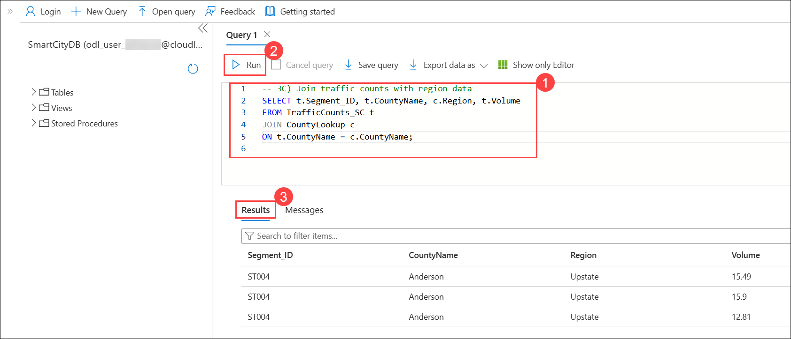

1. Enter the following query **(1)** script in the Azure Query Editor, **Run (2)** it, and review the results in the **Results (3)** pane. This query uses the **LIKE** operator to return only records where the county name starts with “A,” demonstrating pattern-based filtering with wildcards.

    ```sql
    SELECT *
    FROM TrafficCounts_SC
    WHERE CountyName LIKE 'A%';
    ```

    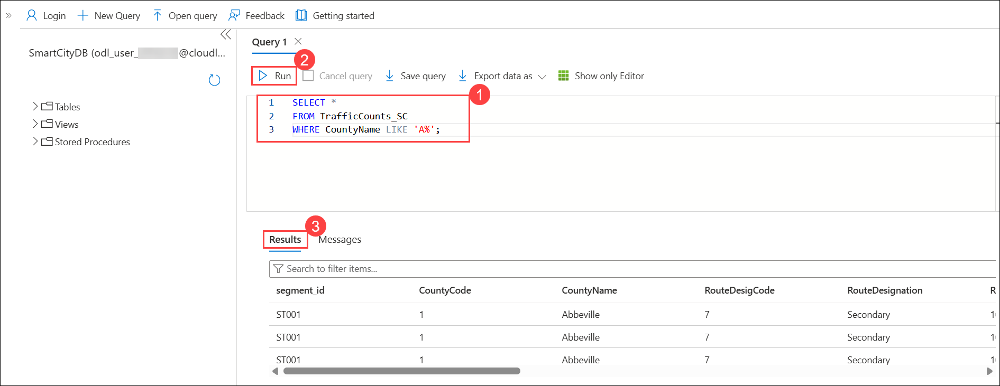

1. Enter the following query **(1)** script in the Azure Query Editor, **Run (2)** it, and review the results in the **Results (3)** pane. This query uses the **IN** operator to return records only for Richland and Lexington, demonstrating efficient filtering using multiple specified values.

    ```sql
    SELECT *
    FROM TrafficCounts_SC
    WHERE CountyName IN ('Richland', 'Lexington');
    ```

    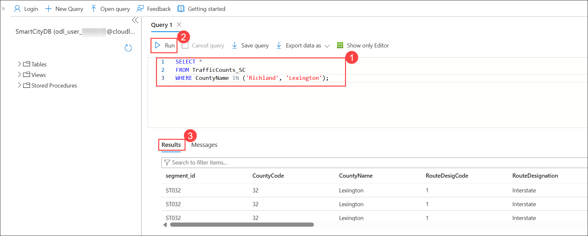

1. Enter the following query **(1)** script in the Azure Query Editor, **Run (2)** it, and review the results in the **Results (3)** pane. This query uses **UNION** to combine counties with very high and very low traffic volumes into a single, duplicate-free list.

    ```sql
    SELECT CountyName 
    FROM TrafficCounts_SC 
    WHERE Volume > 800
    UNION
    SELECT CountyName 
    FROM TrafficCounts_SC 
    WHERE Volume < 400;
    ```

    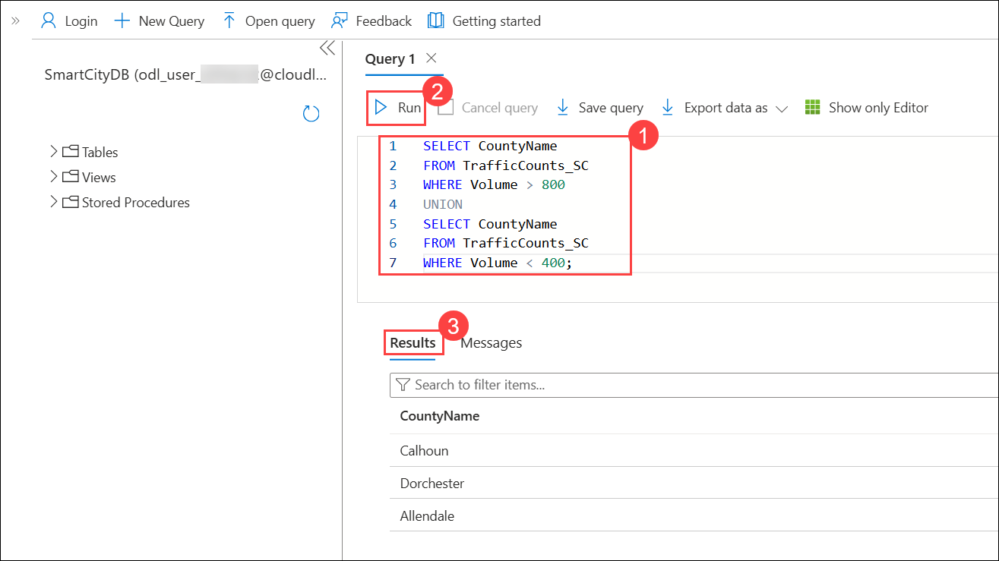

1. Enter the following query **(1)** script in the Azure Query Editor, **Run (2)** it, and review the results in the **Results (3)** pane. This query generates a ranked regional congestion report, combining joins, grouping, filtering, and ordering to highlight regions with many high-volume segments and higher average traffic.

    ```sql
    SELECT 
      c.Region,
      COUNT(CASE WHEN t.Volume > 100 THEN 1 END) AS SegmentsOver100,
      AVG(CAST(t.Volume AS DECIMAL(10,2)))       AS AvgVolume
    FROM TrafficCounts_SC AS t
    JOIN CountyLookup     AS c
      ON t.CountyName = c.CountyName
    GROUP BY c.Region
    HAVING COUNT(CASE WHEN t.Volume > 100 THEN 1 END) >= 5
    ORDER BY SegmentsOver100 DESC, AvgVolume DESC;
    ```

    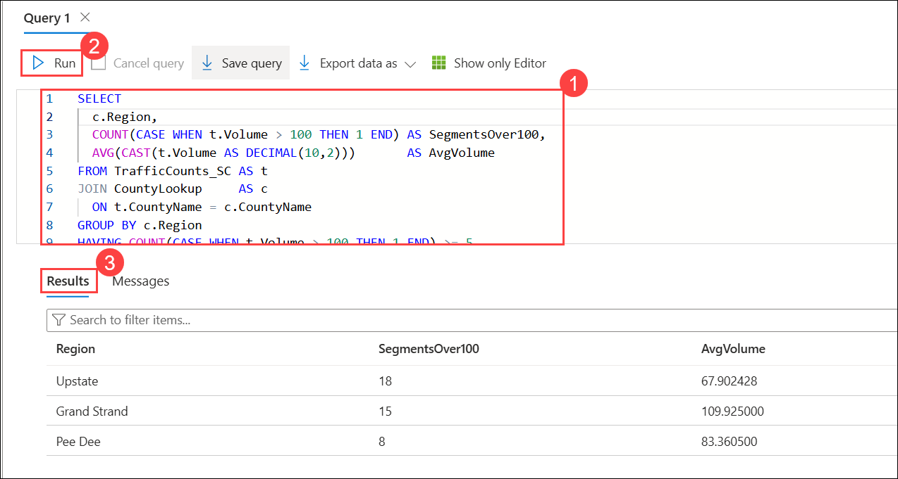

## Summary

In this lab, you practiced running advanced SQL queries to summarize traffic data, filter grouped results, and merge information across tables. By using aggregation and join operations, you moved from viewing individual records to creating regional-level insights that help identify congestion trends and support data-driven infrastructure planning.

### Congratulations, you’ve successfully completed the hands-on lab!
