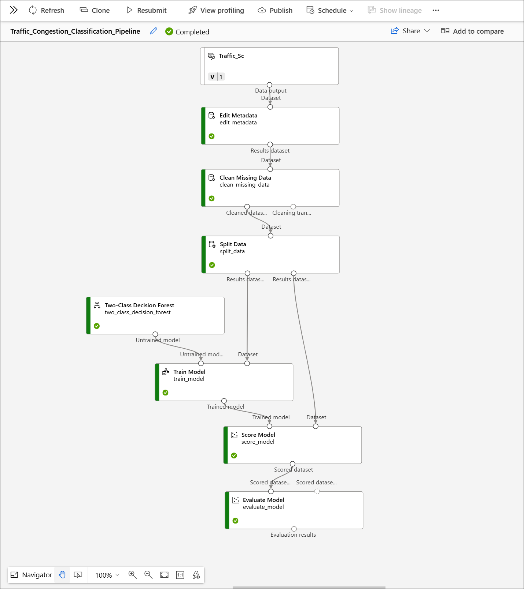
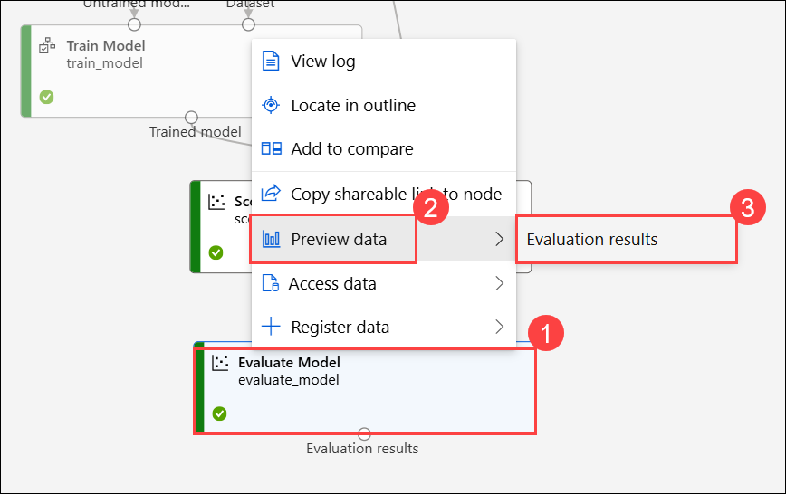
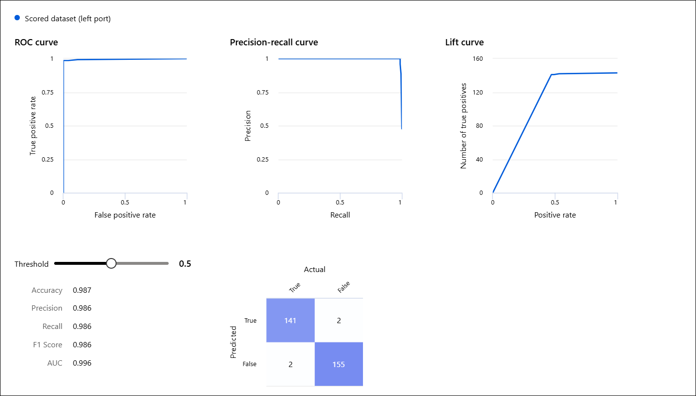
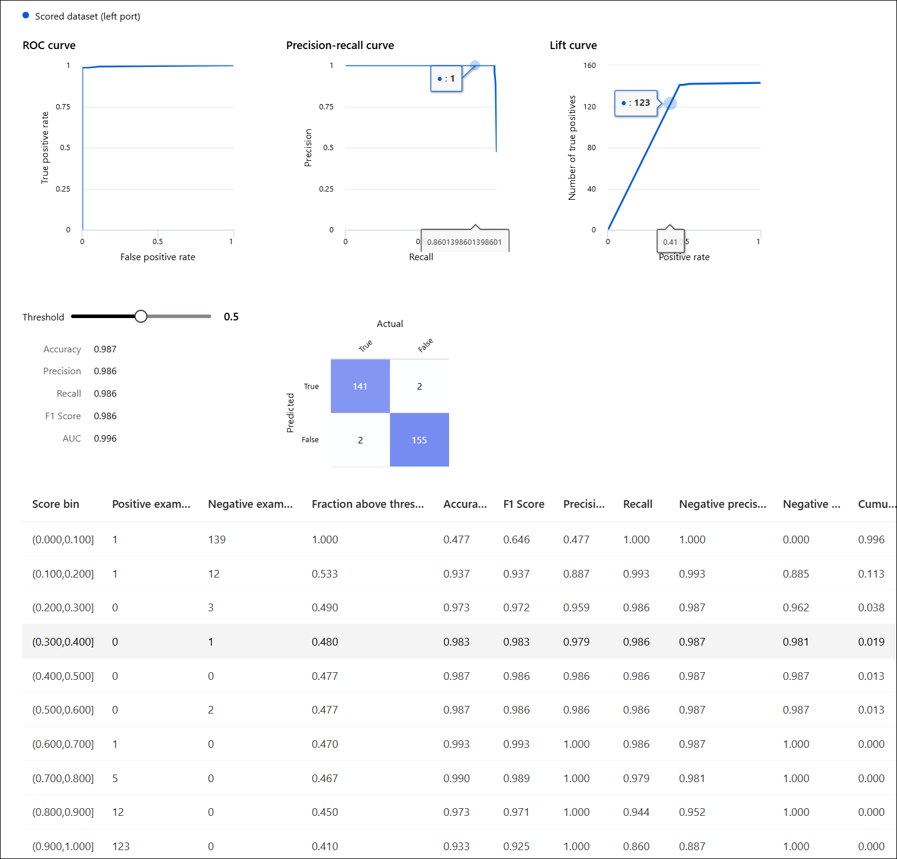

# Lesson 9: Decision Trees with Azure SQL and Azure ML Designer

### Estimated Timing: 60 Minutes

## Lab overview

In this lab, you will integrate Azure SQL Database with Azure Machine Learning Designer to analyze transportation data and build a predictive model for traffic congestion.

You will begin by connecting Azure ML to a SQL database containing the TrafficCounts_SC dataset. Using SQL queries, you will explore, aggregate, and validate traffic data. After preparing the dataset, you will design a complete machine learning pipeline in Azure ML Designer to classify whether a road segment has HighVolume traffic using a Two-Class Decision Forest model.

By the end of this lab, you will understand how structured SQL data can be transformed into actionable insights and how machine learning models can be trained and evaluated to support smart city planning decisions.

## Lab objectives

In this exercise, you will perform the following tasks:

- Task 1: Traffic Data Analysis and Classification Using Azure SQL and Azure ML

## Task 1: Traffic Data Analysis and Classification Using Azure SQL and Azure ML

In this task, you'll connect Azure ML to an Azure SQL database, retrieve and prepare traffic data, build a Decision Forest classification pipeline in Azure ML Designer, and evaluate the model to predict high traffic volume.

1. Open the link below in your browser to access **Azure Machine Learning Studio**:

    ```
    https://ml.azure.com/
    ```

1. If prompted to sign in, enter your credentials.
 
   - **Email/Username:** <inject key="AzureAdUserEmail"></inject>
 
     .png)
 
   - **Password:** <inject key="AzureAdUserPassword"></inject>
 
     .png)
 
1. If prompted to stay signed in, you can click **No**.

   .png)

1. From the left navigation pane, select **Workspaces (1)** and then click on workspace **SmartCities (2)**.

     

1. From the left navigation pane, go to **Assets**, select **Data (1)**, then open the **Datastores (2)** tab and click **+ Create (3)**.

     

1. On the **Create datasore** pane, enter the following details and then click **Create (9)**:

    - Datastore name: **traffic_sc_dataset (1)**
    - Datastore type: **Azure SQL database (2)**
    - Account selection method: **From Azure subscription (3)**
    - Subscription ID: Select the default subscription **(4)** 
    - Server name / database name: Select **smartcity-sqlserver-<inject key="Deployment ID" enableCopy="false" /> (5)**
    - Authentication type: **SQL Authentication (6)**
    - User ID: **<inject key="SQL Admin Login" enableCopy="false" /> (7)**
    - Password: **<inject key="SQL Admin Password" enableCopy="false" /> (8)**

        

1. Once the datastore is created successfully, the new datastore will appear in the **Datastores** tab. Click on it to open. 

    

1. Now click on **Create data asset** at the top.

    

1. On the **Create data asset** page, enter **Traffic_Sc (1)** as the name, then click **Next (2)**.

    

1. In the SQL query box, paste the following query **(1)** and click **Run query (2)**. Once the query executes successfully, a data preview will appear at the bottom showing sample rows from your Azure SQL table so you can validate the columns and data types. If everything looks correct, click **Next (3)** to proceed to the **Schema** step.

    ```sql
    SELECT * FROM TrafficCounts_SC;
    ```

     

1. In the **Schema** page, leave everything as default and click on **Next**.

     

1. On the **Review** page, review the settings for your data asset and click on **Create**.

    

1. Once the data asset is created successfully, you will be redirected to the **Details** tab of **Traffic_Sc**.

    

1. From the top menu, select the **Explore** tab to see the schema, sample records, and the SQL query used to pull data from Azure SQL.

    

1. In Azure ML Studio, select **Designer (1)** from the left navigation menu, then under the **New pipeline** section (Classic prebuilt), click **+ Create a new pipeline using classic prebuilt components (2)**.

    

1. Under the **Data** tab, find your dataset **Traffic_SC** and drag it onto the pipeline canvas to use it as the starting point of your machine learning workflow.

    

1. Click the **Component (1)** tab, use the search bar to find **Edit Metadata (2)**, select it **(3)** from the results, and drag it onto the pipeline canvas.

    

1. Connect **Data output** port of the **Traffic_Sc** to the **Dataset** port of Edit Metadata.

    

1. Double-click the **Edit Metadata (1)** module, then in the Edit Metadata pane, click **Edit column (2)**.

    

1. In the Columns window, select **RouteDesigCode (1)** and then click **Save (2)**.

    

1. Keep **Data type** set to **Unchanged (1)**, set **Categorical** to **Categorical (2)**, leave **Fields** as **Unchanged (3)**, and click **Save (4)** to apply the changes.

    

1. Click on **Close** icon on the top right to close the Edit Metadata pane.

    

1. Enter **Clean Missing Data (1)** in the search bar, select the **Clean Missing Data (2)** module from the results, and drag it onto the pipeline canvas below **Edit Metadata**.

    

1. Connect the **Result dataset** from **Edit Metadata** to the **Dataset** port of **Clean Missing Data** component.

    

1. Double click on the **Clean Missing Data (1)** and then select **Edit column (2)**.

    

1. In the Column window, select the column **AADT** and **volume** **(3)** and then click on **Save (4)**.

    

1. Provide the following values:

    - Minimum missing value ratio: `0.0` **(1)**
    - Maximum missing value ratio: `1.0` **(2)**
    - Cleaning mode: **Custom substitution value (3)**
    - Replacement value: `0` **(4)**
    - Generate missin value indicator column: **False (5)**
    - Click on **Save (6)**

        

1. Enter **Split Data (1)** in the search bar, select the **Split Data (2)** module from the results, and drag it onto the pipeline canvas below **Clean Missing Data**.

    

1. Connect the **Cleaned dataset** output of the **Clean Missing Data** module to the **Dataset** input of **Split Data**.

    .png)

1. Double click on the **Split Data (1)** and then enter the value `0.7` in the **Fraction of rows in the first output dataset (2)** and click on **Save (3)**.

    

1. Enter **Two-Class Decision Forest (1)** in the search bar, select the **Two-Class Decision Forest (2)** module from the results, and drag it onto the pipeline canvas below **Split Data**.

    

1. Enter **Train Model (1)** in the search bar, select the **Train Model (2)** module from the results, and drag it onto the pipeline canvas below **Two-Class Decision Forest**.

    

1. Connect **Two-Class Decision Forest** output to the left input of **Train Model**.

    

1. Connect training data from **Split Data** to the right input of **Train Model**.

    

1. Double click on the **Train Model (1)** and then select **Edit column (2)**.

    

1. In the **Label column** window, set the Label column to **HighVolume (3)** and then click on **Save (4)**.

    

1. In the **Train Model** pane, keep **Model explanations** set to **False (1)** and click **Save (2)**.

    

1. Enter **Score Model (1)** in the search bar, select the **Score Model (2)** module from the results, and drag it onto the pipeline canvas below **Train Model**.

    

1. Connect the **Trained model** output to the **Trained model (1)** input of **Score Model**, and connect the **Results dataset** output of **Split Data** to the **Dataset (2)** input of **Score Model**.

    

1. Enter **Evaluate Model (1)** in the search bar, select the **Evaluate Model (2)** module from the results, and drag it onto the pipeline canvas below **Score Model**.

    

1. Connect the **Scored dataset** output of **Score Model** to the **Scored dataset** input of **Evaluate Model**.

    

1. Ensure that your entire pipeline closely matches the layout shown in the screenshot below. Click on **Save (1)** and then select **Configure & Submit (2)**.

    

1. In the **Set up a pipeline job** pane, under the **Basic** section, enter the following details:

    - **Experiment name:** Select *Create new* **(1)**
    - **New experiment name:** `Traffic_Congestion_Classification_Pipeline` **(2)**
    - **Job display name:** `Traffic_Congestion_Classification_Pipeline` **(3)**
    - Click on **Next (4)**

        

1. In the **Inputs & outputs** section, leave everything as default and click on **Next**.

    

1. In the **Runtime settings** section, choose **Compute instance (1)** as the compute type. Then, under **Select Azure ML compute instance**, pick the running instance named **TestComputeMg<inject key="Deployment ID" enableCopy="false"/> (2)** and click **Next (3)**.

    

1. In the **Review + Submit** section, verify the settings and then click **Submit**.

    

1. Click **View Details** to open the job run page and monitor the pipeline’s execution progress.

    

    >**Note:** The job will take around 5 minutes to complete.

1. Once the job is completed, you should see something similar to the following:

    

1. After the job completes, right-click on **Evaluate Model (1)**, select **Preview data (2)**, and then click on **Evaluation results (3)**.

    

1. Review the displayed metrics: the ROC curve indicates almost perfect class separation (AUC = 0.999), reflecting outstanding model performance. The Precision-Recall curve is positioned near the top-right corner, showing high precision (0.992) and recall (0.992). The Lift curve highlights strong predictive capability, and the confusion matrix reveals very few misclassifications-just 2 errors out of 300 predictions.


    

1. Scroll down to review the detailed performance table. This section categorizes predictions into score bins, which reflect the model’s confidence levels (for example, a 0.9-1.0 bin represents predictions made with 90-100% confidence).

    Each row in the table provides:

    - **Positive/Negative counts** - The number of actual positive and negative cases within that confidence range.
    - **Performance metrics** - Accuracy, F1 score, Precision, and Recall calculated for that specific bin.
    - **Negative Precision and Recall** - Metrics that measure how effectively the model identifies negative cases.
    - **Cumulative metrics** - Aggregated performance values calculated progressively from the highest-confidence predictions downward.

1. The highest-confidence bins (such as 0.9-1.0 and 0.8-0.9) demonstrate perfect precision (1.000) and strong recall, indicating that the model performs exceptionally well when it makes predictions with high confidence.

1. This breakdown allows you to see where the model performs most effectively and whether its performance declines for predictions made with lower confidence.

1. These results confirm the model is highly accurate (Accuracy = 0.993) in predicting the HighVolume label.

    

> **Congratulations** on completing the task! Now, it's time to validate it. Here are the steps:
> - Hit the Validate button for the corresponding task. If you receive a success message, you can proceed to the next task.
> - If not, carefully read the error message and retry the step, following the instructions in the lab guide. 
> - If you need any assistance, please contact us at cloudlabs-support@spektrasystems.com. We are available 24/7 to help you out.

  <validation step="" />

## Summary

In this lab, you connected Azure SQL Database to Azure ML Studio, created a data asset from traffic data, prepared and cleaned the dataset, and built a Two-Class Decision Forest model using Azure ML Designer. You trained, scored, and evaluated the model to successfully predict high traffic volume with high accuracy.

### Congratulations, you’ve successfully completed the hands-on lab!
